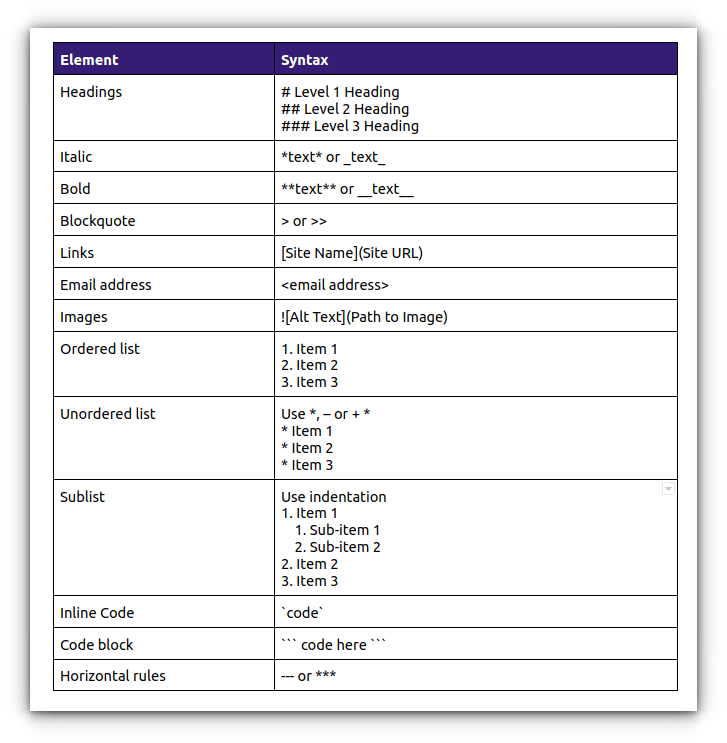
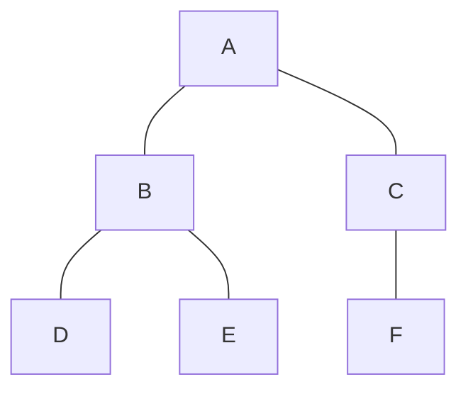
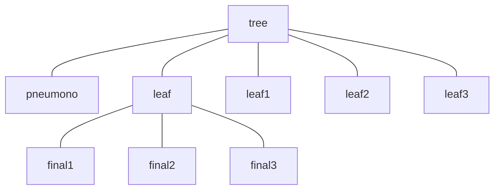
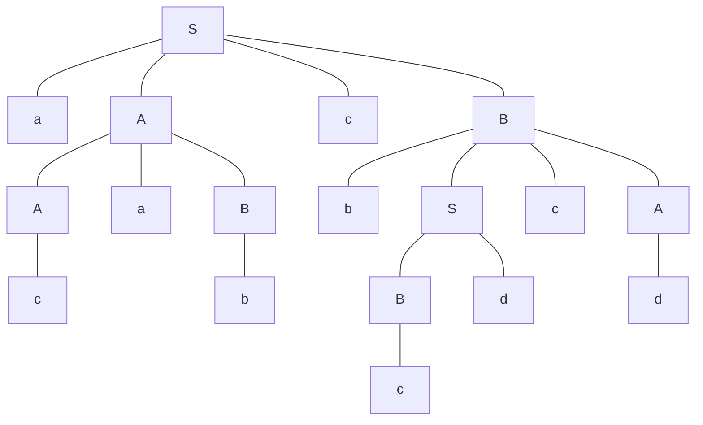
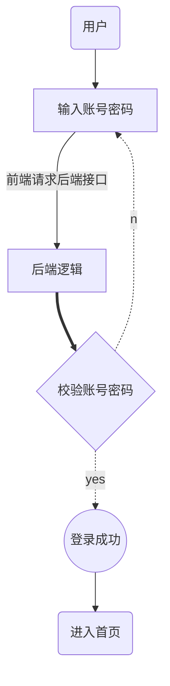
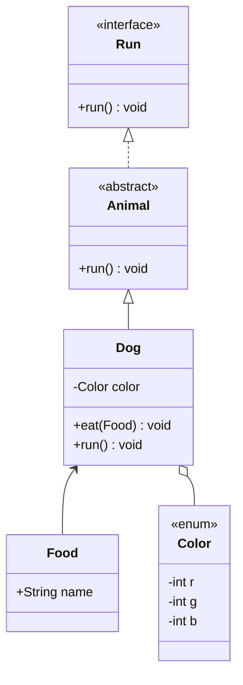
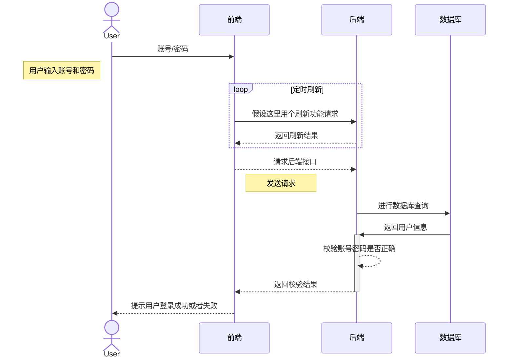
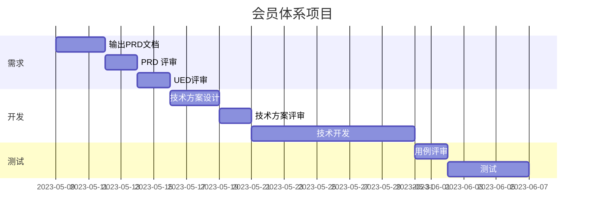

::: details 目录
[[toc]]
:::

> [!tip]
> 本文所示 Markdown 语法适用于 VuePress 2




# 🌸 基础语法

## 🍀 字体

:::: md-demo
**加粗**  
*斜体*  
***斜体加粗***  
~~删除线~~  
<u>下划线</u>  
<p style="color: red">红色</p>  

==高亮==
::::


## 🍀 上下角标

:::: md-demo
上角标：19^th^  
下角标：H~2~O  
::::

## 🍀 强调内容

:::: md-demo
> 一段重要的内容，可以和其他 **Markdown** 语法混用。
::::

## 🍀 任务列表

:::: md-demo
- [ ] foo
- bar
- [x] baz
- [] bam <~ not working
  - [ ] bim
  - [ ] lim
::::

## 🍀 折叠内容

:::: md-demo
<details>
<summary>自我评价（点击展开）</summary>

- Abc
- Abc

</details>
::::


## 🍀 分割线

:::: md-demo
三个或者三个以上的 `-` 或者 `*` 都可以。

---

***

::::

## 🍀 图片


:::: md-demo
`logo` 就是显示在图片下面的文字，相当于对图片内容的解释。


::::

:::: md-demo 指定图片的高度与宽度

::::

## 🍀 链接

:::: md-demo
[百度](http://baidu.com)

<a href="https://www.baidu.com/" target="_blank">百度</a>
::::

:::: md-demo 高级链接

我们可以通过变量来设置一个链接，变量赋值在文档末尾进行：

- 这个链接用 1 作为网址变量： [Google][1]  
- 这个链接用 runoob 作为网址变量： [Runoob][runoob]  

然后在文档的结尾为变量赋值（网址）

[1]: http://www.google.com/

[runoob]: http://www.runoob.com/
::::

## 🍀 列表

:::: md-demo 无序列表
无序列表用 `-` `+` `*` 任何一种都可以

- 列表内容  
+ 列表内容  
* 列表内容
::::


:::: md-demo 有序列表

1. 列表内容
2. 列表内容
3. 列表内容

::::

:::: md-demo 列表嵌套

上一级和下一级之间敲三个空格（或者 <kbd>TAB</kbd>）即可

- 一级无序列表内容
  - 二级无序列表内容
    - 三级无序列表内容
- 一级无序列表内容
  1. 二级有序列表内容
  2. 二级有序列表内容
  3. 二级有序列表内容
1. 一级有序列表内容
   - 二级无序列表
2. 一级有序列表内容
   1. 二级有序列表内容
::::

## 🍀 表格


:::: md-demo
|表头|表头|表头|
|---|:--:|--:|
|内容|内容|内容|
|内容|内容|内容|

- 内容默认居左
- 两边加 `:` 表示文字居中
- 右边加 `:` 表示文字居右
::::

:::: md-demo 例
左对齐|居中对齐|右对齐
:--|:--:|--:
刘备|哭|大哥
关羽|打|二哥
张飞|骂|三弟
::::


:::: md-demo html 实现合并行和列
<table>
    <tr>
        <td>第一列</td> 
        <td>第二列</td> 
   </tr>
   <tr>
        <td colspan="2">我是合并行</td>    
   </tr>
   <tr>
        <td>行二列一</td> 
        <td>行二列二</td> 
   </tr>
    <tr>
        <td rowspan="2">我是合并列</td>    
        <td >行三列二</td>  
    </tr>
    <tr>
        <td >行四列二</td>  
    </tr>
</table>
::::


## 🍀 代码


1. 单行代码：代码之间分别用一个反引号包起来

\`代码内容\`：`代码内容`


2. 代码块：代码之间分别用三个反引号包起来，且两边的反引号单独占一行，并指定一种语言（也可以不指定）  


:::: md-demo
```
    代码...  
    代码...  
    代码...  
```

```java
public fun(){  
    System.out.println("这是一句非常牛逼的代码");
}
```
::::


:::: md-demo 代码块行高亮

可以在代码块添加行数范围标记，来为对应代码行进行高亮:

```ts {1,6-8}
import type { UserConfig } from "vuepress/cli";
import { defaultTheme } from "@vuepress/theme-default";

export const config: UserConfig = {
  title: "你好， VuePress",

  theme: defaultTheme({
    logo: "https://vuejs.org/images/logo.png",
  }),
};
```

行数范围标记的例子:

- 行数范围: \{5-8\}
- 多个单行: \{4,7,9\}
- 组合: \{4,7-13,16,23-27,40\}

::::

## 🍀 支持的 HTML 元素

不在 Markdown 涵盖范围之内的标签，都可以直接在文档里面用 HTML 撰写。

目前支持的 HTML 元素有：

`<kbd>` `<b>` `<i>` `<em>` `<sup>` `<sub>` `<br>`等 ，

如：

:::: md-demo
使用 <kbd>Ctrl</kbd>+<kbd>Alt</kbd>+<kbd>Del</kbd> 重启电脑
::::

## 🍀 转义

`Markdown` 使用了很多特殊符号来表示特定的意义，如果需要显示特定的符号则需要使用转义字符，`Markdown` 使用反斜杠 `\` 转义特殊字符


## 🍀 KaTex 公式

:::: md-demo 格式
$x^{yz}$

$$(\frac{x}{y})^2$$

$$
a^2 = b^2+c^2\tag{1}
$$
::::

详见：[KaTex](./2.md)


# 🌸 样式

## 🍀 目录

:::: md-demo
[[toc]]
::::


## 🍀 对齐方式

:::: md-demo
::: left
左对齐的内容
:::

::: center
居中的内容
:::

::: right
右对齐的内容
:::

::: justify
两端对齐的内容
:::
::::

## 🍀 选项卡


:::: md-demo 普通
::: tabs

@tab 标题 1

<!-- tab 1 内容 -->

@tab 标题 2

<!-- tab 2 内容 -->

@tab:active 标题 3

<!-- tab 3 将会被默认激活 -->

<!-- tab 3 内容 -->

:::
::::


:::: md-demo 代码块分组
安装 VuePress Theme Hope:

::: code-tabs#shell

@tab pnpm

```bash
pnpm add -D vuepress-theme-hope
```

@tab yarn

```bash
yarn add -D vuepress-theme-hope
```

@tab:active npm

```bash
npm i -D vuepress-theme-hope
```

:::
::::

## 🍀 警告

:::: md-demo
> [!note]
> 注释文字

> [!important]
> 重要文字

> [!tip]
> 提示文字

> [!warning]
> 注意文字

> [!caution]
> 警告文字
::::

## 🍀 提示容器


:::: md-demo
::: important
重要容器。
:::

::: info
信息容器。
:::

::: note
注释容器。
:::

::: tip
提示容器
:::

::: warning
警告容器
:::

::: caution
危险容器
:::

::: details
详情容器
:::
::::

### 自定义容器

:::: md-demo
::: important 自定义标题

一个有 `代码` 和 [链接](#演示) 的重要容器。

```js
const a = 1;
```

:::

::: info 自定义标题

一个有 `代码` 和 [链接](#演示) 的信息容器。

```js
const a = 1;
```

:::

::: note 自定义标题

一个有 `代码` 和 [链接](#演示) 的注释容器。

```js
const a = 1;
```

:::

::: tip 自定义标题

一个有 `代码` 和 [链接](#演示) 的提示容器。

```js
const a = 1;
```

:::

::: warning 自定义标题

一个有 `代码` 和 [链接](#演示) 的警告容器。

```js
const a = 1;
```

:::


::: caution 自定义标题

一个有 `代码` 和 [链接](#演示) 的危险容器。

```js
const a = 1;
```

:::


::: details 自定义标题

一个有 `代码` 和 [链接](#演示) 的详情容器。

```js
const a = 1;
```

:::
::::

------------

### 不含内容的自定义容器

:::: md-demo

::: important 自定义重要
:::

::: info 自定义信息
:::

::: note 自定义注释
:::

::: tip 自定义提示
:::

::: warning 自定义警告
:::

::: caution 自定义危险
:::

::::

# 🌸 mermaid 图

## 🍀 树形图

:::: md-demo 树

::: tabs

@tab 树 1



@tab 树 2




@tab 上下文无关文法

::::


## 🍀 流程图

:::: md-demo

::::

## 🍀 类图

:::: md-demo

::::


## 🍀 时序图

:::: md-demo

::::


## 🍀 甘特图

:::: md-demo

::::

