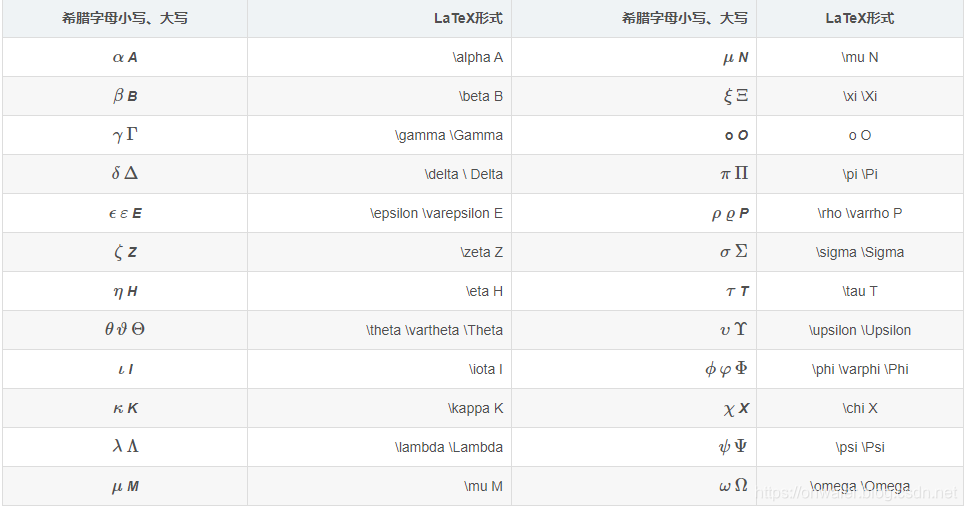

::: details 目录
[[toc]]
:::

## 🍀 文档

具体见 [官方文档](https://katex.org/docs/support_table.html)。

## 🍀 基本写法

行内用 `$ 公式 $`，行间用 `$$ 公式 $$`。

## 🍀 上下标

`_` 表下标，`^` 表上标，多个字符用 `{}`。

:::: md-demo
$x^2$ ，$x^{yz}$ ，$x_2$ ​
::::

## 🍀 分数

分数用 `\frac{分子}{分母}`。

:::: md-demo
$$(\frac{x}{y})^2$$
::::

## 🍀 多个 if 公式

用 `\begin{cases}\ 公式 end{cases}`
如

:::: md-demo
$$
\begin{cases}
matrix[i][j] = 0&(i\geq0& and&i\leq n)&if&matrix[0][j]=0(j \neq 0)\\
matrix[i][j] = 0&(j\geq0&and&j\leq m)&if&matrix[i][0]=0\\
matrix[i][0] = 0&(i\geq0&and&i\leq n)&if&flag\_first\_col=true
\end{cases}
$$
::::

## 🍀 公式

:::: md-demo 1 编号
用 `\tag{编号}`

$$a^2 = b^2+c^2\tag{1}$$
::::

:::: md-demo 2 换行

使用 `\\`

$$
\begin{aligned}
num = num1 \oplus num2 \\
num2 = num \oplus num1
\end{aligned}
$$
::::

## 🍀 特殊字符

- 一些运算符，可以在数学模式下直接输入；另一些需要用控制序列生成:
    - `+`: $+$
    - `-`: $−$
    - `\times`: $\times$
    - `\div`: $\div$
    - `=`: $=$
    - `\pm`: $\pm$
    - `\cdot`: $\cdot$
    - `\cup`: $\cup$
    - `\geq`: $\geq$
    - `\leq`: $\leq$
    - `\neq`: $\neq$
    - `\approx`: $\approx$
    - `\equiv`: $\equiv$
    - `\quad`: $\quad$ (空白分隔符)
- 根式: `\sqrt{xxx}`: $\sqrt{xxx}$
- 分式 `\frac{aaa}{bbb}`: $\frac{aaa}{bbb}$ (第一个参数为分子，第二个为分母) 。
- 连加: `\sum`: $\sum$
- 连乘: `\prod`: $\prod$
- 极限: `\lim`: $\lim$
- 积分: `\int`: $\int$
- 多重积分:
    - `\iint`: $\iint$
    - `\iiint`: $\iiint$
    - `\iiiint`: $\iiiint$
    - `\idotsint`: $\idotsint$

:::: md-demo

连加、连乘、极限、积分等大型运算符

$\sqrt{x}$, $\frac{1}{2}$.

$\sum_{i=1}^n i\; \prod_{i=1}^n$

$\sum\limits _{i=1}^n i\; \prod\limits _{i=1}^n$

$\iint_1^2 x^2\; \iiint_1^2 x^2\; \iiiint_1^2 x^2\; \idotsint_1^2 x^2$

$\iint\limits_1^2 x^2\; \iiint\limits_1^2 x^2\; \iiiint\limits_1^2 x^2\; \idotsint\limits_1^2 x^2$

$$\iint_1^2 x^2\; \iiint_1^2 x^2\; \iiiint_1^2 x^2\; \idotsint_1^2 x^2$$

不同大小的括号

$\Biggl(\biggl(\Bigl(\bigl((x)\bigr)\Bigr)\biggr)\Biggr)$
$\Biggl[\biggl[\Bigl[\bigl[[x]\bigr]\Bigr]\biggr]\Biggr]$
$\Biggl \{\biggl \{\Bigl \{\bigl \{\{x\}\bigr \}\Bigr \}\biggr \}\Biggr\}$
$\Biggl\langle\biggl\langle\Bigl\langle\bigl\langle\langle x
\rangle\bigr\rangle\Bigr\rangle\biggr\rangle\Biggr\rangle$
$\Biggl\lvert\biggl\lvert\Bigl\lvert\bigl\lvert\lvert x
\rvert\bigr\rvert\Bigr\rvert\biggr\rvert\Biggr\rvert$
$\Biggl\lVert\biggl\lVert\Bigl\lVert\bigl\lVert\lVert x
\rVert\bigr\rVert\Bigr\rVert\biggr\rVert\Biggr\rVert$

矩阵

$$
\begin{pmatrix} a&b\\c&d \end{pmatrix} \quad
\begin{bmatrix} a&b\\c&d \end{bmatrix} \quad
\begin{Bmatrix} a&b\\c&d \end{Bmatrix} \quad
\begin{vmatrix} a&b\\c&d \end{vmatrix} \quad
\begin{Vmatrix} a&b\\c&d \end{Vmatrix}
$$

对齐：可以使用 `aligned` 环境来实现对齐，使用 `&` 标识固定锚点

$$
\begin{aligned}
x ={}& a+b+c+{} \\
&d+e+f+g
\end{aligned}
$$

$$
\begin{alignedat}{2}
   10&x+ &3&y = 2 \\
   3&x+&13&y = 4
\end{alignedat}
$$

::::

:::: md-demo 等号与不等号
- 小于等于号 $\leq$ : `\leq`
- 大于等于号 $\geq$ : `\geq`
- 不等号 $\neq$ : `\neq`
::::

:::: md-demo 箭头

- 左双箭头 $\Larr$ : `\Larr`
- 右双箭头 $\Rarr$ : `\Rarr`
- 左单箭头 $\larr$ : `\larr`
- 右单箭头 $\rarr$ : `\rarr`
- 下双箭头 $\Darr$ : `\Downarrow`
- 下单箭头 $\darr$ : `\downarrow`
- 上双箭头 $\Uarr$ : `\Uarr`
- 上单箭头 $\uarr$ : `\uarr`
- 双向双箭头 $\Harr$ : `\Harr`
- 双向单箭头 $\harr$ : `\harr`
::::

:::: md-demo 逻辑符号

- 异或 $\oplus$ : `\oplus`
- 且 $\wedge$ : `\wedge`
- 或 $\vee$ : `\vee`
- 换行 $\\$ : `\\`。
- 空格 $\space$ : `\space`
- $\pm$ : `\pm`
- 点乘 $\cdot$ : `\cdot`
- 叉乘或乘号 $\times$ : `\times`
- 除号 $\div$ : `\div`
::::

:::: md-demo 属于与不属于

- $\in$ : `\in`
- $\notin$ : `\notin`
::::

:::: md-demo 括号

- 左大括号 $\lbrace$ : `\lbrace`
- 右大括号 $\rbrace$ : `\rbrace`
- 左中括号 $\lbrack$ : `\lbrack`
- 右中括号 $\rbrack$ : `\rbrack`
- 左小括号 $\lgroup$ : `\lgroup`
- 右小括号 $\rgroup$ : `\rgroup`
- 向上取整 $\lceil\rceil$ :`\lceil\rceil`
- 向下取整 $\lfloor\rfloor$ : `\lfloor\rfloor`
- 竖线 $\vert$ : `\vert`
- 双竖线 $\Vert$ : `\Vert`
::::

## 左对齐

$$
\begin{flushleft}
\justifying
xxxxxxxxxx
xxxxxxxx
xxxx
\end{flushleft}
$$

## 🍀 希腊字母

