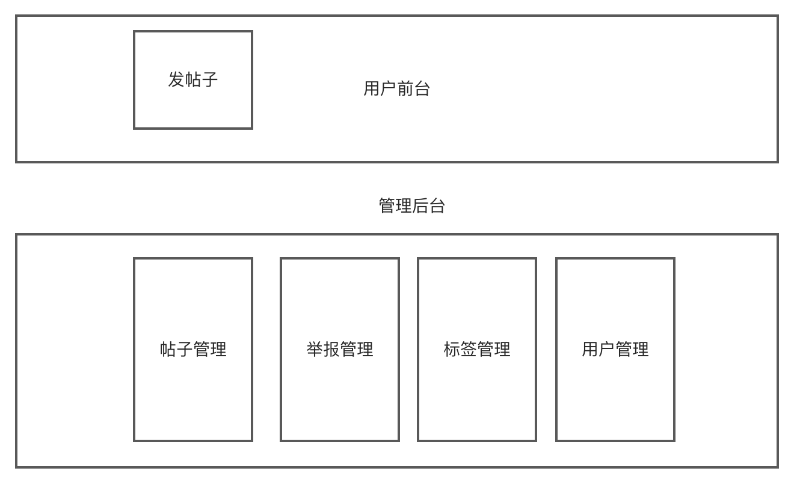
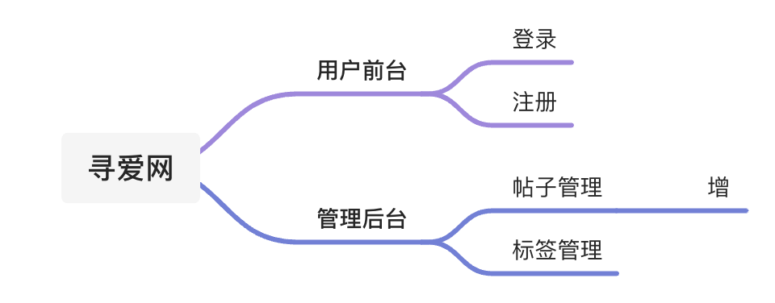
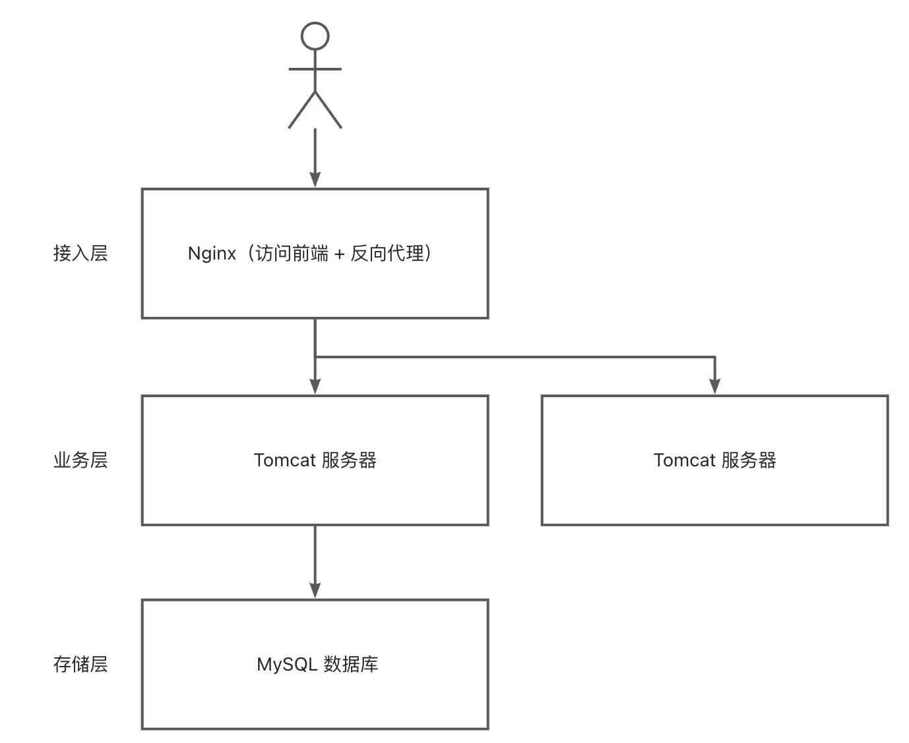

:::details 目录
[[toc]]
:::

## 🍀 项目信息

### 项目介绍

用最简洁清晰的话语描述你的项目。

### 项目背景

为什么想做这个项目？

比如现有的产品不能满足诉求（存在痛点）、或者目前没有类似的产品、或者出于其他目的。

### 项目意义

这个项目能解决什么问题？有什么实际意义？比如方便使用者、提升效率等。

### 核心亮点

这个项目的核心亮点在哪里？

### 调研

#### 竞品分析

市场上有没有类似的项目？你的项目和它们比有哪些异同（优缺点）？

#### 用户调研

问一问其他同学的想法（投票、头脑风暴等）

#### 结果总结

说一说调研之后的心得感受，以及有了哪些新的项目思路。

---

## 🍀 需求信息表

| 功能点 | 所属模块 | 介绍 | 优先级 | 负责人 | 当前进度 | 预期完成时间 | 实际完成时间 | 其他 |
|--------|--------|--------------------|----------|------|--------|------------|------------|----|
| 用户登录 | 用户 | 需要用户输入账号密码 | P0（核心）| xx | 开发中 | 20xx-xx-xx|||

---

## 🍀 团队协作信息

### 团队成员

| 团队姓名 / 昵称 | 职责 | 联系方式 | 个人介绍 |
|-------------|----------------|----------|----------------------------------------------------|
|lxzz | 负责人、后端开发 | 微信：xxxx | 正式工作两年半，熟练使用 SpringBoot，能独立完成项目 |

### 沟通方式

交流群、每周一次腾讯会议等

### 文档沉淀方式

语雀知识库、腾讯文档、自建 wiki 等

### 代码协作方式

星球 GitLab 或 GitHub 私仓

### 成员分工详情

确认分工和对接方式比如前后端用 Swagger 接口文档对接等等

### 开发规范

可以借鉴其他团队或开源的代码规范，并使用工具来提示和约束。

---

## 🍀 团队资源

### 服务器

ip：xx

用户：

密码：

端口：22（访问端口）

作用：在 xx 端口部署 xx 项目

### 数据库

ip：xx

用户：

密码：

端口：3306

作用：在 xx 端口部署 xx 项目

### 监控统计

报表地址：

用户：

密码：

作用：

### 其他资源

#### 用户反馈平台

地址：

用户：

密码：

---

## 🍀 实现方案

### 项目整体实现方案

#### 项目介绍

可以直接复制项目文档中的项目介绍

#### 技术选型

##### 前端

| 技术及版本 | 作用 | 原因 |
|----------|------------|--------------------|
|Vue3.x | 主要开发框架 | 团队成员更熟悉 |
|VantUI | 移动端组件库 | 适配移动端项目、主流 |

##### 后端

| 技术及版本 | 作用 | 原因 |
|-----------------|--------------|--------------------|
|SpringBoot2.7.x | 主要开发框架 | 团队成员更熟悉、主流 |
|Lombok | 注解式代码生成 | 节省开发时间 |

##### 部署

| 技术及版本 | 作用 | 原因 |
|----------|------------------|--------------|
| 宝塔面板 | 管理服务器 | 快速可视化操作 |
|Nginx | 部署前端、反向代理 | 轻量、性能高 |

##### 其他

| 技术及版本 | 作用 | 原因 |
|----------|--------|--------|
|51.LA | 网站统计 | 免费易用 |
||||

#### 功能模块图

1. 类似流程图
2. 思维导图（属性图）

#### 技术架构图

#### 库表设计

##### 用户表

| 字段名 | 类型 | 非空 / 主键 / 自增 / 默认值等 | 备注 |
|------|----------|-----------------------|--------|
|id|bigint(20)| 非空、主键、自增 | 全局唯一 |

#### 详细设计

每个功能大致怎么实现、用什么算法、流程如何等，也可以给每个需求单独开设一个实现方案文档。举个例子：

##### 用户登录功能

###### 接口设计

接受参数：用户账户、密码

请求类型：POST

请求体：JSON 格式的数据

返回值：脱敏的用户信息

###### 流程

> 这里写的越详细越好，写代码的时候本质上就是直接 “翻译”

1. 校验用户账户和密码是否合法
1. 非空
2. 账户长度不小于 4 位
3. 密码就不小于 8 位
4. 账户不包含特殊字符
2. 校验密码是否输入正确，要和数据库中的密文密码去对比
3. 用户信息脱敏，隐藏敏感信息，防止数据库中的字段泄露
4. 我们要记录用户的登录态（session），将其存到服务器上（用后端 SpringBoot 框架封装的服务器 tomcat 去记录）
5. 返回脱敏后的用户信息

### xx 功能实现方案

参考 [项目整体实现方案](# 项目整体实现方案)

---

## 🍀 工作周报

> 字多≠有价值
> 周报不是为了表现工作量，而是给团队提供最基本的 “信息透明”。尽量挑选重要信息来写。

汇报人：…

日期：2022-01-20

### 本周重点

#### 1. 任务进展

> 本周完成了哪些任务、整体进度如何。

本周完成了 XXX 需求开发，已经提测。项目整体进度比预期延迟 1d，预计下周三可以开始正式测试。

#### 2. 相关数据

> 呈现相关数据以及背后的原因（如有）。

本周日均 UV3000，同比上周上涨 20%。原因是周二投放的运营活动生效，吸引了部分新用户。

| 本周日均 UV|3000（↑20%）|
|-----------|------------|
| 上周日均 UV|2500|

具体详见「数据接口」

#### 3. 风险同步

> 存在哪些风险、对应的对策是什么。

由于需要调用外网数据，需要在预发环境搭建代理，接下来需要考虑代理的通用性，在其他需要外网数据配合的需求中可以直接使用。

### 下周计划

> 接下来要做什么、是否需要其他协助。

下周开始主要投入 XXX、XXX 等功能点开发，依赖于中台团队提供接口，下周一和中台团队的 xxx 沟通确认。

### 思考

> 有什么想法或心得体会，都可以拿出来分享下。

---

## 🍀 会议记录

参会人：...

会议时间：2022-01-20

会议地点：6 号会议室

### 会前材料

> 不开没有准备的会。基于材料提前异步沟通、可以给会议带来惊人的提效。

📑产品需求文档

### 会议议题

> 简要记录本次会议的主要议题讨论。

- 议题 1...
- 议题 2...
- 议题 3...

### 会议结论

>不开没有结论的会。哪怕 “方案取消” 或“下次再议”，也是结论的一种。

- 结论 1...
- 结论 2...
- 结论 3...

### 执行计划

> 设置后续待办任务，可使用 @人分配执行人。

- [x] 待办任务 1
- [x] 待办任务 2

---

## 🍀 团队知识库

### 如何做好技术选型？

#### 什么是技术选型？

就像上战场打仗选择兵器一样，你要确定用哪些技术来完成项目的开发和维护。

#### 技术选型选什么？

1. 用哪类技术？比如编程语言、开发框架、数据库
2. 具体用什么技术？比如编程语言用 C++ 还是 Java？开发框架用 Spring 还是 Vert.x？
3. 技术用哪个版本？比如 Vue2 还是 Vue3?Java8 还是 Java11？

#### 为什么要做技术选型？

答案很简单，为了更好地开发和维护项目。这里的 “更好” 可能是提高效率，也可能是节约成本，还可能是提升体验。

#### 怎么做好技术选型？

##### 先有的选

在我们拿到一个需求后，首先要分析一下完成这个需求要用到哪些类别的技术？

比如做一个网盘系统，需要选择开发语言、前端 / 后端开发框架、文件存储系统等。

接下来，就是从百度、Google、GitHub、掘金等各个平台搜索各类技术，比如搜索：主流的文件存储系统。然后把搜到的所有技术以清单的形式记录在一个文档里。建议大家先尽可能多地搜索同类技术，不要只盯着某个技术不放。

有了可选项之后，我们便可以从主观和客观两个视角去分析技术。

##### 主观分析

首先我们要通过看官方文档、或者网上的视频文章等途径来了解每个技术的以下几点：

- 这个技术是什么？有什么用？
- 这个技术有什么优点？
- 这个技术更适用于什么场景？
- 这个技术有什么缺点或不足？

技术选型的重点是要从实际出发，贴合业务和项目，而不是为了用技术而用。

那如果我们的系统是老项目，需要重点关注新引入的技术和老项目依赖的兼容性，尤其要注意版本号。不要说引入了一个类库后，导致整个项目无法运行，这就需要我们在技术选型时先快速试一下能否跑通 Demo、有没有版本冲突，再拍板决定。

而对于新项目来说，技术选型要考虑的点要更多一些。主要是结合实际需求（业务适应性）和现有条件（人员 / 资源）去考虑。

###### 业务适应性

1. 你的业务量级有多大？比如你的项目累积不超过 1000 个用户、存不了多少数据，那么绝大多数的数据库都可以满足，也没必要选择分布式数据库。
2. 系统的核心业务流程和关键数据结构是什么？比如要做一个管理系统，那么数据库选择主流的关系型数据库 MySQL 就好。而如果要做数据分析系统，那么应该选择 OLAP 利好的数据库，比如 PostgreSQL、ClickHouse 等。
3. 更注重哪些性能？比如日志收集的场景更注重高性能和吞吐量，那么可以选择 Kafka 消息队列来采集；比如注重低延迟以及消息的准确性，那么可以选择 RabbitMQ 等。很多时候，我们做技术选型和设计算法一样，是对时间、空间、稳定性、可用性等等的综合权衡。

###### 现有条件

先从人员的角度来说，看看团队的同学都会哪些技术，如果需求很紧急的话，那肯定优先选择大家用的比较熟的技术，先完成一期需求快速交付，后面再调研更合适的技术架构，不断地优化。再比如团队内对于某个技术有比较成熟的实践经历和知识沉淀、也有相应的技术大佬，那么优先使用该技术。比如阿里的 Java 和字节的 Go。

再从资源来说，要看公司或团队的资源是否适合运用这个技术。比如创业公司，没什么钱，那么可以用 MySQL 来代替 Elasticsearch 来实现搜索功能，牺牲灵活性来省钱。再比如公司只能提供 4g 内存的服务器，那你在使用一些开源技术的时候就要关注他们的内存占用，不能超过这个阈值。

##### 客观分析

抛去实际情况，建议大家优先选择知名度高的、有大公司背书的、持续维护的、活跃度高的、开源的、生态好的（有了问题能百度解决的）技术。比如大名鼎鼎的前端框架 Vue 和 Java 后端框架 SpringBoot，大家对它们的印象就是功能强大、简单好用、学习资源多，所以这两个技术是主流。切忌不要选择缺失文档的冷门技术，到后面出了问题搞不好整个项目都无法推进！

在对每个技术进行分析的过程中，记得把它们的优缺点都记录下来，可以整理为一个表格，便于自己对比，最终选择一个相对最优解。

总之，没有绝对完美的技术，技术选型的终极目标是：在有限的条件下、选取特定场景下的技术最优解。

#### 一次技术选型的实践

有一天隔壁数据开发组的组长（专家级大佬）突然来问我：React 和 Vue 在选型上一般是怎样考虑的？

其实这是一道异常经典的面试题了，我在腾讯实习转正答辩时，就被领导问了这道题，给大家分享一下我和组长的对话（已脱敏），看看我这次是如何以 “已经通过面试” 的身份回答的。

组长：咱们现在做前端是用的什么框架，vue 吗？

我：先问了下同事，目前我们组用到 Vue 的项目不多，好像只有一个小模块和管理系统。建议是跟着组件库生态走，如果用公司级的 UI 库（像我们是 TDesign），用 Vue 好一些，因为这个库以 Vue 为主；如果用部门级的 UI 库，用 React。其他感觉区别不大，可以看看大家对哪套技术栈更熟悉。（然后我贴了这两个组件库的地址）

我：之前我负责的项目想用部门的 xx 库来着，但组件有点缺失，放弃了，公司级的库贡献者更多、更全面一些。如果可以不用公司内的库，建议用 AntDesign 库和 React，功能全面、非常好用。

组长：如果是公司外的，开发一个新项目，从开发者的角度看，两个的差别大吗？比如组件库的丰富程度之类的，代码上手难度等等？

我：先说上手难度，Vue 比 React 简单很多，因为他的语法就像是 HTML、CSS、JavaScript 按顺序拼起来，适合新手。开发小项目的话，用 Vue 的同学会相对多一些，我本人做单页面应用也倾向于 Vue，就是因为方便省事；它是渐进式框架，甚至可以把一个没有框架的前端项目轻松改成 Vue。

但如果要开发中大型项目，多人维护的那种，用 React 好一些，一方面是 AntDesign 组件库实在是太好用了（它以 React 主），另外一方面 React 的语法以 JS 为主，组件复用等写法会更容易，更符合高级前端工程师的使用习惯。

值得考虑的是，现在 Vue 存在一个大版本的跨度（2=>3），而且 Vue3 刚刚被定为主流版本，导致很多以前 Vue2 的社区组件会失效或者需要兼容，我就踩过不少坑。

组长：大致理解了，谢谢！👍

#### 我们能做些什么？
1. 多积累技术。把自己看到过的每个和你学习方向或工作相关的技术都记录或收藏，有时间的话可以快速了解个大概，知道这个技术是做什么的、有什么用，有个大致的印象，之后需要用到的时候到收藏夹里搜索即可。
2. 不要满足于一门技术吃遍天。在自学阶段、做一些小项目时，可以尝试使用一些平时不接触的新技术，拓宽自己的技术选型范围。像我虽然工作是 Java 后端，但是经常会做一些前端小项目，而且每次都换着用技术，比如 Vue、React、NodeKoa、NodeExpress 等。

#### 技术选型工具

前端技术选型：[https://openbase.com/](https://openbase.com/)

技术雷达：[https://www.thoughtworks.com/zh-cn/radar](https://www.thoughtworks.com/zh-cn/radar)

框架性能对比：[https://www.techempower.com/benchmarks](https://www.techempower.com/benchmarks)

---

## 🍀 星球嘉宾王德福老师的回答

首先我们思考几个问题：
1. 一项技术为什么被发明？
2. 在它被发明之前，它所要解决的问题是否有解法？
3. 它完美解决了所有问题吗？

比如 SCSS。

在有 SCSS（以及其他预处理器）以前，CSS 就可以完成样式配置，但是不支持变量，不支持函数，不支持嵌套。不过我不太喜欢 Sass 语法还要求保留冒号和分号，Stylus 这种可以省略所有不必要的分隔符的语法是我更喜欢的，所以我选择 Stylus。

这类技术选型问题的解答思路就是：
1. 先定义待解决的问题是什么（问题背景、现有资源、问题的难点）
2. 传统的解决方案是什么
3. 各个待选方案的收益与不足
4. 你的价值标准
5. 他人的因素、同事和上级的决策
6. 最终选择

第二个问题有取巧的办法，一般这种问题都会在项目提问中出现，所以你可以预先对于项目中用到的技术都做一个准备。当然，如果这个项目是你从头开始做的，那么肯定也是经历了技术选型阶段，只不过可能选择的原因是 “我对这个比较熟”。

所以你要关注的是，当前方案有哪里是有所不足的，如果它用起来很不方便，比如你手写一组弹幕效果的时候，很容易想到，有类库对吧。你被组件间数据通信搞得焦头烂额的时候，很容易想到，其他人也会遇到类似问题，有 Redux 去解决。

技术选型类的问题考察的是你的技术视野和技术价值判断能力，前者可以可以通过日常多逛技术社区，或者熟练使用搜索引擎获得提高，对于技术的不满足感会促使你去寻找其他更好的方案。同时你需要有能力在技术选型中平衡好收益和成本，有理有据的得到決策。

总的来说，长线的解决方案是平时多关注技术社区，扩展技术视野，以及做更多的项目，有更多的技术积累。更快见效的，是在项目中好好理解需求，搞清楚技术是如何完成需求的，同时注意发现技术改进点，尽力去改进代码。

### 如何优化项目？

最简单的优化项目方式就是新增功能，但是不能乱加、盲目堆砌新功能，可以问自己几个问题：

1. 这个功能是否符合自己项目的定位？
2. 用户是否真的需要？
3. 这个功能的实现能否给项目增加亮点？（如果都是简单的增删改查，可以再斟酌一下）

个人的建议是完善现有的功能，把功能做到更好，举个例子：是否可以提高帖子搜索功能的灵活性、列举热搜、给出搜索建议等等，这可能就会激励你去学习 Elasticsearch 等技术。

一段有亮点的项目经历绝对不能只写 “用 xx 技术完成了 xx 功能”，而是要有起伏和递进，在完成某功能的基础上进一步优化。

应该优化什么呢？可以从以下角度出发：

1）性能：页面加载速度、接口并发量（qps/tps）、接口响应时长等方法：缓存、并发编程、池化、异步、限流降级熔断、有损服务、CDN、数据压缩等

2）成本：节约系统资源、降低 CPU / 内存 / 磁盘空间 / 带宽占用、节省机器数等方法：人工分析删除、定期删除、低频存储、淘汰策略、数据压缩等

> 实际开发项目中，一定要有成本意识！很多同学光说优化，不考虑实际情况，这是一个错误的思维。

3）可用性：尽可能地提高系统对外提供服务的时长，即提高 SLA（3~5 个 9 的高可用）参考文章：[https://blog.csdn.net/terrychinaz/article/details/112976266](https://blog.csdn.net/terrychinaz/article/details/112976266) 方法：集群、主备、自动故障恢复、监控告警、容灾

4）可靠性：尽可能地让系统提供可靠的服务，不要出现崩溃中断方法：集群、主备、异常处理、降级、容灾关于可靠性和可用性的区别：https://blog.csdn.net/HermitSun/article/details/92164226

5）稳定性：接口响应 / 操作处理时长相对固定，成功率高，响应结果保持正常方法：保证每个服务节点状态正常、性能相当（不要有的机器好有的机器垃圾导致接口时快时慢）；合理规划服务调用链路，不能过长；做好技术选型，避免使用不稳定的第三方依赖

6）容错性：部分节点（服务）出问题时，系统整体依然能够正常提供服务方法：集群、反向代理、故障转移

7）健壮性：系统不会因为部分异常而整体崩溃方法：异常处理、进程监控（如 supervisor）

8）系统复杂度：整个系统易于理解，而不是说前人离职、后人无法接手方法：软件开发原则、设计模式、系统架构设计（如微服务）、开发规范、工作流

9）可维护性：使整个系统结构清晰、利于维护，出了问题也能够快速排查方法：软件开发原则、设计模式、系统架构设计（如微服务）、开发规范、工作流、抽象复用（组件化模块化）

10）可扩展性：使整个系统能够轻松应对未来新增的需求及业务增长，不会牵一发而动全身方法：设计模式、架构设计、集群、分库分表、技术选型

11）可观测性：能够随时观察了解系统 / 服务的运行状态、并能快速发现故障和定位异常方法：系统埋点上报、监控告警（prometheus）、ELK 日志收集、可视化分析（Grafana）

12）可伸缩性：系统根据负载情况动态增加或减少节点，从而能够应对流量高峰、并在空闲时节约成本方法：K8S+Docker 容器、云原生

13）用户体验：符合用户的使用习惯、提升用户对网站的满意度方法：网页性能优化、接口性能优化、懒加载、占位符、骨架屏、设备适配、浏览器兼容性、满意度调研（如 NPS）

14）安全性：保证机器、服务、数据库、网络等不被恶意侵入和污染，保证数据和用户隐私的安全方法：参数校验、常用安全措施（防 XSS、CSRF、SQL 注入等）、网络防护（反 DDOS）、反爬虫、限流、黑白名单、防火墙等

