::: details 目录
[[toc]]
:::


## 🍀 Git 介绍

这里需要阐明一个概念，说到 git 很多人会想到 github。

其实 github 只是 git 的远程服务器端而已，github 并不等于 git ，实际上 git 是一个代码管理软件。

不用 github 也可以用 gitlab 或者 国内的 码云 和 coding
如果不需要图形化界面的话，甚至不需要把代码放到 github 上，完全可以在自己搭建的服务器上进行代码同步管理。

说到 git 也很容易联想到一个老牌的代码管理工具 SVN
其实两者在使用上的区别不是很大，重点是 git 是去中心的分布式管理， SVN 则刚好相反。

不过我自己也没有深入使用 SVN ，因此我也是在网上看的文章得到的片面之词，只是阐述自己目前的理解。

SVN 就好比银行，我们所有的交易都要以它为中心进行解算，因此银行之下的我们是不知道所有的数据的，我们只需要管理好手中的数据就可以了。

git 的话就是每个人都是银行，所有的交易都会同步到每个人的身上。

SVN 管理的好处就是简单清晰，管理好自己负责的代码即可。

git 的好处就是代码安全，如果中心服务器挂了，每个人都可以成为中心来重新建立彼此的同步。

当然现在大行其道的是 git 代码管理。

至于更多 SVN 和 git 区别可以参考 [菜鸟教程](https://www.runoob.com/git/git-tutorial.html)

## 🍀 Git 使用

git 本质上是一个命令行工具，可以去到 git 的官网安装其客户端。 

[链接](https://git-scm.com/)

安装成功之后就可以在命令行上输入 git 获取到 git 的操作指令了。

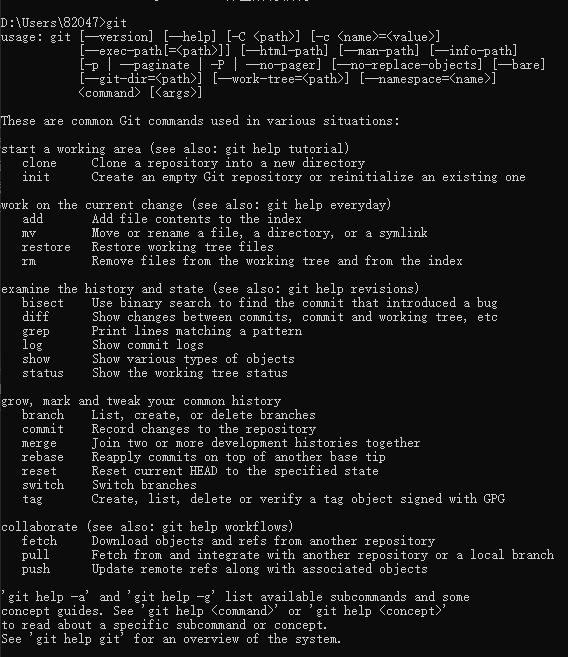

下面关于 git 的命令行使用就详细说明了，可以参考菜鸟学院里面的教程 [链接](https://www.runoob.com/git/git-tutorial.html)
下面是一些常用的命令

```sh
git init  // 初始化本地仓库
git config --global user.name "myname"  // 配置用户名
git config --global user.email "myname@mymail.com"  //配置邮箱
git remote add origin code@github.git  //绑定本地和远程仓库 
git pull   // 拉取远程仓库的变化来同步本地的状态
git add  // 确认本地仓库的变化到本地缓存区
git commit  // 确认本地缓存区的内容，可以准备push
git push   // 提交本地仓库到远程仓库
git status   // 确定本地缓存区的状态
```

补充一下配置了 user 之后就可以在 git 上看到上传代码的用户，这个未必和 github 用户一样的。

另外如果上传到 github 的话需要 github 账号的验证，每次都需要输入账号密码很麻烦。

可以利用 ssh 进行 github 免密登录 [链接](https://blog.csdn.net/u013778905/article/details/83501204)

## 🍀 GitHub SSH 免密登录

ssh 是通过 口令的机制 实现免密登录的。

目前后端的服务器登录很常用的免密登录技术，由于口令非常复杂且无序，比输入人为的密码要安全很多

```sh
$ ssh-keygen -t rsa -C "myname@mymail.com"

Generating public/private rsa key pair.
Enter file in which to save the key (/d/Users/82047/.ssh/id_rsa): test
Enter passphrase (empty for no passphrase):
Enter same passphrase again:
Your identification has been saved in test.
Your public key has been saved in test.pub.
The key fingerprint is:
SHA256:9h/yLOap8OzlXb5s440DqmXAVeHqwik+/azYi21YRI0 myname@mymail.com
The key's randomart image is:
+---[RSA 3072]----+
|         o  o.   |
|        E .o     |
|       .  . .    |
|       ... .     |
|       .S .      |
|       o.=  .    |
|      o++ B....  |
|     .oXoB+B =+o |
|      ++@O*.=o*+.|
+----[SHA256]-----+
```

`ssh-keygen -t rsa -C "myname@mymail.com"` 语句
默认情况下生成名字为 `id_rsa` , 也可以输入自定义的名字
下面的 passphrase 可以不填写，直接留空即可
会在当前两个文件 `id_rsa` 和 `id_rsa.pub`
我上面输入了 test ，因此生成了 `test` 和 `test.pub` 文件。

不过秘钥的存放路径是在用户文件夹下的 `.ssh` 目录 (默认生成的 `id_rsa` 会在那里)


如果秘钥不放在这个路径是读取不了的，直接用文本编辑器打开即可。

`id_rsa` 是私钥
`id_rsa.pub` 是公钥 ， `pub` 就是 `public` 的缩写。

可以看到两个文件是一长串乱码。

可以简单将公钥理解为锁，私钥就是唯一匹配这把锁的钥匙。

从这个乱码的复杂程度可以知道它的安全性是很高的，如果秘钥没有暴露的话基本上无法破解的。

后面的操作就是将 pub 的公钥添加到 github 账号的位置即可，具体操作可以参考上面提供的链接的操作。

github 每次需要登录信息的时候，都会调用 `.ssh` 目录下的秘钥进行匹配，匹配成功即登录成功。

---

`.ssh` 目录可以添加一个 config 文件 (不带后缀)，可以参考下面的格式填写。

```conf
#Default GitHub
  Host github.com
  HostName github.com
  User git
  IdentityFile ~/.ssh/id_rsa

  Host github-personal
  HostName github.com
  User git
  IdentityFile ~/.ssh/821412111

  Host l0v0.com
  HostName 129.204.87.195
  User git
  IdentityFile ~/.ssh/blog
```

这个配置文件可以根据 clone 网址配置来读取不同秘钥。

比如说 github 上面默认 clone 下来的网址是 `git@github.com:FXTD-ODYSSEY/mpdb.git`。

`@` 后面的部分就是 Host。

可以像我上面那样修改 Host 对应的名字调用不同的秘钥进行登录 (如果秘钥是不同的 gihub 账号就可以免密切换登录账号)。

HostName 就对应的 IP 地址 (域名的背后也是根据 DNS 服务获取 IP 地址，可以利用 ping 命令获取域名地址)

理解这个之后就可以根据我上面的 ip 地址来登录我自己构建的服务器的 git。

比如说 `git@l0v0.com:/home/git/repos/blog.git`
就会调用我上面的 blog 的秘钥然后利用服务器上的 ssh 服务来登录服务器。

因此免密登录更加安全，也更加方便。

## 🍀 VSCode 内置 Git 使用方法

经过前面一通的铺垫之后，终于开始今天的主角了。

VScode 默认内置 git 的支持，当然图形化界面客户端也不一定要用 vscode ，git 本身自带了一个图形化界面。

安装了 git 之后在任意目录下右键就有 Git Gui Here 的选项

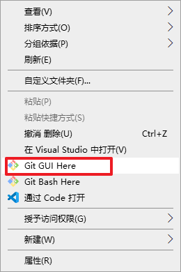

使用上其实大同小异，VScode 本身的功能加上插件辅助基本也可以实现差不多的效果。

### 认识界面

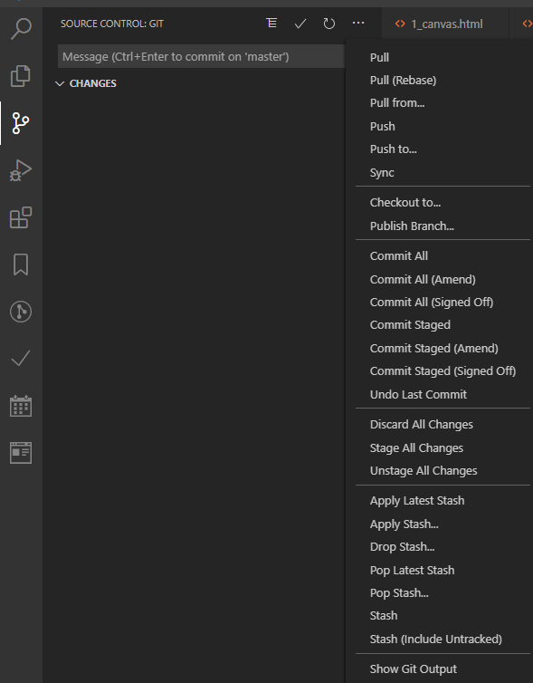

主要包含上面的按钮以及菜单的选项。

不过通常只会菜单里的功能通常只会用到 pull 和 push 而已，其他杂七杂八的选项都可以不管。


### 文件更新示例

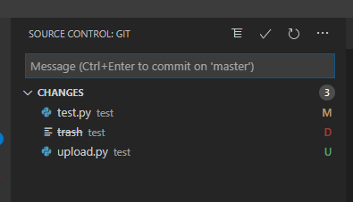

当你对仓库已经被跟踪的文件进行修改的时候，会有三种文件状态。

- M 是 modify 的缩写即该文件存在修改
- D 是 delete 的缩写即该文件被删除了
- U 是 Update 的缩写即该文件是新添加


### commit 代码

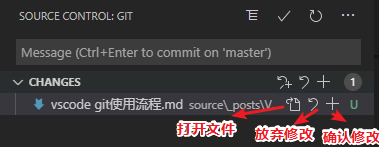


如果是新添加的文件，放弃修改就会提示彻底删除文件。

如果是删除的文件，选择放弃修改就会从仓库中恢复文件 (再也不用担心误删的文件找不到了)。

点击 + 号确认文件的修改就会提到 stash Changes 上 `(对应 git add 命令)`。

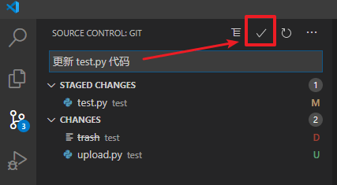

确认了文件之后，在输入框输入这次更新的内容，然后点击打勾就可以保存这一次更新了 `(对应 git commit 命令)`。

如果当前所有的 Changes 都要 commit ，那可以直接输入上传的信息并且打勾就可以快速 commit 了。

### push 代码

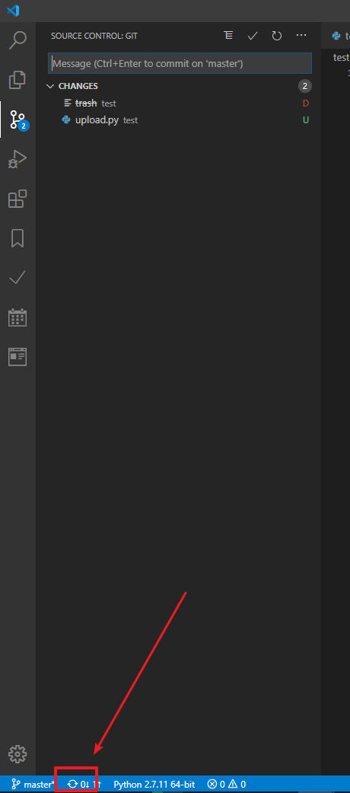

这个时候 vscode 的右下角就会出现上箭头的数字为 1 (上箭头是 push 的更新，下箭头是可以 pull 的更新)。

当然如果之前没有 push 过代码的话，这个可能会没有数字显示。
这个时候就可以将代码 push 到 github 上了 `(对应 git push 命令)`。

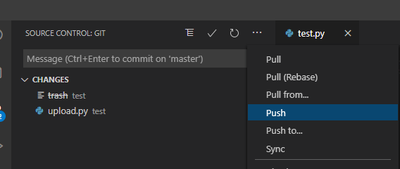

完成这一步之后就可以打开 github 仓库查看代码的更新了。

---

### 补充

另外 push 的时候如果没有设置 ssh 秘钥登录的话， VScode 会弹出账号密码的输入窗口进行登录。

默认情况下个人仓库只能仓库创建者更新仓库代码，第三方的更新只能发布 pull request (这个流程后续补充)。

这因为如此，github 的 public 仓库可以被所有人读取，但是只有仓库拥有者可以对仓库进行写入 (需要登录)。

因此多人协作的话可以使用 github 组织功能，参与开发的人加入到组织，然后再让组织开发成员的写入权限即可。

---

### GitHub 查看代码

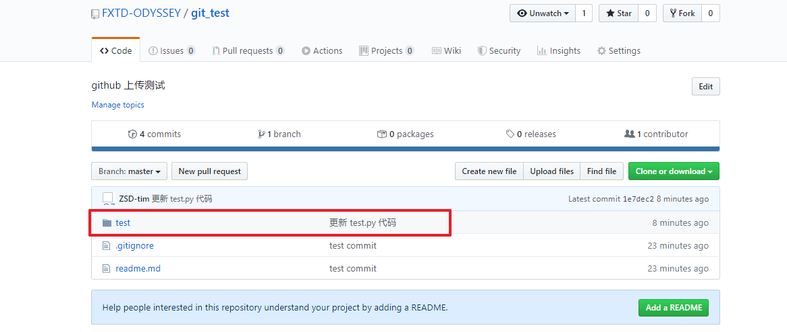

打开 github 的仓库可以看到之前 commit 的信息已经显示出来了。

这个就是 git 的基础用法，只需掌握上面的步骤就可以完成个人开发并且把代码上传到 github 。

如果只是在一个电脑上开发，基本上也不会用到 pull 的功能的。

### pull 代码

有时候比如说公司和家里分别开发代码，那么 push 之后两边的电脑就不同步了。

这个时候就需要 pull 拉去 github 上的新代码来实现仓库同步。
也可以通过 vscode 右下角的下箭头看到仓库是否可以 pull

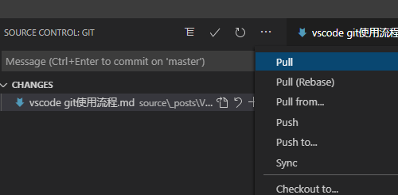


然后点击菜单的 git pull 进行仓库更新 (对应 git pull 命令)。

### 分支切换

代码开发的过程中，可能有不同的开发思路或者不同版本的代码想要留存个快照。

可以通过创建分支来实现，默认的仓库其实也是一个分支，默认名字叫做 master 。

vscode 可以直接在左下角创建分支：

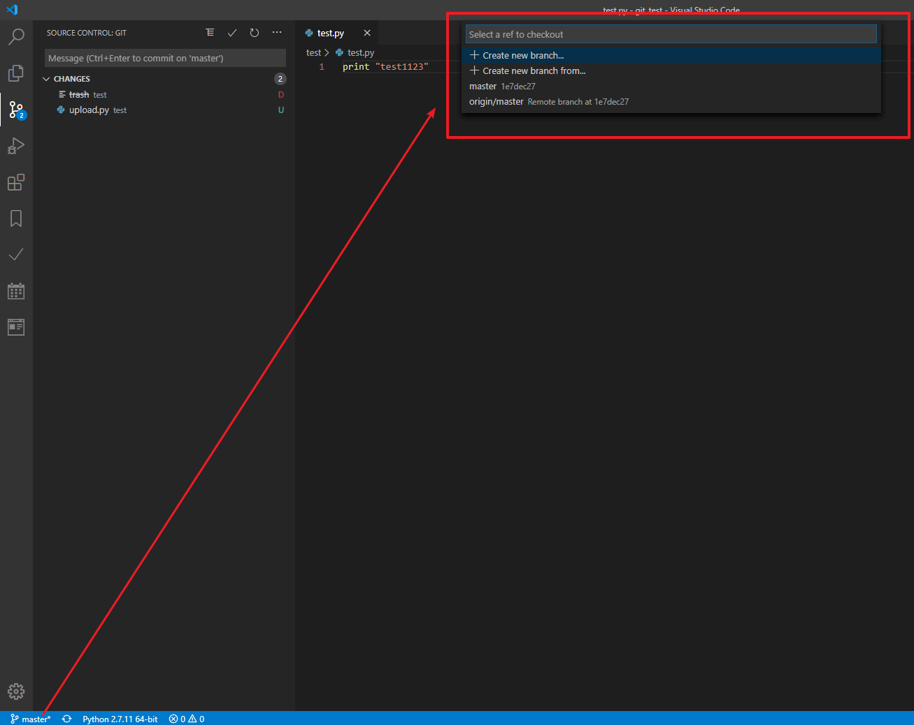

在上面的输入框中输入分支的名字即可：

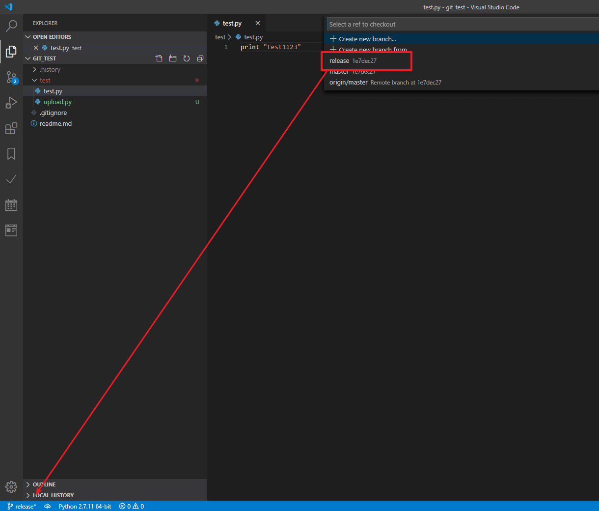

我在上面创建了 release 分支，这样我就可以在 VScode 切换到 release 分支。

我可以像之前那样对 release 分支进行各种修改 push 和 pull，这些修改就不会影响到 master 分支了。


第一次上传新的分支 VScode 会有弹窗提示。
上传成功之后也可以通过 github 来切换查看分支。


## 🍀 总结

上面就是 VScode 内置 git 的支持，基本覆盖日常的使用流程。
如果是个人开发已经完全够用了。

但是如果涉及到一些团队协作的功能，那么 VScode 还是不够强大，比如处理代码冲突之类的支持就不太友好。

那么下一篇就来介绍 VScode 的功能增强实现。

文章作者: 智伤帝
[文章链接](https://blog.l0v0.com/posts/94ffdbdf.html)


## 🍀 常见问题

### 解决“ssh:connect to host github.com port 22: Connection timed out”

> 操作系统: Windows11  
使用: Git VScode  
连接方式：SSH  

在整理完学习笔记后，我像往常一样点开了 VScode 的上传 github 按钮：

原本应该在几秒钟上传成功，但是却异常的慢，这时突然出现一个错误弹窗（忘记截图了）：

提示： `“ssh:connect to host github.com port 22: Connection timed out”`

再多尝试几次，依然是这样。

后来又尝试直接再文件夹里用 `git` 命令行提交：
可惜结果依然是失败。。。

又尝试重启电脑，结果毫无卵用。

最后通过查阅各种资料，得知原因可能是由于电脑的防火墙或者其他网络原因导致 ssh 连接方式端口 22 被封锁。

#### 解决

最终发现两个解决方案：

***方法一*** ：抛弃 `ssh` 连接方式，使用 `http` 连接。（我没有用）

操作方法：

输入命令：
```sh
git config --local -e
```

将配置文件的 `url = git@github.com:username/repo.git` 一行改为： `url = https://github.com/username/repo.git`

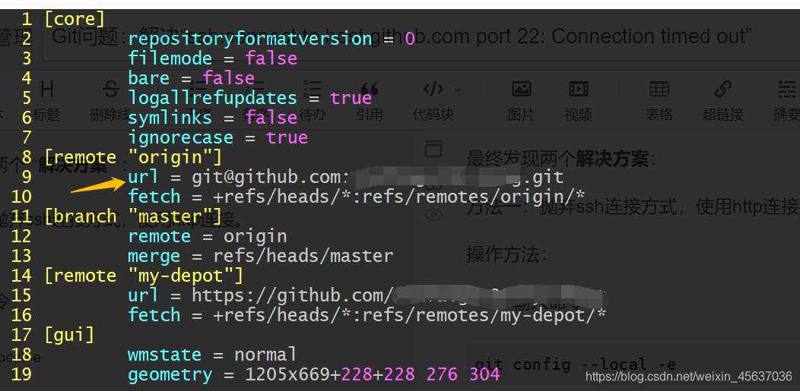

***方法二*** ：如果 22 号端口不行，那就换一个端口

操作方法：

1. 进入 `~/.ssh` 下

```sh
cd ~/.ssh
```

2. 创建一个 `config` 文件(这里我用的vim编辑器)

```sh
vim config
```

3. 编辑文件内容：

```conf
Host github.com
User git
Hostname ssh.github.com
PreferredAuthentications publickey
IdentityFile ~/.ssh/id_rsa
Port 443

Host gitlab.com
Hostname altssh.gitlab.com
User git
Port 443
PreferredAuthentications publickey
IdentityFile ~/.ssh/id_rsa
```


4. 保存退出

5. 检查是否成功

```sh
ssh -T git@github.com
```

额，这里要根据它的提示操作，有个地方要输入 yes
s
大功告成，这时候再试试 `git push` ，已经可以提交了！

