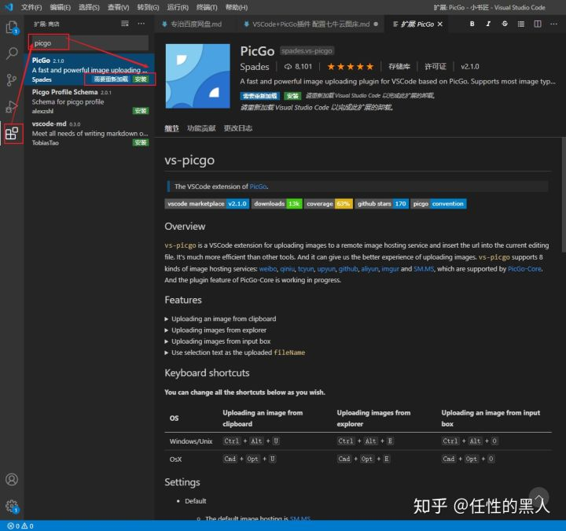
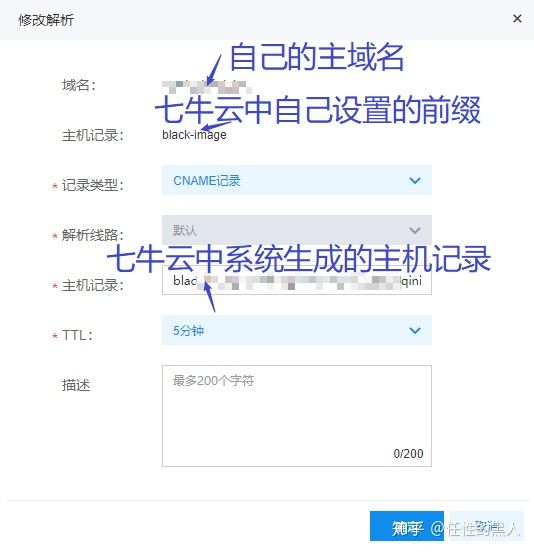
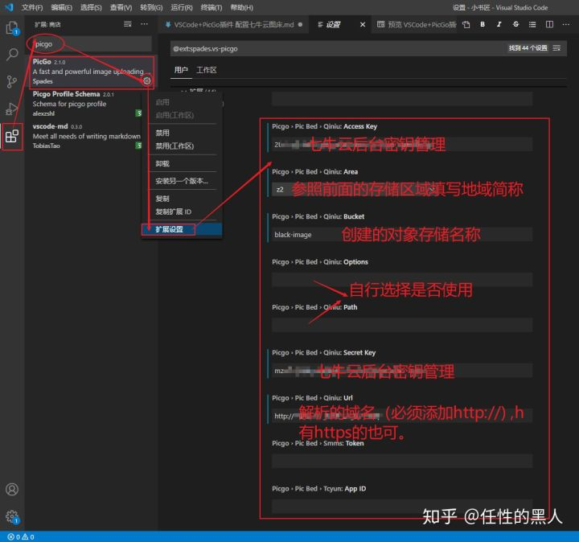
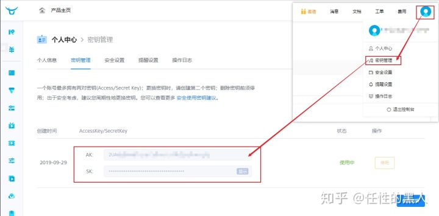
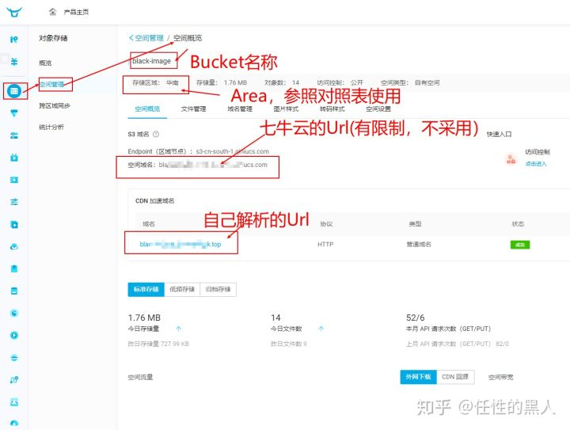
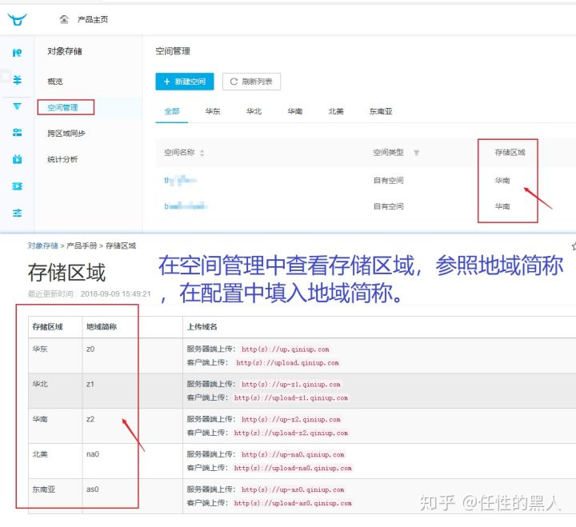
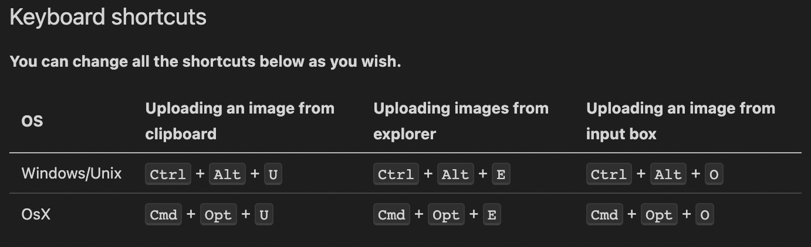

::: details 目录
[[toc]]
:::

> 来源：[任性的黑人](https://zhuanlan.zhihu.com/p/163826941)

## 🍀 一、下载并安装软件 + 插件

#### （一）VSCode 官网下载

官网：[https://code.visualstudio.com/Download](https://code.visualstudio.com/Download)

Win 推荐下载 `.zip` 绿色便携版


#### （二）PicGo 插件下载

开源：[https://github.com/PicGo/vs-picgo/releases](https://github.com/PicGo/vs-picgo/releases)

拓展中安装：拓展 → 输入 Picgo → 点击安装



## 🍀 二、配置插件（七牛云）

#### （一）七牛云平台准备

官网：[https://portal.qiniu.com/](https://portal.qiniu.com/)

官方文档：[https://developer.qiniu.com/kodo](https://developer.qiniu.com/kodo)

空间创建：七牛云注册（登录） → 控制台 → 对象存储 → 新建存储空间

#### （二）配置域名解析

官方文档：[https://developer.qiniu.com/fusion/kb/1322/how-to-configure-cname-domain-name](https://developer.qiniu.com/fusion/kb/1322/how-to-configure-cname-domain-name)

步骤：对象存储 → 空间管理 → 域名管理 → 绑定域名 → CDN → 域名管理 → 复制 CNAME → 第三方域名解析页面 → 添加解析 → 配置解析

> [!NOTE]
> 要使用自己购买的域名的原因：七牛云赠送的加速域名只有一个月有效期，一个月以后就不能使用，使用自己的域名可以长期使用。




#### （三）插件参数设置




七牛云后台密钥管理




七牛云对象存储界面参照



存储区域对照：[https://developer.qiniu.com/kodo/manual/1671/region-endpoint](https://developer.qiniu.com/kodo/manual/1671/region-endpoint)




```json
{
  "accessKey": "",
  "secretKey": "",
  "bucket": "", // 存储空间名
  "url": "", // 自定义域名
  "area": "z0" | "z1" | "z2" | "na0" | "as0", // 存储区域编号
  "options": "", // 网址后缀，比如?imgslim
  "path": "" // 自定义存储路径，比如assets/
}
```


## 🍀 三、测试



- 从剪贴板上传图像： `Ctrl` + `Alt` + `U`
- 从资源管理器上传图像： `Ctrl` + `Alt` + `O`
- 从输入框上传图像 ： `Ctrl` + `Alt` + `E`


## 🍀 附:

七牛云免费额度（需实名认证）  
官网：[https://portal.qiniu.com/financial/price](https://portal.qiniu.com/financial/price)

- 存储空间：第 0 GB 至 10 GB (含)
- CDN 回源流出流量：第 0 GB 至 10 GB (含)
- PUT/DELETE 请求：第 0 千至 10 万 (含)
- GET 请求：第 0 千至 100 万 (含)

PicGo 配置手册：[https://picgo.github.io/PicGo-Doc/zh/guide/](https://picgo.github.io/PicGo-Doc/zh/guide/)

七牛云对象存储开发者中心：[https://developer.qiniu.com/kodo](https://developer.qiniu.com/kodo)


