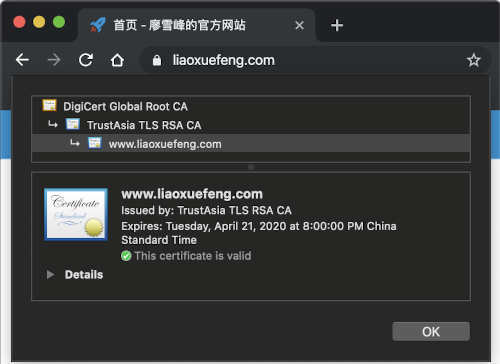

::: details 目录
[[toc]]
:::

我们知道，摘要算法用来确保数据没有被篡改，非对称加密算法可以对数据进行加解密，签名算法可以确保数据完整性和抗否认性，把这些算法集合到一起，并搞一套完善的标准，这就是数字证书。

因此，数字证书就是集合了多种密码学算法，用于实现数据加解密、身份认证、签名等多种功能的一种安全标准。

数字证书可以防止中间人攻击，因为它采用链式签名认证，即通过根证书（Root CA）去签名下一级证书，这样层层签名，直到最终的用户证书。而 Root CA 证书内置于操作系统中，所以，任何经过 CA 认证的数字证书都可以对其本身进行校验，确保证书本身不是伪造的。

我们在上网时常用的 HTTPS 协议就是数字证书的应用。浏览器会自动验证证书的有效性：



要使用数字证书，首先需要创建证书。正常情况下，一个合法的数字证书需要经过 CA 签名，这需要认证域名并支付一定的费用。开发的时候，我们可以使用自签名的证书，这种证书可以正常开发调试，但不能对外作为服务使用，因为其他客户端并不认可未经 CA 签名的证书。

注：[腾讯云](https://cloud.tencent.com/) 可申请有效期 1 年的免费 SSL 证书，[Let's Encrypt](https://letsencrypt.org/) 可申请有效期 90 天的免费 SSL 证书。

在 Java 程序中，数字证书存储在一种 Java 专用的 key store 文件中，JDK 提供了一系列命令来创建和管理 key store。我们用下面的命令创建一个 key store，并设定口令 123456：

```
keytool -storepass 123456 -genkeypair -keyalg RSA -keysize 1024 -sigalg SHA1withRSA -validity 3650 -alias mycert -keystore my.keystore -dname "CN=www.sample.com, OU=sample, O=sample, L=BJ, ST=BJ, C=CN"
```

几个主要的参数是：

- keyalg：指定 RSA 加密算法；
- sigalg：指定 SHA1withRSA 签名算法；
- validity：指定证书有效期 3650 天；
- alias：指定证书在程序中引用的名称；
- dname：最重要的 `CN=www.sample.com` 指定了 `Common Name`，如果证书用在 HTTPS 中，这个名称必须与域名完全一致。

执行上述命令，JDK 会在当前目录创建一个 `my.keystore` 文件，并存储创建成功的一个私钥和一个证书，它的别名是 `mycert`。

有了 key store 存储的证书，我们就可以通过数字证书进行加解密和签名：

```java
import java.io.InputStream;
import java.math.BigInteger;
import java.security.*;
import java.security.cert.*;
import javax.crypto.Cipher;

public class Main {
    public static void main(String[] args) throws Exception {
        byte[] message = "Hello, use X.509 cert!".getBytes("UTF-8");
        // 读取 KeyStore:
        KeyStore ks = loadKeyStore("/my.keystore", "123456");
        // 读取私钥:
        PrivateKey privateKey = (PrivateKey) ks.getKey("mycert", "123456".toCharArray());
        // 读取证书:
        X509Certificate certificate = (X509Certificate) ks.getCertificate("mycert");
        // 加密:
        byte[] encrypted = encrypt(certificate, message);
        System.out.println(String.format("encrypted: %x", new BigInteger(1, encrypted)));
        // 解密:
        byte[] decrypted = decrypt(privateKey, encrypted);
        System.out.println("decrypted:" + new String(decrypted, "UTF-8"));
        // 签名:
        byte[] sign = sign(privateKey, certificate, message);
        System.out.println(String.format("signature: %x", new BigInteger(1, sign)));
        // 验证签名:
        boolean verified = verify(certificate, message, sign);
        System.out.println("verify:" + verified);
    }

    static KeyStore loadKeyStore(String keyStoreFile, String password) {
        try (InputStream input = Main.class.getResourceAsStream(keyStoreFile)) {
            if (input == null) {
                throw new RuntimeException("file not found in classpath:" + keyStoreFile);
            }
            KeyStore ks = KeyStore.getInstance(KeyStore.getDefaultType());
            ks.load(input, password.toCharArray());
            return ks;
        } catch (Exception e) {
            throw new RuntimeException(e);
        }
    }

    static byte[] encrypt(X509Certificate certificate, byte[] message) throws GeneralSecurityException {
        Cipher cipher = Cipher.getInstance(certificate.getPublicKey().getAlgorithm());
        cipher.init(Cipher.ENCRYPT_MODE, certificate.getPublicKey());
        return cipher.doFinal(message);
    }

    static byte[] decrypt(PrivateKey privateKey, byte[] data) throws GeneralSecurityException {
        Cipher cipher = Cipher.getInstance(privateKey.getAlgorithm());
        cipher.init(Cipher.DECRYPT_MODE, privateKey);
        return cipher.doFinal(data);
    }

    static byte[] sign(PrivateKey privateKey, X509Certificate certificate, byte[] message)
            throws GeneralSecurityException {
        Signature signature = Signature.getInstance(certificate.getSigAlgName());
        signature.initSign(privateKey);
        signature.update(message);
        return signature.sign();
    }

    static boolean verify(X509Certificate certificate, byte[] message, byte[] sig) throws GeneralSecurityException {
        Signature signature = Signature.getInstance(certificate.getSigAlgName());
        signature.initVerify(certificate);
        signature.update(message);
        return signature.verify(sig);
    }
}
```

在上述代码中，我们从 key store 直接读取了私钥 - 公钥对，私钥以 `PrivateKey` 实例表示，公钥以 `X509Certificate` 表示，实际上数字证书只包含公钥，因此，读取证书并不需要口令，只有读取私钥才需要。如果部署到 Web 服务器上，例如 Nginx，需要把私钥导出为 Private Key 格式，把证书导出为 X509Certificate 格式。

以 HTTPS 协议为例，浏览器和服务器建立安全连接的步骤如下：

1. 浏览器向服务器发起请求，服务器向浏览器发送自己的数字证书；
2. 浏览器用操作系统内置的 Root CA 来验证服务器的证书是否有效，如果有效，就使用该证书加密一个随机的 AES 口令并发送给服务器；
3. 服务器用自己的私钥解密获得 AES 口令，并在后续通讯中使用 AES 加密。

上述流程只是一种最常见的单向验证。如果服务器还要验证客户端，那么客户端也需要把自己的证书发送给服务器验证，这种场景常见于网银等。

注意：数字证书存储的是公钥，以及相关的证书链和算法信息。私钥必须严格保密，如果数字证书对应的私钥泄漏，就会造成严重的安全威胁。如果 CA 证书的私钥泄漏，那么该 CA 证书签发的所有证书将不可信。数字证书服务商 [DigiNotar](https://en.wikipedia.org/wiki/DigiNotar) 就发生过私钥泄漏导致公司破产的事故。

## 🍀 练习

```java
package com.itranswarp.learnjava;

import java.io.InputStream;
import java.math.BigInteger;
import java.security.*;
import java.security.cert.*;

import javax.crypto.Cipher;

public class Main {
	public static void main(String[] args) throws Exception {
		byte[] message = "Hello, use X.509 cert!".getBytes("UTF-8");
		// 读取 KeyStore:
		KeyStore ks = loadKeyStore("/my.keystore", "123456");
		// 读取私钥:
		PrivateKey privateKey = (PrivateKey) ks.getKey("mycert", "123456".toCharArray());
		// 读取证书:
		X509Certificate certificate = (X509Certificate) ks.getCertificate("mycert");
		// 加密:
		byte[] encrypted = encrypt(certificate, message);
		System.out.println(String.format("encrypted: %x", new BigInteger(1, encrypted)));
		// 解密:
		byte[] decrypted = decrypt(privateKey, encrypted);
		System.out.println("decrypted:" + new String(decrypted, "UTF-8"));
		// 签名:
		byte[] sign = sign(privateKey, certificate, message);
		System.out.println(String.format("signature: %x", new BigInteger(1, sign)));
		// 验证签名:
		boolean verified = verify(certificate, message, sign);
		System.out.println("verify:" + verified);
	}

	static KeyStore loadKeyStore(String keyStoreFile, String password) {
		try (InputStream input = Main.class.getResourceAsStream(keyStoreFile)) {
			if (input == null) {
				throw new RuntimeException("file not found in classpath:" + keyStoreFile);
			}
			KeyStore ks = KeyStore.getInstance(KeyStore.getDefaultType());
			ks.load(input, password.toCharArray());
			return ks;
		} catch (Exception e) {
			throw new RuntimeException(e);
		}
	}

	static byte[] encrypt(X509Certificate certificate, byte[] message) throws GeneralSecurityException {
		Cipher cipher = Cipher.getInstance(certificate.getPublicKey().getAlgorithm());
		cipher.init(Cipher.ENCRYPT_MODE, certificate.getPublicKey());
		return cipher.doFinal(message);
	}

	static byte[] decrypt(PrivateKey privateKey, byte[] data) throws GeneralSecurityException {
		Cipher cipher = Cipher.getInstance(privateKey.getAlgorithm());
		cipher.init(Cipher.DECRYPT_MODE, privateKey);
		return cipher.doFinal(data);
	}

	static byte[] sign(PrivateKey privateKey, X509Certificate certificate, byte[] message)
			throws GeneralSecurityException {
		Signature signature = Signature.getInstance(certificate.getSigAlgName());
		signature.initSign(privateKey);
		signature.update(message);
		return signature.sign();
	}

	static boolean verify(X509Certificate certificate, byte[] message, byte[] sig) throws GeneralSecurityException {
		Signature signature = Signature.getInstance(certificate.getSigAlgName());
		signature.initVerify(certificate);
		signature.update(message);
		return signature.verify(sig);
	}
}
```

## 🍀 小结

数字证书就是集合了多种密码学算法，用于实现数据加解密、身份认证、签名等多种功能的一种安全标准。

数字证书采用链式签名管理，顶级的 Root CA 证书已内置在操作系统中。

数字证书存储的是公钥，可以安全公开，而私钥必须严格保密。