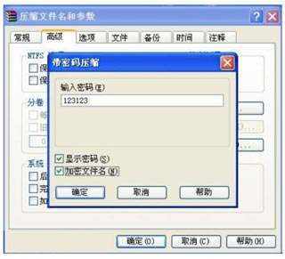

::: details 目录
[[toc]]
:::


对称加密算法就是传统的用一个密码进行加密和解密。例如，我们常用的 WinZIP 和 WinRAR 对压缩包的加密和解密，就是使用对称加密算法：



从程序的角度看，所谓加密，就是这样一个函数，它接收密码和明文，然后输出密文：

```java
secret = encrypt(key, message);
```

而解密则相反，它接收密码和密文，然后输出明文：

```java
plain = decrypt(key, secret);
```

在软件开发中，常用的对称加密算法有：

| 算法 | 密钥长度    | 工作模式             | 填充模式                                |
| :--- | :---------- | :------------------- | :-------------------------------------- |
| DES  | 56/64       | ECB/CBC/PCBC/CTR/... | NoPadding/PKCS5Padding/...              |
| AES  | 128/192/256 | ECB/CBC/PCBC/CTR/... | NoPadding/PKCS5Padding/PKCS7Padding/... |
| IDEA | 128         | ECB                  | PKCS5Padding/PKCS7Padding/...           |

密钥长度直接决定加密强度，而工作模式和填充模式可以看成是对称加密算法的参数和格式选择。Java 标准库提供的算法实现并不包括所有的工作模式和所有填充模式，但是通常我们只需要挑选常用的使用就可以了。

最后注意，DES 算法由于密钥过短，可以在短时间内被暴力破解，所以现在已经不安全了。

## 🍀 使用 AES 加密

AES 算法是目前应用最广泛的加密算法。我们先用 ECB 模式加密并解密：

```java
import java.security.*;
import java.util.Base64;

import javax.crypto.*;
import javax.crypto.spec.*;

public class Main {
    public static void main(String[] args) throws Exception {
        // 原文:
        String message = "Hello, world!";
        System.out.println("Message:" + message);
        // 128 位密钥 = 16 bytes Key:
        byte[] key = "1234567890abcdef".getBytes("UTF-8");
        // 加密:
        byte[] data = message.getBytes("UTF-8");
        byte[] encrypted = encrypt(key, data);
        System.out.println("Encrypted:" + Base64.getEncoder().encodeToString(encrypted));
        // 解密:
        byte[] decrypted = decrypt(key, encrypted);
        System.out.println("Decrypted:" + new String(decrypted, "UTF-8"));
    }

    // 加密:
    public static byte[] encrypt(byte[] key, byte[] input) throws GeneralSecurityException {
        Cipher cipher = Cipher.getInstance("AES/ECB/PKCS5Padding");
        SecretKey keySpec = new SecretKeySpec(key, "AES");
        cipher.init(Cipher.ENCRYPT_MODE, keySpec);
        return cipher.doFinal(input);
    }

    // 解密:
    public static byte[] decrypt(byte[] key, byte[] input) throws GeneralSecurityException {
        Cipher cipher = Cipher.getInstance("AES/ECB/PKCS5Padding");
        SecretKey keySpec = new SecretKeySpec(key, "AES");
        cipher.init(Cipher.DECRYPT_MODE, keySpec);
        return cipher.doFinal(input);
    }
}
```


Java 标准库提供的对称加密接口非常简单，使用时按以下步骤编写代码：

1. 根据算法名称 / 工作模式 / 填充模式获取 Cipher 实例；
2. 根据算法名称初始化一个 SecretKey 实例，密钥必须是指定长度；
3. 使用 SecretKey 初始化 Cipher 实例，并设置加密或解密模式；
4. 传入明文或密文，获得密文或明文。

ECB 模式是最简单的 AES 加密模式，它只需要一个固定长度的密钥，固定的明文会生成固定的密文，这种一对一的加密方式会导致安全性降低，更好的方式是通过 CBC 模式，它需要一个随机数作为 IV 参数，这样对于同一份明文，每次生成的密文都不同：

```java
import java.security.*;
import java.util.Base64;
import javax.crypto.*;
import javax.crypto.spec.*;
public class Main {
    public static void main(String[] args) throws Exception {
        // 原文:
        String message = "Hello, world!";
        System.out.println("Message:" + message);
        // 256 位密钥 = 32 bytes Key:
        byte[] key = "1234567890abcdef1234567890abcdef".getBytes("UTF-8");
        // 加密:
        byte[] data = message.getBytes("UTF-8");
        byte[] encrypted = encrypt(key, data);
        System.out.println("Encrypted:" + Base64.getEncoder().encodeToString(encrypted));
        // 解密:
        byte[] decrypted = decrypt(key, encrypted);
        System.out.println("Decrypted:" + new String(decrypted, "UTF-8"));
    }

    // 加密:
    public static byte[] encrypt(byte[] key, byte[] input) throws GeneralSecurityException {
        Cipher cipher = Cipher.getInstance("AES/CBC/PKCS5Padding");
        SecretKeySpec keySpec = new SecretKeySpec(key, "AES");
        // CBC 模式需要生成一个 16 bytes 的 initialization vector:
        SecureRandom sr = SecureRandom.getInstanceStrong();
        byte[] iv = sr.generateSeed(16);
        IvParameterSpec ivps = new IvParameterSpec(iv);
        cipher.init(Cipher.ENCRYPT_MODE, keySpec, ivps);
        byte[] data = cipher.doFinal(input);
        // IV 不需要保密，把 IV 和密文一起返回:
        return join(iv, data);
    }

    // 解密:
    public static byte[] decrypt(byte[] key, byte[] input) throws GeneralSecurityException {
        // 把 input 分割成 IV 和密文:
        byte[] iv = new byte[16];
        byte[] data = new byte[input.length - 16];
        System.arraycopy(input, 0, iv, 0, 16);
        System.arraycopy(input, 16, data, 0, data.length);
        // 解密:
        Cipher cipher = Cipher.getInstance("AES/CBC/PKCS5Padding");
        SecretKeySpec keySpec = new SecretKeySpec(key, "AES");
        IvParameterSpec ivps = new IvParameterSpec(iv);
        cipher.init(Cipher.DECRYPT_MODE, keySpec, ivps);
        return cipher.doFinal(data);
    }

    public static byte[] join(byte[] bs1, byte[] bs2) {
        byte[] r = new byte[bs1.length + bs2.length];
        System.arraycopy(bs1, 0, r, 0, bs1.length);
        System.arraycopy(bs2, 0, r, bs1.length, bs2.length);
        return r;
    }
}

```


在 CBC 模式下，需要一个随机生成的 16 字节 IV 参数，必须使用 `SecureRandom` 生成。因为多了一个 `IvParameterSpec` 实例，因此，初始化方法需要调用 `Cipher` 的一个重载方法并传入 `IvParameterSpec`。

观察输出，可以发现每次生成的 IV 不同，密文也不同。

## 🍀 小结

对称加密算法使用同一个密钥进行加密和解密，常用算法有 DES、AES 和 IDEA 等；

密钥长度由算法设计决定，AES 的密钥长度是 128/192/256 位；

使用对称加密算法需要指定算法名称、工作模式和填充模式。