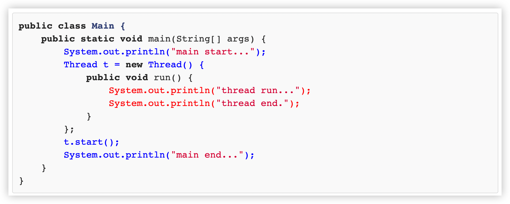

::: details 目录
[[toc]]
:::

Java 语言内置了多线程支持。当 Java 程序启动的时候，实际上是启动了一个 JVM 进程，然后， JVM 启动主线程来执行 `main()` 方法。在 `main()` 方法中，我们又可以启动其他线程。

要创建一个新线程非常容易，我们需要实例化一个 `Thread` 实例，然后调用它的 `start()` 方法：


```java
public class Main {
    public static void main(String[] args) {
        Thread t = new Thread();
        t.start(); // 启动新线程
    }
}
```


但是这个线程启动后实际上什么也不做就立刻结束了。

我们希望 ***新线程能执行指定的代码*** ，有以下几种方法：

- 方法一：从 `Thread` 派生一个自定义类，然后重写 `run()` 方法：

```java
public class Main {
    public static void main(String[] args) {
        Thread t = new MyThread();
        t.start(); // 启动新线程
    }
}

class MyThread extends Thread {
    @Override
    public void run() {
        System.out.println("start new thread!");
    }
}
```

执行上述代码，注意到 `start()` 方法会在内部自动调用实例的 `run()` 方法。

- 方法二：创建 `Thread` 实例时，传入一个 `Runnable` 实例：

```java
public class Main {
    public static void main(String[] args) {
        Thread t = new Thread(new MyRunnable());
        t.start(); // 启动新线程
    }
}

class MyRunnable implements Runnable {
    @Override
    public void run() {
        System.out.println("start new thread!");
    }
}
```

或者用 Java 8 引入的 lambda 语法进一步简写为：

```java
public class Main {
    public static void main(String[] args) {
        Thread t = new Thread(() -> {
            System.out.println("start new thread!");
        });
        t.start(); // 启动新线程
    }
}
```


有童鞋会问，使用线程执行的打印语句，和直接在 `main()` 方法执行有区别吗？

区别大了去了。我们看以下代码：

```java
public class Main {
    public static void main(String[] args) {
        System.out.println("main start...");
        Thread t = new Thread() {
            public void run() {
                System.out.println("thread run...");
                System.out.println("thread end.");
            }
        };
        t.start();
        System.out.println("main end...");
    }
}
```




我们用蓝色表示主线程，也就是 `main` 线程， `main` 线程执行的代码有 4 行，首先打印 `main start` ，然后创建 `Thread` 对象，紧接着调用 `start()` 启动新线程。当 `start()` 方法被调用时， JVM 就创建了一个新线程，我们通过实例变量 `t` 来表示这个新线程对象，并开始执行。

接着， `main` 线程继续执行打印 `main end` 语句，而 `t` 线程在 `main` 线程执行的同时会并发执行，打印 `thread run` 和 `thread end` 语句。

当 `run()` 方法结束时，新线程就结束了。而 `main()` 方法结束时，主线程也结束了。

我们再来看线程的 ***执行顺序*** ：

1. `main` 线程肯定是先打印 `main start` ，再打印 `main end` ；
2. `t` 线程肯定是先打印 `thread run` ，再打印 `thread end` 。

但是，除了可以肯定， `main start` 会先打印外， `main end` 打印在 `thread run` 之前、 `thread end` 之后或者之间，都无法确定。因为从 `t` 线程开始运行以后，两个线程就开始同时运行了，并且由操作系统调度，程序本身无法确定线程的调度顺序。

要模拟并发执行的效果，我们可以在线程中调用 `Thread.sleep()` ，强迫当前线程暂停一段时间：

```java
public class Main {
    public static void main(String[] args) {
        System.out.println("main start...");
        Thread t = new Thread() {
            public void run() {
                System.out.println("thread run...");
                try {
                    Thread.sleep(10);
                } catch (InterruptedException e) {}
                System.out.println("thread end.");
            }
        };
        t.start();
        try {
            Thread.sleep(20);
        } catch (InterruptedException e) {}
        System.out.println("main end...");
    }
}
```

`sleep()` 传入的参数是毫秒。调整暂停时间的大小，我们可以看到 `main` 线程和 `t` 线程执行的先后顺序。

要特别注意：直接调用 `Thread` 实例的 `run()` 方法是无效的：

```java
public class Main {
    public static void main(String[] args) {
        Thread t = new MyThread();
        t.run();
    }
}

class MyThread extends Thread {
    public void run() {
        System.out.println("hello");
    }
}
```

直接调用 `run()` 方法，相当于调用了一个普通的 Java 方法，当前线程并没有任何改变，也不会启动新线程。上述代码实际上是在 `main()` 方法内部又调用了 `run()` 方法，打印 `hello` 语句是在 `main` 线程中执行的，没有任何新线程被创建。

必须调用 `Thread` 实例的 `start()` 方法才能启动新线程，如果我们查看 `Thread` 类的源代码，会看到 `start()` 方法内部调用了一个 `private native void start0()` 方法， `native` 修饰符表示这个方法是由 JVM 虚拟机内部的 C 代码实现的，不是由 Java 代码实现的。


## 🍀 线程的优先级

可以对线程设定优先级，设定优先级的方法是：

```java
Thread.setPriority(int n) // 1~10, 默认值 5
```

优先级高的线程被操作系统调度的优先级较高，操作系统对高优先级线程可能调度更频繁，但我们决不能通过设置优先级来确保高优先级的线程一定会先执行。


## 🍀 练习

创建新线程

```java
package com.itranswarp.learnjava;

public class Main {

	public static void main(String[] args) {
		new Thread1().start();
		new Thread2().start();
		for (int i = 0; i < 100; i++) {
			System.out.println("main: running...");
			try {
				Thread.sleep(1);
			} catch (InterruptedException e) {
			}
		}
	}

}

class Thread1 extends Thread {

	public void run() {
		for (int i = 0; i < 100; i++) {
			System.out.println("Thread-1: running...");
			try {
				Thread.sleep(1);
			} catch (InterruptedException e) {
			}
		}
	}
}

class Thread2 extends Thread {

	public void run() {
		for (int i = 0; i < 100; i++) {
			System.out.println("Thread-2: running...");
			try {
				Thread.sleep(1);
			} catch (InterruptedException e) {
			}
		}
	}
}
```


## 🍀 小结

- Java 用 `Thread` 对象表示一个线程，通过调用 `start()` 启动一个新线程；
- 一个线程对象只能调用一次 `start()` 方法；
- 线程的执行代码写在 `run()` 方法中；
- 线程调度由操作系统决定，程序本身无法决定调度顺序；
- `Thread.sleep()` 可以把当前线程暂停一段时间。


