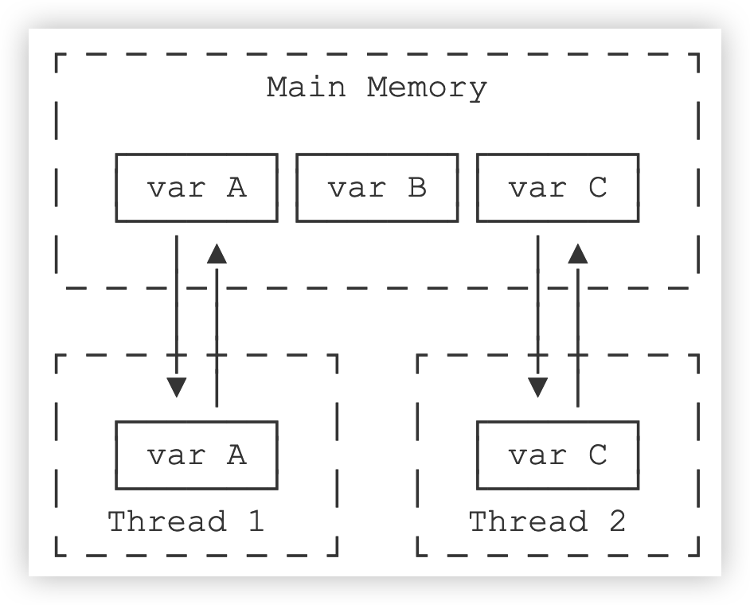

::: details 目录
[[toc]]
:::

如果线程需要执行一个长时间任务，就可能需要能中断线程。

> [!tip]
> 中断线程就是其他线程给该线程发一个信号，该线程收到信号后结束执行 `run()` 方法，使得自身线程能立刻结束运行。

我们举个栗子：假设从网络下载一个 100M 的文件，如果网速很慢，用户等得不耐烦，就可能在下载过程中点 “取消”，这时，程序就需要中断下载线程的执行。

中断一个线程非常简单，只需要在其他线程中对目标线程调用 `interrupt()` 方法，目标线程需要反复检测自身状态是否是 `interrupted` 状态，如果是，就立刻结束运行。

我们还是看示例代码：

```java
public class Main {
    public static void main(String[] args) throws InterruptedException {
        Thread t = new MyThread();
        t.start();
        Thread.sleep(1); // 暂停 1 毫秒
        t.interrupt(); // 中断 t 线程
        t.join(); // 等待 t 线程结束
        System.out.println("end");
    }
}

class MyThread extends Thread {
    public void run() {
        int n = 0;
        while (! isInterrupted()) {
            n ++;
            System.out.println(n + "hello!");
        }
    }
}
```

仔细看上述代码，`main` 线程通过调用 `t.interrupt()` 方法中断 `t` 线程，但是要注意，`interrupt()` 方法仅仅向 `t` 线程发出了 “中断请求”，至于 `t` 线程是否能立刻响应，要看具体代码。而 `t` 线程的 `while` 循环会检测 `isInterrupted()`，所以上述代码能正确响应 `interrupt()` 请求，使得自身立刻结束运行 `run()` 方法。

如果线程处于等待状态，例如，`t.join()` 会让 `main` 线程进入等待状态，此时，如果对 `main` 线程调用 `interrupt()`，`join()` 方法会立刻抛出 `InterruptedException`，因此，目标线程只要捕获到 `join()` 方法抛出的 `InterruptedException`，就说明有其他线程对其调用了 `interrupt()` 方法，通常情况下该线程应该立刻结束运行。

我们来看下面的示例代码：

```java
public class Main {
    public static void main(String[] args) throws InterruptedException {
        Thread t = new MyThread();
        t.start();
        Thread.sleep(1000);
        t.interrupt(); // 中断 t 线程
        t.join(); // 等待 t 线程结束
        System.out.println("end");
    }
}

class MyThread extends Thread {
    public void run() {
        Thread hello = new HelloThread();
        hello.start(); // 启动 hello 线程
        try {
            hello.join(); // 等待 hello 线程结束
        } catch (InterruptedException e) {
            System.out.println("interrupted!");
        }
        hello.interrupt();
    }
}

class HelloThread extends Thread {
    public void run() {
        int n = 0;
        while (!isInterrupted()) {
            n++;
            System.out.println(n + "hello!");
            try {
                Thread.sleep(100);
            } catch (InterruptedException e) {
                break;
            }
        }
    }
}
```

`main` 线程通过调用 `t.interrupt()` 从而通知 `t` 线程中断，而此时 `t` 线程正位于 `hello.join()` 的等待中，此方法会立刻结束等待并抛出 `InterruptedException` 。由于我们在 `t` 线程中捕获了 `InterruptedException`，因此，就可以准备结束该线程。在 `t` 线程结束前，对 `hello` 线程也进行了 `interrupt()` 调用通知其中断。如果去掉这一行代码，可以发现 `hello` 线程仍然会继续运行，且 JVM 不会退出。

另一个常用的中断线程的方法是设置标志位。我们通常会用一个 `running` 标志位来标识线程是否应该继续运行，在外部线程中，通过把 `HelloThread.running` 置为 `false`，就可以让线程结束：

```java
public class Main {
    public static void main(String[] args)  throws InterruptedException {
        HelloThread t = new HelloThread();
        t.start();
        Thread.sleep(1);
        t.running = false; // 标志位置为 false
    }
}

class HelloThread extends Thread {
    public volatile boolean running = true;
    public void run() {
        int n = 0;
        while (running) {
            n ++;
            System.out.println(n + "hello!");
        }
        System.out.println("end!");
    }
}
```

注意到 `HelloThread` 的标志位 `boolean running` 是一个线程间共享的变量。线程间共享变量需要使用 `volatile` 关键字标记，确保每个线程都能读取到更新后的变量值。

为什么要对线程间共享的变量用关键字 `volatile` 声明？这涉及到 Java 的内存模型。在 Java 虚拟机中，变量的值保存在主内存中，但是，当线程访问变量时，它会先获取一个副本，并保存在自己的工作内存中。如果线程修改了变量的值，虚拟机会在某个时刻把修改后的值回写到主内存，但是，这个时间是不确定的！



这会导致如果一个线程更新了某个变量，另一个线程读取的值可能还是更新前的。例如，主内存的变量 `a = true`，线程 1 执行 `a = false` 时，它在此刻仅仅是把变量 `a` 的副本变成了 `false`，主内存的变量 `a` 还是 `true`，在 JVM 把修改后的 `a` 回写到主内存之前，其他线程读取到的 `a` 的值仍然是 `true`，这就造成了多线程之间共享的变量不一致。

因此，`volatile` 关键字的目的是告诉虚拟机：

- 每次访问变量时，总是获取主内存的最新值；
- 每次修改变量后，立刻回写到主内存。

`volatile` 关键字解决的是可见性问题：当一个线程修改了某个共享变量的值，其他线程能够立刻看到修改后的值。

如果我们去掉 `volatile` 关键字，运行上述程序，发现效果和带 `volatile` 差不多，这是因为在 x86 的架构下，JVM 回写主内存的速度非常快，但是，换成 ARM 的架构，就会有显著的延迟。

## 🍀 小结

- 对目标线程调用 `interrupt()` 方法可以请求中断一个线程，目标线程通过检测 `isInterrupted()` 标志获取自身是否已中断。如果目标线程处于等待状态，该线程会捕获到 `InterruptedException` ；
- 目标线程检测到 `isInterrupted()` 为 `true` 或者捕获了 `InterruptedException` 都应该立刻结束自身线程；
- 通过标志位判断需要正确使用 `volatile` 关键字；
- `volatile` 关键字解决了共享变量在线程间的可见性问题。
