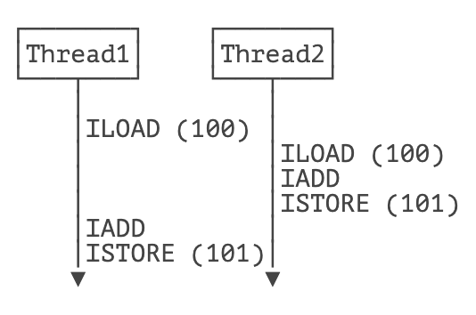
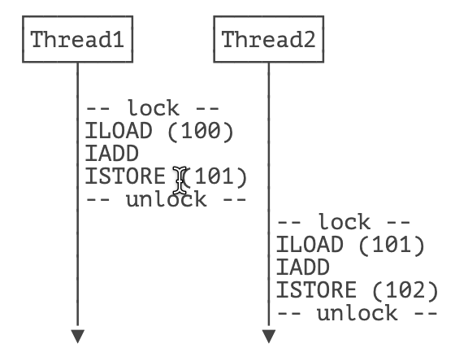

::: details 目录
[[toc]]
:::


当多个线程同时运行时，线程的调度由操作系统决定，程序本身无法决定。因此，任何一个线程都有可能在任何指令处被操作系统暂停，然后在某个时间段后继续执行。

这个时候，有个单线程模型下不存在的问题就来了：如果多个线程同时读写共享变量，会出现数据不一致的问题。

我们来看一个例子：

```java
// 多线程
public class Main {
    public static void main(String[] args) throws Exception {
        var add = new AddThread();
        var dec = new DecThread();
        add.start();
        dec.start();
        add.join();
        dec.join();
        System.out.println(Counter.count);
    }
}

class Counter {
    public static int count = 0;
}

class AddThread extends Thread {
    public void run() {
        for (int i=0; i<10000; i++) { Counter.count += 1; }
    }
}

class DecThread extends Thread {
    public void run() {
        for (int i=0; i<10000; i++) { Counter.count -= 1; }
    }
}

```


上面的代码很简单，两个线程同时对一个 `int` 变量进行操作，一个加 10000 次，一个减 10000 次，最后结果应该是 0，但是，每次运行，结果实际上都是不一样的。

这是因为对变量进行读取和写入时，结果要正确，必须保证是原子操作。原子操作是指不能被中断的一个或一系列操作。

例如，对于语句：

```java
n = n + 1;
```

看上去是一行语句，实际上对应了 3 条指令：

```
ILOAD
IADD
ISTORE
```

我们假设 `n` 的值是 `100`，如果两个线程同时执行 `n = n + 1`，得到的结果很可能不是 `102`，而是 `101`，原因在于：



如果线程 1 在执行 `ILOAD` 后被操作系统中断，此刻如果线程 2 被调度执行，它执行 `ILOAD` 后获取的值仍然是 `100`，最终结果被两个线程的 `ISTORE` 写入后变成了 `101`，而不是期待的 `102`。

这说明多线程模型下，要保证逻辑正确，对共享变量进行读写时，必须保证一组指令以原子方式执行：即某一个线程执行时，其他线程必须等待：



通过加锁和解锁的操作，就能保证 3 条指令总是在一个线程执行期间，不会有其他线程会进入此指令区间。即使在执行期线程被操作系统中断执行，其他线程也会因为无法获得锁导致无法进入此指令区间。只有执行线程将锁释放后，其他线程才有机会获得锁并执行。这种加锁和解锁之间的代码块我们称之为临界区（Critical Section），任何时候临界区最多只有一个线程能执行。

可见，保证一段代码的原子性就是通过加锁和解锁实现的。Java 程序使用 `synchronized` 关键字对一个对象进行加锁：

```java
synchronized(lock) {
    n = n + 1;
}
```

`synchronized` 保证了代码块在任意时刻最多只有一个线程能执行。我们把上面的代码用 `synchronized` 改写如下：

```java
// 多线程
public class Main {
    public static void main(String[] args) throws Exception {
        var add = new AddThread();
        var dec = new DecThread();
        add.start();
        dec.start();
        add.join();
        dec.join();
        System.out.println(Counter.count);
    }
}

class Counter {
    public static final Object lock = new Object();
    public static int count = 0;
}

class AddThread extends Thread {
    public void run() {
        for (int i=0; i<10000; i++) {
            synchronized(Counter.lock) {
                Counter.count += 1;
            }
        }
    }
}

class DecThread extends Thread {
    public void run() {
        for (int i=0; i<10000; i++) {
            synchronized(Counter.lock) {
                Counter.count -= 1;
            }
        }
    }
}

```


注意到代码：

```java
synchronized(Counter.lock) { // 获取锁
    ...
} // 释放锁
```

它表示用 `Counter.lock` 实例作为锁，两个线程在执行各自的 `synchronized(Counter.lock) { ... }` 代码块时，必须先获得锁，才能进入代码块进行。执行结束后，在 `synchronized` 语句块结束会自动释放锁。这样一来，对 `Counter.count` 变量进行读写就不可能同时进行。上述代码无论运行多少次，最终结果都是 0。

使用 `synchronized` 解决了多线程同步访问共享变量的正确性问题。但是，它的缺点是带来了性能下降。因为 `synchronized` 代码块无法并发执行。此外，加锁和解锁需要消耗一定的时间，所以，`synchronized` 会降低程序的执行效率。

我们来概括一下如何使用 `synchronized`：

1. 找出修改共享变量的线程代码块；
2. 选择一个共享实例作为锁；
3. 使用 `synchronized(lockObject) { ... }`。

在使用 `synchronized` 的时候，不必担心抛出异常。因为无论是否有异常，都会在 `synchronized` 结束处正确释放锁：

```java
public void add(int m) {
    synchronized (obj) {
        if (m < 0) {
            throw new RuntimeException();
        }
        this.value += m;
    } // 无论有无异常，都会在此释放锁
}
```

我们再来看一个错误使用 `synchronized` 的例子：

```java
// 多线程
public class Main {
    public static void main(String[] args) throws Exception {
        var add = new AddThread();
        var dec = new DecThread();
        add.start();
        dec.start();
        add.join();
        dec.join();
        System.out.println(Counter.count);
    }
}

class Counter {
    public static final Object lock1 = new Object();
    public static final Object lock2 = new Object();
    public static int count = 0;
}

class AddThread extends Thread {
    public void run() {
        for (int i=0; i<10000; i++) {
            synchronized(Counter.lock1) {
                Counter.count += 1;
            }
        }
    }
}

class DecThread extends Thread {
    public void run() {
        for (int i=0; i<10000; i++) {
            synchronized(Counter.lock2) {
                Counter.count -= 1;
            }
        }
    }
}
```


结果并不是 0，这是因为两个线程各自的 `synchronized` 锁住的 * 不是同一个对象 *！这使得两个线程各自都可以同时获得锁：因为 JVM 只保证同一个锁在任意时刻只能被一个线程获取，但两个不同的锁在同一时刻可以被两个线程分别获取。

因此，使用 `synchronized` 的时候，获取到的是哪个锁非常重要。锁对象如果不对，代码逻辑就不对。

我们再看一个例子：

```java
// 多线程
public class Main {
    public static void main(String[] args) throws Exception {
        var ts = new Thread[] { new AddStudentThread(), new DecStudentThread(), new AddTeacherThread(), new DecTeacherThread() };
        for (var t : ts) {
            t.start();
        }
        for (var t : ts) {
            t.join();
        }
        System.out.println(Counter.studentCount);
        System.out.println(Counter.teacherCount);
    }
}

class Counter {
    public static final Object lock = new Object();
    public static int studentCount = 0;
    public static int teacherCount = 0;
}

class AddStudentThread extends Thread {
    public void run() {
        for (int i=0; i<10000; i++) {
            synchronized(Counter.lock) {
                Counter.studentCount += 1;
            }
        }
    }
}

class DecStudentThread extends Thread {
    public void run() {
        for (int i=0; i<10000; i++) {
            synchronized(Counter.lock) {
                Counter.studentCount -= 1;
            }
        }
    }
}

class AddTeacherThread extends Thread {
    public void run() {
        for (int i=0; i<10000; i++) {
            synchronized(Counter.lock) {
                Counter.teacherCount += 1;
            }
        }
    }
}

class DecTeacherThread extends Thread {
    public void run() {
        for (int i=0; i<10000; i++) {
            synchronized(Counter.lock) {
                Counter.teacherCount -= 1;
            }
        }
    }
}

```


上述代码的 4 个线程对两个共享变量分别进行读写操作，但是使用的锁都是 `Counter.lock` 这一个对象，这就造成了原本可以并发执行的 `Counter.studentCount += 1` 和 `Counter.teacherCount += 1`，现在无法并发执行了，执行效率大大降低。实际上，需要同步的线程可以分成两组：`AddStudentThread` 和 `DecStudentThread`，`AddTeacherThread` 和 `DecTeacherThread`，组之间不存在竞争，因此，应该使用两个不同的锁，即：

`AddStudentThread` 和 `DecStudentThread` 使用 `lockStudent` 锁：

```java
synchronized(Counter.lockStudent) {
    ...
}
```

`AddTeacherThread` 和 `DecTeacherThread` 使用 `lockTeacher` 锁：

```java
synchronized(Counter.lockTeacher) {
    ...
}
```

这样才能最大化地提高执行效率。

## 不需要 synchronized 的操作

JVM 规范定义了几种原子操作：

- 基本类型（`long` 和 `double` 除外）赋值，例如：`int n = m`；
- 引用类型赋值，例如：`List<String> list = anotherList`。

`long` 和 `double` 是 64 位数据，JVM 没有明确规定 64 位赋值操作是不是一个原子操作，不过在 x64 平台的 JVM 是把 `long` 和 `double` 的赋值作为原子操作实现的。

单条原子操作的语句不需要同步。例如：

```java
public void set(int m) {
    synchronized(lock) {
        this.value = m;
    }
}
```

就不需要同步。

对引用也是类似。例如：

```java
public void set(String s) {
    this.value = s;
}
```

上述赋值语句并不需要同步。

但是，如果是多行赋值语句，就必须保证是同步操作，例如：

```java
class Point {
    int x;
    int y;
    public void set(int x, int y) {
        synchronized(this) {
            this.x = x;
            this.y = y;
        }
    }
}
```

> [!warning]
> 多线程连续读写多个变量时，同步的目的是为了保证程序逻辑正确！

不但写需要同步，读也需要同步：

```java
class Point {
    int x;
    int y;

    public void set(int x, int y) {
        synchronized(this) {
            this.x = x;
            this.y = y;
        }
    }

    public int[] get() {
        int[] copy = new int[2];
        copy[0] = x;
        copy[1] = y;
    }
}
```

假定当前坐标是 `(100, 200)`，那么当设置新坐标为 `(110, 220)` 时，上述未同步的多线程读到的值可能有：

- (100, 200)：x，y 更新前；
- (110, 200)：x 更新后，y 更新前；
- (110, 220)：x，y 更新后。

如果读取到 `(110, 200)`，即读到了更新后的 x，更新前的 y，那么可能会造成程序的逻辑错误，无法保证读取的多个变量状态保持一致。

有些时候，通过一些巧妙的转换，可以把非原子操作变为原子操作。例如，上述代码如果改造成：

```java
class Point {
    int[] ps;
    public void set(int x, int y) {
        int[] ps = new int[] { x, y };
        this.ps = ps;
    }
}
```

就不再需要写同步，因为 `this.ps = ps` 是引用赋值的原子操作。而语句：

```java
int[] ps = new int[] { x, y };
```

这里的 `ps` 是方法内部定义的局部变量，每个线程都会有各自的局部变量，互不影响，并且互不可见，并不需要同步。

不过要注意，读方法在复制 `int[]` 数组的过程中仍然需要同步。

## 不可变对象无需同步

如果多线程读写的是一个不可变对象，那么无需同步，因为不会修改对象的状态：

```java
class Data {
    List<String> names;
    void set(String[] names) {
        this.names = List.of(names);
    }
    List<String> get() {
        return this.names;
    }
}
```

注意到 `set()` 方法内部创建了一个不可变 `List`，这个 `List` 包含的对象也是不可变对象 `String`，因此，整个 `List<String>` 对象都是不可变的，因此读写均无需同步。

分析变量是否能被多线程访问时，首先要理清概念，多线程同时执行的是方法。对于下面这个例子：

```java
class Status {
    List<String> names;
    int x;
    int y;
    void set(String[] names, int n) {
        List<String> ns = List.of(names);
        this.names = ns;
        int step = n * 10;
        this.x += step;
        this.y += step;
    }
    StatusRecord get() {
        return new StatusRecord(this.names, this.x, this.y);
    }
}
```

如果有 A、B 两个线程，同时执行是指：

- 可能同时执行 set()；
- 可能同时执行 get()；
- 可能 A 执行 set()，同时 B 执行 get()。

类的成员变量 `names`、`x`、`y` 显然能被多线程同时读写，但局部变量（包括方法参数）如果没有 “逃逸”，那么只有当前线程可见。局部变量 `step` 仅在 `set()` 方法内部使用，因此每个线程同时执行 set 时都有一份独立的 step 存储在线程的栈上，互不影响，但是局部变量 `ns` 虽然每个线程也各有一份，但后续赋值后对其他线程就变成可见了。对 `set()` 方法同步时，如果要最小化 `synchronized` 代码块，可以改写如下：

```java
void set(String[] names, int n) {
    // 局部变量其他线程不可见:
    List<String> ns = List.of(names);
    int step = n * 10;
    synchronized(this) {
        this.names = ns;
        this.x += step;
        this.y += step;
    }
}
```

因此，深入理解多线程还需理解变量在栈上的存储方式，基本类型和引用类型的存储方式也不同。

## 小结

多线程同时读写共享变量时，可能会造成逻辑错误，因此需要通过 `synchronized` 同步；

同步的本质就是给指定对象加锁，加锁后才能继续执行后续代码；

注意加锁对象必须是同一个实例；

对 JVM 定义的单个原子操作不需要同步。