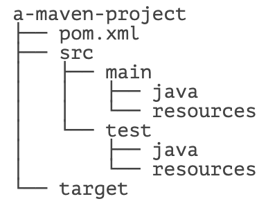
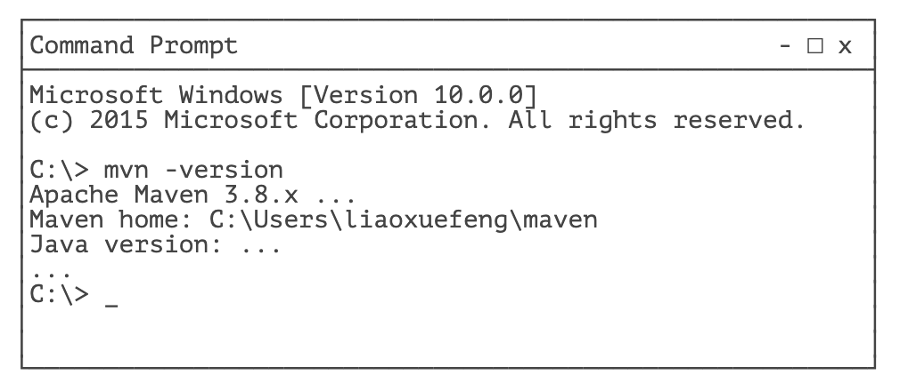

::: details 目录
[[toc]]
:::


在了解 Maven 之前，我们先来看看一个 Java 项目需要的东西。首先，我们需要确定引入哪些依赖包。例如，如果我们需要用到 [commons logging](https://commons.apache.org/proper/commons-logging/)，我们就必须把 commons logging 的 jar 包放入 classpath。如果我们还需要 [log4j](https://logging.apache.org/log4j/)，就需要把 log4j 相关的 jar 包都放到 classpath 中。这些就是依赖包的管理。

其次，我们要确定项目的目录结构。例如，`src` 目录存放 Java 源码，`resources` 目录存放配置文件，`bin` 目录存放编译生成的 `.class` 文件。

此外，我们还需要配置环境，例如 JDK 的版本，编译打包的流程，当前代码的版本号。

最后，除了使用 Eclipse 这样的 IDE 进行编译外，我们还必须能通过命令行工具进行编译，才能够让项目在一个独立的服务器上编译、测试、部署。

这些工作难度不大，但是非常琐碎且耗时。如果每一个项目都自己搞一套配置，肯定会一团糟。我们需要的是一个标准化的 Java 项目管理和构建工具。

Maven 就是是专门为 Java 项目打造的管理和构建工具，它的主要功能有：

- 提供了一套标准化的项目结构；
- 提供了一套标准化的构建流程（编译，测试，打包，发布……）；
- 提供了一套依赖管理机制。

## 🍀 Maven 项目结构

一个使用 Maven 管理的普通的 Java 项目，它的目录结构默认如下：



项目的根目录 `a-maven-project` 是项目名，它有一个项目描述文件 `pom.xml`，存放 Java 源码的目录是 `src/main/java`，存放资源文件的目录是 `src/main/resources`，存放测试源码的目录是 `src/test/java`，存放测试资源的目录是 `src/test/resources`，最后，所有编译、打包生成的文件都放在 `target` 目录里。这些就是一个 Maven 项目的标准目录结构。

所有的目录结构都是约定好的标准结构，我们千万不要随意修改目录结构。使用标准结构不需要做任何配置，Maven 就可以正常使用。

我们再来看最关键的一个项目描述文件 `pom.xml`，它的内容长得像下面：

```xml
<project ...>
	<modelVersion>4.0.0</modelVersion>
	<groupId>com.itranswarp.learnjava</groupId>
	<artifactId>hello</artifactId>
	<version>1.0</version>
	<packaging>jar</packaging>
	<properties>
        ...
	</properties>
	<dependencies>
        <dependency>
            <groupId>commons-logging</groupId>
            <artifactId>commons-logging</artifactId>
            <version>1.2</version>
        </dependency>
	</dependencies>
</project>
```

其中，`groupId` 类似于 Java 的包名，通常是公司或组织名称，`artifactId` 类似于 Java 的类名，通常是项目名称，再加上 `version`，一个 Maven 工程就是由 `groupId`，`artifactId` 和 `version` 作为唯一标识。我们在引用其他第三方库的时候，也是通过这 3 个变量确定。例如，依赖 `commons-logging`：

```xml
<dependency>
    <groupId>commons-logging</groupId>
    <artifactId>commons-logging</artifactId>
    <version>1.2</version>
</dependency>
```

使用 `<dependency>` 声明一个依赖后，Maven 就会自动下载这个依赖包并把它放到 classpath 中。

## 🍀 安装 Maven

要安装 Maven，可以从 [Maven 官网](https://maven.apache.org/) 下载最新的 Maven 3.8.x，然后在本地解压，设置几个环境变量：

```
M2_HOME=/path/to/maven-3.8.x
PATH=$PATH:$M2_HOME/bin
```

Windows 可以把 `%M2_HOME%\bin` 添加到系统 Path 变量中。

然后，打开命令行窗口，输入 `mvn -version`，应该看到 Maven 的版本信息：



如果提示命令未找到，说明系统 PATH 路径有误，需要修复后再运行。

## 🍀 小结

Maven 是一个 Java 项目的管理和构建工具：

- Maven 使用 `pom.xml` 定义项目内容，并使用预设的目录结构；
- 在 Maven 中声明一个依赖项可以自动下载并导入 classpath；
- Maven 使用 `groupId`，`artifactId` 和 `version` 唯一定位一个依赖。

