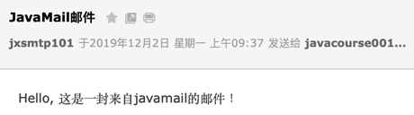
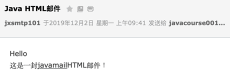
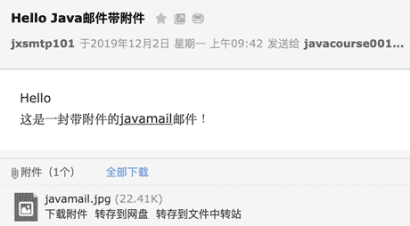
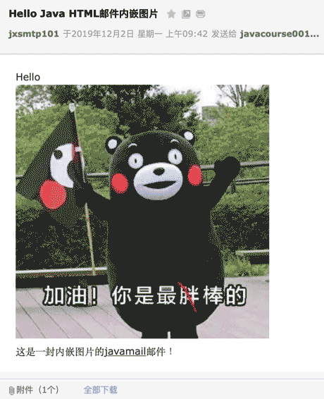

::: details 目录
[[toc]]
:::

Email 就是电子邮件。电子邮件的应用已经有几十年的历史了，我们熟悉的邮箱地址比如 `abc@example.com`，邮件软件比如 Outlook 都是用来收发邮件的。

使用 Java 程序也可以收发电子邮件。我们先来看一下传统的邮件是如何发送的。

传统的邮件是通过邮局投递，然后从一个邮局到另一个邮局，最终到达用户的邮箱：


电子邮件的发送过程也是类似的，只不过是电子邮件是从用户电脑的邮件软件，例如 Outlook，发送到邮件服务器上，可能经过若干个邮件服务器的中转，最终到达对方邮件服务器上，收件方就可以用软件接收邮件：


- 我们把类似 Outlook 这样的邮件软件称为 **MUA**：Mail User Agent，意思是 _给用户服务的邮件代理_；
- 邮件服务器则称为 **MTA**：Mail Transfer Agent，意思是 _邮件中转的代理_；
- 最终到达的邮件服务器称为 **MDA**：Mail Delivery Agent，意思是 _邮件到达的代理_。

电子邮件一旦到达 MDA，就不再动了。实际上，电子邮件通常就存储在 MDA 服务器的硬盘上，然后等收件人通过软件或者登陆浏览器查看邮件。

MTA 和 MDA 这样的服务器软件通常是现成的，我们不关心这些服务器内部是如何运行的。要发送邮件，我们关心的是如何编写一个 MUA 的软件，把邮件发送到 MTA 上。

MUA 到 MTA 发送邮件的协议就是 **SMTP 协议**，它是 Simple Mail Transport Protocol 的缩写，使用标准端口 25，也可以使用加密端口 465 或 587。

SMTP 协议是一个建立在 TCP 之上的协议，任何程序发送邮件都必须遵守 SMTP 协议。使用 Java 程序发送邮件时，我们无需关心 SMTP 协议的底层原理，只需要使用 JavaMail 这个标准 API 就可以直接发送邮件。

## 🍀 准备 SMTP 登录信息

假设我们准备使用自己的邮件地址 `me@example.com` 给小明发送邮件，已知小明的邮件地址是 `xiaoming@somewhere.com`，发送邮件前，我们首先要确定作为 MTA 的邮件服务器地址和端口号。邮件服务器地址通常是 `smtp.example.com`，端口号由邮件服务商确定使用 25、465 还是 587。以下是一些常用邮件服务商的 SMTP 信息：

- QQ 邮箱：SMTP 服务器是 smtp.qq.com，端口是 465/587；
- 163 邮箱：SMTP 服务器是 smtp.163.com，端口是 465；
- Gmail 邮箱：SMTP 服务器是 smtp.gmail.com，端口是 465/587。

有了 SMTP 服务器的域名和端口号，我们还需要 SMTP 服务器的登录信息，通常是使用自己的邮件地址作为用户名，登录口令是用户口令或者一个独立设置的 SMTP 口令。

我们来看看如何使用 JavaMail 发送邮件。

首先，我们需要创建一个 Maven 工程，并把 JavaMail 相关的两个依赖加入进来：

- jakarta.mail:javax.mail-api:2.0.1
- com.sun.mail:jakarta.mail:2.0.1

这两个包一个是接口定义，一个是具体实现。如果使用早期的 1.x 版本，则需注意引入的包名有所不同：

- javax.mail:javax.mail-api:1.6.2
- com.sun.mail:javax.mail:1.6.2

并且代码引用的 `jakarta.mail` 需替换为 `javax.mail`。

然后，我们通过 JavaMail API 连接到 SMTP 服务器上：

```java
// 服务器地址:
String smtp = "smtp.office365.com";
// 登录用户名:
String username = "jxsmtp101@outlook.com";
// 登录口令:
String password = "********";
// 连接到 SMTP 服务器 587 端口:
Properties props = new Properties();
props.put("mail.smtp.host", smtp); // SMTP 主机名
props.put("mail.smtp.port", "587"); // 主机端口号
props.put("mail.smtp.auth", "true"); // 是否需要用户认证
props.put("mail.smtp.starttls.enable", "true"); // 启用 TLS 加密
// 获取 Session 实例:
Session session = Session.getInstance(props, new Authenticator() {
    protected PasswordAuthentication getPasswordAuthentication() {
        return new PasswordAuthentication(username, password);
    }
});
// 设置 debug 模式便于调试:
session.setDebug(true);
```

以 587 端口为例，连接 SMTP 服务器时，需要准备一个 `Properties` 对象，填入相关信息。最后获取 `Session` 实例时，如果服务器需要认证，还需要传入一个 `Authenticator` 对象，并返回指定的用户名和口令。

当我们获取到 `Session` 实例后，打开调试模式可以看到 SMTP 通信的详细内容，便于调试。

## 🍀 发送邮件

发送邮件时，我们需要构造一个 `Message` 对象，然后调用 `Transport.send(Message)` 即可完成发送：

```java
MimeMessage message = new MimeMessage(session);
// 设置发送方地址:
message.setFrom(new InternetAddress("me@example.com"));
// 设置接收方地址:
message.setRecipient(Message.RecipientType.TO, new InternetAddress("xiaoming@somewhere.com"));
// 设置邮件主题:
message.setSubject("Hello", "UTF-8");
// 设置邮件正文:
message.setText("Hi Xiaoming...", "UTF-8");
// 发送:
Transport.send(message);
```

绝大多数邮件服务器要求发送方地址和登录用户名必须一致，否则发送将失败。

填入真实的地址，运行上述代码，我们可以在控制台看到 JavaMail 打印的调试信息：

```sh
这是 JavaMail 打印的调试信息:
DEBUG: setDebug: JavaMail version 1.6.2
DEBUG: getProvider() returning javax.mail.Provider[TRANSPORT,smtp,com.sun.mail.smtp.SMTPTransport,Oracle]
DEBUG SMTP: need username and password for authentication
DEBUG SMTP: protocolConnect returning false, host=smtp.office365.com, ...
DEBUG SMTP: useEhlo true, useAuth true
开始尝试连接 smtp.office365.com:
DEBUG SMTP: trying to connect to host "smtp.office365.com", port 587, ...
DEBUG SMTP: connected to host "smtp.office365.com", port: 587
发送命令 EHLO:
EHLO localhost
SMTP 服务器响应 250:
250-SG3P274CA0024.outlook.office365.com Hello
250-SIZE 157286400
...
DEBUG SMTP: Found extension "SIZE", arg "157286400"
发送命令 STARTTLS:
STARTTLS
SMTP 服务器响应 220:
220 2.0.0 SMTP server ready
EHLO localhost
250-SG3P274CA0024.outlook.office365.com Hello [111.196.164.63]
250-SIZE 157286400
250-PIPELINING
250-...
DEBUG SMTP: Found extension "SIZE", arg "157286400"
...
尝试登录:
DEBUG SMTP: protocolConnect login, host=smtp.office365.com, user=********, password=********
DEBUG SMTP: Attempt to authenticate using mechanisms: LOGIN PLAIN DIGEST-MD5 NTLM XOAUTH2
DEBUG SMTP: Using mechanism LOGIN
DEBUG SMTP: AUTH LOGIN command trace suppressed
登录成功:
DEBUG SMTP: AUTH LOGIN succeeded
DEBUG SMTP: use8bit false
开发发送邮件，设置 FROM:
MAIL FROM:<********@outlook.com>
250 2.1.0 Sender OK
设置 TO:
RCPT TO:<********@sina.com>
250 2.1.5 Recipient OK
发送邮件数据:
DATA
服务器响应 354:
354 Start mail input; end with <CRLF>.<CRLF>
真正的邮件数据:
Date: Mon, 2 Dec 2019 09:37:52 +0800 (CST)
From: ********@outlook.com
To: ********001@sina.com
Message-ID: <1617791695.0.1575250672483@localhost>
邮件主题是编码后的文本:
Subject: =?UTF-8?Q?JavaMail=E9=82=AE=E4=BB=B6?=
MIME-Version: 1.0
Content-Type: text/plain; charset=UTF-8
Content-Transfer-Encoding: base64

邮件正文是 Base64 编码的文本:
SGVsbG8sIOi/meaYr+S4gOWwgeadpeiHqmphdmFtYWls55qE6YKu5Lu277yB
.
邮件数据发送完成后，以 \ r\n.\r\n 结束，服务器响应 250 表示发送成功:
250 2.0.0 OK <HK0PR03MB4961.apcprd03.prod.outlook.com> [Hostname=HK0PR03MB4961.apcprd03.prod.outlook.com]
DEBUG SMTP: message successfully delivered to mail server
发送 QUIT 命令:
QUIT
服务器响应 221 结束 TCP 连接:
221 2.0.0 Service closing transmission channel
```

从上面的调试信息可以看出，SMTP 协议是一个请求-响应协议，客户端总是发送命令，然后等待服务器响应。服务器响应总是以数字开头，后面的信息才是用于调试的文本。这些响应码已经被定义在 [SMTP 协议](https://www.iana.org/assignments/smtp-enhanced-status-codes/smtp-enhanced-status-codes.txt) 中了，查看具体的响应码就可以知道出错原因。

如果一切顺利，对方将收到一封文本格式的电子邮件：



## 🍀 发送 HTML 邮件

发送 HTML 邮件和文本邮件是类似的，只需要把：

```java
message.setText(body, "UTF-8");
```

改为：

```java
message.setText(body, "UTF-8", "html");
```

传入的 `body` 是类似 `<h1>Hello</h1><p>Hi, xxx</p>` 这样的 HTML 字符串即可。

HTML 邮件可以在邮件客户端直接显示为网页格式：



## 🍀 发送附件

要在电子邮件中携带附件，我们就不能直接调用 `message.setText()` 方法，而是要构造一个 `Multipart` 对象：

```java
Multipart multipart = new MimeMultipart();
// 添加 text:
BodyPart textpart = new MimeBodyPart();
textpart.setContent(body, "text/html;charset=utf-8");
multipart.addBodyPart(textpart);
// 添加 image:
BodyPart imagepart = new MimeBodyPart();
imagepart.setFileName(fileName);
imagepart.setDataHandler(new DataHandler(new ByteArrayDataSource(input, "application/octet-stream")));
multipart.addBodyPart(imagepart);
// 设置邮件内容为 multipart:
message.setContent(multipart);
```

一个 `Multipart` 对象可以添加若干个 `BodyPart`，其中第一个 `BodyPart` 是文本，即邮件正文，后面的 BodyPart 是附件。`BodyPart` 依靠 `setContent()` 决定添加的内容，如果添加文本，用 `setContent("...", "text/plain;charset=utf-8")` 添加纯文本，或者用 `setContent("...", "text/html;charset=utf-8")` 添加 HTML 文本。如果添加附件，需要设置文件名（不一定和真实文件名一致），并且添加一个 `DataHandler()`，传入文件的 MIME 类型。二进制文件可以用 `application/octet-stream`，Word 文档则是 `application/msword`。

最后，通过 `setContent()` 把 `Multipart` 添加到 `Message` 中，即可发送。

带附件的邮件在客户端会被提示下载：



## 🍀 发送内嵌图片的 HTML 邮件

有些童鞋可能注意到，HTML 邮件中可以内嵌图片，这是怎么做到的？

如果给一个 ``，这样的外部图片链接通常会被邮件客户端过滤，并提示用户显示图片并不安全。只有内嵌的图片才能正常在邮件中显示。

内嵌图片实际上也是一个附件，即邮件本身也是 `Multipart`，但需要做一点额外的处理：

```java
Multipart multipart = new MimeMultipart();
// 添加 text:
BodyPart textpart = new MimeBodyPart();
textpart.setContent("<h1>Hello</h1><p></p>", "text/html;charset=utf-8");
multipart.addBodyPart(textpart);
// 添加 image:
BodyPart imagepart = new MimeBodyPart();
imagepart.setFileName(fileName);
imagepart.setDataHandler(new DataHandler(new ByteArrayDataSource(input, "image/jpeg")));
// 与 HTML 的  关联:
imagepart.setHeader("Content-ID", "<img01>");
multipart.addBodyPart(imagepart);
```

在 HTML 邮件中引用图片时，需要设定一个 ID，用类似 `` 引用，然后，在添加图片作为 BodyPart 时，除了要正确设置 MIME 类型（根据图片类型使用 `image/jpeg` 或 `image/png`），还需要设置一个 Header：

```java
imagepart.setHeader("Content-ID", "<img01>");
```

这个 ID 和 HTML 中引用的 ID 对应起来，邮件客户端就可以正常显示内嵌图片：



## 🍀 常见问题

如果用户名或口令错误，会导致 `535` 登录失败：

```sh
DEBUG SMTP: AUTH LOGIN failed
Exception in thread "main" javax.mail.AuthenticationFailedException: 535 5.7.3 Authentication unsuccessful [HK0PR03CA0105.apcprd03.prod.outlook.com]
```

如果登录用户和发件人不一致，会导致 `554` 拒绝发送错误：

```sh
DEBUG SMTP: MessagingException while sending, THROW:
com.sun.mail.smtp.SMTPSendFailedException: 554 5.2.0 STOREDRV.Submission.Exception:SendAsDeniedException.MapiExceptionSendAsDenied;
```

有些时候，如果邮件主题和正文过于简单，会导致 `554` 被识别为垃圾邮件的错误：

```sh
DEBUG SMTP: MessagingException while sending, THROW:
com.sun.mail.smtp.SMTPSendFailedException: 554 DT:SPM
```

## 🍀 练习

使用 SMTP 发送邮件

## 🍀 小结

- 使用 JavaMail API 发送邮件本质上是一个 MUA 软件通过 SMTP 协议发送邮件至 MTA 服务器；

- 打开调试模式可以看到详细的 SMTP 交互信息；

- 某些邮件服务商需要开启 SMTP，并需要独立的 SMTP 登录密码。

