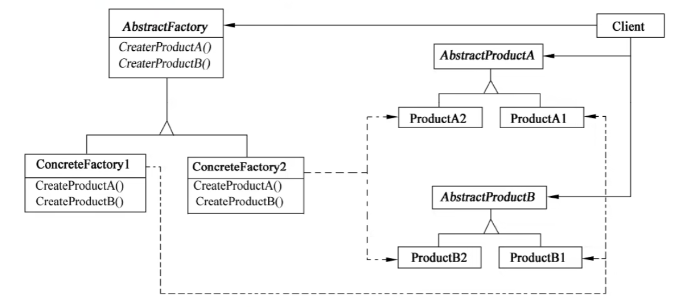
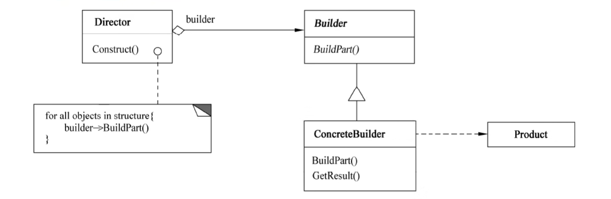
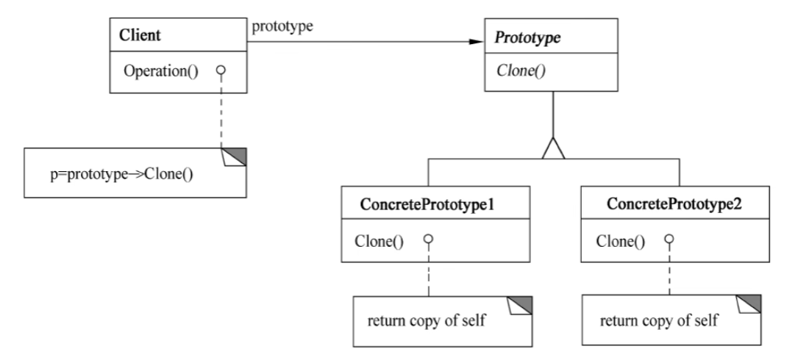
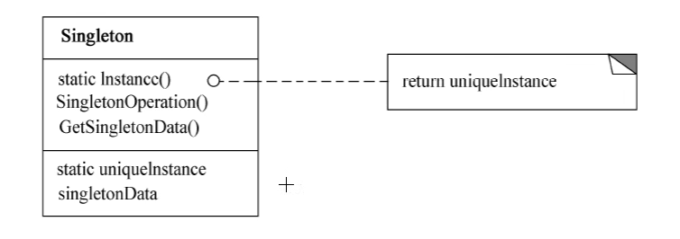

> 创建型模式关注点是如何创建对象，其核心思想是要把对象的创建和使用相分离，这样使得两者能相对独立地变换。

:::: tabs

@tab 简单工厂

## Simple Factory

::: tip 创建对象不对外暴露细节
:::

- 简单工厂模式属创建型模式，~~但不属于 23 种设计模式之一~~。

### （1）意图

在创建一个对象时不向客户暴露内部细节，并提供一个创建对象的通用接口。

> - 定义：定义一个工厂类，他可以根据参数的不同返回不同类的实例，被创建的实例通常都具有共同的父类。在简单工厂模式中用于被创建实例的方法通常为静态 (static) 方法，因此简单工厂模式又被成为静态工厂方法
> - _简单工厂模式违反了开放封闭原则，即对扩展开放对修改也开放_。

### （2）类图


```java {13,19-21,23-24}
public class SimpleFactory {
    public static void main(String[] args) {
        Product productA = Factory.createProduct("A");
        productA.info();

        Product productB = Factory.createProduct("B");
        productB.info();

    }
}

class Factory{
    public static Product createProduct(String type){
        Product product = null;

        switch (type){
            case "A":
                product = new ProductA();
                break;
            case "B":
                product = new ProductB();
                break;
            default:
                System.out.println("没有 " + type + " 类型的产品！");
                return null;
        }
        return product;
    }
}

abstract class Product{
    public abstract void info();
}

class ProductA extends Product{

    @Override
    public void info() {
        System.out.println("产品的信息：A");
    }
}

class ProductB extends Product{

    @Override
    public void info() {
        System.out.println("产品的信息：B");
    }
}
```

@tab 工厂方法

## 1. Factory Method

> 创建型**类**模式

::: tip 定义创建对象的接口，子类进行实例化
:::

### （1）意图

定义一个创建对象的接口，让子类决定实例化哪个类。_Factory Method 把实例化操作延迟到子类。_

### （2）类图


### （3）适用性

工厂模式适用于

- _当一个类不知道它所必须创建的对象的类的时候_。
- 当一个类希望由它的子类来指定它所创建的对象的时候。
- 当类将创建对象的职责委托给多个帮助子类中的某一个，并且你希望将哪一个帮助子类是代理者这一信息局部化的时候。❓

```java {15-17,22-24,30-32}
public class FactoryMethod {
    public static void main(String[] args) {

        Factory factoryA = new FactoryA();
        Product productA = factoryA.createProduct();
        productA.info();

        Factory factoryB = new FactoryB();
        Product productB = factoryB.createProduct();
        productB.info();

    }
}

interface Factory{
   Product createProduct();
}

class FactoryA implements Factory{

    @Override
    public Product createProduct() {
        return new ProductA();
    }
}

class FactoryB implements Factory{

    @Override
    public Product createProduct() {
        return new ProductB();
    }
}

interface Product{
    void info();
}

class ProductA implements Product{

    @Override
    public void info() {
        System.out.println("产品的信息：A");
    }
}

class ProductB implements Product{

    @Override
    public void info() {
        System.out.println("产品的信息：B");
    }
}
```

@tab 抽象工厂

## 2. Abstract Factory

::: tip 创建一系列对象
:::

### （1）意图

提供一个创建**一系列**相关或相互依赖对象的接口，而无须指定它们具体的类。

> 提供一个接口，用于创建 _相关的对象家族_

### （2）类图



### （3）适用性

Abstract Factory 模式适用于

- 一个系统要独立于它的产品的创建、**组合**和表示时。
- 一个系统要由多个产品系列中的一个来配置时。
- 当要强调一系列相关的产品对象的设计以便进行联合使用时。
- 当提供一个产品类库，只想显示它们的接口而不是实现时。

```java {21-22,26,30,35,43,48,39}
public class AbstractFactory {

    public static void main(String[] args) {
        Factory factory1 = new Factory1();
        ProductA productA1 = factory1.createProductA();
        productA1.info();
        ProductB productB1 = factory1.createProductB();
        productB1.info();

        Factory factory2 = new Factory2();
        ProductA productA2 = factory2.createProductA();
        productA2.info();
        ProductB productB2 = factory2.createProductB();
        productB2.info();

    }
}

// 声明一个创建抽象产品对象的操作接口
interface Factory{
   ProductA createProductA();
   ProductB createProductB();
}

// 实现创建具体产品对象的操作
class Factory1 implements Factory{

    @Override
    public ProductA createProductA() {
        return new ProductA1();
    }

    @Override
    public ProductB createProductB() {
        return new ProductB1();
    }
}

class Factory2 implements Factory{

    @Override
    public ProductA createProductA() {
        return new ProductA2();
    }

    @Override
    public ProductB createProductB() {
        return new ProductB2();
    }
}

// 为一类产品对象声明一个接口
interface ProductA{
    void info();
}

interface ProductB{
    void info();
}

// 定义一将被相应的具体工厂创建的产品对象
class ProductA1 implements ProductA{

    @Override
    public void info() {
        System.out.println("产品的信息：A1");
    }
}

class ProductA2 implements ProductA{

    @Override
    public void info() {
        System.out.println("产品的信息：A2");
    }
}

class ProductB1 implements ProductB{

    @Override
    public void info() {
        System.out.println("产品的信息：B1");
    }
}

class ProductB2 implements ProductB{

    @Override
    public void info() {
        System.out.println("产品的信息：B2");
    }
}
```

@tab 生成器/建造者

## 3. Builder

::: tip 构建复杂对象：类似于组装
:::

### （1）意图

将一个**复杂对象**的构建与它的表示分离，使得同样的**构建过程**可以创建不同的表示。

> 封装一个对象的构造过程，并允许按步骤构造。

### （2）类图



### （3）适用性

Builder 模式适用于

- 当创建复杂对象的算法应该独立于该对象的组成部分以及它们的装配方式时。
- 当构造过程必须允许被构造的对象有不同的表示时。

> 可以将 Builder 理解为一个抽象套餐，ConcreteBuilder 为一个具体套餐

```java {18-20,24-25,68,70-72}
public class Main {
    public static void main(String[] args) {
        Director director = new Director();

        Builder builder1 = new Builder1();
        director.Construct(builder1);
        Product product1 = builder1.getResult();
        product1.show();

        Builder builder2 = new Builder2();
        director.Construct(builder2);
        Product product2 = builder2.getResult();
        product2.show();
    }
}

class Director{
    public void Construct(Builder builder){
        builder.BuildPart();
    }
}

abstract class Builder{
    public abstract void BuildPart();
    public abstract Product getResult();
}

class Builder1 extends Builder{

    Product product = new Product();

    @Override
    public void BuildPart() {
        product.add("A");
        product.add("B");
        product.add("C");
        product.add("D");
        product.add("E");
        product.add("F");
    }

    @Override
    public Product getResult() {

        return product;
    }
}

class Builder2 extends Builder{

    Product product = new Product();

    @Override
    public void BuildPart() {
        product.add("A");
        product.add("B");
        product.add("C");
    }

    @Override
    public Product getResult() {

        return product;
    }
}

class Product{
    List<String> parts = new ArrayList<String>();

    public void add(String part){
        parts.add(part);
    }

    public void show(){
        System.out.print("产品的组成：");
        for (String part : parts) {
            System.out.print(part + " ");
        }
        System.out.println();
    }
}
```

@tab 原型

## 4. Prototype

::: tip 复制
:::

### （1）意图

用原型实例指定创建对象的类型，并且通过**复制**这些原型创建新的对象。

### （2）类图



- Prototype 声明一个复制自身的接口。
- ConcretePrototype 实现一个复制自身的操作。
- Client 让一个原型复制自身从而创建一个新的对象

### （3）适用性

Prototype 模式适用于

- 当一个系统应该独立于它的产品创建、**构成**和表示时。
- 当要实例化的类是在运行时刻指定时，例如，通过动态装载。
- 为了避免创建一个与产品类层次平行的工厂类层次时。
- 当一个类的实例只能有几个不同状态组合中的一种时。建立相应数目的原型并克隆它们，可能比每次用合适的状态手工实例化该类更方便一些。

```java {13,37-43}
public class Main {
    public static void main(String[] args) {
        Product product1 = new Product(2022,5.28);
        System.out.println(product1.getId()+ " " + product1.getPrice());

        Product product2 = (Product) product1.Chlone();
        System.out.println(product2.getId()+ " " + product2.getPrice());

    }
}

interface Prototype{
    Object Clone();
}

class Product implements Prototype{

    private int id;
    private double price;

    public Product(){}

    public Product(int id,double price){
        this.id = id;
        this.price = price;
    }

    public int getId() {
        return id;
    }

    public double getPrice() {
        return price;
    }

    @Override
    public Object Clone() {
        Product object = new Product();
        object.id = this.id;
        object.price = this.price;

        return object;
    }
}
```

@tab 单例

## 5. Singleton

::: tip 仅有一个实例
:::

### （1）意图

保证一个类**仅有**一个实例，并提供一个访问它的**全局访问点**。

### （2）类图



- 其中：Singleton 指定一个 Instance 操作，允许客户访问它的唯一实例，Instance 是一个类
- 操作：可能负责创建它自己的唯一实例。

### （3）适用性

Singleton 模式适用于：

- 当类只能有一个实例而且客户可以从一个众所周知的访问点访问它时。
- 当这个唯一实例应该是通过子类化可扩展的，并且客户无须更改代码就能使用一个扩展的实例时。

```java {14,16,18-20}
public class SingletonPattern {
    public static void main(String[] args) {
        Singleton instance1 = Singleton.getInstance();
        Singleton instance2 = Singleton.getInstance();
        Singleton instance3 = Singleton.getInstance();

        System.out.println("instance1: " + instance1);
        System.out.println("instance2: " + instance2);
        System.out.println("instance3: " + instance3);
    }
}

class Singleton {
    private static Singleton instance = new Singleton();

    private Singleton(){};

    public static Singleton getInstance(){
        return instance;
    }
}
```


::::
