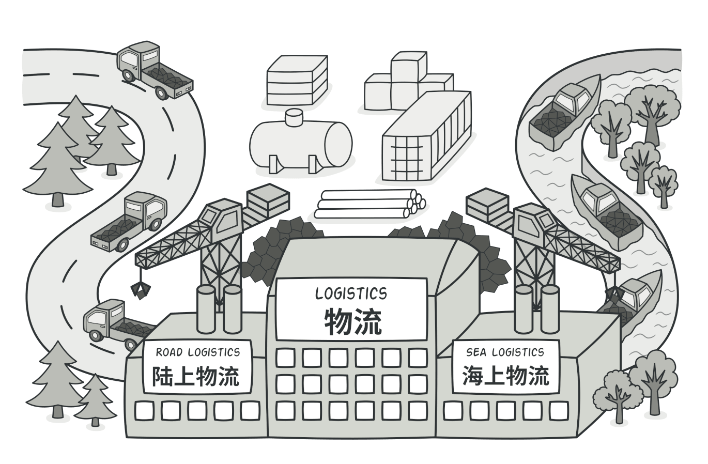
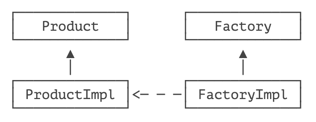

> 定义一个用于创建对象的接口，让子类决定实例化哪一个类。Factory Method 使一个类的实例化延迟到其子类。

## 🍀 意图

**工厂方法** 即 Factory Method，是一种对象创建型模式，其在父类中提供一个创建对象的方法，允许子类决定实例化对象的类型。



## 🍀 工厂方法模式结构


1. **产品** （Product） 将会对接口进行声明。对于所有由创建者及其子类构建的对象，这些接口都是通用的。

2. **具体产品** （Concrete Products）是产品接口的不同实现。

3. **创建者** （Creator）类声明返回产品对象的工厂方法。该方法的返回对象类型必须与产品接口相匹配。

    你可以将工厂方法声明为抽象方法，强制要求每个子类以不同方式实现该方法。 或者，你也可以在基础工厂方法中返回默认产品类型。

    注意，尽管它的名字是创建者，但它最主要的职责并**不是**创建产品。 一般来说，创建者类包含一些与产品相关的核心业务逻辑。 工厂方法将这些逻辑处理从具体产品类中分离出来。 打个比方，大型软件开发公司拥有程序员培训部门。 但是，这些公司的主要工作还是编写代码，而非生产程序员。

4. **具体创建者** （Concrete Creators） 将会重写基础工厂方法，使其返回不同类型的产品。

    注意，并不一定每次调用工厂方法都会**创建**新的实例。 工厂方法也可以返回缓存、对象池或其他来源的已有对象。

## 🍀 案例

工厂方法的目的是使得创建对象和使用对象是分离的，并且客户端总是引用抽象工厂和抽象产品：



我们以具体的例子来说：假设我们希望实现一个解析字符串到 `Number` 的 `Factory`，可以定义如下：

```java
public interface NumberFactory {
    Number parse(String s);
}
```

有了工厂接口，再编写一个工厂的实现类：

```java
public class NumberFactoryImpl implements NumberFactory {
    public Number parse(String s) {
        return new BigDecimal(s);
    }
}
```

而产品接口是 `Number`，`NumberFactoryImpl` 返回的实际产品是 `BigDecimal`。

那么客户端如何创建 `NumberFactoryImpl` 呢？通常我们会在接口 `Factory` 中定义一个静态方法 `getFactory()` 来返回真正的子类：

```java
public interface NumberFactory {
    // 创建方法:
    Number parse(String s);

    // 获取工厂实例:
    static NumberFactory getFactory() {
        return impl;
    }

    static NumberFactory impl = new NumberFactoryImpl();
}
```

在客户端中，我们只需要和工厂接口 `NumberFactory` 以及抽象产品 `Number` 打交道：

```java
NumberFactory factory = NumberFactory.getFactory();
Number result = factory.parse("123.456");
```

调用方可以完全忽略真正的工厂 `NumberFactoryImpl` 和实际的产品 `BigDecimal`，这样做的好处是允许创建产品的代码独立地变换，而不会影响到调用方。

有的童鞋会问：一个简单的 `parse()` 需要写这么复杂的工厂吗？实际上大多数情况下我们并不需要抽象工厂，而是通过静态方法直接返回产品，即：

```java
public class NumberFactory {
    public static Number parse(String s) {
        return new BigDecimal(s);
    }
}
```

这种简化的使用静态方法创建产品的方式称为静态工厂方法（Static Factory Method）。静态工厂方法广泛地应用在 Java 标准库中。例如：

```java
Integer n = Integer.valueOf(100);
```

`Integer` 既是产品又是静态工厂。它提供了静态方法 `valueOf()` 来创建 `Integer`。那么这种方式和直接写 `new Integer(100)` 有何区别呢？我们观察 `valueOf()` 方法：

```java
public final class Integer {
    public static Integer valueOf(int i) {
        if (i>= IntegerCache.low && i <= IntegerCache.high)
            return IntegerCache.cache[i + (-IntegerCache.low)];
        return new Integer(i);
    }
    ...
}
```

它的好处在于，`valueOf()` 内部可能会使用 `new` 创建一个新的 `Integer` 实例，但也可能直接返回一个缓存的 `Integer` 实例。对于调用方来说，没必要知道 `Integer` 创建的细节。


> [!tip] 
> 工厂方法可以隐藏创建产品的细节，且不一定每次都会真正创建产品，完全可以返回缓存的产品，从而提升速度并减少内存消耗。

如果调用方直接使用 `Integer n = new Integer(100)`，那么就失去了使用缓存优化的可能性。

我们经常使用的另一个静态工厂方法是 `List.of()`：

```java
List<String> list = List.of("A", "B", "C");
```

这个静态工厂方法接收可变参数，然后返回 `List` 接口。需要注意的是，调用方获取的产品总是 `List` 接口，而且并不关心它的实际类型。即使调用方知道 `List` 产品的实际类型是 `java.util.ImmutableCollections$ListN`，也不要去强制转型为子类，因为静态工厂方法 `List.of()` 保证返回 `List`，但也完全可以修改为返回 `java.util.ArrayList`。这就是里氏替换原则：返回实现接口的任意子类都可以满足该方法的要求，且不影响调用方。


> [!tip]
> 总是引用接口而非实现类，能允许变换子类而不影响调用方，即尽可能面向抽象编程。

和 `List.of()` 类似，我们使用 `MessageDigest` 时，为了创建某个摘要算法，总是使用静态工厂方法 `getInstance(String)`：

```java
MessageDigest md5 = MessageDigest.getInstance("MD5");
MessageDigest sha1 = MessageDigest.getInstance("SHA-1");
```

调用方通过产品名称获得产品实例，不但调用简单，而且获得的引用仍然是 `MessageDigest` 这个抽象类。

## 🍀 练习

使用静态工厂方法实现一个类似 `20200202` 的整数转换为 `LocalDate`：

```java
public class LocalDateFactory {
    public static LocalDate fromInt(int yyyyMMdd) {
        ...
    }
}
```


## 🍀 小结

工厂方法是指定义工厂接口和产品接口，但如何创建实际工厂和实际产品被推迟到子类实现，从而使调用方只和抽象工厂与抽象产品打交道。

实际更常用的是更简单的静态工厂方法，它允许工厂内部对创建产品进行优化。

调用方尽量持有接口或抽象类，避免持有具体类型的子类，以便工厂方法能随时切换不同的子类返回，却不影响调用方代码。


