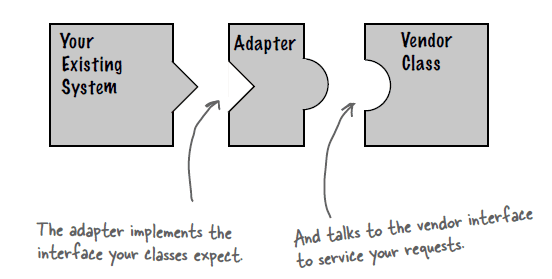
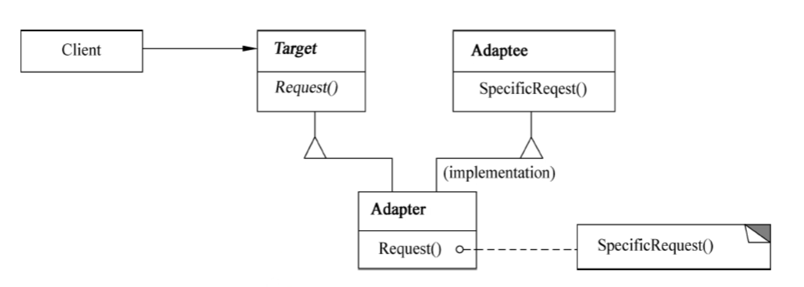
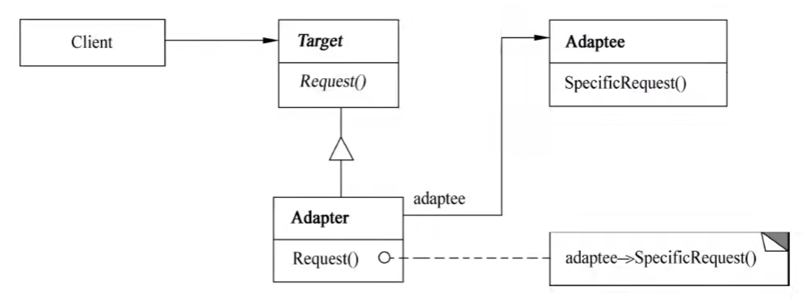
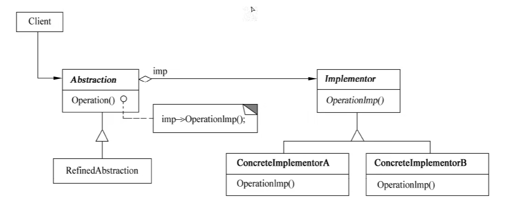
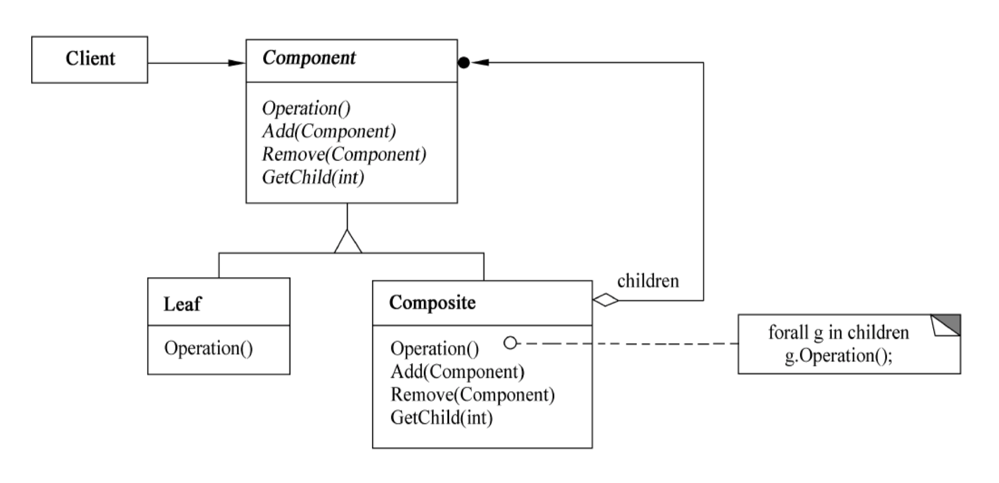
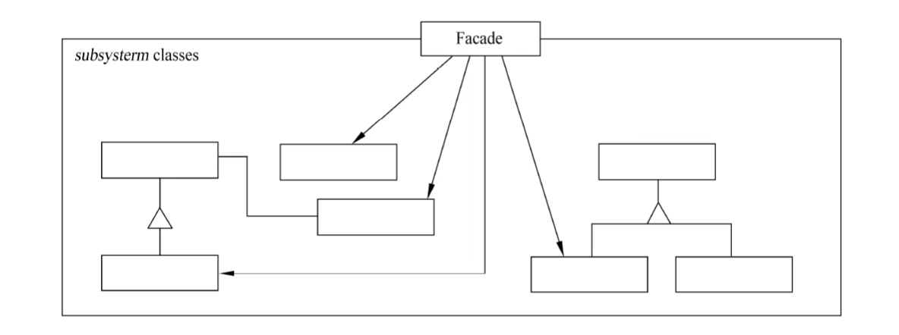
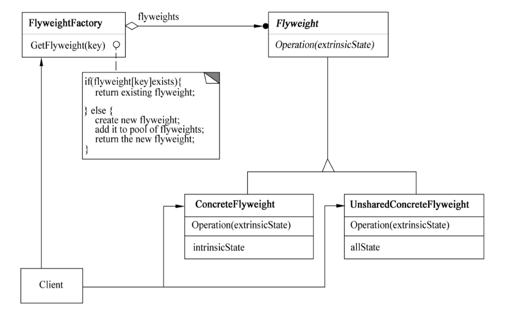
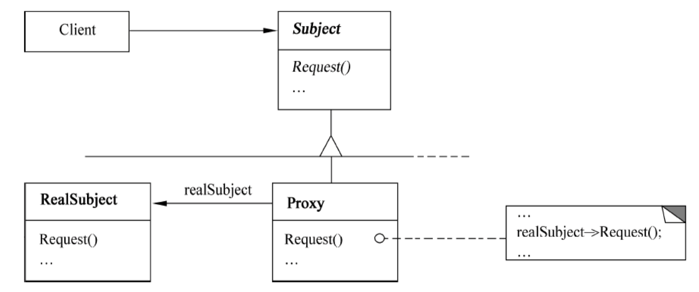

> 结构型模式主要涉及如何组合各种对象以便获得更好、更灵活的结构。虽然面向对象的继承机制提供了最基本的子类扩展父类的功能，但结构型模式不仅仅简单地使用继承，而更多地通过组合与运行期的动态组合来实现更灵活的功能。

:::: tabs

@tab 适配器

## 🌸 1. Adapter

::: tip 接口适配
:::

### （1）意图

将一个类的接口转换成另一个用户需要的接口。



Adapter 模式使得原本由于**接口不兼容**而不能一起工作的那些类可以一起工作。

### （2）类图





其中：

- Target 定义 Client 使用的与特定领域相关的接口。
- Client 与符合 Target 接口的对象协同。
- Adaptee 定义一个已经存在的接口，这个接口需要适配。
- Adapter 对 Adaptee 的接口与 Target 接口进行适配。

### （3）适用性

Adapter 模式适用于

- _想使用一个已经存在的类，而它的接口不符合要求。_
- 想创建一个可以复用的类，该类可以与其他不相关的类或不可预见的类（即那些接口可能不一定兼容的类）协同工作。（了解）
- (仅适用于对象 Adapter) 想使用一个已经存在的子类，但是不可能对每一个都进行子类化以匹配它们的接口。对象适配器可以适配它的父类接口。（了解）

```java {14-20}
public class AdapterPattern {
    public static void main(String[] args) {
        Target target = new Adapter();
        target.Request();
    }
}

class Target{
    public void Request(){
        System.out.println("普通请求~");
    }
}

class Adapter extends Target {
    private Adaptee adaptee = new Adaptee();
    @Override
    public void Request() {
        adaptee.SpecificRequest();
    }
}

class Adaptee{
    public void SpecificRequest(){
        System.out.println("特殊请求~");
    }
}
```

@tab 桥接

## 🌸 2. Bridge

::: tip 抽象与实现分离
:::

### （1）意图

将抽象部分与其实现部分**分离**，使它们都可以*独立地变化*。

### （2）类图



### （3）适用性

- 不希望在抽象和它的实现部分之间有一个固定的绑定关系。
- 类的抽象以及它的实现都应该可以通过生成子类的方法加以扩充。
- 对一个抽象的实现部分的修改应对客户不产生影响，即客户代码不必重新编译。(C++) 想对客户完全隐藏抽象的实现部分。
- 有许多类要生成的类层次结构。
- 想在多个对象间共享实现（可能使用引用计数），但同时要求客户并不知道这一点。

```java {34,38,44-46}
public class BridgePattern {
    public static void main(String[] args) {
        Product productA = new ProductA();
        Product productB = new ProductA();

        Color red = new Red();
        productA.setName("产品A");
        productA.setColor(red);
        productA.Operation();

        Blue blue = new Blue();
        productB.setName("产品B");
        productB.setColor(blue);
        productB.Operation();
    }
}

abstract class Product{
    private String name;
    protected Color color;

    public void setName(String name){
        this.name = name;
    }

    public String getName(){
        return name;
    }

    public void setColor(Color color){
        this.color = color;
    }

    public abstract void Operation();
}

interface Color{
    void OperationImpl(String name);
}

class ProductA extends Product{

    @Override
    public void Operation() {
        color.OperationImpl(this.getName());
    }
}

class Red implements Color{

    @Override
    public void OperationImpl(String name) {
        System.out.println(name + ": 红色" );
    }
}

class Blue implements Color{

    @Override
    public void OperationImpl(String name) {
        System.out.println(name + ": 蓝色" );
    }
}
```

@tab 组合

## 🌸 3. Composite

::: tip 部分-整体
:::

### （1）意图

将对象组合成树型结构以表示 **“部分-整体”** 的层次结构。Composite 使得用户对单个对象和组合对象的使用具有**一致性**。

> 例如，文件-文件夹

### （2）类图



其中：

- _Component_ 为组合中的对像 _声明接口_：在适当情况下实现所有类共有接口的默认行为：声明一个接口用于访问和管理 Component 的子组件；（可选）在递归结构中定义一个接口，用于访问一个父组件，并在合适的情况下实现它。
- _Leaf_ 在组合中表示叶结点对象，叶结点没有子结点；在组合中 _定义图元对象的行为_。
- _Composite_ _定义有子组件的那些组件的行为_；存储子组件；在 Component 接口中实现与子组件有关的操作。
- _Client 通过 Component 接口操纵组合组件的对象_。

### （3）适用性

Composite 模式下适用于：

- 想表示对象的 “部分-整体” 层次结构。
- 希望用户忽略组合对象与单个对象的不同，用户将统一地使用组合结构中的所有对象。

```java {28-29,33-35,46-48,72}
import java.util.*;

public class CompositePattern {
    public static void main(String[] args) {
        // 父类名 对象名 = new 子类名();
        AbstractFile root = new Folder("root");

        AbstractFile folderA = new Folder("folderA");
        AbstractFile folderB = new Folder("folderB");

        AbstractFile fileC = new File("fileC");
        AbstractFile fileD = new File("fileD");
        AbstractFile fileE = new File("fileE");

        root.Add(folderA);
        root.Add(folderB);
        root.Add(fileC);

        folderA.Add(fileD);
        folderA.Add(fileE);

        print(root);
    }

    static void print(AbstractFile file){
        file.printName();

        List<AbstractFile> childrenList = file.getChildren();
        if (childrenList == null){
            return;
        }

        for (AbstractFile children : childrenList) {
            print(children);
        }
    }
}

abstract class AbstractFile{
    protected String name;

    public void printName(){
        System.out.println(name);
    }

    public abstract boolean Add(AbstractFile file);
    public abstract boolean Remove(AbstractFile file);
    public abstract List<AbstractFile> getChildren();

}

class Folder extends AbstractFile {

    private List<AbstractFile> childrenList = new ArrayList<>();

    public Folder(String name) {
        this.name = name;
    }

    @Override
    public boolean Add(AbstractFile file) {
        return childrenList.add(file);
    }

    @Override
    public boolean Remove(AbstractFile file) {
        return childrenList.remove(file);
    }

    @Override
    public List<AbstractFile> getChildren() {
        return childrenList;
    }
}

class File extends AbstractFile{
    public File(String name) {
        this.name = name;
    }

    @Override
    public boolean Add(AbstractFile filei) {
        return false;
    }

    @Override
    public boolean Remove(AbstractFile file) {
        return false;
    }

    @Override
    public List<AbstractFile> getChildren() {
        return null;
    }
}
```

@tab 装饰器

## 4. Decorator

::: tip 为对象动态添加功能
:::

### （1）意图

动态地给一个对象添加一些*额外的职责*。就增加功能而言，Decorator 模式比生成子类更加灵活。

### （2）类图

 {
        Person zhangsan = new Student("张三");
        zhangsan = new DecoratorA(zhangsan);
        zhangsan = new DecoratorB(zhangsan);
        zhangsan.Operation();

        System.out.println("==========分割线==============");

        // 对像链
        Person lisi = new DecoratorB(new DecoratorA(new Student("李四")));
        lisi.Operation();

    }
}

abstract class Decorator extends Person{
    protected Person person;
}

class DecoratorA extends Decorator{
    public DecoratorA(Person person){
        this.person = person;
    }

    @Override
    public void Operation() { // 职责
        person.Operation(); // 原本的职责
        System.out.println("写作业~");
    }
}

class DecoratorB extends Decorator{
    public DecoratorB(Person person){
        this.person = person;
    }

    @Override
    public void Operation() { // 职责
        person.Operation(); // 原本的职责
        System.out.println("考试~");
    }
}

abstract class Person{
    protected String name;

    public abstract void Operation(); // 职责

}

class Student extends Person{
    public Student(String name){
        this.name = name;
    }

    @Override
    public void Operation() {
        System.out.println(name + "的职责：学习~");
    }
}
```

@tab 外观

## 5. Facade

::: tip 提供一个统一的接口来访问子系统中的一群接口
:::

### （1）意图

为**子系统**中的**一组接口**提供一个一致的界面，Facade 模式定义了一个高层接口，这个接口使得这一子系统更加容易使用。

### （2）类图



其中：

- Facade 知道哪些子系统类负责处理请求；将客户的请求代理给适当的子系统对象。
- Subsystem classes 实现子系统的功能；处理有 Facade 对象指派的任务；没有 Facade 的任何相关信息，即没有指向 Facade 的指针。

### （3）适用性

Facade 模式适用于

- _要为一个复杂子系统提供一个简单接口时_。
- 客户程序与抽象类的实现部分之间存在着很大的依赖性。
- 当需要构建一个层次结构的子系统时，使用 Facade 模式定义子系统中每层的入口点。

```java {19-21}
import java.util.Scanner;

public class FacadePattern {
    public static void main(String[] args) {
        Facade facade = new Facade();

        facade.methodA();
        facade.methodB();
        facade.methodC();
    }
}

class Facade{
    SubSystemOne subSystemOne;
    SubSystemTwo subSystemTwo;
    SubSystemThree subSystemThree;

    public Facade(){
        subSystemOne = new SubSystemOne();
        subSystemTwo = new SubSystemTwo();
        subSystemThree = new SubSystemThree();
    }

    public void methodA(){
        subSystemOne.methodOne();
    }

    public void methodB(){
        subSystemTwo.methodTwo();
    }

    public void methodC(){
        subSystemThree.methodThree();
    }
}

class SubSystemOne{
    public void methodOne(){
        System.out.println("执行子系统一的功能~");
    }
}

class SubSystemTwo{
    public void methodTwo(){
        System.out.println("执行子系统二的功能~");
    }
}

class SubSystemThree{
    public void methodThree(){
        System.out.println("执行子系统三的功能~");
    }
}
```

@tab 享元

## 6. Flyweight

::: tip 共享创建的对象
:::

### （1）意图

运用**共享技术**有效地支持**大量**细粒度的对象。

> 减少创建的对象的数量，降低存储开销

### （2）类图



其中：

- Flyweight 描述一个接口，通过这个接口 Flyweight 可以接受并作用于外部状态。
- ConcreteFlyweight 实现 Flyweight 接口，并为内部状态（如果有）增加存储空间。
- ConcreteFlyweight 对象必须是可共享的。它所存储的状态必须是内部的，即它必须独立于 ConcreteFlyweight 对象的场景。
- 并非所有的 Flyweight 子类都需要被共享。Flyweight 接口使共享成为可能，但它并不强制共享。在 Flyweight 对象结构的某些层次，UnsharedConcreteFlyweight 对象通常将 ConcreteFlyweight 对象作为子结点。
- FlyweightFactory 创建并管理 Flyweight 对象；确保合理地共享 Flyweight，当用户请求一个 Flyweight 时，FlyweightFactory 对象提供一个已创建的实例或者在不存在时创建个实例。
- Client 维持一个对 Flyweight 的引用；计算或存储一个或多个 Flyweight 的外部状态。

### （3）适用性

Flyweight 模式适用于：

- 一个应用程序使用了大量的对象。
- 完全由于使用大量的对象，造成很大的存储开销。
- 对象的大多数状态都可变为外部状态。
- 如果删除对象的外部状态，那么可以用相对较少的共享对象取代很多组对象。
- 应用程序不依赖于对象标识。由于 Flyweight 对象可以被共享，所以对于概念上明显有别的对象，标识测试将返回真值。

#### 🍐 1 黑白棋

```java {24,27-28}
public class FlyweightPattern {
    public static void main(String[] args) {
        PieceFactory factory = new PieceFactory();

        Piece whitePiece1 = factory.getPiece(0);
        whitePiece1.draw(66,87);
        System.out.println(whitePiece1);

        Piece blackPiece1 = factory.getPiece(1);
        blackPiece1.draw(20,11);
        System.out.println(blackPiece1);

        Piece whitePiece2 = factory.getPiece(0);
        whitePiece1.draw(26，54);
        System.out.println(whitePiece2);

        Piece blackPiece2 = factory.getPiece(1);
        blackPiece2.draw(12，34);
        System.out.println(blackPiece2);
    }
}

class PieceFactory{
    private Piece[] pieces = {new WhitePiece(),new BlackPiece()};

    public Piece getPiece(int key){
        if (key == 0) return pieces[0];
        else return pieces[1];
    }
}

abstract class Piece{
    protected String color;

    public abstract void draw(int x,int y);
}

class WhitePiece extends Piece{
    public WhitePiece(){
        this.color = "white";
    }

    @Override
    public void draw(int x，int y) {
        System.out.println("draw a color: " + color + " piece x: " + x + " y:　" + y);
    }
}

class BlackPiece extends Piece{
    public BlackPiece(){
        this.color = "black";
    }

    @Override
    public void draw(int x，int y) {
        System.out.println("draw a color: " + color + " piece x: " + x + " y:　" + y);
    }
}
```

运行 1

```text
draw a color: white piece x: 66 y:　87
com.lxzz.softdesign.WhitePiece@4c873330
draw a color: black piece x: 20 y:　11
com.lxzz.softdesign.BlackPiece@119d7047
draw a color: white piece x: 26 y:　54
com.lxzz.softdesign.WhitePiece@4c873330
draw a color: black piece x: 12 y:　34
com.lxzz.softdesign.BlackPiece@119d7047
```

#### 🍐 2 画圆

```java {}
public class FlyweightPattern {
    public static void main(String[] args) {
        ShapeFactory factory = new ShapeFactory();

        Random random = new Random();
        String[] colors = {"red","blue","green","white","black"};

        for (int i = 1; i <= 10; i++) {
            int x = random.nextInt(colors.length);
            Shape shape = factory.getShape(colors[x]);
            System.out.print("第" + i + "个圆：");
            shape.draw(random.nextInt(100),random.nextInt(100));
        }
    }
}

class ShapeFactory{
    private Map<String,Shape> map = new HashMap<>();

    public Shape getShape(String key){
        if (!map.containsKey(key)) {
            map.put(key，new Circle(key));
            System.out.println("create color: " + key + " circle");
        }
        return map.get(key);
    }
}

abstract class Shape {
    protected String color;

    public abstract void draw(int x，int y);
}

class Circle extends Shape {

    public Circle(String color){
        this.color = color;
    }

    @Override
    public void draw(int x，int y) {
        System.out.println("draw a color: " + color + " circle x："+ x + " y：" + y);
    }
}
```

运行 2

```text
create color: white circle
第1个圆：draw a color: white circle x：98 y：99
create color: blue circle
第2个圆：draw a color: blue circle x：59 y：14
create color: red circle
第3个圆：draw a color: red circle x：21 y：31
create color: black circle
第4个圆：draw a color: black circle x：0 y：13
create color: green circle
第5个圆：draw a color: green circle x：41 y：66
第6个圆：draw a color: black circle x：54 y：11
第7个圆：draw a color: white circle x：99 y：68
第8个圆：draw a color: white circle x：18 y：52
第9个圆：draw a color: red circle x：28 y：60
第10个圆：draw a color: white circle x：83 y：66
```

@tab 代理

## 7. Proxy

::: tip 代理控制
:::

### （1）意图

为其他对象提供一种**代理**以**控制**对这个对象的**访问**。

### （2）类图



### （3）适用性

Proxy 模式适用于在需要比较通用和复杂的对象指针代替简单的指针的时候，常见情况有：

- 远程代理 (Remote Proxy) 为一个对象在不同地址空间提供局部代表。
- 虚代理 (Virtual Proxy) 根据需要创建开销很大的对象。
- 保护代理 (Protection Proxy) 控制对原始对象的访问，用于对象应该有不同的访问权限的时候。
- 智能引用 (Smart Reference) 取代了简单的指针，它在访问对象时执行一些附加操作。

```java {14,18-20,30}
public class ProxyPattern {
    public static void main(String[] args) {
        RealSubject realSubject = new RealSubject();
        Proxy proxy = new Proxy(realSubject);

        proxy.buy();
    }
}

interface Subject{
    void buy();
}

class Proxy implements Subject{

    protected RealSubject realSubject;

    public Proxy(RealSubject realSubject){
        this.realSubject = realSubject;
    }

    @Override
    public void buy() {
        System.out.println("办理购买前的手续~");
        realSubject.buy(); // 付钱
        System.out.println("办理购买后的手续~");
    }
}

class RealSubject implements Subject{

    @Override
    public void buy() {
        System.out.println("付钱~");
    }
}
```

::::
