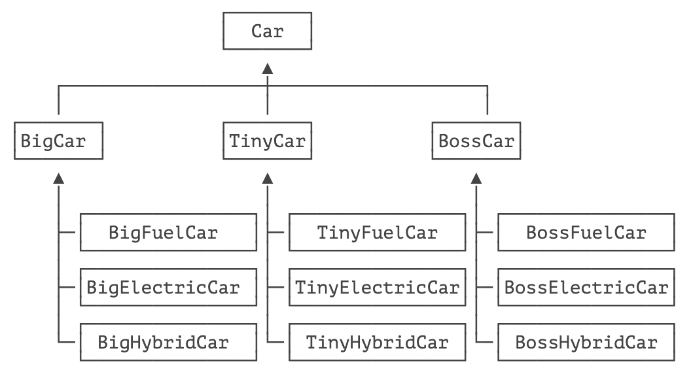
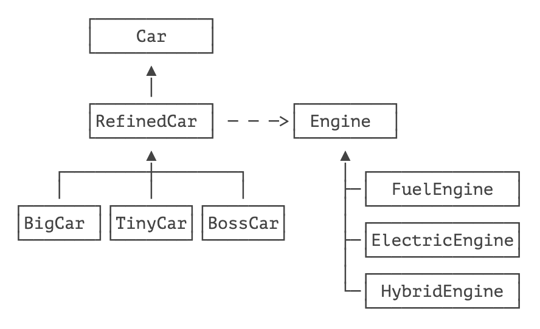

> 将抽象部分与它的实现部分分离，使它们都可以独立地变化。

桥接模式的定义非常玄乎，直接理解不太容易，所以我们还是举例子。

假设某个汽车厂商生产三种品牌的汽车：Big、Tiny 和 Boss，每种品牌又可以选择燃油、纯电和混合动力。如果用传统的继承来表示各个最终车型，一共有 3 个抽象类加 9 个最终子类：



如果要新增一个品牌，或者加一个新的引擎（比如核动力），那么子类的数量增长更快。

所以，桥接模式就是为了避免直接继承带来的子类爆炸。

我们来看看桥接模式如何解决上述问题。

在桥接模式中，首先把 `Car` 按品牌进行子类化，但是，每个品牌选择什么发动机，不再使用子类扩充，而是通过一个抽象的 “修正” 类，以组合的形式引入。我们来看看具体的实现。

首先定义抽象类 `Car`，它引用一个 `Engine`：

```java
public abstract class Car {
    // 引用 Engine:
    protected Engine engine;

    public Car(Engine engine) {
        this.engine = engine;
    }

    public abstract void drive();
}
```

`Engine` 的定义如下：

```java
public interface Engine {
    void start();
}
```

紧接着，在一个 “修正” 的抽象类 `RefinedCar` 中定义一些额外操作：

```java
public abstract class RefinedCar extends Car {
    public RefinedCar(Engine engine) {
        super(engine);
    }

    public void drive() {
        this.engine.start();
        System.out.println("Drive" + getBrand() + "car...");
    }

    public abstract String getBrand();
}
```

这样一来，最终的不同品牌继承自 `RefinedCar`，例如 `BossCar`：

```java
public class BossCar extends RefinedCar {
    public BossCar(Engine engine) {
        super(engine);
    }

    public String getBrand() {
        return "Boss";
    }
}
```

而针对每一种引擎，继承自 `Engine`，例如 `HybridEngine`：

```java
public class HybridEngine implements Engine {
    public void start() {
        System.out.println("Start Hybrid Engine...");
    }
}
```

客户端通过自己选择一个品牌，再配合一种引擎，得到最终的 Car ：

```java
RefinedCar car = new BossCar(new HybridEngine());
car.drive();
```

使用桥接模式的好处在于，如果要增加一种引擎，只需要针对 `Engine` 派生一个新的子类，如果要增加一个品牌，只需要针对 `RefinedCar` 派生一个子类，任何 `RefinedCar` 的子类都可以和任何一种 `Engine` 自由组合，即一辆汽车的两个维度：品牌和引擎都可以独立地变化。




桥接模式实现比较复杂，实际应用也非常少，但它提供的设计思想值得借鉴，即不要过度使用继承，而是优先拆分某些部件，使用组合的方式来扩展功能。

## 🍀 练习

使用桥接模式扩展一种新的品牌和新的核动力引擎。

## 🍀 小结

桥接模式通过分离一个抽象接口和它的实现部分，使得设计可以按两个维度独立扩展。


