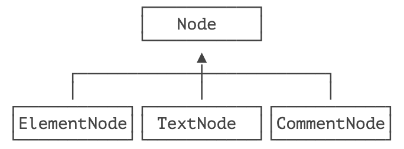

> 将对象组合成树形结构以表示 `部分 - 整体` 的层次结构，使得用户对单个对象和组合对象的使用具有一致性。

组合模式（Composite）经常用于树形结构，为了简化代码，使用 `Composite` 可以把一个叶子节点与一个父节点统一起来处理。

我们来看一个具体的例子。在 XML 或 HTML 中，从根节点开始，每个节点都可能包含任意个其他节点，这些层层嵌套的节点就构成了一颗树。

要以树的结构表示 XML ，我们可以先抽象出节点类型 `Node`：

```java
public interface Node {
    // 添加一个节点为子节点:
    Node add(Node node);
    // 获取子节点:
    List<Node> children();
    // 输出为 XML:
    String toXml();
}
```

对于一个 `<abc>` 这样的节点，我们称之为 `ElementNode` ，它可以作为容器包含多个子节点：

```java
public class ElementNode implements Node {
    private String name;
    private List<Node> list = new ArrayList<>();

    public ElementNode(String name) {
        this.name = name;
    }

    public Node add(Node node) {
        list.add(node);
        return this;
    }

    public List<Node> children() {
        return list;
    }

    public String toXml() {
        String start = "<" + name + ">\n";
        String end = "</" + name + ">\n";
        StringJoiner sj = new StringJoiner("", start, end);
        list.forEach(node -> {
            sj.add(node.toXml() + "\n");
        });
        return sj.toString();
    }
}
```

对于普通文本，我们把它看作 `TextNode`，它没有子节点：

```java
public class TextNode implements Node {
	private String text;

	public TextNode(String text) {
		this.text = text;
	}

	public Node add(Node node) {
		throw new UnsupportedOperationException();
	}

	public List<Node> children() {
		return List.of();
	}

	public String toXml() {
		return text;
	}
}
```

此外，还可以有注释节点：

```java
public class CommentNode implements Node {
	private String text;

	public CommentNode(String text) {
		this.text = text;
	}

	public Node add(Node node) {
		throw new UnsupportedOperationException();
	}

	public List<Node> children() {
		return List.of();
	}

	public String toXml() {
		return "<!--" + text + "-->";
	}
}
```

通过 `ElementNode`、`TextNode` 和 `CommentNode`，我们就可以构造出一颗树：

```java
Node root = new ElementNode("school");
root.add(new ElementNode("classA")
        .add(new TextNode("Tom"))
        .add(new TextNode("Alice")));
root.add(new ElementNode("classB")
        .add(new TextNode("Bob"))
        .add(new TextNode("Grace"))
        .add(new CommentNode("comment...")));
System.out.println(root.toXml());
```

最后通过 `root` 节点输出的 XML 如下：

```xml
<school>
<classA>
Tom
Alice
</classA>
<classB>
Bob
Grace
<!-- comment... -->
</classB>
</school>
```

可见，使用 Composite 模式时，需要先统一单个节点以及 “容器” 节点的接口：



作为容器节点的 `ElementNode` 又可以添加任意个 `Node`，这样就可以构成层级结构。

类似的，像文件夹和文件、GUI 窗口的各种组件，都符合 Composite 模式的定义，因为它们的结构天生就是层级结构。

## 🍀 练习


## 🍀 小结

Composite 模式使得叶子对象和容器对象具有一致性，从而形成统一的树形结构，并用一致的方式去处理它们。


