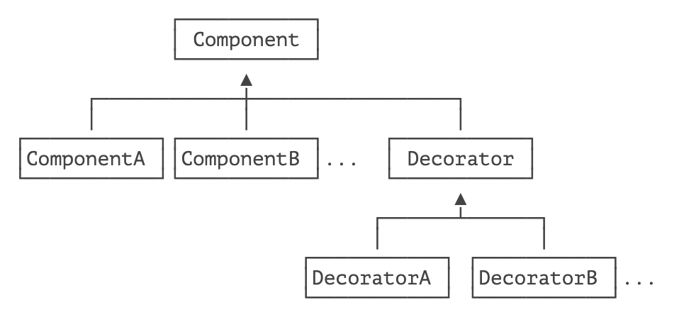

> 动态地给一个对象添加一些额外的职责。就增加功能来说，相比生成子类更为灵活。

装饰器（Decorator）模式，是一种在运行期动态给某个对象的实例增加功能的方法。

我们在 IO 的 [Filter 模式](/1-Java/8_IO/4.md) 一节中其实已经讲过装饰器模式了。在 Java 标准库中，`InputStream` 是抽象类，`FileInputStream`、`ServletInputStream`、`Socket.getInputStream()` 这些 `InputStream` 都是最终数据源。

现在，如果要给不同的最终数据源增加缓冲功能、计算签名功能、加密解密功能，那么，3 个最终数据源、3 种功能一共需要 9 个子类。如果继续增加最终数据源，或者增加新功能，子类会爆炸式增长，这种设计方式显然是不可取的。

Decorator 模式的目的就是把一个一个的附加功能，用 Decorator 的方式给一层一层地累加到原始数据源上，最终，通过组合获得我们想要的功能。

例如：给 `FileInputStream` 增加缓冲和解压缩功能，用 Decorator 模式写出来如下：

```java
// 创建原始的数据源:
InputStream fis = new FileInputStream("test.gz");
// 增加缓冲功能:
InputStream bis = new BufferedInputStream(fis);
// 增加解压缩功能:
InputStream gis = new GZIPInputStream(bis);
```

或者一次性写成这样：

```java
InputStream input = new GZIPInputStream( // 第二层装饰
                        new BufferedInputStream( // 第一层装饰
                            new FileInputStream("test.gz") // 核心功能
                        ));
```

观察 `BufferedInputStream` 和 `GZIPInputStream`，它们实际上都是从 `FilterInputStream` 继承的，这个 `FilterInputStream` 就是一个抽象的 Decorator。我们用图把 Decorator 模式画出来如下：



最顶层的 Component 是接口，对应到 IO 的就是 `InputStream` 这个抽象类。ComponentA、ComponentB 是实际的子类，对应到 IO 的就是 `FileInputStream`、`ServletInputStream` 这些数据源。Decorator 是用于实现各个附加功能的抽象装饰器，对应到 IO 的就是 `FilterInputStream`。而从 Decorator 派生的就是一个一个的装饰器，它们每个都有独立的功能，对应到 IO 的就是 `BufferedInputStream`、`GZIPInputStream` 等。

Decorator 模式有什么好处？它实际上把核心功能和附加功能给分开了。核心功能指 `FileInputStream` 这些真正读数据的源头，附加功能指加缓冲、压缩、解密这些功能。如果我们要新增核心功能，就增加 Component 的子类，例如 `ByteInputStream`。如果我们要增加附加功能，就增加 Decorator 的子类，例如 `CipherInputStream`。两部分都可以独立地扩展，而具体如何附加功能，由调用方自由组合，从而极大地增强了灵活性。

如果我们要自己设计完整的 Decorator 模式，应该如何设计？

我们还是举个栗子：假设我们需要渲染一个 HTML 的文本，但是文本还可以附加一些效果，比如加粗、变斜体、加下划线等。为了实现动态附加效果，可以采用 Decorator 模式。

首先，仍然需要定义顶层接口 `TextNode`：

```java
public interface TextNode {
    // 设置 text:
    void setText(String text);
    // 获取 text:
    String getText();
}
```

对于核心节点，例如 `<span>`，它需要从 `TextNode` 直接继承：

```java
public class SpanNode implements TextNode {
    private String text;

    public void setText(String text) {
        this.text = text;
    }

    public String getText() {
        return "<span>" + text + "</span>";
    }
}
```

紧接着，为了实现 Decorator 模式，需要有一个抽象的 Decorator 类：

```java
public abstract class NodeDecorator implements TextNode {
    protected final TextNode target;

    protected NodeDecorator(TextNode target) {
        this.target = target;
    }

    public void setText(String text) {
        this.target.setText(text);
    }
}
```

这个 `NodeDecorator` 类的核心是持有一个 `TextNode`，即将要把功能附加到的 `TextNode` 实例。接下来就可以写一个加粗功能：

```java
public class BoldDecorator extends NodeDecorator {
    public BoldDecorator(TextNode target) {
        super(target);
    }

    public String getText() {
        return "<b>" + target.getText() + "</b>";
    }
}
```

类似的，可以继续加 `ItalicDecorator`、`UnderlineDecorator` 等。客户端可以自由组合这些 Decorator：

```java
TextNode n1 = new SpanNode();
TextNode n2 = new BoldDecorator(new UnderlineDecorator(new SpanNode()));
TextNode n3 = new ItalicDecorator(new BoldDecorator(new SpanNode()));
n1.setText("Hello");
n2.setText("Decorated");
n3.setText("World");
System.out.println(n1.getText());
// 输出 <span>Hello</span>

System.out.println(n2.getText());
// 输出 <b><u><span>Decorated</span></u></b>

System.out.println(n3.getText());
// 输出 <i><b><span>World</span></b></i>
```

## 🍀 练习

使用 Decorator 添加一个 `<del>` 标签表示删除。


## 🍀 小结

使用 Decorator 模式，可以独立增加核心功能，也可以独立增加附加功能，二者互不影响；

可以在运行期动态地给核心功能增加任意个附加功能。


