> 行为型模式主要涉及算法和对象间的职责分配。通过使用对象组合，行为型模式可以描述一组对象应该如何协作来完成一个整体任务。

:::: tabs

@tab 责任链

## 1. Chain of Responsibility

::: tip 为某个请求创建一个对象链，每个对象依序检查此请求并对其进行处理或者将它传给链中的下一个对象
:::

### （1）意图

_使多个对象都有机会处理请求_，从而避免请求的发送者和接收者之间的耦合关系。_将这些对象连成一条链_，并沿着这条链传递该请求，直到有一个对象处理它为止。

### （2）类图

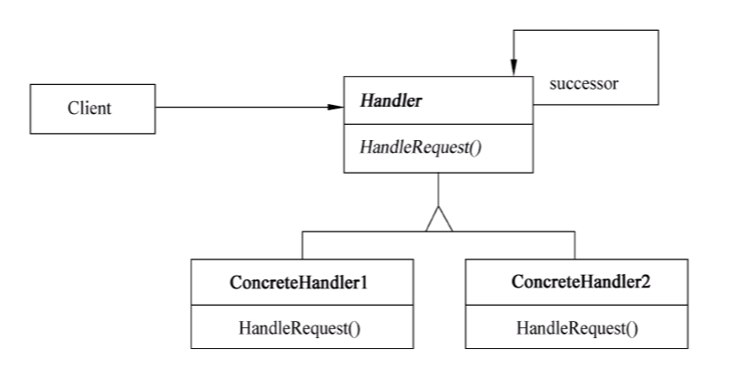

其中：

- Handler 定义一个处理请求的接口；（可选）实现后继链。
- ConcreteHandler 处理它所负责的请求；可访问它的后继者（successor）；如果可处理该请求，就处理它，否则将该请求转发给后继者。
- Client 向链上的具体处理者 (ConcreteHandler) 对象提交请求。

### （3）适用性

Chain of Responsibility 模式适用于以下条件：

- 有多个的对象可以处理一个请求，哪个对象处理该请求运行时刻自动确定。
- 想在不明确指定接收者的情况下向多个对象中的一个提交一个请求。
- 可处理一个请求的对象集合应被动态指定。

```java
public class ChainOfResponsibilityPattern {
    public static void main(String[] args) {
        Handler counsellor = new Counsellor();
        Handler dean = new Dean();
        Handler headmaster= new Headmaster();

        counsellor.setNext(dean);
        dean.setNext(headmaster);

        counsellor.HandRequest(25);
    }

}

abstract class Handler{
    protected Handler next;

    public void setNext(Handler next){
        this.next = next;
    }

    public abstract void HandRequest(int request);
}

class Counsellor extends Handler{

    @Override
    public void HandRequest(int request) {
        if (request <= 7){
            System.out.println("辅导员审批通过~");
        }else {
            if (next != null){
                next.HandRequest(request);
            }else {
                System.out.println("无法审批");
            }
        }
    }
}

class Dean extends Handler{

    @Override
    public void HandRequest(int request) {
        if (request <= 15){
            System.out.println("院长审批通过~");
        }else {
            if (next != null){
                next.HandRequest(request);
            }else {
                System.out.println("无法审批");
            }
        }
    }
}

class Headmaster extends Handler{

    @Override
    public void HandRequest(int request) {
        if (request <= 30){
            System.out.println("校长审批通过~");
        }else {
            if (next != null){
                next.HandRequest(request);
            }else {
                System.out.println("无法审批");
            }
        }
    }
}
```

@tab 命令

## 🌸 2. Command

::: tip 将请求封装为对象
:::

### （1）意图

将一个请求封装为一个对象，从而使得可以用不同的请求对客户进行参数化；对**请求排队**或记录**请求日志**，以及支持可**撤销**的操作。

### （2）类图

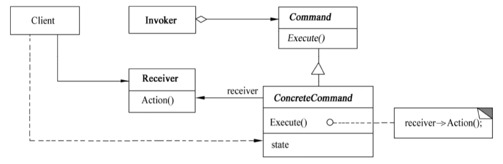

其中：

- _Command_ 声明执行操作的接口。
- _ConcreteCommand_ 将一个接收者对象绑定于一个动作：调用接收者相应的操作，以实现 Execute。
- Client 创建一个具体命令对象并设定它的接收者。
- Invoker 要求该命令执行这个请求。
- Receiver 知道如何实施与执行一个请求相关的操作。_任何类都可能作为一个接收者_。

### （3）适用性

Command 模式适用于：

- 抽象出待执行的动作以参数化某对象。
- 在不同的时刻指定、排列和执行请求。
- 支持取消操作。
- 支持修改日志。
- 用构建在原语操作上的高层操作构造一个系统。

```java
public class CommandPattern {
    public static void main(String[] args) {
        Tv tv = new Tv(); // 接收者 对象 电视机

        Command onCommand = new OnCommand(tv); // 命令对象 开机命令
        Command offCommand = new OnCommand(tv); // 命令对象 关机命令

        Invoker invoker = new Invoker(); //请求者
        invoker.setCommand(onCommand); // 给请求者设置 开机 命令
        invoker.call(); // 请求者去请求命令

        System.out.println("==============分割线===============");

        invoker.setCommand(offCommand); // 给请求者设置 关机命令
        invoker.call(); // 请求者去请求命令

    }
}

class Invoker{ // 请求者
    private Command command; // 命令

    public void setCommand(Command command){ // 设置请求者的命令
        this.command = command;
    }

    public void call(){ // 调用
        command.Execute();
    }
}

interface Command{ // 命令接口
    void Execute(); // 执行命令

}

class OnCommand implements Command{// 开机命令
    private Tv tv;

    public OnCommand(Tv tv){
        this.tv = tv;
    }

    @Override
    public void Execute() {
        tv.OnAction();
    }
}

class OffCommand implements Command{ // 关机命令
    private Tv tv;

    public OffCommand(Tv tv){
        this.tv = tv;
    }

    @Override
    public void Execute() {
        tv.OffAction();
    }
}

class Tv{
    public void OnAction(){ // 开机行为
        System.out.println("电视机开机了...");
    }

    public void OffAction(){ // 关机行为
        System.out.println("电视机关机了...");
    }
}
```

@tab 解释器

## 3. Interpreter

> 没考过

::: tip 为语言创建解释器，通常由语言的语法和语法分析来定义
:::

### （1）意图

给定一个语言，_定义它的文法的一种表示_，并定义一个解释器，这个解释器使用该表示来解释语言中的句子。

### （2）类图

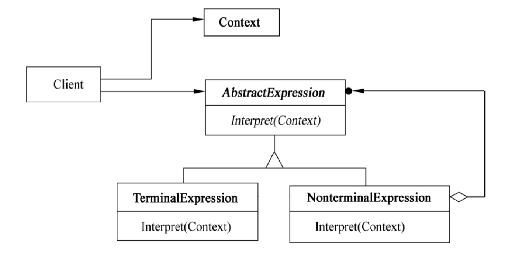

- Context 上下文
- NonterminalExpression 非终结符表达式

### （3）适用性

Interpreter 模式适用于当有一个语言需要解释执行，并且可将该语言中的句子表示为一个抽象语法树时，以下情况效果最好：

- 该文法简单。对于复杂的发文，文法的类层次变得庞大而无法管理。
- 效率不是一个关键问题。最高效的解释器通常不是通过直接解释语法分析树实现的，而是首先将它们转换成另一种形式。

```java
public class InterpreterPattern {

    public static void main(String[] args) {

        Context context = new Context();

        context.check("A区的开发人员");
        context.check("B区的调试人员");
        context.check("C区的测试人员");

        System.out.println("========分割线=============");

        context.check("D区的程序员");
        context.check("D区的测试员");
        context.check("C区的程序员");

    }
}

class Context{
    private String[] regions = {"A区","B区","C区"};
    private String[] persions = {"开发人员","测试人员","调试人员"};
    private NonterminalExpression nonterminal;

    public Context(){
        TerminalExpression region = new TerminalExpression(regions);
        TerminalExpression person = new TerminalExpression(persions);
        nonterminal = new NonterminalExpression(region,person);
    }

    public void check(String info){
        boolean result = nonterminal.Interpret(info);
        if (result){
            System.out.println("识别成功~");
        }else {
            System.out.println("识别失败~");
        }
    }

}

interface Expression{
    boolean Interpret(String info);
}

class NonterminalExpression implements Expression{

    private TerminalExpression region;
    private TerminalExpression person;

    public NonterminalExpression(TerminalExpression region,TerminalExpression person){
        this.region =region;
        this.person = person;
    }

    @Override
    public boolean Interpret(String info) {
        String[] str = info.split("的");
        // B区的调试人员 --> str = {"B区","调试人员"};
        return region.Interpret(str[0]) && person.Interpret(str[1]);
    }
}

class TerminalExpression implements Expression{

    private Set<String> set = new HashSet<>();

    public TerminalExpression(String[] data){
        for (String str : data) {
            set.add(str);
        }
    }

    @Override
    public boolean Interpret(String info) {
        return set.contains(info);
    }
}
```

@tab 迭代器

## 4. Iterator

::: tip 提供一种方法顺序访问一个聚合对象中的各个元素，而又不暴露其内部的表示
:::

### （1）意图

提供一种方法*顺序访问*一个**聚合对象**中的各个元素，且*不需要暴露该对象的内部表示*。

### （2）类图

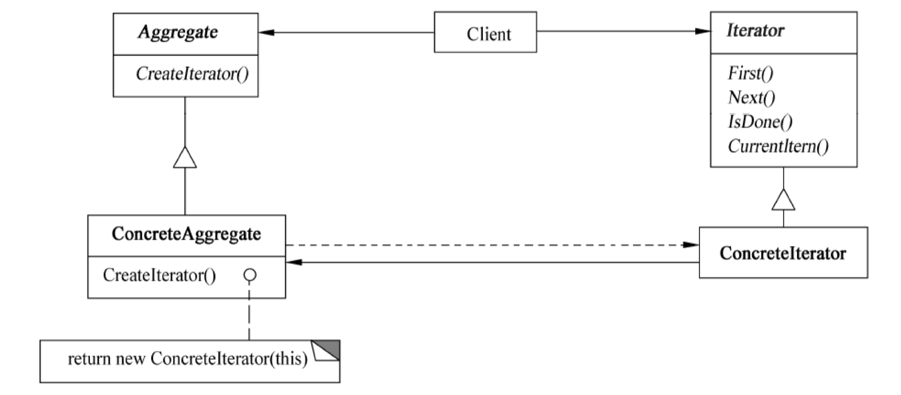

其中：

- Iterator (迭代器) _定义访问和遍历元素的接口_。
- ConcreteIterator（具体迭代器）_实现迭代器接口_；对该聚合遍历时跟踪当前位置。
- Aggregate (聚合) 定义创建相应迭代器对象的接口。
- ConcreteAggregate (具体聚合) 实现创建相应迭代器的接口，该操作返回 ConcreteIterator 的一个适当的实例。

### （3）适用性

Iterator 模式适用于：

- 访问一个聚合对象的内容而无须暴露它的内部表示。
- 支持对聚合对象的多种遍历。
- 为遍历不同的聚合结构提供一个统一的接口。

```java
public class IteratorPattern {

    public static void main(String[] args) {
        BookAggregate bookAggregate = new BookAggregate();

        String[] books = {"数据结构","操作系统","计算机网络","计算机组成原理"};
        double[] prices = {10.24,20.48,40.96,81.92};

        for (int i = 0; i < 4; i++) {
            bookAggregate.Add(new Book(books[i],prices[i]));
        }

        Iterator iterator = bookAggregate.CreateIterator();
        while (iterator.hasNext()) {
            Book book = (Book) iterator.next();
            System.out.println("书名：" + book.getName() + " 价格：" + book.getPrice());
        }

    }

}

interface Iterator{
    boolean hasNext();
    Object next();
}

class BookIterator implements Iterator{
    private int index;
    private BookAggregate bookAggregate;

    public BookIterator(BookAggregate bookAggregate){
        this.index = 0;
        this.bookAggregate = bookAggregate;
    }

    @Override
    public boolean hasNext() {
        if (index < bookAggregate.getSize()){
            return true;
        }
        return false;
    }

    @Override
    public Object next() {
        Object obj = bookAggregate.get(index);
        index ++ ;
        return obj;
    }
}

class BookAggregate implements Aggregate{

    private List<Book> list = new ArrayList<>();

    public void Add(Book book){
        list.add(book);
    }

    public Book get(int index){
        return list.get(index);
    }

    public int getSize(){
        return list.size();
    }

    @Override
    public Iterator CreateIterator() {
        return new BookIterator(this);
    }
}

interface Aggregate{
    Iterator CreateIterator();
}

class Book{
    private String name;
    private double price;

    public Book(String name,double price){
        this.name = name;
        this.price = price;
    }

    public String getName(){
        return name;
    }

    public double getPrice(){
        return price;
    }
}
```

@tab 中介者

## 5. Mediator

::: tip 集中相关对象之间复杂的沟通和控制方式
:::

### （1）意图

用一个**中介对象**来*封装一系列的对象交互*。中介者使各对象不需要显式的相互引用，从而使其*耦合松散*，而且可以独立地改变它们之间的交互。

### （2）类图

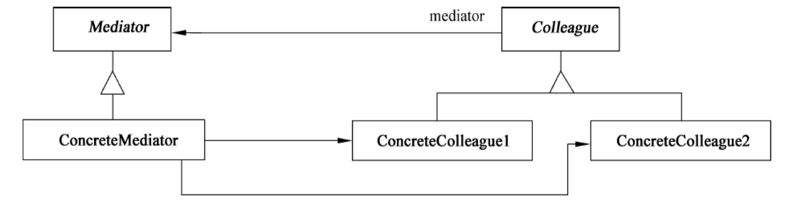

其中：

- Mediator (中介者) 定义一个接口用于各同事 (Colleague) 对象通信。
- ConcreteMediator (具体中介者) 通过协调各同事对象实现协作行为；了解并维护它的各个同事。
- Colleague class (同事类) 知道它的中介者对象；每一个同事类对象在需要与其他同事通信的时候与它的中介者通信。

### （3）适用性

Mediator 模式适用于：

- 一组对象以*定义良好*但是~~复杂的方式进行通信~~，产生的~~相互依赖关系结构混乱且难以理解~~。
- 一个对象引用其他很多对象并且直接与这些对象通信，导致难以复用该对象。
- 想定制一个分布在多个类中的行为，而又不想生成太多的子类。

```java
public class MediatorPattern {
    public static void main(String[] args) {
        ConcreteMediator mediator = new ConcreteMediator();

        Colleague1 colleague1 = new Colleague1(mediator);
        Colleague2 colleague2 = new Colleague2(mediator);

        mediator.setColleague1(colleague1);
        mediator.setColleague2(colleague2);

        colleague1.sendMessage("软考加油~");
        colleague2.sendMessage("祝你上岸~");
    }
}

abstract class Colleague {
    protected Mediator mediator;
}

class Colleague1 extends Colleague {
    public Colleague1(Mediator mediator) {
        this.mediator = mediator;
    }

    public void sendMessage(String message) {
        mediator.sendMessage(message，this);
    }

    public void Notify(String message) {
        System.out.println("同事1收到消息：" + message);
    }
}

class Colleague2 extends Colleague {
    public Colleague2(Mediator mediator) {
        this.mediator = mediator;
    }

    public void sendMessage(String message) {
        mediator.sendMessage(message，this);
    }

    public void Notify(String message) {
        System.out.println("同事2收到消息：" + message);
    }
}

abstract class Mediator {
    public abstract void sendMessage(String message，Colleague colleague);
}

class ConcreteMediator extends Mediator {
    private Colleague1 colleague1;
    private Colleague2 colleague2;

    public void setColleague1(Colleague1 colleague1) {
        this.colleague1 = colleague1;
    }

    public void setColleague2(Colleague2 colleague2) {
        this.colleague2 = colleague2;
    }

    @Override
    public void sendMessage(String message，Colleague colleague) {
        if (colleague == colleague1) {
            // 让同事2收到消息
            colleague2.Notify(message);
        } else {
            // 让同事1收到消息
            colleague1.Notify(message);
        }
    }
}
```

@tab 备忘录

## 6. Memento

::: tip 当你需要让对象返回之前的状态时(例如，你的用户请求"撤销")，你使用备忘录模式
:::

### （1）意图

在不破坏封装性的前提下*捕获一个对象的内部状态*，并在对象之外*保存*这个状态。这样以后就可以将对象*恢复*到原先保存的状态。

### （2）类图

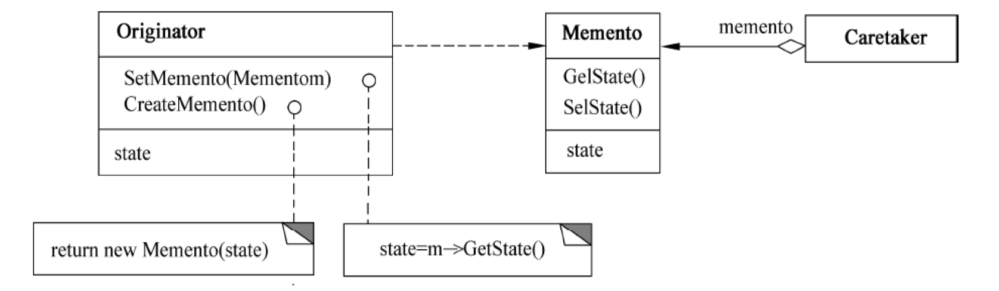

- Memento（备忘录）：存储原发器对象的内部状态；防止原发器以外的对象访问备忘录；
- Originator（原发器）：创建一个备忘录，用于记录当前时刻它的内部状态；使用备忘录恢复内部状态
- Caretaker（管理者）

### （3）适用性

Memento 模式适用于：

- _必须保存一个对象在某一个时刻的（部分）状态_，这样以后需要时它才能恢复到先前的状态。
- 如果一个用接口来让其他对象直接得到这些状态，将会暴露对象的实现细节并破坏对象的封装性。

```java
public class MementoPattern {
    public static void main(String[] args) {
        Caretaker caretaker = new Caretaker();
        Originator originator = new Originator();

        originator.setState("1024");
        Memento backup1 = originator.createMemento();
        caretaker.addMemento(backup1);

        originator.setState("2048");
        Memento backup2 = originator.createMemento();
        caretaker.addMemento(backup2);

        originator.setState("4096");
        Memento backup3 = originator.createMemento();
        caretaker.addMemento(backup3);

        System.out.println(originator.getState());
        caretaker.showMemento();

        Memento memento1 = caretaker.getMemento(2);
        originator.setState(memento1.getState());

        System.out.println("根据第2次备份还原之后的状态为：" + originator.getState());
    }
}

class Originator{ // 原发器
    private String state;

    public void setState(String state){
        this.state = state;
    }

    public String getState(){
        return state;
    }

    public Memento createMemento(){
        return new Memento(state);
    }

    public void setMemento(Memento memento){
        state = memento.getState();
    }
}

class Memento{ // 备忘录
    private String state;

    public String getState(){
        return state;
    }

    public Memento(String state){
        this.state = state;
    }
}

class Caretaker{ // 管理者
    private List<Memento> mementoList = new ArrayList<>();

    public void addMemento(Memento memento){
        mementoList.add(memento);
    }

    public Memento getMemento(int index){
        // 判断参数是否合法
        if (index >=1 && index <= mementoList.size()) {
            return mementoList.get(index - 1);
        }
        return null;
    }

    public void showMemento(){
        int cnt = 1;
        for (Memento memento : mementoList) {
            System.out.println("第" + cnt + "次备份，状态为：" + memento.getState());
            cnt ++;
        }
    }
}
```

@tab 观察者

## 🌸 7. Observer

::: tip 对象间定义一对多的依赖，一个对象改变状态，依赖它的对象都会收到通知
:::

### （1）意图

定义对象间的一种一对多的依赖关系，当一个对象的状态发生改变时，所有依赖于它的对象都得到通知并被自动更新。

### （2）类图

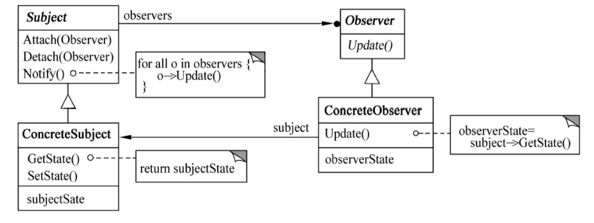

其中：

- _Subject (目标) 知道它的观察者，可以有任意多个观察者观察同一个目标_；提供注册和删除观察者对象的接口。
- Observer (观察者) 为那些在目标发生改变时需获得通知的对象定义一个更新接口。
- ConcreteSubject (具体目标) 将有关状态存入各 ConcreteObserver 对象；当它的状态发生改变时，向它的各个观察者发出通知。
- ConcreteObserver (具体观察者) 维护一个指向 ConcreteSubject 对象的引用；存储有关状态，这些状态应与目标的状态保持一致。
- 实现 Observer 的更新接口，以使自身状态与目标的状态保持一致。

### （3）适用性

Observer 模式适用于：

- 当一个抽象模型有两个方面，其中一个方面依赖于另一个方面，将这两者封装在独立的对象中以使它们可以各自独立地改变和复用。
- _当对一个对象的改变需要同时改变其他对象，而不知道具体有多少对象有待改变时_。
- 当一个对象必须通知其他对象，而它又不能假定其他对象是谁，即*不希望这些对象是 **紧耦合** 的*。

```java
public class ObserverPattern {
    public static void main(String[] args) {
        Subject subjectA = new ConcreteSubject("目标A");

        Observer observerB = new ConcreteObserver("张三"，subjectA);
        Observer observerC = new ConcreteObserver("李四"，subjectA);
        Observer observerD = new ConcreteObserver("王五"，subjectA);

        subjectA.setState("更新了");
    }
}


interface Subject { // 目标接口
    void Attach(Observer observer); // 添加观察者

    void Detach(Observer observer); // 删除观察者

    void Notify(); // 状态改变后，通知所有观察者

    void setState(String state); // 设置状态（改变状态）

    String getState(); // 获取状态


}

class ConcreteSubject implements Subject {
    private String name;
    private String state;


    private List<Observer> observerList;

    public ConcreteSubject(String name) {
        state = "未更新";
        this.name = name;
        observerList = new ArrayList<>();
    }

    @Override
    public void Attach(Observer observer) {
        observerList.add(observer);
    }

    @Override
    public void Detach(Observer observer) {
        observerList.remove(observer);
    }

    @Override
    public void Notify() {
        for (Observer observer : observerList) {
            observer.update();
        }
    }

    @Override
    public void setState(String state) {
        this.state = state;

        System.out.println(name + "的状态发生变化，变化后的状态为：" + state);
        Notify();
    }

    @Override
    public String getState() {
        return state;
    }


}

interface Observer { // 观察者接口
    void update(); // 收到通知，更新观察者的状态
}

class ConcreteObserver implements Observer {


    private String name;
    private String state;

    private Subject subject;

    public ConcreteObserver(String name，Subject subject) {
        this.name = name;
        this.subject = subject;
        subject.Attach(this);
        state = subject.getState();
    }

    @Override
    public void update() {
        System.out.println(name + " 收到通知");
        state = subject.getState(); //  让当前观察者的状态 和 目标改变后的状态保持一致
        System.out.println(name + " 改变后的状态为：" + state);
    }
}
```

@tab 状态

## 🌸 8. State

::: tip 允许对象在内部状态改变时改变它的行为
:::

### （1）意图

允许一个对象在其*内部状态改变*时改变它的行为。对象看起来似乎修改了它的类。

### （2）类图

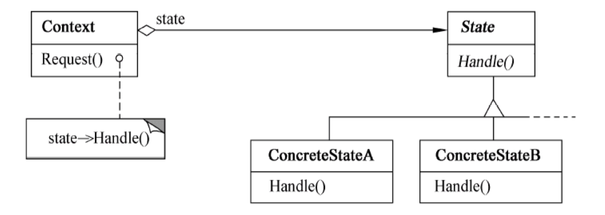

### （3）适用性

State 模式适用于：

- 一个对象的*行为决定于它的状态*，并且它*必须在运行时刻根据状态改变它的行为*。
- 一个操作中*含有庞大的多分支的条件语句*，且这些*分支依赖于该对象的状态*。这个状态常用一个或多个枚举常量表示。

```java
public class StatePattern {
    public static void main(String[] args) {
        Context context = new Context(); // count = 3

        System.out.println("状态：" + context.getState() + " 数量：" + context.getCount());

        context.Request(); // 购买一个饮料 count = 2
        context.Request(); // 购买一个饮料 count = 1
        context.Request(); // 购买一个饮料 count = 0

        System.out.println("状态：" + context.getState() + " 数量：" + context.getCount());

        context.Request(); // 无货，等待补货

        System.out.println("状态：" + context.getState() + " 数量：" + context.getCount());

        context.Request(); // 购买一个饮料 count = 4
        System.out.println("状态：" + context.getState() + " 数量：" + context.getCount());

    }
}

class Context{ // 贩卖机
    private int count;

    private State state;

    public Context(){
        count = 3;
        state = new StateA();
    }

    public int getCount() {
        return count;
    }

    public void setCount(int count) {
        this.count = count;
    }

    public State getState() {
        return state;
    }

    public void setState(State state) {
        this.state = state;
    }

    public void Request(){  // 购买饮料
        state.Handle(this);
    }
}

interface State{
    void Handle(Context context);
}

class StateA implements State{

    @Override
    public void Handle(Context context) {
        int count = context.getCount();

        if (count >= 1){
            System.out.println("购买成功~");
            context.setCount(count - 1);

            if (context.getCount() == 0){
                context.setState(new StateB()); // 设置为无货状态
            }
        }else {
            System.out.println("购买失败~");
        }
    }
}

class StateB implements State{

    @Override
    public void Handle(Context context) {
        int count = context.getCount();

        if (count == 0){
            System.out.println("购买失败！等待补货~");

            context.setCount(5);
            System.out.println("补货成功，请重新购买~");

            context.setState(new StateA());
        }
    }
}
```

@tab 策略

## 🌸 9. Strategy

::: tip 定义了算法族，分别封闭起来，让它们之间可以互相替换，此模式让算法的变化独立于使用算法的客户
:::

### （1）意图

定义一系列的**算法**，把它们一个个**封装**起来，并且使它们可以相互替换。此模式使得算法可以独立于使用它们的客户而变化。

### （2）类图

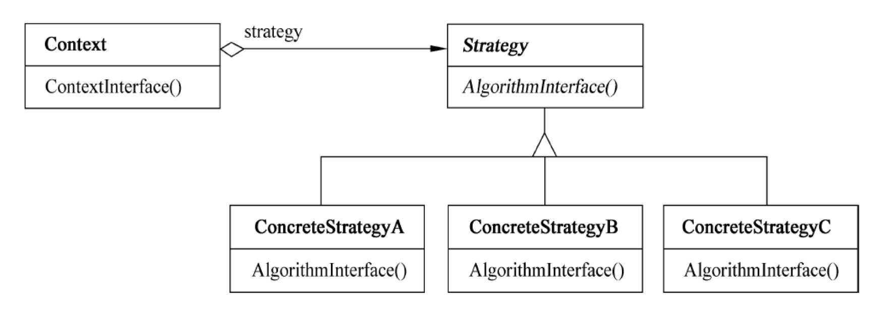

### （3）适用性

Strategy 模式适用于：

- 许多相关的类仅仅是*行为有异*。
- _需要使用一个算法的不同变体_。
- 算法使用客户不应该知道的数据。可使用策略模式以*避免暴露复杂的、与算法相关的数据结构*。
- 一个类定义了多种行为，并且这些行为在这个类的操作中以多个条件语句的形式出现（超市打折，普通/高级会员价），将相关的条件分支移入它们各自的 Strategy 类中，以代替这些条件语句。

```java
public class StrategyPattern {
    public static void main(String[] args) {

        OperationContext context = new OperationContext(new Addstrategy());
        context.Operation(20,17);

        context = new OperationContext(new Substrategy());
        context.Operation(20,17);

        context = new OperationContext(new Multstrategy());
        context.Operation(20,17);
    }
}

class OperationContext{
    private Strategy strategy;

    public OperationContext(Strategy strategy){
        this.strategy = strategy;
    }

    public void Operation(int a，int b){
        strategy.TwoNumberOperation(a,b);
    }
}

interface Strategy{
    void TwoNumberOperation(int a,int b);
}

class Addstrategy implements Strategy{
    @Override
    public void TwoNumberOperation(int a，int b) {
        System.out.println(a + b);
    }
}

class Substrategy implements Strategy{
    @Override
    public void TwoNumberOperation(int a，int b) {
        System.out.println(a - b);
    }
}

class Multstrategy implements Strategy{
    @Override
    public void TwoNumberOperation(int a，int b) {
        System.out.println(a * b);
    }
}
```

@tab 模板方法

## 10. Template Method

::: tip 在一个方法中定义一个算法的骨架，而将一些步骤延迟到子类中
:::

### （1）意图

定义一个操作中的**算法骨架**，而将一些步骤延迟到子类中。Template Method 使得子类可以不改变一个算法的结构即*可重定义该算法的某些特定步骤*。

### （2）类图

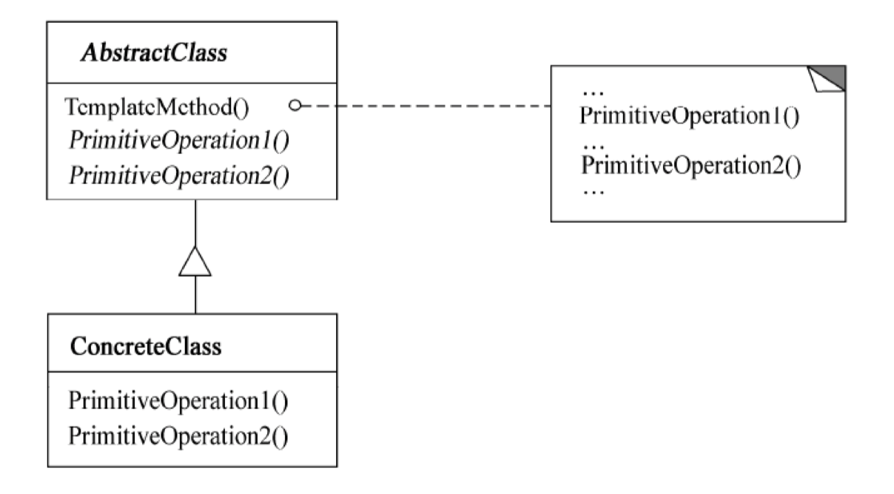

其中：

- AbstractClass（抽象类）定义抽象的*原语操作*，具体的子类将重定义它们以实现一个算法的各步骤；实现模板方法，定一个算法的骨架，该模板方法不仅调用原语操作，也调用定义在 AbstractClass 或其他对象中的操作。
- ConcreteClass（具体类）实现原语操作以完成算法中与特定子类相关的步骤。

> 抽象类控制步骤，各子类继承父类具体实现操作步骤

### （3）适用性

Template Method 模式适用于：

- 一次性实现一个算法的不变的部分，并将可变的行为留给子类来实现。
- 各子类中公共的行为应被提取出来并集中到一个公共父类中，以避免代码重复。
- 控制子类扩展：模板方法在特定点调用 “hook” 操作 (默认行为，子类可以在必要时进行重定义扩展)，这就只允许在这些点进行扩展。

```java
public class TemplateMethodPattern {
    public static void main(String[] args) {
        // 父类名 对象名 = new 子类名();

        Person student = new Student();
        Person teacher = new Teacher();

        student.TemplateMethod();

        System.out.println("=========分割线=============");

        teacher.TemplateMethod();
    }
}

abstract class Person{
    public void TemplateMethod(){
        System.out.println("上课 去教室");
        PrimitiveOperation1();
        System.out.println("下课 离开教室");
        PrimitiveOperation2();
    }

    public abstract void PrimitiveOperation1(); // 原语操作 1：上课过程 学生 听课... 老师 讲课
    public abstract void PrimitiveOperation2(); // 原语操作 2：作业  学生 写作业 提交作业... 老师批改作业 打分数
}

class Student extends Person{

    @Override
    public void PrimitiveOperation1() {
        System.out.println("学生：听课 学习 做笔记 提出问题");
    }

    @Override
    public void PrimitiveOperation2() {
        System.out.println("学生：写作业 提交作业");
    }
}

class Teacher extends Person{

    @Override
    public void PrimitiveOperation1() {
        System.out.println("老师：上课 讲课 解答问题 布置作业");
    }

    @Override
    public void PrimitiveOperation2() {
        System.out.println("老师：批改作业 打分数");
    }
}
```

@tab 访问者

## 🌸 11. Visitor

::: tip 当你想要为一个对象的组合增加新的能力，且封装并不重要时，就使用访问者模式
:::

### （1）意图

_表示一个作用于某**对象结构**中的各元素的操作_。它允许在不改变各元素的类的前提下定义作用于这些元素的新操作。

### （2）类图

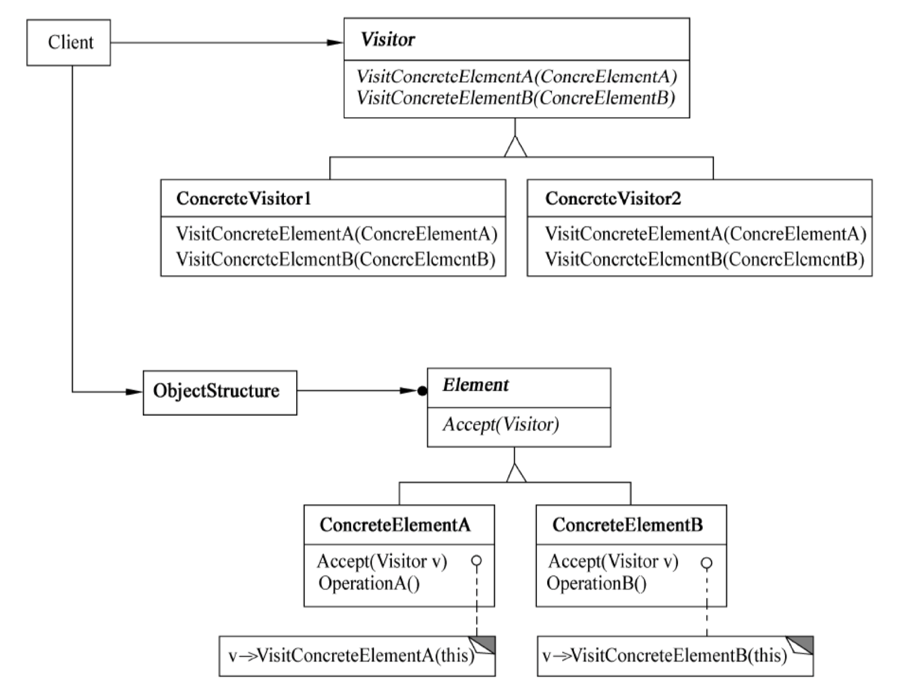

其中：

- Visitor (访问者) 为该对象结构中 ConcreteElement 的每一个类声明一个 Visit 操作。该操作的名字和特征标识了发送 Vist 请求给该访问者的那个类，这使得访问者可以确定正被访问元素的具体的类。这样访问者就可以通过该元素的特定接口直接访问它。
- ConcreteVisitor (具体访问者) 实现每个有 Visitor 声明的操作，每个操作实现本算法的一部分，而该算法片段乃是对应于结构中对象的类。Concrete Visitor 为该算法提供了上下文并存储它的局部状态。这一状态常常在遍历该结构的过程中累积结果。
- Element (元素) 定义以一个访问者为参数的 Accept 操作。
- ConcreteElement (具体元素) 实现以一个访问者为参数的 Accept 操作。
- ObjectStructure (对象结构) 能枚举它的元素；可以提供一个高层的接口以允许该访问者访问它的元素；可以是一个组合或者一个集合，如一个列表或一个无序集合。

### （3）适用性

Visitor 模式适用于：

- 一个对象结构包含很多类对象，它们有不同的接口，而用户想对这些对象实施一些依赖于其具体类的操作。
- 需要对一个对象结构中的对象进行很多不同的并且不相关的操作，而又想要避免这些操作 “污染” 这些对象的类。
- 定义对象结构的类很少改变，但经常需要在此结构上定义新的操作。

```java
public class VisitorPattern {
    public static void main(String[] args) {
        PersonStructure structure = new PersonStructure();

        Visitor1 visitor1 = new Visitor1();
        System.out.println("访问者1的访问记录：");
        structure.Accept(visitor1);
        System.out.println("学生年龄的总和：" + visitor1.getStudentAgeSum() +" 老师年龄的总和：" + visitor1.getTeacherAgeSum());

        System.out.println("=========分割线==============");

        Visitor2 visitor2 = new Visitor2();
        System.out.println("访问者2的访问记录：");
        structure.Accept(visitor2);
        System.out.println("学生的最高成绩：" + visitor2.getMaxScore() + " 老师的最高工龄：" + visitor2.getMaxWorkYear());

    }
}

interface Visitor{
    void VistStudent(Student student); // 访问
    void vistTeacher(Teacher teacher); // 访问老师
}

class Visitor1 implements Visitor{ // 访问者1 分别统计学生和老师的年龄总和
    private int studentAgeSum = 0;
    private int teacherAgeSum = 0;

    public int getStudentAgeSum() {
        return studentAgeSum;
    }

    public int getTeacherAgeSum() {
        return teacherAgeSum;
    }

    @Override
    public void VistStudent(Student student) {
        System.out.println("访问者1访问学生：" + student.getName() + " 年龄：" + student.getAge());
        studentAgeSum += student.getAge();
    }

    @Override
    public void vistTeacher(Teacher teacher) {
        System.out.println("访问者1访问老师：" + teacher.getName() + " 年龄：" + teacher.getAge());
        teacherAgeSum += teacher.getAge();
    }
}

class Visitor2 implements Visitor{ // 访问者2 分别求出 学生的最高成绩 以及 老师的最高工龄
    private int maxScore = -1;
    private int maxWorkYear = -1;

    public int getMaxScore() {
        return maxScore;
    }

    public int getMaxWorkYear() {
        return maxWorkYear;
    }

    @Override
    public void VistStudent(Student student) {
        System.out.println("访问者2访问学生：" + student.getName() + " 成绩：" + student.getScore());
        maxScore = Math.max(maxScore,student.getScore());
    }

    @Override
    public void vistTeacher(Teacher teacher) {
        System.out.println("访问者2访问老师：" + teacher.getName() + " 工龄：" + teacher.getWorkYear());
        maxWorkYear = Math.max(maxWorkYear,teacher.getWorkYear());
    }
}

class PersonStructure{
    private List<Person> personList = new ArrayList<>();

    public PersonStructure(){
        personList.add(new Student("张三",20,70));
        personList.add(new Student("李四",21,80));
        personList.add(new Student("王五",22,90));

        personList.add(new Teacher("李老师",26,3));
        personList.add(new Teacher("陈老师",27,4));
        personList.add(new Teacher("刘老师",28,5));
    }

    public void Accept(Visitor visitor){
        for (Person person : personList) {
            person.Accept(visitor);
        }
    }
}

abstract class Person{
    private String name;
    private int age;

    public Person(String  name,int age){
        this.name = name;
        this.age = age;
    }

    public String getName(){
        return name;
    }

    public int getAge() {
        return age;
    }

    public abstract void Accept(Visitor visitor);
}

class Student extends Person{

    private int score;
    public Student(String name,int age,int score){
        super(name,age);
        this.score = score;
    }

    public int getScore(){
        return score;
    }

    @Override
    public void Accept(Visitor visitor) {
        visitor.VistStudent(this);
    }
}

class Teacher extends Person{
    private int workYear;
    public Teacher(String name,int age,int workYear){
        super(name,age);
        this.workYear = workYear;
    }

    public int getWorkYear(){
        return workYear;
    }

    @Override
    public void Accept(Visitor visitor) {
        visitor.vistTeacher(this);
    }
}
```
