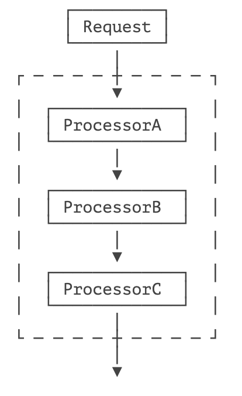

---
title: 责任链
sidebarDepth: 1
category: Java 教程
tag: Java
--- 


> 使多个对象都有机会处理请求，从而避免请求的发送者和接收者之间的耦合关系。将这些对象连成一条链，并沿着这条链传递该请求，直到有一个对象处理它为止。

责任链模式（Chain of Responsibility）是一种处理请求的模式，它让多个处理器都有机会处理该请求，直到其中某个处理成功为止。责任链模式把多个处理器串成链，然后让请求在链上传递：



在实际场景中，财务审批就是一个责任链模式。假设某个员工需要报销一笔费用，审核者可以分为：

- Manager：只能审核 1000 元以下的报销；
- Director：只能审核 10000 元以下的报销；
- CEO：可以审核任意额度。

用责任链模式设计此报销流程时，每个审核者只关心自己责任范围内的请求，并且处理它。对于超出自己责任范围的，扔给下一个审核者处理，这样，将来继续添加审核者的时候，不用改动现有逻辑。

我们来看看如何实现责任链模式。

首先，我们要抽象出请求对象，它将在责任链上传递：

```java
public class Request {
    private String name;
    private BigDecimal amount;

    public Request(String name, BigDecimal amount) {
        this.name = name;
        this.amount = amount;
    }

    public String getName() {
        return name;
    }

    public BigDecimal getAmount() {
        return amount;
    }
}
```

其次，我们要抽象出处理器：

```java
public interface Handler {
    // 返回 Boolean.TRUE = 成功
    // 返回 Boolean.FALSE = 拒绝
    // 返回 null = 交下一个处理
	Boolean process(Request request);
}
```

并且做好约定：如果返回 `Boolean.TRUE`，表示处理成功，如果返回 `Boolean.FALSE`，表示处理失败（请求被拒绝），如果返回 `null`，则交由下一个 `Handler` 处理。

然后，依次编写 ManagerHandler、DirectorHandler 和 CEOHandler。以 ManagerHandler 为例：

```java
public class ManagerHandler implements Handler {
    public Boolean process(Request request) {
        // 如果超过 1000 元，处理不了，交下一个处理:
        if (request.getAmount().compareTo(BigDecimal.valueOf(1000)) > 0) {
            return null;
        }
        // 对 Bob 有偏见:
        return !request.getName().equalsIgnoreCase("bob");
    }
}
```

有了不同的 `Handler` 后，我们还要把这些 `Handler` 组合起来，变成一个链，并通过一个统一入口处理：

```java
public class HandlerChain {
    // 持有所有 Handler:
    private List<Handler> handlers = new ArrayList<>();

    public void addHandler(Handler handler) {
        this.handlers.add(handler);
    }

    public boolean process(Request request) {
        // 依次调用每个 Handler:
        for (Handler handler : handlers) {
            Boolean r = handler.process(request);
            if (r != null) {
                // 如果返回 TRUE 或 FALSE，处理结束:
                System.out.println(request + "" + (r ?"Approved by ":"Denied by ") + handler.getClass().getSimpleName());
                return r;
            }
        }
        throw new RuntimeException("Could not handle request:" + request);
    }
}
```

现在，我们就可以在客户端组装出责任链，然后用责任链来处理请求：

```java
// 构造责任链:
HandlerChain chain = new HandlerChain();
chain.addHandler(new ManagerHandler());
chain.addHandler(new DirectorHandler());
chain.addHandler(new CEOHandler());
// 处理请求:
chain.process(new Request("Bob", new BigDecimal("123.45")));
chain.process(new Request("Alice", new BigDecimal("1234.56")));
chain.process(new Request("Bill", new BigDecimal("12345.67")));
chain.process(new Request("John", new BigDecimal("123456.78")));
```

责任链模式本身很容易理解，需要注意的是，`Handler` 添加的顺序很重要，如果顺序不对，处理的结果可能就不是符合要求的。

此外，责任链模式有很多变种。有些责任链的实现方式是通过某个 `Handler` 手动调用下一个 `Handler` 来传递 `Request`，例如：

```java
public class AHandler implements Handler {
    private Handler next;
    public void process(Request request) {
        if (!canProcess(request)) {
            // 手动交给下一个 Handler 处理:
            next.process(request);
        } else {
            ...
        }
    }
}
```

还有一些责任链模式，每个 `Handler` 都有机会处理 `Request`，通常这种责任链被称为拦截器（Interceptor）或者过滤器（Filter），它的目的不是找到某个 `Handler` 处理掉 `Request`，而是每个 `Handler` 都做一些工作，比如：

- 记录日志；
- 检查权限；
- 准备相关资源；
- ...

例如，JavaEE 的 Servlet 规范定义的 `Filter` 就是一种责任链模式，它不但允许每个 `Filter` 都有机会处理请求，还允许每个 `Filter` 决定是否将请求 “放行” 给下一个 `Filter`：

```java
public class AuditFilter implements Filter {
    public void doFilter(ServletRequest req, ServletResponse resp, FilterChain chain) throws IOException, ServletException {
        log(req);
        if (check(req)) {
            // 放行:
            chain.doFilter(req, resp);
        } else {
            // 拒绝:
            sendError(resp);
        }
    }
}
```

这种模式不但允许一个 `Filter` 自行决定处理 `ServletRequest` 和 `ServletResponse`，还可以 “伪造”`ServletRequest` 和 `ServletResponse` 以便让下一个 `Filter` 处理，能实现非常复杂的功能。

## 🍀 练习

使用责任链模式实现审批

## 🍀 小结

责任链模式是一种把多个处理器组合在一起，依次处理请求的模式；

责任链模式的好处是添加新的处理器或者重新排列处理器非常容易；

责任链模式经常用在拦截、预处理请求等。


