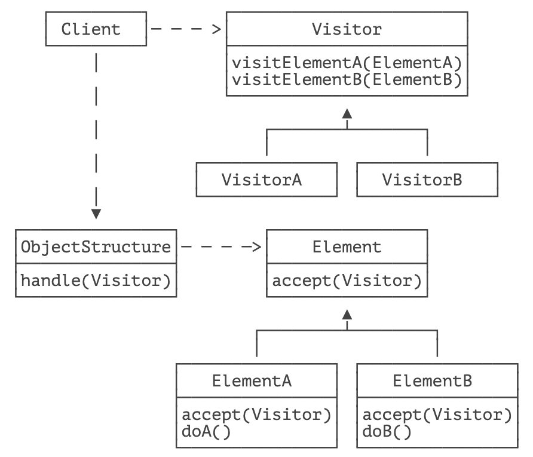

> 表示一个作用于某对象结构中的各元素的操作。它使你可以在不改变各元素的类的前提下定义作用于这些元素的新操作。

访问者模式（Visitor）是一种操作一组对象的操作，它的目的是不改变对象的定义，但允许新增不同的访问者，来定义新的操作。

访问者模式的设计比较复杂，如果我们查看 GoF 原始的访问者模式，它是这么设计的：



上述模式的复杂之处在于上述访问者模式为了实现所谓的 “双重分派”，设计了一个回调再回调的机制。因为 Java 只支持基于多态的单分派模式，这里强行模拟出“双重分派” 反而加大了代码的复杂性。

这里我们只介绍简化的访问者模式。假设我们要递归遍历某个文件夹的所有子文件夹和文件，然后找出 `.java` 文件，正常的做法是写个递归：

```java
void scan(File dir, List<File> collector) {
    for (File file : dir.listFiles()) {
        if (file.isFile() && file.getName().endsWith(".java")) {
            collector.add(file);
        } else if (file.isDir()) {
            // 递归调用:
            scan(file, collector);
        }
    }
}
```

上述代码的问题在于，扫描目录的逻辑和处理. java 文件的逻辑混在了一起。如果下次需要增加一个清理 `.class` 文件的功能，就必须再重复写扫描逻辑。

因此，访问者模式先把数据结构（这里是文件夹和文件构成的树型结构）和对其的操作（查找文件）分离开，以后如果要新增操作（例如清理 `.class` 文件），只需要新增访问者，不需要改变现有逻辑。

用访问者模式改写上述代码步骤如下：

首先，我们需要定义访问者接口，即该访问者能够干的事情：

```java
public interface Visitor {
    // 访问文件夹:
    void visitDir(File dir);
    // 访问文件:
    void visitFile(File file);
}
```

紧接着，我们要定义能持有文件夹和文件的数据结构 `FileStructure`：

```java
public class FileStructure {
    // 根目录:
    private File path;
    public FileStructure(File path) {
        this.path = path;
    }
}
```

然后，我们给 `FileStructure` 增加一个 `handle()` 方法，传入一个访问者：

```java
public class FileStructure {
    ...

    public void handle(Visitor visitor) {
		scan(this.path, visitor);
	}

	private void scan(File file, Visitor visitor) {
		if (file.isDirectory()) {
            // 让访问者处理文件夹:
			visitor.visitDir(file);
			for (File sub : file.listFiles()) {
                // 递归处理子文件夹:
				scan(sub, visitor);
			}
		} else if (file.isFile()) {
            // 让访问者处理文件:
			visitor.visitFile(file);
		}
	}
}
```

这样，我们就把访问者的行为抽象出来了。如果我们要实现一种操作，例如，查找 `.java` 文件，就传入 `JavaFileVisitor`：

```java
FileStructure fs = new FileStructure(new File("."));
fs.handle(new JavaFileVisitor());
```

这个 `JavaFileVisitor` 实现如下：

```java
public class JavaFileVisitor implements Visitor {
    public void visitDir(File dir) {
        System.out.println("Visit dir:" + dir);
    }

    public void visitFile(File file) {
        if (file.getName().endsWith(".java")) {
            System.out.println("Found java file:" + file);
        }
    }
}
```

类似的，如果要清理 `.class` 文件，可以再写一个 `ClassFileClearnerVisitor`：

```java
public class ClassFileCleanerVisitor implements Visitor {
	public void visitDir(File dir) {
	}

	public void visitFile(File file) {
		if (file.getName().endsWith(".class")) {
			System.out.println("Will clean class file:" + file);
		}
	}
}
```

可见，访问者模式的核心思想是为了访问比较复杂的数据结构，不去改变数据结构，而是把对数据的操作抽象出来，在 “访问” 的过程中以回调形式在访问者中处理操作逻辑。如果要新增一组操作，那么只需要增加一个新的访问者。

实际上，Java 标准库提供的 `Files.walkFileTree()` 已经实现了一个访问者模式：

```java
import java.io.*;
import java.nio.file.*;
import java.nio.file.attribute.*;

public class Main {
    public static void main(String[] args) throws IOException {
        Files.walkFileTree(Paths.get("."), new MyFileVisitor());
    }
}

// 实现一个 FileVisitor:
class MyFileVisitor extends SimpleFileVisitor<Path> {
    // 处理 Directory:
    public FileVisitResult preVisitDirectory(Path dir, BasicFileAttributes attrs) throws IOException {
        System.out.println("pre visit dir:" + dir);
        // 返回 CONTINUE 表示继续访问:
        return FileVisitResult.CONTINUE;
    }

    // 处理 File:
    public FileVisitResult visitFile(Path file, BasicFileAttributes attrs) throws IOException {
        System.out.println("visit file:" + file);
        // 返回 CONTINUE 表示继续访问:
        return FileVisitResult.CONTINUE;
    }
}
```


`Files.walkFileTree()` 允许访问者返回 `FileVisitResult.CONTINUE` 以便继续访问，或者返回 `FileVisitResult.TERMINATE` 停止访问。

类似的，对 XML 的 SAX 处理也是一个访问者模式，我们需要提供一个 SAX Handler 作为访问者处理 XML 的各个节点。

## 🍀 练习

使用访问者模式递归遍历文件夹

## 🍀 小结

访问者模式是为了抽象出作用于一组复杂对象的操作，并且后续可以新增操作而不必对现有的对象结构做任何改动。


