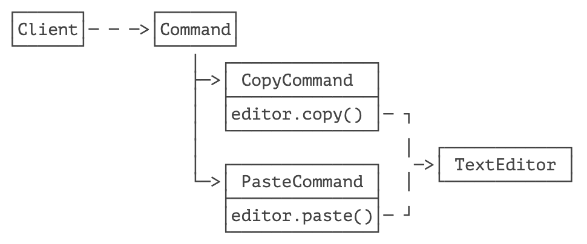
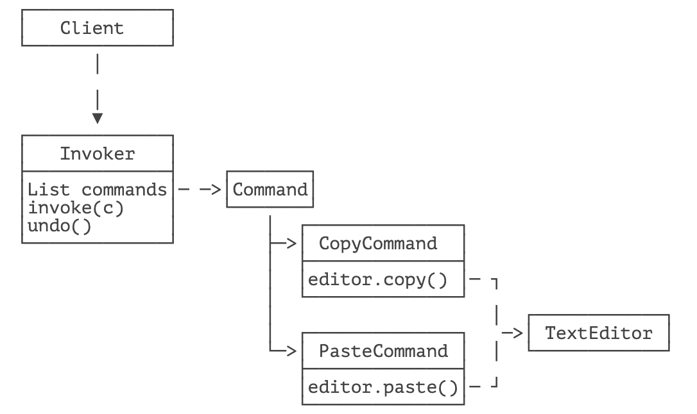

> 将一个请求封装为一个对象，从而使你可用不同的请求对客户进行参数化，对请求排队或记录请求日志，以及支持可撤销的操作。

命令模式（Command）是指，把请求封装成一个命令，然后执行该命令。

在使用命令模式前，我们先以一个编辑器为例子，看看如何实现简单的编辑操作：

```java
public class TextEditor {
    private StringBuilder buffer = new StringBuilder();

    public void copy() {
        ...
    }

    public void paste() {
        String text = getFromClipBoard();
        add(text);
    }

    public void add(String s) {
        buffer.append(s);
    }

    public void delete() {
        if (buffer.length() > 0) {
            buffer.deleteCharAt(buffer.length() - 1);
        }
    }

    public String getState() {
        return buffer.toString();
    }
}
```

我们用一个 `StringBuilder` 模拟一个文本编辑器，它支持 `copy()`、`paste()`、`add()`、`delete()` 等方法。

正常情况，我们像这样调用 `TextEditor`：

```java
TextEditor editor = new TextEditor();
editor.add("Command pattern in text editor.\n");
editor.copy();
editor.paste();
System.out.println(editor.getState());
```

这是直接调用方法，调用方需要了解 `TextEditor` 的所有接口信息。

如果改用命令模式，我们就要把调用方发送命令和执行方执行命令分开。怎么分？

解决方案是引入一个 `Command` 接口：

```java
public interface Command {
    void execute();
}
```

调用方创建一个对应的 `Command`，然后执行，并不关心内部是如何具体执行的。

为了支持 `CopyCommand` 和 `PasteCommand` 这两个命令，我们从 `Command` 接口派生：

```java
public class CopyCommand implements Command {
    // 持有执行者对象:
    private TextEditor receiver;

    public CopyCommand(TextEditor receiver) {
        this.receiver = receiver;
    }

    public void execute() {
        receiver.copy();
    }
}

public class PasteCommand implements Command {
    private TextEditor receiver;

    public PasteCommand(TextEditor receiver) {
        this.receiver = receiver;
    }

    public void execute() {
        receiver.paste();
    }
}
```

最后我们把 `Command` 和 `TextEditor` 组装一下，客户端这么写：

```java
TextEditor editor = new TextEditor();
editor.add("Command pattern in text editor.\n");
// 执行一个 CopyCommand:
Command copy = new CopyCommand(editor);
copy.execute();
editor.add("----\n");
// 执行一个 PasteCommand:
Command paste = new PasteCommand(editor);
paste.execute();
System.out.println(editor.getState());
```

这就是命令模式的结构：



有的童鞋会有疑问：搞了一大堆 `Command`，多了好几个类，还不如直接这么写简单：

```java
TextEditor editor = new TextEditor();
editor.add("Command pattern in text editor.\n");
editor.copy();
editor.paste();
```

实际上，使用命令模式，确实增加了系统的复杂度。如果需求很简单，那么直接调用显然更直观而且更简单。

那么我们还需要命令模式吗？

答案是视需求而定。如果 `TextEditor` 复杂到一定程度，并且需要支持 Undo、Redo 的功能时，就需要使用命令模式，因为我们可以给每个命令增加 `undo()`：

```java
public interface Command {
    void execute();
    void undo();
}
```

然后把执行的一系列命令用 `List` 保存起来，就既能支持 Undo，又能支持 Redo。这个时候，我们又需要一个 `Invoker` 对象，负责执行命令并保存历史命令：



可见，模式带来的设计复杂度的增加是随着需求而增加的，它减少的是系统各组件的耦合度。

## 🍀 练习

给命令模式新增 Add 和 Delete 命令并支持 Undo、Redo 操作。


## 🍀 小结

命令模式的设计思想是把命令的创建和执行分离，使得调用者无需关心具体的执行过程。

通过封装 `Command` 对象，命令模式可以保存已执行的命令，从而支持撤销、重做等操作。


