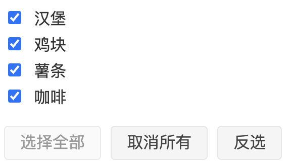
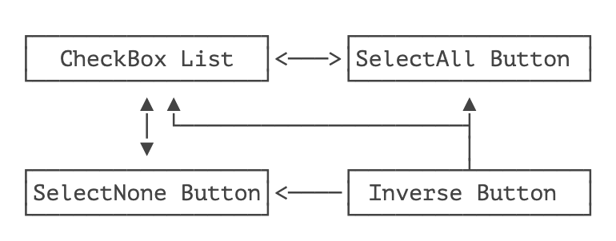
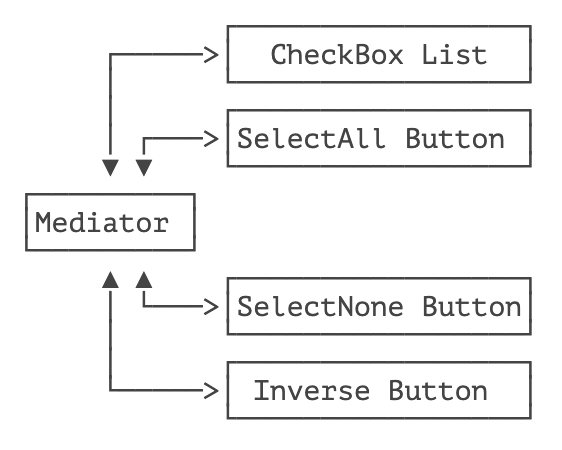
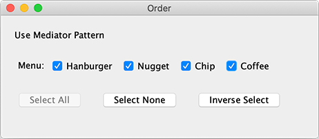

> 用一个中介对象来封装一系列的对象交互。中介者使各个对象不需要显式地相互引用，从而使其耦合松散，而且可以独立地改变它们之间的交互。

中介模式（Mediator）又称调停者模式，它的目的是把多方会谈变成双方会谈，从而实现多方的松耦合。

有些童鞋听到中介立刻想到房产中介，立刻气不打一处来。这个中介模式与房产中介还真有点像，所以消消气，先看例子。

考虑一个简单的点餐输入：



这个小系统有 4 个参与对象：

- 多选框；
- “选择全部” 按钮；
- “取消所有” 按钮；
- “反选” 按钮。

它的复杂性在于，当多选框变化时，它会影响 “选择全部” 和“取消所有”按钮的状态（是否可点击），当用户点击某个按钮时，例如 “反选”，除了会影响多选框的状态，它又可能影响“选择全部” 和“取消所有”按钮的状态。

所以这是一个多方会谈，逻辑写起来很复杂：



如果我们引入一个中介，把多方会谈变成多个双方会谈，虽然多了一个对象，但对象之间的关系就变简单了：



下面我们用中介模式来实现各个 UI 组件的交互。首先把 UI 组件给画出来：

```java
public class Main {
    public static void main(String[] args) {
        new OrderFrame("Hanburger", "Nugget", "Chip", "Coffee");
    }
}

class OrderFrame extends JFrame {
    public OrderFrame(String... names) {
        setTitle("Order");
        setSize(460, 200);
        setDefaultCloseOperation(JFrame.EXIT_ON_CLOSE);
        Container c = getContentPane();
        c.setLayout(new FlowLayout(FlowLayout.LEADING, 20, 20));
        c.add(new JLabel("Use Mediator Pattern"));
        List<JCheckBox> checkboxList = addCheckBox(names);
        JButton selectAll = addButton("Select All");
        JButton selectNone = addButton("Select None");
        selectNone.setEnabled(false);
        JButton selectInverse = addButton("Inverse Select");
        new Mediator(checkBoxList, selectAll, selectNone, selectInverse);
        setVisible(true);
    }

    private List<JCheckBox> addCheckBox(String... names) {
        JPanel panel = new JPanel();
        panel.add(new JLabel("Menu:"));
        List<JCheckBox> list = new ArrayList<>();
        for (String name : names) {
            JCheckBox checkbox = new JCheckBox(name);
            list.add(checkbox);
            panel.add(checkbox);
        }
        getContentPane().add(panel);
        return list;
    }

    private JButton addButton(String label) {
        JButton button = new JButton(label);
        getContentPane().add(button);
        return button;
    }
}
```

然后，我们设计一个 Mediator 类，它引用 4 个 UI 组件，并负责跟它们交互：

```java
public class Mediator {
    // 引用 UI 组件:
    private List<JCheckBox> checkBoxList;
    private JButton selectAll;
    private JButton selectNone;
    private JButton selectInverse;

    public Mediator(List<JCheckBox> checkBoxList, JButton selectAll, JButton selectNone, JButton selectInverse) {
        this.checkBoxList = checkBoxList;
        this.selectAll = selectAll;
        this.selectNone = selectNone;
        this.selectInverse = selectInverse;
        // 绑定事件:
        this.checkBoxList.forEach(checkBox -> {
            checkBox.addChangeListener(this::onCheckBoxChanged);
        });
        this.selectAll.addActionListener(this::onSelectAllClicked);
        this.selectNone.addActionListener(this::onSelectNoneClicked);
        this.selectInverse.addActionListener(this::onSelectInverseClicked);
    }

    // 当 checkbox 有变化时:
    public void onCheckBoxChanged(ChangeEvent event) {
        boolean allChecked = true;
        boolean allUnchecked = true;
        for (var checkBox : checkBoxList) {
            if (checkBox.isSelected()) {
                allUnchecked = false;
            } else {
                allChecked = false;
            }
        }
        selectAll.setEnabled(!allChecked);
        selectNone.setEnabled(!allUnchecked);
    }

    // 当点击 select all:
    public void onSelectAllClicked(ActionEvent event) {
        checkBoxList.forEach(checkBox -> checkBox.setSelected(true));
        selectAll.setEnabled(false);
        selectNone.setEnabled(true);
    }

    // 当点击 select none:
    public void onSelectNoneClicked(ActionEvent event) {
        checkBoxList.forEach(checkBox -> checkBox.setSelected(false));
        selectAll.setEnabled(true);
        selectNone.setEnabled(false);
    }

    // 当点击 select inverse:
    public void onSelectInverseClicked(ActionEvent event) {
        checkBoxList.forEach(checkBox -> checkBox.setSelected(!checkBox.isSelected()));
        onCheckBoxChanged(null);
    }
}
```

运行一下看看效果：



使用 Mediator 模式后，我们得到了以下好处：

- 各个 UI 组件互不引用，这样就减少了组件之间的耦合关系；
- Mediator 用于当一个组件发生状态变化时，根据当前所有组件的状态决定更新某些组件；
- 如果新增一个 UI 组件，我们只需要修改 Mediator 更新状态的逻辑，现有的其他 UI 组件代码不变。

Mediator 模式经常用在有众多交互组件的 UI 上。为了简化 UI 程序，MVC 模式以及 MVVM 模式都可以看作是 Mediator 模式的扩展。

## 🍀 练习

使用 Mediator 模式

## 🍀 小结

中介模式是通过引入一个中介对象，把多边关系变成多个双边关系，从而简化系统组件的交互耦合度。


