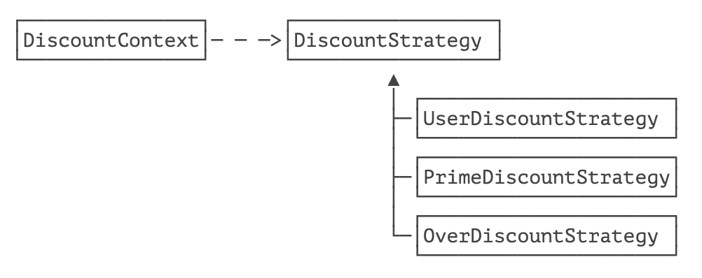

> 定义一系列的算法，把它们一个个封装起来，并且使它们可相互替换。本模式使得算法可独立于使用它的客户而变化。

策略模式：`Strategy`，是指，定义一组算法，并把其封装到一个对象中。然后在运行时，可以灵活的使用其中的一个算法。

策略模式在 Java 标准库中应用非常广泛，我们以排序为例，看看如何通过 `Arrays.sort()` 实现忽略大小写排序：

```java
import java.util.Arrays;

public class Main {
    public static void main(String[] args) throws InterruptedException {
        String[] array = { "apple", "Pear", "Banana", "orange"};
        Arrays.sort(array, String::compareToIgnoreCase);
        System.out.println(Arrays.toString(array));
    }
}
```


如果我们想忽略大小写排序，就传入 `String::compareToIgnoreCase`，如果我们想倒序排序，就传入 `(s1, s2) -> -s1.compareTo(s2)`，这个比较两个元素大小的算法就是策略。

我们观察 `Arrays.sort(T[] a, Comparator<? super T> c)` 这个排序方法，它在内部实现了 TimSort 排序，但是，排序算法在比较两个元素大小的时候，需要借助我们传入的 `Comparator` 对象，才能完成比较。因此，这里的策略是指比较两个元素大小的策略，可以是忽略大小写比较，可以是倒序比较，也可以根据字符串长度比较。

因此，上述排序使用到了策略模式，它实际上指，在一个方法中，流程是确定的，但是，某些关键步骤的算法依赖调用方传入的策略，这样，传入不同的策略，即可获得不同的结果，大大增强了系统的灵活性。

如果我们自己实现策略模式的排序，用冒泡法编写如下：

```java
import java.util.*;

public class Main {
    public static void main(String[] args) throws InterruptedException {
        String[] array = { "apple", "Pear", "Banana", "orange"};
        sort(array, String::compareToIgnoreCase);
        System.out.println(Arrays.toString(array));
    }

    static <T> void sort(T[] a, Comparator<? super T> c) {
        for (int i = 0; i < a.length - 1; i++) {
            for (int j = 0; j < a.length - 1 - i; j++) {
                if (c.compare(a[j], a[j + 1]) > 0) { // 注意这里比较两个元素的大小依赖传入的策略
                    T temp = a[j];
                    a[j] = a[j + 1];
                    a[j + 1] = temp;
                }
            }
        }
    }
}
```


一个完整的策略模式要定义策略以及使用策略的上下文。我们以购物车结算为例，假设网站针对普通会员、Prime 会员有不同的折扣，同时活动期间还有一个满 100 减 20 的活动，这些就可以作为策略实现。先定义打折策略接口：

```java
public interface DiscountStrategy {
    // 计算折扣额度:
    BigDecimal getDiscount(BigDecimal total);
}
```

接下来，就是实现各种策略。普通用户策略如下：

```java
public class UserDiscountStrategy implements DiscountStrategy {
    public BigDecimal getDiscount(BigDecimal total) {
        // 普通会员打九折:
        return total.multiply(new BigDecimal("0.1")).setScale(2, RoundingMode.DOWN);
    }
}
```

满减策略如下：

```java
public class OverDiscountStrategy implements DiscountStrategy {
    public BigDecimal getDiscount(BigDecimal total) {
        // 满 100 减 20 优惠:
        return total.compareTo(BigDecimal.valueOf(100)) >= 0 ? BigDecimal.valueOf(20) : BigDecimal.ZERO;
    }
}
```

最后，要应用策略，我们需要一个 `DiscountContext`：

```java
public class DiscountContext {
    // 持有某个策略:
    private DiscountStrategy strategy = new UserDiscountStrategy();

    // 允许客户端设置新策略:
    public void setStrategy(DiscountStrategy strategy) {
        this.strategy = strategy;
    }

    public BigDecimal calculatePrice(BigDecimal total) {
        return total.subtract(this.strategy.getDiscount(total)).setScale(2);
    }
}
```

调用方必须首先创建一个 DiscountContext，并指定一个策略（或者使用默认策略），即可获得折扣后的价格：

```java
DiscountContext ctx = new DiscountContext();

// 默认使用普通会员折扣:
BigDecimal pay1 = ctx.calculatePrice(BigDecimal.valueOf(105));
System.out.println(pay1);

// 使用满减折扣:
ctx.setStrategy(new OverDiscountStrategy());
BigDecimal pay2 = ctx.calculatePrice(BigDecimal.valueOf(105));
System.out.println(pay2);

// 使用 Prime 会员折扣:
ctx.setStrategy(new PrimeDiscountStrategy());
BigDecimal pay3 = ctx.calculatePrice(BigDecimal.valueOf(105));
System.out.println(pay3);
```

上述完整的策略模式如下图所示：



策略模式的核心思想是在一个计算方法中把容易变化的算法抽出来作为 “策略” 参数传进去，从而使得新增策略不必修改原有逻辑。

## 🍀 练习

使用策略模式新增一种策略，允许在满 100 减 20 的基础上对 Prime 会员再打七折。


## 🍀 小结

策略模式是为了允许调用方选择一个算法，从而通过不同策略实现不同的计算结果。

通过扩展策略，不必修改主逻辑，即可获得新策略的结果。


