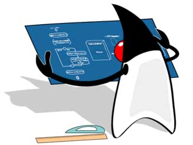

设计模式，即 Design Patterns，是指在软件设计中，被反复使用的一种代码设计经验。使用设计模式的目的是为了可重用代码，提高代码的可扩展性和可维护性。

设计模式这个术语是上个世纪 90 年代由 Erich Gamma、Richard Helm、Raplh Johnson 和 Jonhn Vlissides 四个人总结提炼出来的，并且写了一本 Design Patterns 的书。这四人也被称为四人帮（GoF）。

为什么要使用设计模式？根本原因还是软件开发要实现可维护、可扩展，就必须尽量复用代码，并且降低代码的耦合度。设计模式主要是基于 OOP 编程提炼的，它基于以下几个原则：

## 🍀 开闭原则

由 Bertrand Meyer 提出的开闭原则（Open Closed Principle）是指，软件应该对扩展开放，而对修改关闭。这里的意思是在增加新功能的时候，能不改代码就尽量不要改，如果只增加代码就完成了新功能，那是最好的。

## 🍀 里氏替换原则

里氏替换原则是 Barbara Liskov 提出的，这是一种面向对象的设计原则，即如果我们调用一个父类的方法可以成功，那么替换成子类调用也应该完全可以运行。

设计模式把一些常用的设计思想提炼出一个个模式，然后给每个模式命名，这样在使用的时候更方便交流。GoF 把 23 个常用模式分为创建型模式、结构型模式和行为型模式三类，我们后续会一一讲解。

学习设计模式，关键是学习设计思想，不能简单地生搬硬套，也不能为了使用设计模式而过度设计，要合理平衡设计的复杂度和灵活性，并意识到设计模式也并不是万能的。

## 🍀 创建型模式

创建型模式关注点是如何创建对象，其核心思想是要把对象的创建和使用相分离，这样使得两者能相对独立地变换。

创建型模式包括：

* [☘️ 工厂方法](#工厂方法) ：Factory Method
* [☘️ 抽象工厂](#抽象工厂) ：Abstract Factory
* [☘️ 生成器](#生成器) ：Builder
* [☘️ 原型](#原型) ：Prototype
* [☘️ 单例](#单例) ：Singleton

## 🍀 结构型模式

结构型模式主要涉及如何组合各种对象以便获得更好、更灵活的结构。虽然面向对象的继承机制提供了最基本的子类扩展父类的功能，但结构型模式不仅仅简单地使用继承，而更多地通过组合与运行期的动态组合来实现更灵活的功能。

结构型模式有：

- [☘️ 适配器](#适配器)
- [☘️ 桥接](#桥接)
- [☘️ 组合](#组合)
- [☘️ 装饰器](#装饰器)
- [☘️ 外观](#外观)
- [☘️ 享元](#享元)
- [☘️ 代理](#代理)

## 🍀 行为型模式

行为型模式主要涉及算法和对象间的职责分配。通过使用对象组合，行为型模式可以描述一组对象应该如何协作来完成一个整体任务。

行为型模式有：

- [责任链](#责任链)
- [命令](#命令)
- [解释器](#解释器)
- [迭代器](#迭代器)
- [中介](#中介)
- [备忘录](#备忘录)
- [观察者](#观察者)
- [状态](#状态)
- [策略](#策略)
- [模板方法](#模板方法)
- [访问者](#访问者)
