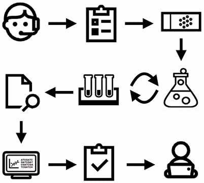
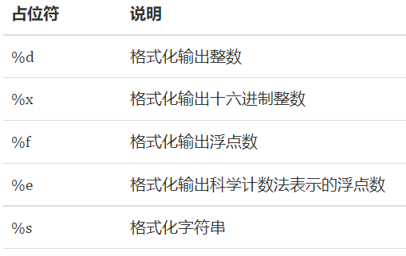
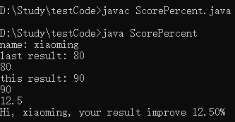
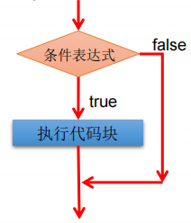
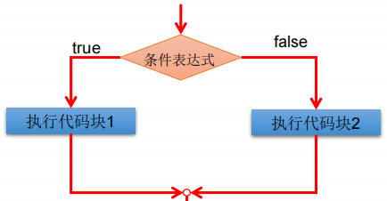
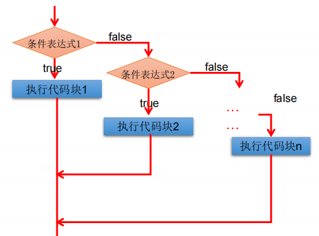
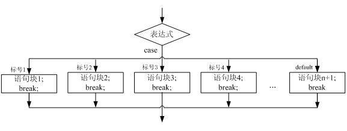
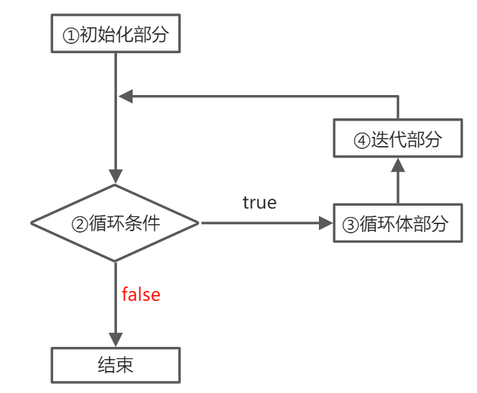

::: details 目录
[[toc]]
:::
 

在 Java 程序中，JVM 默认总是顺序执行以分号; 结束的语句。但是，在实际的代码中，程序经常需要做条件判断、循环，因此，需要有多种流程控制语句，来实现程序的跳转和循环等功能。





本节我们将介绍 if 条件判断、switch 多重选择和各种循环语句。

## 🍀 输入和输出

### 输出

在前面的代码中，我们总是使用 `System.out.println()` 来向屏幕输出一些内容。

`println` 是 print line 的缩写，表示输出并换行。因此，如果输出后不想换行，可以用 `print()` ：

```java
// 输出
public class Main {
    public static void main(String[] args) {
        System.out.print("A,");
        System.out.print("B,");
        System.out.print("C.");
        System.out.println();
        System.out.println("END");
    }
}
```

### 格式化输出

Java 还提供了格式化输出的功能。为什么要格式化输出？因为计算机表示的数据不一定适合人来阅读：

```java
public class Main {
    public static void main(String[] args) {
        double d = 12900000;
        System.out.println(d); // 1.29E7
    }
}
```

如果要把数据显示成我们期望的格式，就需要使用格式化输出的功能。格式化输出使用 `System.out.printf()` ，通过使用占位符 `%?`，`printf()` 可以把后面的参数格式化成指定格式：

```java
public class Main {
    public static void main(String[] args) {
        double d = 3.1415926;
        System.out.printf("%.2f\n", d); // 显示两位小数3.14
        System.out.printf("%.4f\n", d); // 显示4位小数3.1416
    }
}
```

Java 的格式化功能提供了多种占位符，可以把各种数据类型“格式化”成指定的字符串：



注意，由于 `%` 表示占位符，因此，连续两个 `%%` 表示一个 `%` 字符本身。

占位符本身还可以有更详细的格式化参数。下面的例子把一个整数格式化成十六进制，并用 0 补足 8 位：

```java
public class Main {
    public static void main(String[] args) {
        int n = 12345000;
        System.out.printf("n=%d, hex=%08x", n, n); // 注意，两个%占位符必须传入两个数
    }
}
```

详细的格式化参数请参考 JDK 文档 [java.util.Formatter](https://docs.oracle.com/en/java/javase/11/docs/api/java.base/java/util/Formatter.html#syntax)


### 输入

和输出相比，Java 的输入就要复杂得多。

我们先看一个从控制台读取一个字符串和一个整数的例子：

```java
import java.util.Scanner;

public class Main {
    public static void main(String[] args) {
        Scanner scanner = new Scanner(System.in); // 创建Scanner对象
        System.out.print("Input your name: "); // 打印提示
        String name = scanner.nextLine(); // 读取一行输入并获取字符串
        System.out.print("Input your age: "); // 打印提示
        int age = scanner.nextInt(); // 读取一行输入并获取整数
        System.out.printf("Hi, %s, you are %d\n", name, age); // 格式化输出
    }
}
```

首先，我们通过 `import` 语句导入 `java.util.Scanner` ， `import` 是导入某个类的语句，必须放到 Java 源代码的开头，后面我们在 Java 的 `package` 中会详细讲解如何使用 `import`。

然后，创建 `Scanner` 对象并传入 `System.in`。 `System.out` 代表标准输出流，而 `System.in` 代表标准输入流。直接使用 `System.in` 读取用户输入虽然是可以的，但需要更复杂的代码，而通过 `Scanner` 就可以简化后续的代码。

有了 `Scanner` 对象后，要读取用户输入的字符串，使用 `scanner.nextLine()` ，要读取用户输入的整数，使用 `scanner.nextInt()` 。 `Scanner` 会自动转换数据类型，因此不必手动转换。

要测试输入，我们不能在线运行它，因为输入必须从命令行读取，因此，需要走编译、执行的流程：

```bash
$ javac Main.java
```

这个程序编译时如果有警告，可以暂时忽略它，在后面学习 IO 的时候再详细解释。编译成功后，执行：

```bash
$ java Main
Input your name: Bob
Input your age: 12
Hi, Bob, you are 12
```

根据提示分别输入一个字符串和整数后，我们得到了格式化的输出。


### 练习

请帮小明同学设计一个程序，输入上次考试成绩（ int ）和本次考试成绩（ int ），然后输出成绩提高的百分比，保留两位小数位（例如， 21.75% ）。

```java
import java.util.Scanner;

public class ScorePercent {
    public static void main(String[] args) {
        Scanner scanner = new Scanner(System.in); // 创建Scanner对象
        System.out.print("name: "); 
        String name = scanner.nextLine(); // 获取输入的姓名
        System.out.print("last result: ");
        int prev = scanner.nextInt(); // 获取输入的上次考试成绩
        System.out.print("this result: ");
        int score = scanner.nextInt(); // 获取输入的本次考试成绩
        double percent = 100.0 * ( score - prev ) / prev; // 计算成绩提高的百分比
        System.out.printf("Hi, %s, your result improve %.2f%%\n", name, percent); // %.2f保留两位小数
    }
}
```




### 小结

- Java 提供的输出包括：`System.out.println()` / `print()` / `printf()`，其中 `printf()` 可以格式化输出；

- Java 提供 Scanner 对象来方便输入，读取对应的类型可以使用：`scanner.nextLine()` / `nextInt()` / `nextDouble()` / ...


## 🍀 if 判断

在 Java 程序中，如果要根据条件来决定是否执行某一段代码，就需要 `if` 语句。


### if 语句的基本语法

```java
    if ( 条件 ){
        执行表达式; // 条件满足时执行
    }
```

根据 `if` 的计算结果（`true` 还是 `false`），JVM 决定是否执行 `if` 语句块（即花括号`{}`包含的所有语句）。



让我们来看一个例子：

```java
public class Main {
    public static void main(String[] args) {
        int n = 70;
        if (n >= 60) {
            System.out.println("及格了");
        }
        System.out.println("END");
    }
}
```

当条件 `n >= 60` 计算结果为 `true` 时，`if` 语句块被执行，将打印 `"及格了"`，否则，`if` 语句块将被跳过。修改 `n` 的值可以看到执行效果。

注意到 `if` 语句包含的块可以包含多条语句：

```java
public class Main {
    public static void main(String[] args) {
        int n = 70;
        if (n >= 60) {
            System.out.println("及格了");
            System.out.println("恭喜你");
        }
        System.out.println("END");
    }
}
```


当 `if` 语句块只有一行语句时，可以省略花括号 `{}`：

```java
public class Main {
    public static void main(String[] args) {
        int n = 70;
        if (n >= 60)
            System.out.println("及格了");
        System.out.println("END");
    }
}
```


但是，省略花括号并不总是一个好主意。假设某个时候，突然想给 `if` 语句块增加一条语句时：

```java
public class Main {
    public static void main(String[] args) {
        int n = 50;
        if (n >= 60)
            System.out.println("及格了");
            System.out.println("恭喜你"); // 注意这条语句不是if语句块的一部分
        System.out.println("END");
    }
}
```


由于使用缩进格式，很容易把两行语句都看成 `if` 语句的执行块，但 ***实际上只有第一行语句是 `if` 的执行块*** 。在使用 git 这些版本控制系统自动合并时更容易出问题，所以 **不推荐忽略花括号的写法** 。


### else

`if` 语句还可以编写一个 `else { ... }`，当条件判断为 `false` 时，将执行 `else` 的语句块



例如：

```java
    public class Main {
    public static void main(String[] args) {
        int n = 70;
        if (n >= 60) {
            System.out.println("及格了");
        } else {
            System.out.println("挂科了");
        }
        System.out.println("END");
    }
}
```

> [!caution]
> else 不是必须的。


还可以用多个 `if ... else if ...` 串联。



例如：

```java
public class Main {
    public static void main(String[] args) {
        int n = 70;
        if (n >= 90) {
            System.out.println("优秀");
        } else if (n >= 60) {
            System.out.println("及格了");
        } else {
            System.out.println("挂科了");
        }
        System.out.println("END");
    }
}
```

串联的效果其实相当于：

```java
if (n >= 90) {
    // n >= 90为true:
    System.out.println("优秀");
} else {
    // n >= 90为false:
    if (n >= 60) {
        // n >= 60为true:
        System.out.println("及格了");
    } else {
        // n >= 60为false:
        System.out.println("挂科了");
    }
}
```

在串联使用多个 `if` 时，要特别注意判断顺序。观察下面的代码：

```java
public class Main {
    public static void main(String[] args) {
        int n = 100;
        if (n >= 60) {
            System.out.println("及格了");
        } else if (n >= 90) {
            System.out.println("优秀");
        } else {
            System.out.println("挂科了");
        }
    }
}
```


执行发现，`n = 100` 时，满足条件 `n >= 90`，但输出的不是 `"优秀"`，而是 `"及格了"`，原因是 if 语句从上到下执行时，先判断 `n >= 60` 成功后，后续 `else` 不再执行，因此，`if (n >= 90)`没有机会执行了。

正确的方式是 ***按照判断范围从大到小依次判断*** ：

```java
// 从大到小依次判断：
if (n >= 90) {
    // ...
} else if (n >= 60) {
    // ...
} else {
    // ...
}
```

***或者改写成从小到大依次判断***：

```java
// 从小到大依次判断：
if (n < 60) {
    // ...
} else if (n < 90) {
    // ...
} else {
    // ...
}
```

使用 `if` 时，还要特别注意边界条件。例如：

```java
public class Main {
    public static void main(String[] args) {
        int n = 90;
        if (n > 90) {
            System.out.println("优秀");
        } else if (n >= 60) {
            System.out.println("及格了");
        } else {
            System.out.println("挂科了");
        }
    }
}
```

假设我们期望 90 分或更高为 “优秀”，上述代码输出的却是 “及格”，原因是 `>` 和 `>=` 效果是不同的。

前面讲过了浮点数在计算机中常常无法精确表示，并且计算可能出现误差，因此，判断浮点数相等用 `==` 判断不靠谱：

```java
public class Main {
    public static void main(String[] args) {
        double x = 1 - 9.0 / 10;
        if (x == 0.1) {
            System.out.println("x is 0.1");
        } else {
            System.out.println("x is NOT 0.1");
        }
    }
}
```

正确的方法是 ***利用差值小于某个临界值来判断*** ：

```java
public class Main {
    public static void main(String[] args) {
        double x = 1 - 9.0 / 10;
        if (Math.abs(x - 0.1) < 0.00001) {
            System.out.println("x is 0.1");
        } else {
            System.out.println("x is NOT 0.1");
        }
    }
}
```

### 判断引用类型相等

在 Java 中，判断值类型的变量是否相等，可以使用 `==` 运算符。但是，判断引用类型的变量是否相等，`==` 表示 *“引用是否相等”* ，或者说，*是否指向同一个对象* 。例如，下面的两个 String 类型，它们的内容是相同的，但是，分别指向不同的对象，用 `==` 判断，结果为 `false`：

```java
public class Main {
    public static void main(String[] args) {
        String s1 = "hello";
        String s2 = "HELLO".toLowerCase();//将字符串转换为小写。
        System.out.println(s1);
        System.out.println(s2);
        if (s1 == s2) {
            System.out.println("s1 == s2");
        } else {
            System.out.println("s1 != s2");
        }
    }
}
```

要判断引用类型的变量内容是否相等，必须使用 `equals()` 方法：

```java
public class Main {
    public static void main(String[] args) {
        String s1 = "hello";
        String s2 = "HELLO".toLowerCase();
        System.out.println(s1);
        System.out.println(s2);
        if (s1.equals(s2)) {
            System.out.println("s1 equals s2");
        } else {
            System.out.println("s1 not equals s2");
        }
    }
}
```

> [!caution]
> 执行语句 `s1.equals(s2)` 时，如果变量 `s1` 为 `null`，会报 `NullPointerException`：

```java
public class Main {
    public static void main(String[] args) {
        String s1 = null;
        if (s1.equals("hello")) {
            System.out.println("hello");
        }
    }
}
```

要避免 `NullPointerException` 错误，可以利用短路与运算符 `&&`：

```java
public class Main {
    public static void main(String[] args) {
        String s1 = null;
        if (s1 != null && s1.equals("hello")) {
            System.out.println("hello");
        }
    }
}
```

还可以把一定不是 `null` 的对象 `"hello"` 放到前面：例如：`if ("hello".equals(s)) { ... }`。


### 练习

请用 `if ... else` 编写一个程序，用于计算体质指数 BMI，并打印结果。

$BMI = 体重(kg) ÷ 身高(m)的平方$

BMI 结果：
- 过轻：低于18.5
- 正常：18.5-25
- 过重：25-28
- 肥胖：28-32
- 非常肥胖：高于32

```java
import java.util.Scanner;

public class BMITest {
    public static void main(String[] args) {
        Scanner scan = new Scanner(System.in);

        System.out.print("请输入您的体重（kg）：");

        double weight = scan.nextDouble();

        System.out.print("请输入您的身高（m）：");

        double height = scan.nextDouble();

        double bmi = weight / (height * height);

        System.out.printf("BMI: %.2f", bmi);

        if (bmi <= 0){
            return;
        }else if (bmi < 18.5) {
            System.out.println(",过轻");
        }else if (bmi <= 25) {
            System.out.println(",正常");
        }else if (bmi <= 28) {
            System.out.println(",过重");
        }else if (bmi <= 32) {
            System.out.println(",肥胖");
        }else{
            System.out.println(",非常肥胖");
        }
    }
}
```


### 小结：

- `if-else` 可以做条件判断，`else` 是可选的
- 语句块只有一条执行语句时，`{}` 可以省略， ***但建议保留***
- 多个 `if ... else` 串联要特别注意判断顺序；
- 要注意 `if` 的边界条件；
- 要注意浮点数判断相等不能直接用 `==` 运算符；
- 引用类型判断内容相等要使用 `equals()`，注意避免 `NullPointerException`。


## 🍀 switch 多重选择

除了 if 语句外，还有一种条件判断，是根据某个表达式的结果，分别去执行不同的分支。

例如，在游戏中，让用户选择选项：

1. 单人模式
2. 多人模式
3. 退出游戏

### switch-case

`switch` 语句根据 `switch(表达式)` 计算的结果，跳转到匹配的 `case` 结果，然后继续执行后续语句，直到遇到 `break` 结束执行。

```java
  switch(表达式){
    case 常量1:
      语句1;
      // break;
    case 常量2:
      语句2;
      // break; 
    ... ...
    case 常量N:
      语句N;
      // break;
    default:
      语句;
      // break;
  }
```




我们看一个例子：

```java
public class Main {
    public static void main(String[] args) {
        int option = 1;
        switch (option) {
        case 1:
            System.out.println("Selected 1");
            break;
        case 2:
            System.out.println("Selected 2");
            break;
        case 3:
            System.out.println("Selected 3");
            break;
        }
    }
}
```

修改 `option` 的值分别为 1、2、3 ，观察执行结果。

如果 `option` 的值没有匹配到任何 `case` ，例如 `option = 99` ，那么， `switch` 语句不会执行任何语句。这时，可以给 `switch` 语句加一个 `default` ，当没有匹配到任何 `case` 时，执行 `default` ：


```java
public class Main {
    public static void main(String[] args) {
        int option = 99;
        switch (option) {
        case 1:
            System.out.println("Selected 1");
            break;
        case 2:
            System.out.println("Selected 2");
            break;
        case 3:
            System.out.println("Selected 3");
            break;
        default:
            System.out.println("Not selected");
            break;
        }
    }
}
```

如果把 `switch` 语句翻译成 `if` 语句，那么上述的代码相当于：


```java
    if (option == 1) {
        System.out.println("Selected 1");
    } else if (option == 2) {
        System.out.println("Selected 2");
    } else if (option == 3) {
        System.out.println("Selected 3");
    } else {
        System.out.println("Not selected");
    }
```

对于多个 `==` 判断的情况，使用 `switch` 结构更加清晰。

同时注意，上述“翻译”只有在 `switch` 语句中对每个 `case` 正确编写了 `break` 语句才能对应得上。

使用 `switch` 时，注意 `case` 语句并没有花括号 `{}` ，而且， `case` 语句具有“**穿透性**”，漏写 `break` 将导致意想不到的结果：

```java
public class Main {
    public static void main(String[] args) {
        int option = 2;
        switch (option) {
        case 1:
            System.out.println("Selected 1");
        case 2:
            System.out.println("Selected 2");
        case 3:
            System.out.println("Selected 3");
        default:
            System.out.println("Not selected");
        }
    }
}
```

当 `option = 2` 时，将依次输出 `"Selected 2"` 、 `"Selected 3"` 、 `"Not selected"` ，原因是从匹配到 `case 2` 开始，后续语句将全部执行，直到遇到 `break` 语句。因此，任何时候都不要忘记写 `break` 。

如果有几个 `case` 语句执行的是同一组语句块，可以这么写：

```java
public class Main {
    public static void main(String[] args) {
        int option = 2;
        switch (option) {
        case 1:
            System.out.println("Selected 1");
            break;
        case 2:
        case 3:
            System.out.println("Selected 2, 3");
            break;
        default:
            System.out.println("Not selected");
            break;
        }
    }
}
```

使用 `switch` 语句时，只要保证有 `break` ， `case` 的顺序不影响程序逻辑：


```java
    switch (option) {
    case 3:
        ...
        break;
    case 2:
        ...
        break;
    case 1:
        ...
        break;
    }
```

但是仍然建议按照自然顺序排列，便于阅读。

`switch` 语句还可以匹配字符串。字符串匹配时，是比较“内容相等”。例如：


```java
public class Main {
    public static void main(String[] args) {
        String fruit = "apple";
        switch (fruit) {
        case "apple":
            System.out.println("Selected apple");
            break;
        case "pear":
            System.out.println("Selected pear");
            break;
        case "mango":
            System.out.println("Selected mango");
            break;
        default:
            System.out.println("No fruit selected");
            break;
        }
    }
}
```

`switch` 语句还可以使用枚举类型，枚举类型我们在后面学习。

### 编译检查

使用 IDE 时，可以自动检查是否漏写了 `break` 语句和 `default` 语句，方法是打开 IDE 的编译检查。

在 Eclipse 中，选择 `Preferences - Java - Compiler - Errors/Warnings - Potential programming problems` ，将以下检查标记为 Warning：

- 'switch' is missing 'default' case
- 'switch' case fall-through

在 Idea 中，选择 `Preferences - Editor - Inspections - Java - Control flow issues` ，将以下检查标记为 Warning：

- Fallthrough in 'switch' statement
- 'switch' statement without 'default' branch

当 switch 语句存在问题时，即可在 IDE 中获得警告提示。

> [!warning]
> **不要忘记 break！**  
> **不要忘记 default！**


### switch 表达式 *

使用 `switch` 时，如果遗漏了 `break` ，就会造成严重的逻辑错误，而且不易在源代码中发现错误。从 Java 12 开始， `switch` 语句升级为更简洁的表达式语法，使用类似模式匹配（ Pattern Matching ）的方法，保证只有一种路径会被执行，并且不需要 `break` 语句：


```java
public class Main {
    public static void main(String[] args) {
        String fruit = "apple";
        switch (fruit) {
        case "apple" -> System.out.println("Selected apple");
        case "pear" -> System.out.println("Selected pear");
        case "mango" -> {
            System.out.println("Selected mango");
            System.out.println("Good choice!");
        }
        default -> System.out.println("No fruit selected");
        }
    }
}
```

注意新语法使用 `->` ，如果有多条语句，需要用 `{}` 括起来。不要写 `break` 语句，因为新语法只会执行匹配的语句，没有穿透效应。

很多时候，我们还可能用 `switch` 语句给某个变量赋值。例如：

```java
    int opt;
    switch (fruit) {
    case "apple":
        opt = 1;
        break;
    case "pear":
    case "mango":
        opt = 2;
        break;
    default:
        opt = 0;
        break;
    }
```

使用新的 `switch` 语法，不但不需要 `break` ，还可以直接返回值。把上面的代码改写如下：

```java
public class Main {
    public static void main(String[] args) {
        String fruit = "apple";
        int opt = switch (fruit) {
            case "apple" -> 1;
            case "pear", "mango" -> 2;
            default -> 0;
        }; // 注意赋值语句要以;结束
        System.out.println("opt = " + opt);
    }
}
```

这样可以获得更简洁的代码。


### yield *

大多数时候，在 `switch` 表达式内部，我们会返回简单的值。

但是，如果需要复杂的语句，我们也可以写很多语句，放到 `{...}` 里，然后，用 `yield` 返回一个值作为 `switch` 语句的返回值：


```java
public class Main {
    public static void main(String[] args) {
        String fruit = "orange";
        int opt = switch (fruit) {
            case "apple" -> 1;
            case "pear", "mango" -> 2;
            default -> {
                int code = fruit.hashCode();
                yield code; // switch语句返回值
            }
        };
        System.out.println("opt = " + opt);
    }
}
```

### 练习

使用 `switch` 实现一个简单的石头、剪子、布游戏。

```java
import java.util.Scanner;

public class MoraTest {

    public static void main(String[] args) {
        Scanner scan = new Scanner(System.in);

        System.out.println("please choice:");
        System.out.println(" 1: Rock");
        System.out.println(" 2: Scissors");
        System.out.println(" 3: Paper");

        // 用户输入:
        int choice = scan.nextInt();

        // 计算机随机数 1, 2, 3:
        int random = 1 + (int) (Math.random() * 3);
        System.out.println("Bot:" + random);

        switch (choice) {
            // TODO:
            case 1 :
                System.out.println(random == 1 ? "draw" : (random == 2 ? "win" : "lose"));
                break;
            case 2 :
                System.out.println(random == 2 ? "draw" : (random == 3 ? "win" : "lose"));
                break;
            case 3 :
                System.out.println(random == 3 ? "draw" : (random == 1 ? "win" : "lose"));
                break;
            default:
                System.out.println("Please input correct option!");
                break;
        }
    }
}
```


### 小结：

1. 根据 `switch` 表达式中的值，依次匹配各个 `case` 中的常量。  
   一旦匹配成功，则进入相应 `case` 结构中，调用其执行语句。  
   当调用完执行语句以后，则仍然继续向下执行其他 `case` 结构中的执行语句，  
   直到遇到 `break` 关键字或此 `switch-case` 结构末尾结束为止。  
2.  `break` ，可以使用在 `switch-case` 结构中，表示一旦执行到此关键字，就跳出 `switch-case` 结构。
3.  `switch` 结构中的表达式只能是如下的 6 种数据类型之一：*byte*、*short*、*char*、*int*、*枚举类型* (JDK5.0)、*String* (JDK7.0)。
4.  `case` 之后只能声明常量，不能声明范围。
5.  `break` 关键字是可选的。
6.  `default` ：相当于 `if-else` 结构中的 `else` 。 `default` 结构是可选的。

> [!important]
> - 如果 `switch-case` 结构中的多个 `case` 的执行语句相同，则可以考虑进行合并。
> - `break` 在 `switch-case` 中是可选的


> [!important]
> 从 Java 14 开始， `switch` 语句正式升级为表达式，不再需要 `break` ，并且允许使用 `yield` 返回值。


## 🍀 分支结构总结

### switch 和 if 语句的对比

> [!caution]
> 1. 凡是可以使用 `switch-case` 的结构，都可以转换为 `if-else` 。反之，不成立(if 的使用范围更广)。
> 2. 当我们写分支结构时，两种结构都可以使用时(case 不要过多：判断的具体数值不多)，优先使用 `switch-case`。

原因：`switch-case` 执行效率稍高。

### 补充：Scanner 类的使用

> [!tip]
> 具体实现步骤：
> 1. 导包：`import java.util.Scanner`;
> 2. Scanner 的实例化: `Scanner scan = new Scanner(System.in)`;
> 3. 调用 Scanner 类的相关方法( `next()` / `nextXxx()` )，来获取指定类型的变量


> [!warning]
> 注意：  
> 需要根据相应的方法，来输入指定类型的值。  
> 如果输入的数据类型与要求的类型不匹配时，会报异常：`InputMisMatchException`，导致程序终止。


## 🍀 while 循环

> [!important]
> 循环语句就是让计算机根据条件做循环计算，在条件满足时继续循环，条件不满足时退出循环。

例如，计算从 1 到 100 的和：

$1 + 2 + 3 + 4 + … + 100 = ?$

除了用数列公式外，完全可以让计算机做 100 次循环累加。因为计算机的特点是计算速度非常快，我们让计算机循环一亿次也用不到 1 秒，所以很多计算的任务，人去算是算不了的，但是计算机算，使用循环这种简单粗暴的方法就可以快速得到结果。




我们先看 Java 提供的 while 条件循环。它的 ***基本用法*** 是：

```java
    while (条件表达式) {
        循环语句
    }
    // 继续执行后续代码
```

`while` 循环在每次循环开始前，首先判断条件是否成立。如果计算结果为 `true` ，就把循环体内的语句执行一遍，如果计算结果为 `false` ，那就直接跳到 `while` 循环的末尾，继续往下执行。

我们用 `while` 循环来累加 1 到 100 ，可以这么写：

```java
public class Main {
    public static void main(String[] args) {
        int sum = 0; // 累加的和，初始化为0
        int n = 1;
        while (n <= 100) { // 循环条件是n <= 100
            sum = sum + n; // 把n累加到sum中
            n ++; // n自身加1
        }
        System.out.println(sum); // 5050
    }
}
```

注意到 `while` 循环是先判断循环条件，再循环，因此，有可能一次循环都不做。

对于循环条件判断，以及自增变量的处理，要特别注意边界条件。思考一下下面的代码为何没有获得正确结果：

```java
public class Main {
    public static void main(String[] args) {
        int sum = 0;
        int n = 0;
        while (n <= 100) {
            n ++; 
            sum = sum + n; 
        }
        System.out.println(sum);
    }
}
```

如果循环条件永远满足，那这个循环就变成了死循环。死循环将导致 100% 的 CPU 占用，用户会感觉电脑运行缓慢，所以 ***要避免编写死循环代码*** 。

如果循环条件的逻辑写得有问题，也会造成意料之外的结果：

```java
public class Main {
    public static void main(String[] args) {
        int sum = 0;
        int n = 1;
        while (n > 0) {
            sum = sum + n;
            n ++;
        }
        System.out.println(n); // -2147483648
        System.out.println(sum);
    }
}
```

表面上看，上面的 while 循环是一个死循环，但是，Java 的 `int` 类型有最大值，达到最大值后，再加 1 会变成负数，结果，意外退出了 `while` 循环。

### 练习

使用 while 计算从 m 到 n 的和：

```java
import java.util.Scanner;

public class SumMNTest {
    public static void main(String[] args) {
        Scanner scan = new Scanner(System.in);

        System.out.print("Start: ");
        int m = scan.nextInt();

        System.out.print("End: ");
        int n = scan.nextInt();

        // 使用while计算M+...+N:
        int sum = 0;
        while (m <= n) {
            sum += m;
            m ++;
        }
        System.out.printf("Sum: %d", sum);
    }
}
```


### 小结

- while 循环先判断循环条件是否满足，再执行循环语句；
- while 循环可能一次都不执行；
- 编写循环时要注意循环条件，并避免死循环。


## 🍀 do-while 循环


在 Java 中， `while` 循环是先判断循环条件，再执行循环。而另一种 `do while` 循环则是 ***先执行循环*** ，再判断条件，条件满足时继续循环，条件不满足时退出。它的用法是：

```java
    do {
        执行循环语句
    } while (条件表达式);
```

可见， ***do while 循环会至少循环一次*** 。

我们把对 1 到 100 的求和用 `do while` 循环改写一下：

```java
public class Main {
    public static void main(String[] args) {
        int sum = 0;
        int n = 1;
        do {
            sum = sum + n;
            n ++;
        } while (n <= 100);
        System.out.println(sum);
    }
}
```

使用 `do while` 循环时，同样要注意循环条件的判断。

### 练习

使用 `do while` 循环计算从 m 到 n 的和。

```java
import java.util.Scanner;

public class SumMNTest {
    public static void main(String[] args) {
        Scanner scan = new Scanner(System.in);

        System.out.print("Start: ");
        int m = scan.nextInt();

        System.out.print("End: ");
        int n = scan.nextInt();

        int sum = 0;
        // 使用do while计算M+...+N:
        do {
            sum += m;
            m ++;
        }while(m <= n);

        System.out.printf("Sum: %d", sum);
    }
}
```

### 小结

- `do while` 循环先执行循环，再判断条件；
- `do while` 循环会至少执行一次。


## 🍀 for 循环


除了 `while` 和 `do while` 循环，Java 使用最广泛的是 `for` 循环。

`for` 循环的功能非常强大，它使用 *计数器* 实现循环。 `for` 循环会先初始化计数器，然后，在每次循环前检测循环条件，在每次循环后更新计数器。计数器变量通常命名为 `i` 。

我们把 1 到 100 求和用 `for` 循环改写一下：

```java
public class Main {
    public static void main(String[] args) {
        int sum = 0;
        for (int i=1; i<=100; i++) {
            sum = sum + i;
        }
        System.out.println(sum);
    }
}
```

在 `for` 循环执行前，会先执行初始化语句 `int i = 1` ，它定义了计数器变量 `i` 并赋初始值为 `1` ，然后，循环前先检查循环条件 `i <= 100` ，循环后自动执行 `i++` ，因此，和 `while` 循环相比， `for` 循环把更新计数器的代码统一放到了一起。在 `for` 循环的循环体内部，不需要去更新变量 `i` 。

因此， `for` 循环的 ***用法*** 是：

```java
    for (初始条件; 循环检测条件; 循环后更新计数器) {
        // 执行语句
    }
```

如果我们要对一个整型数组的所有元素求和，可以用 `for` 循环实现：

```java
public class Main {
    public static void main(String[] args) {
        int[] ns = { 1, 4, 9, 16, 25 };
        int sum = 0;
        for (int i=0; i<ns.length; i++) {
            System.out.println("i = " + i + ", ns[i] = " + ns[i]);
            sum = sum + ns[i];
        }
        System.out.println("sum = " + sum);
    }
}
```

上面代码的循环条件是 `i < ns.length` 。因为 `ns` 数组的长度是 `5` ，因此，当循环 `5` 次后， `i` 的值被更新为 `5` ，就不满足循环条件，因此 `for` 循环结束。

> [!important]
> 思考：如果把循环条件改为 `i<=ns.length` ，会出现什么问题？

注意 `for` 循环的初始化计数器总是会被执行，并且 `for` 循环也可能循环 0 次。

> [!warning]
> 使用 `for` 循环时， ***千万不要在循环体内修改计数器！*** 在循环体中修改计数器常常导致莫名其妙的逻辑错误。

对于下面的代码：

```java
public class Main {
    public static void main(String[] args) {
        int[] ns = { 1, 4, 9, 16, 25 };
        for (int i=0; i<ns.length; i++) {
            System.out.println(ns[i]);
            i = i + 1;
        }
    }
}
```

虽然不会报错，但是，数组元素只打印了一半，原因是循环内部的 `i = i + 1` 导致了计数器变量每次循环实际上加了 `2` （因为 `for` 循环还会自动执行 `i++` ）。因此，在 `for` 循环中，不要修改计数器的值。计数器的初始化、判断条件、每次循环后的更新条件统一放到 `for()` 语句中可以一目了然。

如果希望只访问索引为奇数的数组元素，应该把 `for` 循环改写为：

```java
    int[] ns = { 1, 4, 9, 16, 25 };
    for (int i=0; i<ns.length; i=i+2) {
        System.out.println(ns[i]);
    }
```

通过更新计数器的语句 `i=i+2` 就达到了这个效果，从而避免了在循环体内去修改变量 `i` 。

使用 `for` 循环时，计数器变量 `i` 要尽量定义在 `for` 循环中：

```java
    int[] ns = { 1, 4, 9, 16, 25 };
    for (int i = 0; i < ns.length; i++) {
        System.out.println(ns[i]);
    }
    // 无法访问i
    int n = i; // compile error!
```

如果变量 `i` 定义在 `for` 循环外：

```java
    int[] ns = { 1, 4, 9, 16, 25 };
    int i;
    for (i = 0; i < ns.length; i++) {
        System.out.println(ns[i]);
    }
    // 仍然可以使用i
    int n = i;
```

那么，退出 `for` 循环后，变量 `i` 仍然可以被访问，这就破坏了 ***变量应该把访问范围缩到最小*** 的原则。

### 灵活使用 for 循环

`for` 循环还可以缺少初始化语句、循环条件和每次循环更新语句，例如：

```java
    // 不设置结束条件:
    for (int i=0; ; i++) {
        ...
    }
    // 不设置结束条件和更新语句:
    for (int i=0; ;) {
        ...
    }
    // 什么都不设置:
    for (;;) {
        ...
    }
```

通常不推荐这样写，但是，某些情况下，是可以省略 `for` 循环的某些语句的。

### for each 循环

`for` 循环经常用来遍历数组，因为通过计数器可以根据索引来访问数组的每个元素：

```java
    int[] ns = { 1, 4, 9, 16, 25 };
    for (int i = 0; i < ns.length; i++) {
        System.out.println(ns[i]);
    }
```

但是，很多时候，我们实际上真正想要访问的是数组每个元素的值。Java 还提供了另一种 `for each` 循环，它可以更简单地遍历数组：

```java
public class Main {
    public static void main(String[] args) {
        int[] ns = { 1, 4, 9, 16, 25 };
        for (int n : ns) {
            System.out.println(n);
        }
    }
}
```

和 `for` 循环相比，`for each` 循环的变量 `n` 不再是计数器，而是直接对应到数组的每个元素。 `for each` 循环的写法也更简洁。但是， ***`for each` 循环无法指定遍历顺序，也无法获取数组的索引*** 。

除了数组外， `for each` 循环能够遍历所有“可迭代”的数据类型，包括后面会介绍的 `List` 、 `Map` 等。

### 练习 1

给定一个数组，请用 for 循环倒序输出每一个元素：

### 练习 2

利用 for each 循环对数组每个元素求和：

### 练习 3

圆周率 π 可以使用公式计算：

$\frac{\mathrm\pi}4=1-\frac13+\frac15-\frac17+\frac19-\dots$ 

请利用 `for` 循环计算 π ：


```java
public class ForTest {
    public static void main(String[] args) {
        int[] ns = { 1, 4, 9, 16, 25 };

        //练习1 倒序输出
        for (int i=4; i>=0; i--) {
            System.out.printf("ns[%d]: %d\t", i , ns[i]);
        }

        System.out.println();

        //练习2 for each 数组求和
        int sum = 0;
        for (int n : ns){
            sum += n;
        }
        System.out.printf("Sum: %d", sum);

        System.out.println();

        //练习3 圆周率

        double pi = 0;
        int times = 0;
        for (int i=1; i<1000000; i+=2) {
            // TODO
            times ++;
            if(times%2 == 1){
                pi += 1.0 / i;
            }else{
                pi -= 1.0 / i;
            }
            System.out.println("times:" + times + ", pi:" + pi);
        }
        pi = 4 * pi;
        System.out.println(pi);
    }
}
```


### 小结

- `for` 循环通过计数器可以实现复杂循环；
- `for each` 循环可以直接遍历数组的每个元素；
- 最佳实践：计数器变量定义在 `for` 循环内部，循环体内部不修改计数器；


## 🍀 循环补充

### *无限循环

1. 不在循环条件部分限制次数的结构：`for(;;)` 或 `while(true)`
2. 结束循环有几种方式？
   - 方式一：循环条件部分返回 false
   - 方式二：**在循环体中，执行 break**


### 嵌套循环

1. 嵌套循环：将一个循环结构 A 声明在另一个循环结构 B 的循环体中，就构成了嵌套循环
    - 外层循环：循环结构 B
    - 内层循环：循环结构 A
2. 内层循环结构遍历一遍，只相当于外层循环循环体执行了一次
3. 假设外层循环需要执行 m 次，内层循环需要执行 n 次。此时内层循环的循环体一共执行了 m * n 次

> [!important]
> 外层循环控制行数，内层循环控制列数


## 🍀 break 和 continue

无论是 `while` 循环还是 `for` 循环，有两个特别的语句可以使用，就是 `break` 语句和 `continue` 语句。

### break

在循环过程中，可以使用 `break` 语句 ***跳出当前循环*** 。我们来看一个例子：

```java
public class Main {
    public static void main(String[] args) {
        int sum = 0;
        for (int i=1; ; i++) {
            sum = sum + i;
            if (i == 100) {
                break;
            }
        }
        System.out.println(sum);
    }
}
```

使用 `for` 循环计算从 1 到 100 时，我们并没有在 `for()` 中设置循环退出的检测条件。但是，在循环内部，我们用 `if` 判断，如果 `i==100` ，就通过 `break` 退出循环。

因此， `break` 语句通常都是配合 `if` 语句使用。要特别注意， ***`break` 语句总是跳出自己所在的那一层循环*** 。例如：

```java
public class Main {
    public static void main(String[] args) {
        for (int i=1; i<=10; i++) {
            System.out.println("i = " + i);
            for (int j=1; j<=10; j++) {
                System.out.println("j = " + j);
                if (j >= i) {
                    break;
                }
            }
            // break跳到这里
            System.out.println("breaked");
        }
    }
}
```

上面的代码是两个 `for` 循环嵌套。因为 `break` 语句位于内层的 `for` 循环，因此，它会跳出内层 `for` 循环，但不会跳出外层 `for` 循环。

### continue

`break` 会跳出当前循环，也就是整个循环都不会执行了。而 `continue` 则是提前结束本次循环，直接继续执行下次循环。我们看一个例子：

```java
public class Main {
    public static void main(String[] args) {
        int sum = 0;
        for (int i=1; i<=10; i++) {
            System.out.println("begin i = " + i);
            if (i % 2 == 0) {
                continue; // continue语句会结束本次循环
            }
            sum = sum + i;
            System.out.println("end i = " + i);
        }
        System.out.println(sum); // 25
    }
}
```

注意观察 `continue` 语句的效果。当 `i` 为奇数时，完整地执行了整个循环，因此，会打印 `begin i=1` 和 `end i=1` 。在 `i` 为偶数时， `continue` 语句会提前结束本次循环，因此，会打印 `begin i=2` 但不会打印 `end i = 2` 。

在多层嵌套的循环中， `continue` 语句同样是结束本次自己所在的循环。

### break 和 continue 关键字的使用


<table style="text-align:center">
    <tr>
        <th>关键字</th> 
        <th>使用范围</th> 
        <th>循环中使用的作用(不同点)</th> 
        <th>相同点</th> 
    </tr>
    <tr>
        <th rowspan="2">break</th>    
        <td>switch-case</td>
        <td rowspan="2">结束当前循环</td>  
        <td rowspan="3">关键字后面不能声明执行语句</td>      
    </tr>
    <tr>
        <td>循环结构中</td> 
    </tr>
    <tr>
        <th>continue</th>    
        <td >循环结构中</td> 
        <td>结束当次循环</td>  
    </tr>
</table>


可以通过标签指明要跳过的是哪一层循环

> [!tip]
> - `return`：并非专门用于结束循环的，它的功能是结束一个方法。  
> 当一个方法执行到一个 `return` 语句时，这个方法将被结束。
> - 与 `break` 和 `continue` 不同的是， `return` **直接结束整个方法**，不管这个 `return` 处于多少层循环之内


### 小结

- `break` 语句可以跳出当前循环；
- `break` 语句通常配合 `if` ，在满足条件时提前结束整个循环；
- `break` 语句总是跳出最近的一层循环；
- `continue` 语句可以提前结束本次循环；
- `continue` 语句通常配合 `if` ，在满足条件时提前结束本次循环。


