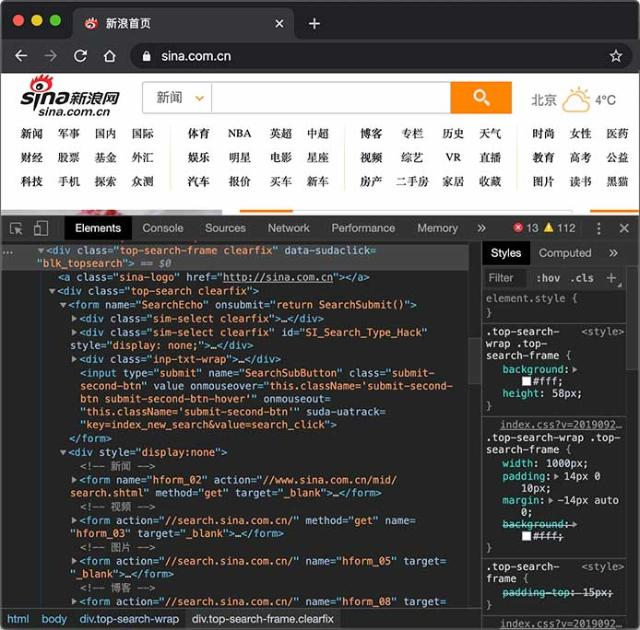
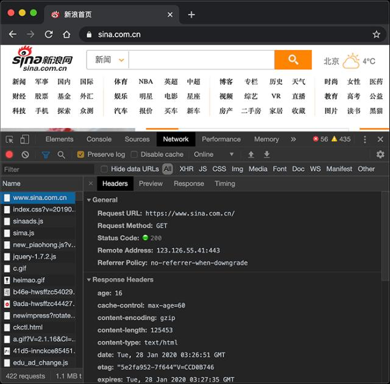
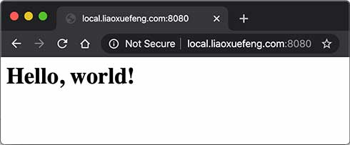

::: details 目录
[[toc]]
:::

今天我们访问网站，使用 App 时，都是基于 Web 这种 Browser/Server 模式，简称 BS 架构，它的特点是，客户端只需要浏览器，应用程序的逻辑和数据都存储在服务器端。浏览器只需要请求服务器，获取 Web 页面，并把 Web 页面展示给用户即可。

Web 页面具有极强的交互性。由于 Web 页面是用 HTML 编写的，而 HTML 具备超强的表现力，并且，服务器端升级后，客户端无需任何部署就可以使用到新的版本，因此，BS 架构升级非常容易。

## 🍀 HTTP 协议

在 Web 应用中，浏览器请求一个 URL，服务器就把生成的 HTML 网页发送给浏览器，而浏览器和服务器之间的传输协议是 HTTP，所以：

- HTML 是一种用来定义网页的文本，会 HTML，就可以编写网页；
- HTTP 是在网络上传输 HTML 的协议，用于浏览器和服务器的通信。

HTTP 协议是一个基于 TCP 协议之上的请求 - 响应协议，它非常简单，我们先使用 Chrome 浏览器查看新浪首页，然后选择 View - Developer - Inspect Elements 就可以看到 HTML：



切换到 Network，重新加载页面，可以看到浏览器发出的每一个请求和响应：




> [!tip]
> 使用 Chrome 浏览器可以方便地调试 Web 应用程序。

对于 Browser 来说，请求页面的流程如下：

1. 与服务器建立 TCP 连接；
2. 发送 HTTP 请求；
3. 收取 HTTP 响应，然后把网页在浏览器中显示出来。

浏览器发送的 HTTP 请求如下：

```java
GET / HTTP/1.1
Host: www.sina.com.cn
User-Agent: Mozilla/5.0 xxx
Accept: */*
Accept-Language: zh-CN,zh;q=0.9,en-US;q=0.8
```

其中，第一行表示使用 `GET` 请求获取路径为 `/` 的资源，并使用 `HTTP/1.1` 协议，从第二行开始，每行都是以 `Header: Value` 形式表示的 HTTP 头，比较常用的 HTTP Header 包括：

- Host: 表示请求的主机名，因为一个服务器上可能运行着多个网站，因此，Host 表示浏览器正在请求的域名；
- User-Agent: 标识客户端本身，例如 Chrome 浏览器的标识类似 `Mozilla/5.0 ... Chrome/79`，IE 浏览器的标识类似 `Mozilla/5.0 (Windows NT ...) like Gecko`；
- Accept：表示浏览器能接收的资源类型，如 `text/*`，`image/*` 或者 `*/*` 表示所有；
- Accept-Language：表示浏览器偏好的语言，服务器可以据此返回不同语言的网页；
- Accept-Encoding：表示浏览器可以支持的压缩类型，例如 `gzip, deflate, br`。

服务器的响应如下：

```sh
HTTP/1.1 200 OK
Content-Type: text/html
Content-Length: 21932
Content-Encoding: gzip
Cache-Control: max-age=300

<html>... 网页数据...
```

服务器响应的第一行总是版本号 + 空格 + 数字 + 空格 + 文本，数字表示响应代码，其中 `2xx` 表示成功，`3xx` 表示重定向，`4xx` 表示客户端引发的错误，`5xx` 表示服务器端引发的错误。数字是给程序识别，文本则是给开发者调试使用的。常见的响应代码有：

- `200 OK`：表示成功；
- `301 Moved Permanently`：表示该 URL 已经永久重定向；
- `302 Found`：表示该 URL 需要临时重定向；
- `304 Not Modified`：表示该资源没有修改，客户端可以使用本地缓存的版本；
- `400 Bad Request`：表示客户端发送了一个错误的请求，例如参数无效；
- `401 Unauthorized`：表示客户端因为身份未验证而不允许访问该 URL；
- `403 Forbidden`：表示服务器因为权限问题拒绝了客户端的请求；
- `404 Not Found`：表示客户端请求了一个不存在的资源；
- `500 Internal Server Error`：表示服务器处理时内部出错，例如因为无法连接数据库；
- `503 Service Unavailable`：表示服务器此刻暂时无法处理请求。

从第二行开始，服务器每一行均返回一个 HTTP 头。服务器经常返回的 HTTP Header 包括：

- `Content-Type`：表示该响应内容的类型，例如 `text/html`，`image/jpeg`；
- `Content-Length`：表示该响应内容的长度（字节数）；
- `Content-Encoding`：表示该响应压缩算法，例如 `gzip`；
- `Cache-Control`：指示客户端应如何缓存，例如 `max-age=300` 表示可以最多缓存 300 秒。

HTTP 请求和响应都由 HTTP Header 和 HTTP Body 构成，其中 HTTP Header 每行都以 `\r\n` 结束。如果遇到两个连续的 `\r\n`，那么后面就是 HTTP Body。浏览器读取 HTTP Body，并根据 Header 信息中指示的 `Content-Type`、`Content-Encoding` 等解压后显示网页、图像或其他内容。

通常浏览器获取的第一个资源是 HTML 网页，在网页中，如果嵌入了 JavaScript、CSS、图片、视频等其他资源，浏览器会根据资源的 URL 再次向服务器请求对应的资源。

关于 HTTP 协议的详细内容，请参考 [HTTP 权威指南](https://www.amazon.cn/dp/B00M2DKYRC/) 一书，或者[Mozilla 开发者网站](https://developer.mozilla.org/zh-CN/docs/Web/HTTP)。

我们在前面介绍的 [HTTP 编程](/1-Java/15_网络编程/6.md) 是以客户端的身份去请求服务器资源。现在，我们需要以服务器的身份响应客户端请求，编写服务器程序来处理客户端请求通常就称之为 Web 开发。

## 🍀 编写 HTTP Server

我们来看一下如何编写 HTTP Server。一个 HTTP Server 本质上是一个 TCP 服务器，我们先用 [TCP 编程](/1-Java/15_网络编程/2.md) 的多线程实现的服务器端框架：

```java
public class Server {
    public static void main(String[] args) throws IOException {
        ServerSocket ss = new ServerSocket(8080); // 监听指定端口
        System.out.println("server is running...");
        for (;;) {
            Socket sock = ss.accept();
            System.out.println("connected from" + sock.getRemoteSocketAddress());
            Thread t = new Handler(sock);
            t.start();
        }
    }
}

class Handler extends Thread {
    Socket sock;

    public Handler(Socket sock) {
        this.sock = sock;
    }

    public void run() {
        try (InputStream input = this.sock.getInputStream()) {
            try (OutputStream output = this.sock.getOutputStream()) {
                handle(input, output);
            }
        } catch (Exception e) {
        } finally {
            try {
                this.sock.close();
            } catch (IOException ioe) {
            }
            System.out.println("client disconnected.");
        }
    }

    private void handle(InputStream input, OutputStream output) throws IOException {
        var reader = new BufferedReader(new InputStreamReader(input, StandardCharsets.UTF_8));
        var writer = new BufferedWriter(new OutputStreamWriter(output, StandardCharsets.UTF_8));
        // TODO: 处理 HTTP 请求
    }
}
```

只需要在 `handle()` 方法中，用 Reader 读取 HTTP 请求，用 Writer 发送 HTTP 响应，即可实现一个最简单的 HTTP 服务器。编写代码如下：

```java
private void handle(InputStream input, OutputStream output) throws IOException {
    System.out.println("Process new http request...");
    var reader = new BufferedReader(new InputStreamReader(input, StandardCharsets.UTF_8));
    var writer = new BufferedWriter(new OutputStreamWriter(output, StandardCharsets.UTF_8));
    // 读取 HTTP 请求:
    boolean requestOk = false;
    String first = reader.readLine();
    if (first.startsWith("GET / HTTP/1.")) {
        requestOk = true;
    }
    for (;;) {
        String header = reader.readLine();
        if (header.isEmpty()) { // 读取到空行时, HTTP Header 读取完毕
            break;
        }
        System.out.println(header);
    }
    System.out.println(requestOk ? "Response OK" : "Response Error");
    if (!requestOk) {
        // 发送错误响应:
        writer.write("HTTP/1.0 404 Not Found\r\n");
        writer.write("Content-Length: 0\r\n");
        writer.write("\r\n");
        writer.flush();
    } else {
        // 发送成功响应:
        String data = "<html><body><h1>Hello, world!</h1></body></html>";
        int length = data.getBytes(StandardCharsets.UTF_8).length;
        writer.write("HTTP/1.0 200 OK\r\n");
        writer.write("Connection: close\r\n");
        writer.write("Content-Type: text/html\r\n");
        writer.write("Content-Length:" + length + "\r\n");
        writer.write("\r\n"); // 空行标识 Header 和 Body 的分隔
        writer.write(data);
        writer.flush();
    }
}
```

这里的核心代码是，先读取 HTTP 请求，这里我们只处理 `GET /` 的请求。当读取到空行时，表示已读到连续两个 `\r\n`，说明请求结束，可以发送响应。发送响应的时候，首先发送响应代码 `HTTP/1.0 200 OK` 表示一个成功的 200 响应，使用 `HTTP/1.0` 协议，然后，依次发送 Header，发送完 Header 后，再发送一个空行标识 Header 结束，紧接着发送 HTTP Body，在浏览器输入 `http://local.liaoxuefeng.com:8080/` 就可以看到响应页面：



HTTP 目前有多个版本，`1.0` 是早期版本，浏览器每次建立 TCP 连接后，只发送一个 HTTP 请求并接收一个 HTTP 响应，然后就关闭 TCP 连接。由于创建 TCP 连接本身就需要消耗一定的时间，因此，HTTP 1.1 允许浏览器和服务器在同一个 TCP 连接上反复发送、接收多个 HTTP 请求和响应，这样就大大提高了传输效率。

我们注意到 HTTP 协议是一个请求 - 响应协议，它总是发送一个请求，然后接收一个响应。能不能一次性发送多个请求，然后再接收多个响应呢？HTTP 2.0 可以支持浏览器同时发出多个请求，但每个请求需要唯一标识，服务器可以不按请求的顺序返回多个响应，由浏览器自己把收到的响应和请求对应起来。可见，HTTP 2.0 进一步提高了传输效率，因为浏览器发出一个请求后，不必等待响应，就可以继续发下一个请求。

HTTP 3.0 为了进一步提高速度，将抛弃 TCP 协议，改为使用无需创建连接的 UDP 协议，目前 HTTP 3.0 仍然处于实验阶段。

## 🍀 练习

编写一个简单的 HTTP 服务器

## 🍀 小结

使用 B/S 架构时，总是通过 HTTP 协议实现通信；

Web 开发通常是指开发服务器端的 Web 应用程序。


