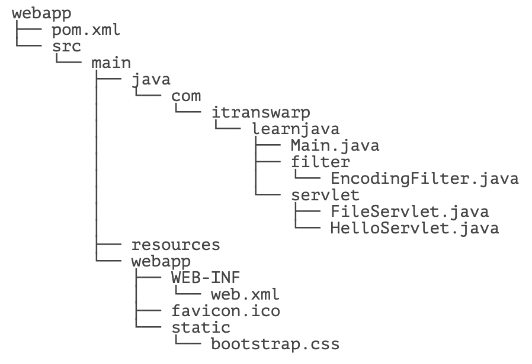
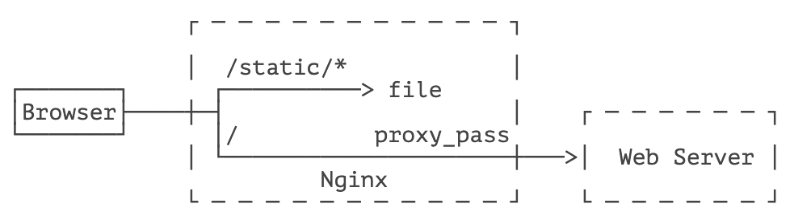

::: details 目录
[[toc]]
:::


对一个 Web 应用程序来说，除了 Servlet、Filter 这些逻辑组件，还需要 JSP 这样的视图文件，外加一堆静态资源文件，如 CSS、JS 等。

合理组织文件结构非常重要。我们以一个具体的 Web 应用程序为例：



我们把所有的静态资源文件放入 `/static/` 目录，在开发阶段，有些 Web 服务器会自动为我们加一个专门负责处理静态文件的 Servlet，但如果 `IndexServlet` 映射路径为 `/`，会屏蔽掉处理静态文件的 Servlet 映射。因此，我们需要自己编写一个处理静态文件的 `FileServlet`：

```java
@WebServlet(urlPatterns = "/static/*")
public class FileServlet extends HttpServlet {
    protected void doGet(HttpServletRequest req, HttpServletResponse resp) throws ServletException, IOException {
        ServletContext ctx = req.getServletContext();
        // RequestURI 包含 ContextPath, 需要去掉:
        String urlPath = req.getRequestURI().substring(ctx.getContextPath().length());
        // 获取真实文件路径:
        String filepath = ctx.getRealPath(urlPath);
        if (filepath == null) {
            // 无法获取到路径:
            resp.sendError(HttpServletResponse.SC_NOT_FOUND);
            return;
        }
        Path path = Paths.get(filepath);
        if (!path.toFile().isFile()) {
            // 文件不存在:
            resp.sendError(HttpServletResponse.SC_NOT_FOUND);
            return;
        }
        // 根据文件名猜测 Content-Type:
        String mime = Files.probeContentType(path);
        if (mime == null) {
            mime = "application/octet-stream";
        }
        resp.setContentType(mime);
        // 读取文件并写入 Response:
        OutputStream output = resp.getOutputStream();
        try (InputStream input = new BufferedInputStream(new FileInputStream(filepath))) {
            input.transferTo(output);
        }
        output.flush();
    }
}
```

这样一来，在开发阶段，我们就可以方便地高效开发。

类似 Tomcat 这样的 Web 服务器，运行的 Web 应用程序通常都是业务系统，因此，这类服务器也被称为应用服务器。应用服务器并不擅长处理静态文件，也不适合直接暴露给用户。通常，我们在生产环境部署时，总是使用类似 Nginx 这样的服务器充当反向代理和静态服务器，只有动态请求才会放行给应用服务器，所以，部署架构如下：



实现上述功能的 Nginx 配置文件如下：

```conf
server {
    listen 80;

    server_name www.local.liaoxuefeng.com;

    # 静态文件根目录:
    root /path/to/src/main/webapp;

    access_log /var/log/nginx/webapp_access_log;
    error_log  /var/log/nginx/webapp_error_log;

    # 处理静态文件请求:
    location /static {
    }

    # 处理静态文件请求:
    location /favicon.ico {
    }

    # 不允许请求 / WEB-INF:
    location /WEB-INF {
        return 404;
    }

    # 其他请求转发给 Tomcat:
    location / {
        proxy_pass       http://127.0.0.1:8080;
        proxy_set_header Host $host;
        proxy_set_header X-Real-IP $remote_addr;
        proxy_set_header X-Forwarded-Proto $scheme;
        proxy_set_header X-Forwarded-For $proxy_add_x_forwarded_for;
    }
}
```

使用 Nginx 配合 Tomcat 服务器，可以充分发挥 Nginx 作为网关的优势，既可以高效处理静态文件，也可以把 https、防火墙、限速、反爬虫等功能放到 Nginx 中，使得我们自己的 WebApp 能专注于业务逻辑。

## 🍀 练习

使用 Nginx + Tomcat 部署

## 🍀 小结

部署 Web 应用程序时，要设计合理的目录结构，同时考虑开发模式需要便捷性，生产模式需要高性能。


