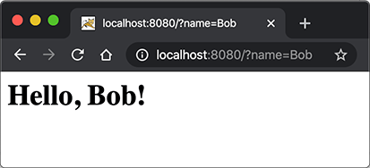
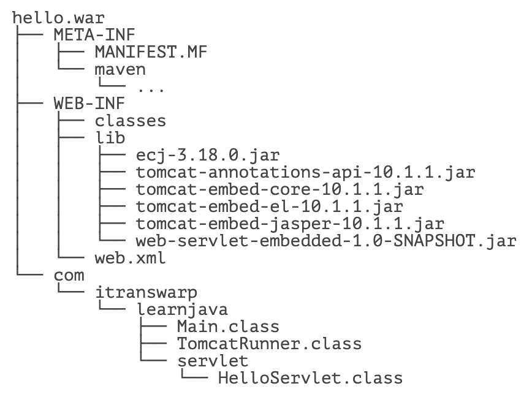
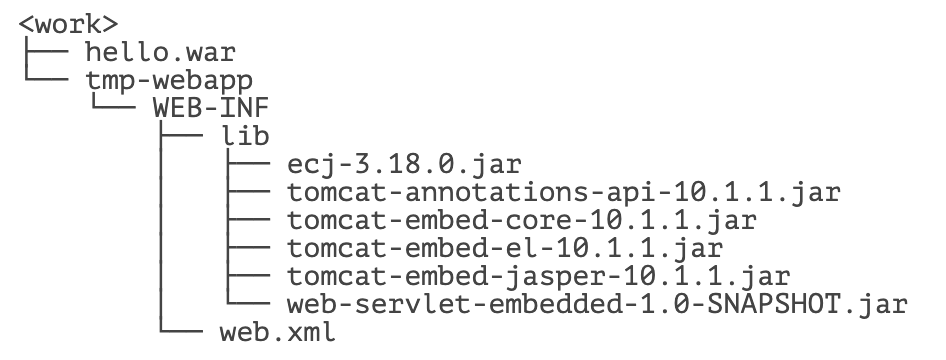

::: details 目录
[[toc]]
:::

在上一节中，我们看到，一个完整的 Web 应用程序的开发流程如下：

1. 编写 Servlet；
2. 打包为 war 文件；
3. 复制到 Tomcat 的 webapps 目录下；
4. 启动 Tomcat。

这个过程是不是很繁琐？如果我们想在 IDE 中断点调试，还需要打开 Tomcat 的远程调试端口并且连接上去。


许多初学者经常卡在如何在 IDE 中启动 Tomcat 并加载 webapp，更不要说断点调试了。

我们需要一种简单可靠，能直接在 IDE 中启动并调试 webapp 的方法。

因为 Tomcat 实际上也是一个 Java 程序，我们看看 Tomcat 的启动流程：

1. 启动 JVM 并执行 Tomcat 的 `main()` 方法；
2. 加载 war 并初始化 Servlet；
3. 正常服务。

启动 Tomcat 无非就是设置好 classpath 并执行 Tomcat 某个 jar 包的 `main()` 方法，我们完全可以把 Tomcat 的 jar 包全部引入进来，然后自己编写一个 `main()` 方法，先启动 Tomcat，然后让它加载我们的 webapp 就行。

我们新建一个 `web-servlet-embedded` 工程，编写 `pom.xml` 如下：

```xml
<project xmlns="http://maven.apache.org/POM/4.0.0"
    xmlns:xsi="http://www.w3.org/2001/XMLSchema-instance"
    xsi:schemaLocation="http://maven.apache.org/POM/4.0.0 http://maven.apache.org/xsd/maven-4.0.0.xsd">
    <modelVersion>4.0.0</modelVersion>

    <groupId>com.itranswarp.learnjava</groupId>
    <artifactId>web-servlet-embedded</artifactId>
    <version>1.0-SNAPSHOT</version>
    <packaging>war</packaging>

    <properties>
        <project.build.sourceEncoding>UTF-8</project.build.sourceEncoding>
        <project.reporting.outputEncoding>UTF-8</project.reporting.outputEncoding>
        <maven.compiler.source>17</maven.compiler.source>
        <maven.compiler.target>17</maven.compiler.target>
        <java.version>17</java.version>
        <tomcat.version>10.1.1</tomcat.version>
    </properties>

    <dependencies>
        <dependency>
            <groupId>org.apache.tomcat.embed</groupId>
            <artifactId>tomcat-embed-core</artifactId>
            <version>${tomcat.version}</version>
            <scope>provided</scope>
        </dependency>
        <dependency>
            <groupId>org.apache.tomcat.embed</groupId>
            <artifactId>tomcat-embed-jasper</artifactId>
            <version>${tomcat.version}</version>
            <scope>provided</scope>
        </dependency>
    </dependencies>
</project>
```

其中，`<packaging>` 类型仍然为 `war`，引入依赖 `tomcat-embed-core` 和 `tomcat-embed-jasper`，引入的 Tomcat 版本 `<tomcat.version>` 为 `10.1.1`。

不必引入 Servlet API，因为引入 Tomcat 依赖后自动引入了 Servlet API。因此，我们可以正常编写 Servlet 如下：

```java
@WebServlet(urlPatterns = "/")
public class HelloServlet extends HttpServlet {
    protected void doGet(HttpServletRequest req, HttpServletResponse resp) throws ServletException, IOException {
        resp.setContentType("text/html");
        String name = req.getParameter("name");
        if (name == null) {
            name = "world";
        }
        PrintWriter pw = resp.getWriter();
        pw.write("<h1>Hello," + name + "!</h1>");
        pw.flush();
    }
}
```

然后，我们编写一个 `main()` 方法，启动 Tomcat 服务器：

```java
public class Main {
    public static void main(String[] args) throws Exception {
        // 启动 Tomcat:
        Tomcat tomcat = new Tomcat();
        tomcat.setPort(Integer.getInteger("port", 8080));
        tomcat.getConnector();
        // 创建 webapp:
        Context ctx = tomcat.addWebapp("", new File("src/main/webapp").getAbsolutePath());
        WebResourceRoot resources = new StandardRoot(ctx);
        resources.addPreResources(
                new DirResourceSet(resources, "/WEB-INF/classes", new File("target/classes").getAbsolutePath(), "/"));
        ctx.setResources(resources);
        tomcat.start();
        tomcat.getServer().await();
    }
}
```

这样，我们直接运行 `main()` 方法，即可启动嵌入式 Tomcat 服务器，然后，通过预设的 `tomcat.addWebapp("", new File("src/main/webapp")`，Tomcat 会自动加载当前工程作为根 webapp，可直接在浏览器访问 `http://localhost:8080/`：



通过 `main()` 方法启动 Tomcat 服务器并加载我们自己的 webapp 有如下好处：

1. 启动简单，无需下载 Tomcat 或安装任何 IDE 插件；
2. 调试方便，可在 IDE 中使用断点调试；
3. 使用 Maven 创建 war 包后，也可以正常部署到独立的 Tomcat 服务器中。

## 🍀 生成可执行 war 包

如果要生成可执行的 war 包，用 `java -jar xxx.war` 启动，则需要把 Tomcat 的依赖项的 `<scope>` 去掉，然后配置 `maven-war-plugin` 如下：

```xml
<project ...>
    ...
	<build>
		<finalName>hello</finalName>
		<plugins>
			<plugin>
				<groupId>org.apache.maven.plugins</groupId>
				<artifactId>maven-war-plugin</artifactId>
				<version>3.3.2</version>
				<configuration>
					<!-- 复制 classes 到 war 包根目录 -->
					<webResources>
						<resource>
							<directory>${project.build.directory}/classes</directory>
						</resource>
					</webResources>
					<archiveClasses>true</archiveClasses>
					<archive>
						<manifest>
							<!-- 添加 Class-Path -->
							<addClasspath>true</addClasspath>
							<!-- Classpath 前缀 -->
							<classpathPrefix>tmp-webapp/WEB-INF/lib/</classpathPrefix>
							<!-- main 启动类 -->
							<mainClass>com.itranswarp.learnjava.Main</mainClass>
						</manifest>
					</archive>
				</configuration>
			</plugin>
		</plugins>
	</build>
</project>
```

生成的 war 包结构如下：



之所以要把编译后的 classes 复制到 war 包根目录，是因为用 `java -jar hello.war` 启动时，JVM 的 Class Loader 不会查找 `WEB-INF/lib` 的 jar 包，而是直接从 `hello.war` 的根目录查找。`MANIFEST.MF` 生成的内容如下：

```sh
Main-Class: com.itranswarp.learnjava.Main
Class-Path: tmp-webapp/WEB-INF/lib/tomcat-embed-core-10.1.1.jar tmp-weba
 pp/WEB-INF/lib/tomcat-annotations-api-10.1.1.jar tmp-webapp/WEB-INF/lib
 /tomcat-embed-jasper-10.1.1.jar tmp-webapp/WEB-INF/lib/tomcat-embed-el-
 10.1.1.jar tmp-webapp/WEB-INF/lib/ecj-3.18.0.jar
```

注意到 `Class-Path` 的路径，这里定义的 `Class-Path` 相当于 `java -cp` 指定的 Classpath，JVM 不会在一个 jar 包中查找 jar 包内的 jar 包，它只会在文件系统中搜索，因此，我们要修改 `main()` 方法，在执行 `main()` 方法时，先自解压 `war` 包，再启动 Tomcat：

```java
public class Main {
    public static void main(String[] args) throws Exception {
        // 判定是否从 jar/war 启动:
        String jarFile = Main.class.getProtectionDomain().getCodeSource().getLocation().getFile();
        boolean isJarFile = jarFile.endsWith(".war") || jarFile.endsWith(".jar");
        // 定位 webapp 根目录:
        String webDir = isJarFile ? "tmp-webapp" : "src/main/webapp";
        if (isJarFile) {
            // 解压到 tmp-webapp:
            Path baseDir = Paths.get(webDir).normalize().toAbsolutePath();
            if (Files.isDirectory(baseDir)) {
                Files.delete(baseDir);
            }
            Files.createDirectories(baseDir);
            System.out.println("extract to:" + baseDir);
            try (JarFile jar = new JarFile(jarFile)) {
                List<JarEntry> entries = jar.stream().sorted(Comparator.comparing(JarEntry::getName))
                        .collect(Collectors.toList());
                for (JarEntry entry : entries) {
                    Path res = baseDir.resolve(entry.getName());
                    if (!entry.isDirectory()) {
                        System.out.println(res);
                        Files.createDirectories(res.getParent());
                        Files.copy(jar.getInputStream(entry), res);
                    }
                }
            }
            // JVM 退出时自动删除 tmp-webapp:
            Runtime.getRuntime().addShutdownHook(new Thread(() -> {
                try {
                    Files.walk(baseDir).sorted(Comparator.reverseOrder()).map(Path::toFile).forEach(File::delete);
                } catch (IOException e) {
                    e.printStackTrace();
                }
            }));
        }
        // 启动 Tomcat:
        TomcatRunner.run(webDir, isJarFile ? "tmp-webapp" : "target/classes");
    }
}

// Tomcat 启动类:
class TomcatRunner {
    public static void run(String webDir, String baseDir) throws Exception {
        Tomcat tomcat = new Tomcat();
        tomcat.setPort(Integer.getInteger("port", 8080));
        tomcat.getConnector();
        Context ctx = tomcat.addWebapp("", new File(webDir).getAbsolutePath());
        WebResourceRoot resources = new StandardRoot(ctx);
        resources.addPreResources(new DirResourceSet(resources, "/WEB-INF/classes", new File(baseDir).getAbsolutePath(), "/"));
        ctx.setResources(resources);
        tomcat.start();
        tomcat.getServer().await();
    }
}
```

现在，执行 `java -jar hello.war` 时，JVM 先定位 `hello.war` 的 `Main` 类，运行 `main()`，自动解压后，文件系统目录如下：



解压后的目录结构和我们在 `MANIFEST.MF` 中设定的 `Class-Path` 一致，因此，JVM 能顺利加载 Tomcat 的 jar 包，然后运行 Tomcat，启动 Web App。

编写可执行的 jar 或者 war 需要注意的几点：

- 必须在 `MANIFEST.MF` 中指定 `Main-Class` 和 `Class-Path`；
- `Main` 必须能在 jar/war 包的根目录下被 JVM 的 Class Loader 加载；
- `Main` 负责解压 jar/war，解压后的目录结构与 `MANIFEST.MF` 中设定的 `Class-Path` 一致；
- `Main` 不能引用任何解压后才能被加载的类，例如 `org.apache.catalina.startup.Tomcat`。

对 SpringBoot 有所了解的童鞋可能知道，SpringBoot 也支持在 `main()` 方法中一行代码直接启动 Tomcat，并且还能方便地更换成 Jetty 等其他服务器。它的启动方式和我们介绍的是基本一样的，后续涉及到 SpringBoot 的部分我们还会详细讲解。

## 🍀 练习

使用嵌入式 Tomcat 运行 Servlet

注意：引入的 Tomcat 的 scope 为 `provided`，在 Idea 下运行时，需要设置 `Run/Debug Configurations`，选择 `Application - Main`，钩上 `Include dependencies with "Provided" scope`，这样才能让 Idea 在运行时把 Tomcat 相关依赖包自动添加到 classpath 中。

## 🍀 小结

开发 Servlet 时，推荐使用 `main()` 方法启动嵌入式 Tomcat 服务器并加载当前工程的 webapp，便于开发调试，且不影响打包部署，能极大地提升开发效率。


