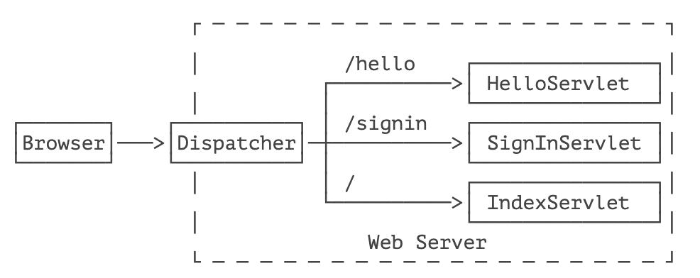

::: details 目录
[[toc]]
:::


一个 Web App 就是由一个或多个 Servlet 组成的，每个 Servlet 通过注解说明自己能处理的路径。例如：

```java
@WebServlet(urlPatterns = "/hello")
public class HelloServlet extends HttpServlet {
    ...
}
```

上述 `HelloServlet` 能处理 `/hello` 这个路径的请求。

> [!caution]
> 早期的 Servlet 需要在 web.xml 中配置映射路径，但最新 Servlet 版本只需要通过注解就可以完成映射。

因为浏览器发送请求的时候，还会有请求方法（HTTP Method）：即 GET、POST、PUT 等不同类型的请求。因此，要处理 GET 请求，我们要覆写 `doGet()` 方法：

```java
@WebServlet(urlPatterns = "/hello")
public class HelloServlet extends HttpServlet {
    @Override
    protected void doGet(HttpServletRequest req, HttpServletResponse resp) throws ServletException, IOException {
        ...
    }
}
```

类似的，要处理 POST 请求，就需要覆写 `doPost()` 方法。

如果没有覆写 `doPost()` 方法，那么 `HelloServlet` 能不能处理 `POST /hello` 请求呢？

我们查看一下 `HttpServlet` 的 `doPost()` 方法就一目了然了：它会直接返回 405 或 400 错误。因此，一个 Servlet 如果映射到 `/hello`，那么所有请求方法都会由这个 Servlet 处理，至于能不能返回 200 成功响应，要看有没有覆写对应的请求方法。

一个 Webapp 完全可以有多个 Servlet，分别映射不同的路径。例如：

```java
@WebServlet(urlPatterns = "/hello")
public class HelloServlet extends HttpServlet {
    ...
}

@WebServlet(urlPatterns = "/signin")
public class SignInServlet extends HttpServlet {
    ...
}

@WebServlet(urlPatterns = "/")
public class IndexServlet extends HttpServlet {
    ...
}
```

浏览器发出的 HTTP 请求总是由 Web Server 先接收，然后，根据 Servlet 配置的映射，不同的路径转发到不同的 Servlet：



这种根据路径转发的功能我们一般称为 Dispatch。映射到 `/` 的 `IndexServlet` 比较特殊，它实际上会接收所有未匹配的路径，相当于 `/*`，因为 Dispatcher 的逻辑可以用伪代码实现如下：

```java
String path = ...
if (path.equals("/hello")) {
    dispatchTo(helloServlet);
} else if (path.equals("/signin")) {
    dispatchTo(signinServlet);
} else {
    // 所有未匹配的路径均转发到 "/"
    dispatchTo(indexServlet);
}
```

所以我们在浏览器输入一个 `http://localhost:8080/abc` 也会看到 `IndexServlet` 生成的页面。

## HttpServletRequest

`HttpServletRequest` 封装了一个 HTTP 请求，它实际上是从 `ServletRequest` 继承而来。最早设计 Servlet 时，设计者希望 Servlet 不仅能处理 HTTP，也能处理类似 SMTP 等其他协议，因此，单独抽出了 `ServletRequest` 接口，但实际上除了 HTTP 外，并没有其他协议会用 Servlet 处理，所以这是一个过度设计。

我们通过 `HttpServletRequest` 提供的接口方法可以拿到 HTTP 请求的几乎全部信息，常用的方法有：

- getMethod()：返回请求方法，例如，`"GET"`，`"POST"`；
- getRequestURI()：返回请求路径，但不包括请求参数，例如，`"/hello"`；
- getQueryString()：返回请求参数，例如，`"name=Bob&a=1&b=2"`；
- getParameter(name)：返回请求参数，GET 请求从 URL 读取参数，POST 请求从 Body 中读取参数；
- getContentType()：获取请求 Body 的类型，例如，`"application/x-www-form-urlencoded"`；
- getContextPath()：获取当前 Webapp 挂载的路径，对于 ROOT 来说，总是返回空字符串 `""`；
- getCookies()：返回请求携带的所有 Cookie；
- getHeader(name)：获取指定的 Header，对 Header 名称不区分大小写；
- getHeaderNames()：返回所有 Header 名称；
- getInputStream()：如果该请求带有 HTTP Body，该方法将打开一个输入流用于读取 Body；
- getReader()：和 getInputStream() 类似，但打开的是 Reader；
- getRemoteAddr()：返回客户端的 IP 地址；
- getScheme()：返回协议类型，例如，`"http"`，`"https"`；

此外，`HttpServletRequest` 还有两个方法：`setAttribute()` 和 `getAttribute()`，可以给当前 `HttpServletRequest` 对象附加多个 Key-Value，相当于把 `HttpServletRequest` 当作一个 `Map<String, Object>` 使用。

调用 `HttpServletRequest` 的方法时，注意务必阅读接口方法的文档说明，因为有的方法会返回 `null`，例如 `getQueryString()` 的文档就写了：

```
... This method returns null if the URL does not have a query string...
```

## HttpServletResponse

`HttpServletResponse` 封装了一个 HTTP 响应。由于 HTTP 响应必须先发送 Header，再发送 Body，所以，操作 `HttpServletResponse` 对象时，必须先调用设置 Header 的方法，最后调用发送 Body 的方法。

常用的设置 Header 的方法有：

- setStatus(sc)：设置响应代码，默认是 `200`；
- setContentType(type)：设置 Body 的类型，例如，`"text/html"`；
- setCharacterEncoding(charset)：设置字符编码，例如，`"UTF-8"`；
- setHeader(name, value)：设置一个 Header 的值；
- addCookie(cookie)：给响应添加一个 Cookie；
- addHeader(name, value)：给响应添加一个 Header，因为 HTTP 协议允许有多个相同的 Header；

写入响应时，需要通过 `getOutputStream()` 获取写入流，或者通过 `getWriter()` 获取字符流，二者只能获取其中一个。

写入响应前，无需设置 `setContentLength()`，因为底层服务器会根据写入的字节数自动设置，如果写入的数据量很小，实际上会先写入缓冲区，如果写入的数据量很大，服务器会自动采用 Chunked 编码让浏览器能识别数据结束符而不需要设置 Content-Length 头。

但是，写入完毕后调用 `flush()` 却是必须的，因为大部分 Web 服务器都基于 HTTP/1.1 协议，会复用 TCP 连接。如果没有调用 `flush()`，将导致缓冲区的内容无法及时发送到客户端。此外，写入完毕后千万不要调用 `close()`，原因同样是因为会复用 TCP 连接，如果关闭写入流，将关闭 TCP 连接，使得 Web 服务器无法复用此 TCP 连接。

> [!caution]
> 写入完毕后对输出流调用 flush() 而不是 close() 方法！

有了 `HttpServletRequest` 和 `HttpServletResponse` 这两个高级接口，我们就不需要直接处理 HTTP 协议。注意到具体的实现类是由各服务器提供的，而我们编写的 Web 应用程序只关心接口方法，并不需要关心具体实现的子类。

## Servlet 多线程模型

一个 Servlet 类在服务器中只有一个实例，但对于每个 HTTP 请求，Web 服务器会使用多线程执行请求。因此，一个 Servlet 的 `doGet()`、`doPost()` 等处理请求的方法是多线程并发执行的。如果 Servlet 中定义了字段，要注意多线程并发访问的问题：

```java
public class HelloServlet extends HttpServlet {
    private Map<String, String> map = new ConcurrentHashMap<>();

    protected void doGet(HttpServletRequest req, HttpServletResponse resp) throws ServletException, IOException {
        // 注意读写 map 字段是多线程并发的:
        this.map.put(key, value);
    }
}
```

对于每个请求，Web 服务器会创建唯一的 `HttpServletRequest` 和 `HttpServletResponse` 实例，因此，`HttpServletRequest` 和 `HttpServletResponse` 实例只有在当前处理线程中有效，它们总是局部变量，不存在多线程共享的问题。

## 小结

一个 Webapp 中的多个 Servlet 依靠路径映射来处理不同的请求；

映射为 `/` 的 Servlet 可处理所有 “未匹配” 的请求；

如何处理请求取决于 Servlet 覆写的对应方法；

Web 服务器通过多线程处理 HTTP 请求，一个 Servlet 的处理方法可以由多线程并发执行。


