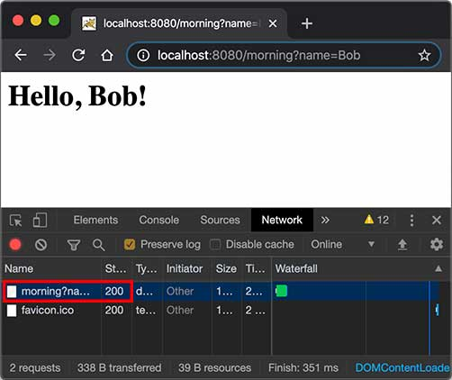

::: details 目录
[[toc]]
:::


## Redirect

重定向是指当浏览器请求一个 URL 时，服务器返回一个重定向指令，告诉浏览器地址已经变了，麻烦使用新的 URL 再重新发送新请求。

例如，我们已经编写了一个能处理 `/hello` 的 `HelloServlet`，如果收到的路径为 `/hi`，希望能重定向到 `/hello`，可以再编写一个 `RedirectServlet`：

```java
@WebServlet(urlPatterns = "/hi")
public class RedirectServlet extends HttpServlet {
    protected void doGet(HttpServletRequest req, HttpServletResponse resp) throws ServletException, IOException {
        // 构造重定向的路径:
        String name = req.getParameter("name");
        String redirectToUrl = "/hello" + (name == null ? "":"?name=" + name);
        // 发送重定向响应:
        resp.sendRedirect(redirectToUrl);
    }
}
```

如果浏览器发送 `GET /hi` 请求，`RedirectServlet` 将处理此请求。由于 `RedirectServlet` 在内部又发送了重定向响应，因此，浏览器会收到如下响应：

```sh
HTTP/1.1 302 Found
Location: /hello
```

当浏览器收到 302 响应后，它会立刻根据 `Location` 的指示发送一个新的 `GET /hello` 请求，这个过程就是重定向：


观察 Chrome 浏览器的网络请求，可以看到两次 HTTP 请求：


并且浏览器的地址栏路径自动更新为 `/hello`。

重定向有两种：一种是 302 响应，称为临时重定向，一种是 301 响应，称为永久重定向。两者的区别是，如果服务器发送 301 永久重定向响应，浏览器会缓存 `/hi` 到 `/hello` 这个重定向的关联，下次请求 `/hi` 的时候，浏览器就直接发送 `/hello` 请求了。

重定向有什么作用？重定向的目的是当 Web 应用升级后，如果请求路径发生了变化，可以将原来的路径重定向到新路径，从而避免浏览器请求原路径找不到资源。

`HttpServletResponse` 提供了快捷的 `redirect()` 方法实现 302 重定向。如果要实现 301 永久重定向，可以这么写：

```java
resp.setStatus(HttpServletResponse.SC_MOVED_PERMANENTLY); // 301
resp.setHeader("Location", "/hello");
```

## Forward

Forward 是指内部转发。当一个 Servlet 处理请求的时候，它可以决定自己不继续处理，而是转发给另一个 Servlet 处理。

例如，我们已经编写了一个能处理 `/hello` 的 `HelloServlet`，继续编写一个能处理 `/morning` 的 `ForwardServlet`：

```java
@WebServlet(urlPatterns = "/morning")
public class ForwardServlet extends HttpServlet {
    protected void doGet(HttpServletRequest req, HttpServletResponse resp) throws ServletException, IOException {
        req.getRequestDispatcher("/hello").forward(req, resp);
    }
}
```

`ForwardServlet` 在收到请求后，它并不自己发送响应，而是把请求和响应都转发给路径为 `/hello` 的 Servlet，即下面的代码：

```java
req.getRequestDispatcher("/hello").forward(req, resp);
```

后续请求的处理实际上是由 `HelloServlet` 完成的。这种处理方式称为转发（Forward），我们用流程图画出来如下：


转发和重定向的区别在于，转发是在 Web 服务器内部完成的，对浏览器来说，它只发出了一个 HTTP 请求：



注意到使用转发的时候，浏览器的地址栏路径仍然是 `/morning`，浏览器并不知道该请求在 Web 服务器内部实际上做了一次转发。

## 练习

使用重定向和转发

## 小结

使用重定向时，浏览器知道重定向规则，并且会自动发起新的 HTTP 请求；

使用转发时，浏览器并不知道服务器内部的转发逻辑。


