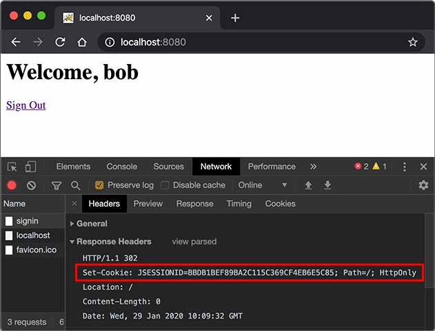
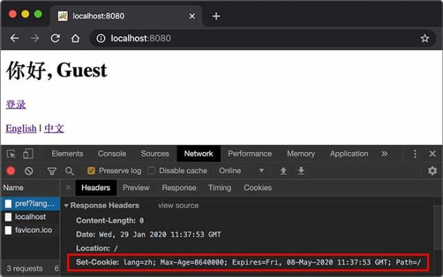

::: details 目录
[[toc]]
:::

在 Web 应用程序中，我们经常要跟踪用户身份。当一个用户登录成功后，如果他继续访问其他页面，Web 程序如何才能识别出该用户身份？

因为 HTTP 协议是一个无状态协议，即 Web 应用程序无法区分收到的两个 HTTP 请求是否是同一个浏览器发出的。为了跟踪用户状态，服务器可以向浏览器分配一个唯一 ID，并以 Cookie 的形式发送到浏览器，浏览器在后续访问时总是附带此 Cookie，这样，服务器就可以识别用户身份。

## Session

我们把这种基于唯一 ID 识别用户身份的机制称为 Session。每个用户第一次访问服务器后，会自动获得一个 Session ID。如果用户在一段时间内没有访问服务器，那么 Session 会自动失效，下次即使带着上次分配的 Session ID 访问，服务器也认为这是一个新用户，会分配新的 Session ID。

JavaEE 的 Servlet 机制内建了对 Session 的支持。我们以登录为例，当一个用户登录成功后，我们就可以把这个用户的名字放入一个 `HttpSession` 对象，以便后续访问其他页面的时候，能直接从 `HttpSession` 取出用户名：

```java
@WebServlet(urlPatterns = "/signin")
public class SignInServlet extends HttpServlet {
    // 模拟一个数据库:
    private Map<String, String> users = Map.of("bob", "bob123", "alice", "alice123", "tom", "tomcat");

    // GET 请求时显示登录页:
    protected void doGet(HttpServletRequest req, HttpServletResponse resp) throws ServletException, IOException {
        resp.setContentType("text/html");
        PrintWriter pw = resp.getWriter();
        pw.write("<h1>Sign In</h1>");
        pw.write("<form action=\"/signin\"method=\"post\">");
        pw.write("<p>Username: <input name=\"username\"></p>");
        pw.write("<p>Password: <input name=\"password\"type=\"password\"></p>");
        pw.write("<p><button type=\"submit\">Sign In</button> <a href=\"/\">Cancel</a></p>");
        pw.write("</form>");
        pw.flush();
    }

    // POST 请求时处理用户登录:
    protected void doPost(HttpServletRequest req, HttpServletResponse resp) throws ServletException, IOException {
        String name = req.getParameter("username");
        String password = req.getParameter("password");
        String expectedPassword = users.get(name.toLowerCase());
        if (expectedPassword != null && expectedPassword.equals(password)) {
            // 登录成功:
            req.getSession().setAttribute("user", name);
            resp.sendRedirect("/");
        } else {
            resp.sendError(HttpServletResponse.SC_FORBIDDEN);
        }
    }
}
```

上述 `SignInServlet` 在判断用户登录成功后，立刻将用户名放入当前 `HttpSession` 中：

```java
HttpSession session = req.getSession();
session.setAttribute("user", name);
```

在 `IndexServlet` 中，可以从 `HttpSession` 取出用户名：

```java
@WebServlet(urlPatterns = "/")
public class IndexServlet extends HttpServlet {
    protected void doGet(HttpServletRequest req, HttpServletResponse resp) throws ServletException, IOException {
        // 从 HttpSession 获取当前用户名:
        String user = (String) req.getSession().getAttribute("user");
        resp.setContentType("text/html");
        resp.setCharacterEncoding("UTF-8");
        resp.setHeader("X-Powered-By", "JavaEE Servlet");
        PrintWriter pw = resp.getWriter();
        pw.write("<h1>Welcome," + (user != null ? user : "Guest") + "</h1>");
        if (user == null) {
            // 未登录，显示登录链接:
            pw.write("<p><a href=\"/signin\">Sign In</a></p>");
        } else {
            // 已登录，显示登出链接:
            pw.write("<p><a href=\"/signout\">Sign Out</a></p>");
        }
        pw.flush();
    }
}
```

如果用户已登录，可以通过访问 `/signout` 登出。登出逻辑就是从 `HttpSession` 中移除用户相关信息：

```java
@WebServlet(urlPatterns = "/signout")
public class SignOutServlet extends HttpServlet {
    protected void doGet(HttpServletRequest req, HttpServletResponse resp) throws ServletException, IOException {
        // 从 HttpSession 移除用户名:
        req.getSession().removeAttribute("user");
        resp.sendRedirect("/");
    }
}
```

对于 Web 应用程序来说，我们总是通过 `HttpSession` 这个高级接口访问当前 Session。如果要深入理解 Session 原理，可以认为 Web 服务器在内存中自动维护了一个 ID 到 `HttpSession` 的映射表，我们可以用下图表示：


而服务器识别 Session 的关键就是依靠一个名为 `JSESSIONID` 的 Cookie。在 Servlet 中第一次调用 `req.getSession()` 时，Servlet 容器自动创建一个 Session ID，然后通过一个名为 `JSESSIONID` 的 Cookie 发送给浏览器：



这里要注意的几点是：

- `JSESSIONID` 是由 Servlet 容器自动创建的，目的是维护一个浏览器会话，它和我们的登录逻辑没有关系；
- 登录和登出的业务逻辑是我们自己根据 `HttpSession` 是否存在一个 `"user"` 的 Key 判断的，登出后，Session ID 并不会改变；
- 即使没有登录功能，仍然可以使用 `HttpSession` 追踪用户，例如，放入一些用户配置信息等。

除了使用 Cookie 机制可以实现 Session 外，还可以通过隐藏表单、URL 末尾附加 ID 来追踪 Session。这些机制很少使用，最常用的 Session 机制仍然是 Cookie。

使用 Session 时，由于服务器把所有用户的 Session 都存储在内存中，如果遇到内存不足的情况，就需要把部分不活动的 Session 序列化到磁盘上，这会大大降低服务器的运行效率，因此，放入 Session 的对象要小，通常我们放入一个简单的 `User` 对象就足够了：

```java
public class User {
    public long id; // 唯一标识
    public String email;
    public String name;
}
```

在使用多台服务器构成集群时，使用 Session 会遇到一些额外的问题。通常，多台服务器集群使用反向代理作为网站入口：


如果多台 Web Server 采用无状态集群，那么反向代理总是以轮询方式将请求依次转发给每台 Web Server，这会造成一个用户在 Web Server 1 存储的 Session 信息，在 Web Server 2 和 3 上并不存在，即从 Web Server 1 登录后，如果后续请求被转发到 Web Server 2 或 3，那么用户看到的仍然是未登录状态。

要解决这个问题，方案一是在所有 Web Server 之间进行 Session 复制，但这样会严重消耗网络带宽，并且，每个 Web Server 的内存均存储所有用户的 Session，内存使用率很低。

另一个方案是采用粘滞会话（Sticky Session）机制，即反向代理在转发请求的时候，总是根据 JSESSIONID 的值判断，相同的 JSESSIONID 总是转发到固定的 Web Server，但这需要反向代理的支持。

无论采用何种方案，使用 Session 机制，会使得 Web Server 的集群很难扩展，因此，Session 适用于中小型 Web 应用程序。对于大型 Web 应用程序来说，通常需要避免使用 Session 机制。

## Cookie

实际上，Servlet 提供的 `HttpSession` 本质上就是通过一个名为 `JSESSIONID` 的 Cookie 来跟踪用户会话的。除了这个名称外，其他名称的 Cookie 我们可以任意使用。

如果我们想要设置一个 Cookie，例如，记录用户选择的语言，可以编写一个 `LanguageServlet`：

```java
@WebServlet(urlPatterns = "/pref")
public class LanguageServlet extends HttpServlet {

    private static final Set<String> LANGUAGES = Set.of("en", "zh");

    protected void doGet(HttpServletRequest req, HttpServletResponse resp) throws ServletException, IOException {
        String lang = req.getParameter("lang");
        if (LANGUAGES.contains(lang)) {
            // 创建一个新的 Cookie:
            Cookie cookie = new Cookie("lang", lang);
            // 该 Cookie 生效的路径范围:
            cookie.setPath("/");
            // 该 Cookie 有效期:
            cookie.setMaxAge(8640000); // 8640000 秒 = 100 天
            // 将该 Cookie 添加到响应:
            resp.addCookie(cookie);
        }
        resp.sendRedirect("/");
    }
}
```

创建一个新 Cookie 时，除了指定名称和值以外，通常需要设置 `setPath("/")`，浏览器根据此前缀决定是否发送 Cookie。如果一个 Cookie 调用了 `setPath("/user/")`，那么浏览器只有在请求以 `/user/` 开头的路径时才会附加此 Cookie。通过 `setMaxAge()` 设置 Cookie 的有效期，单位为秒，最后通过 `resp.addCookie()` 把它添加到响应。

如果访问的是 https 网页，还需要调用 `setSecure(true)`，否则浏览器不会发送该 Cookie。

因此，务必注意：浏览器在请求某个 URL 时，是否携带指定的 Cookie，取决于 Cookie 是否满足以下所有要求：

- URL 前缀是设置 Cookie 时的 Path；
- Cookie 在有效期内；
- Cookie 设置了 secure 时必须以 https 访问。

我们可以在浏览器看到服务器发送的 Cookie：



如果我们要读取 Cookie，例如，在 `IndexServlet` 中，读取名为 `lang` 的 Cookie 以获取用户设置的语言，可以写一个方法如下：

```java
private String parseLanguageFromCookie(HttpServletRequest req) {
    // 获取请求附带的所有 Cookie:
    Cookie[] cookies = req.getCookies();
    // 如果获取到 Cookie:
    if (cookies != null) {
        // 循环每个 Cookie:
        for (Cookie cookie : cookies) {
            // 如果 Cookie 名称为 lang:
            if (cookie.getName().equals("lang")) {
                // 返回 Cookie 的值:
                return cookie.getValue();
            }
        }
    }
    // 返回默认值:
    return "en";
}
```

可见，读取 Cookie 主要依靠遍历 `HttpServletRequest` 附带的所有 Cookie。

## 练习


## 小结

Servlet 容器提供了 Session 机制以跟踪用户；

默认的 Session 机制是以 Cookie 形式实现的，Cookie 名称为 `JSESSIONID`；

通过读写 Cookie 可以在客户端设置用户偏好等。


