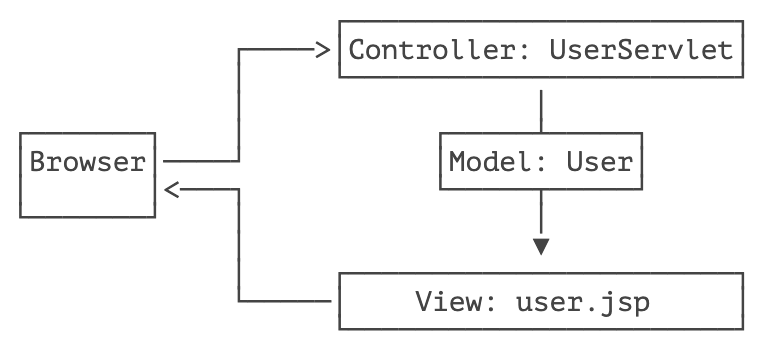

::: details 目录
[[toc]]
:::


我们通过前面的章节可以看到：

- Servlet 适合编写 Java 代码，实现各种复杂的业务逻辑，但不适合输出复杂的 HTML；
- JSP 适合编写 HTML，并在其中插入动态内容，但不适合编写复杂的 Java 代码。

能否将两者结合起来，发挥各自的优点，避免各自的缺点？

答案是肯定的。我们来看一个具体的例子。

假设我们已经编写了几个 JavaBean：

```java
public class User {
    public long id;
    public String name;
    public School school;
}

public class School {
    public String name;
    public String address;
}
```

在 `UserServlet` 中，我们可以从数据库读取 `User`、`School` 等信息，然后，把读取到的 JavaBean 先放到 HttpServletRequest 中，再通过 `forward()` 传给 `user.jsp` 处理：

```java
@WebServlet(urlPatterns = "/user")
public class UserServlet extends HttpServlet {
    protected void doGet(HttpServletRequest req, HttpServletResponse resp) throws ServletException, IOException {
        // 假装从数据库读取:
        School school = new School("No.1 Middle School", "101 South Street");
        User user = new User(123, "Bob", school);
        // 放入 Request 中:
        req.setAttribute("user", user);
        // forward 给 user.jsp:
        req.getRequestDispatcher("/WEB-INF/user.jsp").forward(req, resp);
    }
}
```

在 `user.jsp` 中，我们只负责展示相关 JavaBean 的信息，不需要编写访问数据库等复杂逻辑：

```html
<%@ page import="com.itranswarp.learnjava.bean.*"%>
<%
    User user = (User) request.getAttribute("user");
%>
<html>
<head>
    <title>Hello World - JSP</title>
</head>
<body>
    <h1>Hello <%= user.name %>!</h1>
    <p>School Name:
    <span style="color:red">
        <%= user.school.name %>
    </span>
    </p>
    <p>School Address:
    <span style="color:red">
        <%= user.school.address %>
    </span>
    </p>
</body>
</html>
```

请注意几点：

- 需要展示的 `User` 被放入 `HttpServletRequest` 中以便传递给 JSP，因为一个请求对应一个 `HttpServletRequest`，我们也无需清理它，处理完该请求后 `HttpServletRequest` 实例将被丢弃；
- 把 `user.jsp` 放到 `/WEB-INF/` 目录下，是因为 `WEB-INF` 是一个特殊目录，Web Server 会阻止浏览器对 `WEB-INF` 目录下任何资源的访问，这样就防止用户通过 `/user.jsp` 路径直接访问到 JSP 页面；
- JSP 页面首先从 `request` 变量获取 `User` 实例，然后在页面中直接输出，此处未考虑 HTML 的转义问题，有潜在安全风险。

我们在浏览器访问 `http://localhost:8080/user`，请求首先由 `UserServlet` 处理，然后交给 `user.jsp` 渲染：


我们把 `UserServlet` 看作业务逻辑处理，把 `User` 看作模型，把 `user.jsp` 看作渲染，这种设计模式通常被称为 MVC：Model-View-Controller，即 `UserServlet` 作为控制器（Controller），`User` 作为模型（Model），`user.jsp` 作为视图（View），整个 MVC 架构如下：



使用 MVC 模式的好处是，Controller 专注于业务处理，它的处理结果就是 Model。Model 可以是一个 JavaBean，也可以是一个包含多个对象的 Map，Controller 只负责把 Model 传递给 View，View 只负责把 Model 给 “渲染” 出来，这样，三者职责明确，且开发更简单，因为开发 Controller 时无需关注页面，开发 View 时无需关心如何创建 Model。

MVC 模式广泛地应用在 Web 页面和传统的桌面程序中，我们在这里通过 Servlet 和 JSP 实现了一个简单的 MVC 模型，但它还不够简洁和灵活，后续我们会介绍更简单的 Spring MVC 开发。

## 🍀 练习


## 🍀 小结

MVC 模式是一种分离业务逻辑和显示逻辑的设计模式，广泛应用在 Web 和桌面应用程序。


