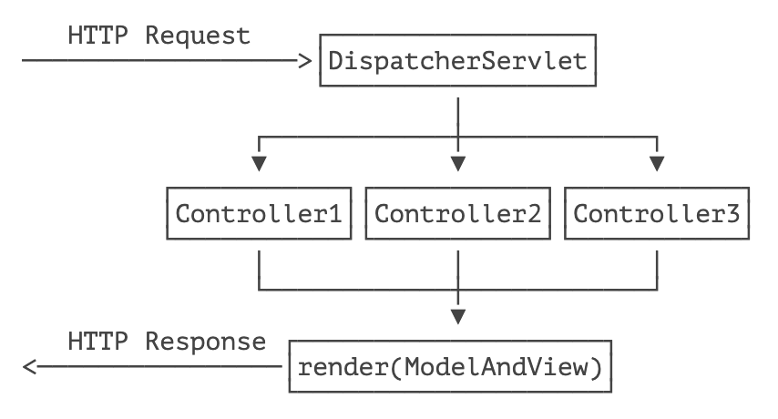
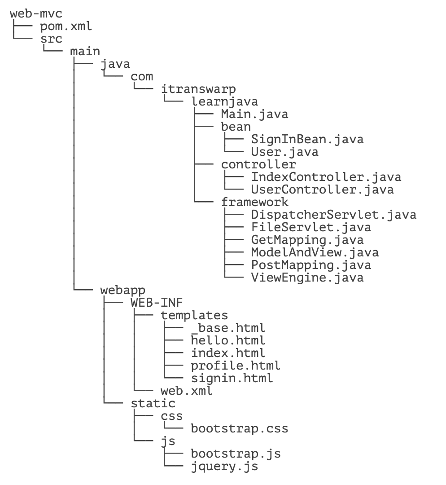
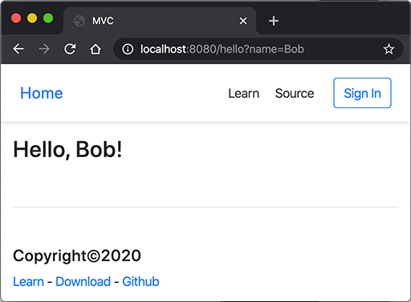

::: details 目录
[[toc]]
:::

通过结合 Servlet 和 JSP 的 MVC 模式，我们可以发挥二者各自的优点：

- Servlet 实现业务逻辑；
- JSP 实现展示逻辑。

但是，直接把 MVC 搭在 Servlet 和 JSP 之上还是不太好，原因如下：

- Servlet 提供的接口仍然偏底层，需要实现 Servlet 调用相关接口；
- JSP 对页面开发不友好，更好的替代品是模板引擎；
- 业务逻辑最好由纯粹的 Java 类实现，而不是强迫继承自 Servlet。

能不能通过普通的 Java 类实现 MVC 的 Controller？类似下面的代码：

```java
public class UserController {
    @GetMapping("/signin")
    public ModelAndView signin() {
        ...
    }

    @PostMapping("/signin")
    public ModelAndView doSignin(SignInBean bean) {
        ...
    }

    @GetMapping("/signout")
    public ModelAndView signout(HttpSession session) {
        ...
    }
}
```

上面的这个 Java 类每个方法都对应一个 GET 或 POST 请求，方法返回值是 `ModelAndView`，它包含一个 View 的路径以及一个 Model，这样，再由 MVC 框架处理后返回给浏览器。

如果是 GET 请求，我们希望 MVC 框架能直接把 URL 参数按方法参数对应起来然后传入：

```java
@GetMapping("/hello")
public ModelAndView hello(String name) {
    ...
}
```

如果是 POST 请求，我们希望 MVC 框架能直接把 Post 参数变成一个 JavaBean 后通过方法参数传入：

```java
@PostMapping("/signin")
public ModelAndView doSignin(SignInBean bean) {
    ...
}
```

为了增加灵活性，如果 Controller 的方法在处理请求时需要访问 `HttpServletRequest`、`HttpServletResponse`、`HttpSession` 这些实例时，只要方法参数有定义，就可以自动传入：

```java
@GetMapping("/signout")
public ModelAndView signout(HttpSession session) {
    ...
}
```

以上就是我们在设计 MVC 框架时，上层代码所需要的一切信息。

## 🍀 设计 MVC 框架

如何设计一个 MVC 框架？在上文中，我们已经定义了上层代码编写 Controller 的一切接口信息，并且并不要求实现特定接口，只需返回 `ModelAndView` 对象，该对象包含一个 `View` 和一个 `Model`。实际上 `View` 就是模板的路径，而 `Model` 可以用一个 `Map<String, Object>` 表示，因此，`ModelAndView` 定义非常简单：

```java
public class ModelAndView {
    Map<String, Object> model;
    String view;
}
```

比较复杂的是我们需要在 MVC 框架中创建一个接收所有请求的 `Servlet`，通常我们把它命名为 `DispatcherServlet`，它总是映射到 `/`，然后，根据不同的 Controller 的方法定义的 `@Get` 或 `@Post` 的 Path 决定调用哪个方法，最后，获得方法返回的 `ModelAndView` 后，渲染模板，写入 `HttpServletResponse`，即完成了整个 MVC 的处理。

这个 MVC 的架构如下：



其中，`DispatcherServlet` 以及如何渲染均由 MVC 框架实现，在 MVC 框架之上只需要编写每一个 Controller。

我们来看看如何编写最复杂的 `DispatcherServlet`。首先，我们需要存储请求路径到某个具体方法的映射：

```java
@WebServlet(urlPatterns = "/")
public class DispatcherServlet extends HttpServlet {
    private Map<String, GetDispatcher> getMappings = new HashMap<>();
    private Map<String, PostDispatcher> postMappings = new HashMap<>();
}
```

处理一个 GET 请求是通过 `GetDispatcher` 对象完成的，它需要如下信息：

```java
class GetDispatcher {
    Object instance; // Controller 实例
    Method method; // Controller 方法
    String[] parameterNames; // 方法参数名称
    Class<?>[] parameterClasses; // 方法参数类型
}
```

有了以上信息，就可以定义 `invoke()` 来处理真正的请求：

```java
class GetDispatcher {
    ...
    public ModelAndView invoke(HttpServletRequest request, HttpServletResponse response) {
        Object[] arguments = new Object[parameterClasses.length];
        for (int i = 0; i < parameterClasses.length; i++) {
            String parameterName = parameterNames[i];
            Class<?> parameterClass = parameterClasses[i];
            if (parameterClass == HttpServletRequest.class) {
                arguments[i] = request;
            } else if (parameterClass == HttpServletResponse.class) {
                arguments[i] = response;
            } else if (parameterClass == HttpSession.class) {
                arguments[i] = request.getSession();
            } else if (parameterClass == int.class) {
                arguments[i] = Integer.valueOf(getOrDefault(request, parameterName, "0"));
            } else if (parameterClass == long.class) {
                arguments[i] = Long.valueOf(getOrDefault(request, parameterName, "0"));
            } else if (parameterClass == boolean.class) {
                arguments[i] = Boolean.valueOf(getOrDefault(request, parameterName, "false"));
            } else if (parameterClass == String.class) {
                arguments[i] = getOrDefault(request, parameterName, "");
            } else {
                throw new RuntimeException("Missing handler for type:" + parameterClass);
            }
        }
        return (ModelAndView) this.method.invoke(this.instance, arguments);
    }

    private String getOrDefault(HttpServletRequest request, String name, String defaultValue) {
        String s = request.getParameter(name);
        return s == null ? defaultValue : s;
    }
}
```

上述代码比较繁琐，但逻辑非常简单，即通过构造某个方法需要的所有参数列表，使用反射调用该方法后返回结果。

类似的，`PostDispatcher` 需要如下信息：

```java
class PostDispatcher {
    Object instance; // Controller 实例
    Method method; // Controller 方法
    Class<?>[] parameterClasses; // 方法参数类型
    ObjectMapper objectMapper; // JSON 映射
}
```

和 GET 请求不同，POST 请求严格地来说不能有 URL 参数，所有数据都应当从 Post Body 中读取。这里我们为了简化处理，* 只支持 * JSON 格式的 POST 请求，这样，把 Post 数据转化为 JavaBean 就非常容易。

```java
class PostDispatcher {
    ...
    public ModelAndView invoke(HttpServletRequest request, HttpServletResponse response) {
        Object[] arguments = new Object[parameterClasses.length];
        for (int i = 0; i < parameterClasses.length; i++) {
            Class<?> parameterClass = parameterClasses[i];
            if (parameterClass == HttpServletRequest.class) {
                arguments[i] = request;
            } else if (parameterClass == HttpServletResponse.class) {
                arguments[i] = response;
            } else if (parameterClass == HttpSession.class) {
                arguments[i] = request.getSession();
            } else {
                // 读取 JSON 并解析为 JavaBean:
                BufferedReader reader = request.getReader();
                arguments[i] = this.objectMapper.readValue(reader, parameterClass);
            }
        }
        return (ModelAndView) this.method.invoke(instance, arguments);
    }
}
```

最后，我们来实现整个 `DispatcherServlet` 的处理流程，以 `doGet()` 为例：

```java
public class DispatcherServlet extends HttpServlet {
    ...
    @Override
    protected void doGet(HttpServletRequest req, HttpServletResponse resp) throws ServletException, IOException {
        resp.setContentType("text/html");
        resp.setCharacterEncoding("UTF-8");
        String path = req.getRequestURI().substring(req.getContextPath().length());
        // 根据路径查找 GetDispatcher:
        GetDispatcher dispatcher = this.getMappings.get(path);
        if (dispatcher == null) {
            // 未找到返回 404:
            resp.sendError(404);
            return;
        }
        // 调用 Controller 方法获得返回值:
        ModelAndView mv = dispatcher.invoke(req, resp);
        // 允许返回 null:
        if (mv == null) {
            return;
        }
        // 允许返回 `redirect:` 开头的 view 表示重定向:
        if (mv.view.startsWith("redirect:")) {
            resp.sendRedirect(mv.view.substring(9));
            return;
        }
        // 将模板引擎渲染的内容写入响应:
        PrintWriter pw = resp.getWriter();
        this.viewEngine.render(mv, pw);
        pw.flush();
    }
}
```

这里有几个小改进：

- 允许 Controller 方法返回 `null`，表示内部已自行处理完毕；
- 允许 Controller 方法返回以 `redirect:` 开头的 view 名称，表示一个重定向。

这样使得上层代码编写更灵活。例如，一个显示用户资料的请求可以这样写：

```java
@GetMapping("/user/profile")
public ModelAndView profile(HttpServletResponse response, HttpSession session) {
    User user = (User) session.getAttribute("user");
    if (user == null) {
        // 未登录，跳转到登录页:
        return new ModelAndView("redirect:/signin");
    }
    if (!user.isManager()) {
        // 权限不够，返回 403:
        response.sendError(403);
        return null;
    }
    return new ModelAndView("/profile.html", Map.of("user", user));
}
```

最后一步是在 `DispatcherServlet` 的 `init()` 方法中初始化所有 Get 和 Post 的映射，以及用于渲染的模板引擎：

```java
public class DispatcherServlet extends HttpServlet {
    private Map<String, GetDispatcher> getMappings = new HashMap<>();
    private Map<String, PostDispatcher> postMappings = new HashMap<>();
    private ViewEngine viewEngine;

    @Override
    public void init() throws ServletException {
        this.getMappings = scanGetInControllers();
        this.postMappings = scanPostInControllers();
        this.viewEngine = new ViewEngine(getServletContext());
    }
    ...
}
```

如何扫描所有 Controller 以获取所有标记有 `@GetMapping` 和 `@PostMapping` 的方法？当然是使用反射了。虽然代码比较繁琐，但我们相信各位童鞋可以轻松实现。

这样，整个 MVC 框架就搭建完毕。

## 🍀 实现渲染

有的童鞋对如何使用模板引擎进行渲染有疑问，即如何实现上述的 `ViewEngine`？其实 `ViewEngine` 非常简单，只需要实现一个简单的 `render()` 方法：

```
public class ViewEngine {
    public void render(ModelAndView mv, Writer writer) throws IOException {
        String view = mv.view;
        Map<String, Object> model = mv.model;
        // 根据 view 找到模板文件:
        Template template = getTemplateByPath(view);
        // 渲染并写入 Writer:
        template.write(writer, model);
    }
}
```

Java 有很多开源的模板引擎，常用的有：

- [Thymeleaf](https://www.thymeleaf.org/)
- [FreeMarker](https://freemarker.apache.org/)
- [Velocity](https://velocity.apache.org/)

他们的用法都大同小异。这里我们推荐一个使用 [Jinja](https://palletsprojects.com/p/jinja/) 语法的模板引擎[Pebble](https://pebbletemplates.io/)，它的特点是语法简单，支持模板继承，编写出来的模板类似：

```html
<html>
<body>
  <ul>
  
    <li><a href="{{ user.url }}">{{ user.username }}</a></li>
  
  </ul>
</body>
</html>
```

即变量用 `{{xxx}}` 表示，控制语句用 `` 表示。

使用 Pebble 渲染只需要如下几行代码：

```java
public class ViewEngine {
    private final PebbleEngine engine;

    public ViewEngine(ServletContext servletContext) {
        // 定义一个 ServletLoader 用于加载模板:
        ServletLoader loader = new ServletLoader(servletContext);
        // 模板编码:
        loader.setCharset("UTF-8");
        // 模板前缀，这里默认模板必须放在 `/WEB-INF/templates` 目录:
        loader.setPrefix("/WEB-INF/templates");
        // 模板后缀:
        loader.setSuffix("");
        // 创建 Pebble 实例:
        this.engine = new PebbleEngine.Builder()
            .autoEscaping(true) // 默认打开 HTML 字符转义，防止 XSS 攻击
            .cacheActive(false) // 禁用缓存使得每次修改模板可以立刻看到效果
            .loader(loader).build();
    }

    public void render(ModelAndView mv, Writer writer) throws IOException {
        // 查找模板:
        PebbleTemplate template = this.engine.getTemplate(mv.view);
        // 渲染:
        template.evaluate(writer, mv.model);
    }
}
```

最后我们来看看整个工程的结构：



其中，`framework` 包是 MVC 的框架，完全可以单独编译后作为一个 Maven 依赖引入，`controller` 包才是我们需要编写的业务逻辑。

我们还硬性规定模板必须放在 `webapp/WEB-INF/templates` 目录下，静态文件必须放在 `webapp/static` 目录下，因此，为了便于开发，我们还顺带实现一个 `FileServlet` 来处理静态文件：

```java
@WebServlet(urlPatterns = { "/favicon.ico", "/static/*"})
public class FileServlet extends HttpServlet {
    protected void doGet(HttpServletRequest req, HttpServletResponse resp) throws ServletException, IOException {
        // 读取当前请求路径:
        ServletContext ctx = req.getServletContext();
        // RequestURI 包含 ContextPath, 需要去掉:
        String urlPath = req.getRequestURI().substring(ctx.getContextPath().length());
        // 获取真实文件路径:
        String filepath = ctx.getRealPath(urlPath);
        if (filepath == null) {
            // 无法获取到路径:
            resp.sendError(HttpServletResponse.SC_NOT_FOUND);
            return;
        }
        Path path = Paths.get(filepath);
        if (!path.toFile().isFile()) {
            // 文件不存在:
            resp.sendError(HttpServletResponse.SC_NOT_FOUND);
            return;
        }
        // 根据文件名猜测 Content-Type:
        String mime = Files.probeContentType(path);
        if (mime == null) {
            mime = "application/octet-stream";
        }
        resp.setContentType(mime);
        // 读取文件并写入 Response:
        OutputStream output = resp.getOutputStream();
        try (InputStream input = new BufferedInputStream(new FileInputStream(filepath))) {
            input.transferTo(output);
        }
        output.flush();
    }
}
```

运行代码，在浏览器中输入 URL`http://localhost:8080/hello?name=Bob` 可以看到如下页面：



为了把方法参数的名称编译到 class 文件中，以便处理 `@GetMapping` 时使用，我们需要打开编译器的一个参数，在 Eclipse 中勾选 `Preferences`-`Java`-`Compiler`-`Store information about method parameters (usable via reflection)`；在 Idea 中选择 `Preferences`-`Build, Execution, Deployment`-`Compiler`-`Java Compiler`-`Additional command line parameters`，填入 `-parameters`；在 Maven 的 `pom.xml` 添加一段配置如下：

```xml
<project ...>
    <modelVersion>4.0.0</modelVersion>
    ...
    <build>
        <plugins>
            <plugin>
                <groupId>org.apache.maven.plugins</groupId>
                <artifactId>maven-compiler-plugin</artifactId>
                <configuration>
                    <compilerArgs>
                        <arg>-parameters</arg>
                    </compilerArgs>
                </configuration>
            </plugin>
        </plugins>
    </build>
</project>
```

有些用过 Spring MVC 的童鞋会发现，本节实现的这个 MVC 框架，上层代码使用的公共类如 `GetMapping`、`PostMapping` 和 `ModelAndView` 都和 Spring MVC 非常类似。实际上，我们这个 MVC 框架主要参考就是 Spring MVC，通过实现一个 “简化版”MVC，可以掌握 Java Web MVC 开发的核心思想与原理，对将来直接使用 Spring MVC 是非常有帮助的。

## 🍀 练习

实现一个 MVC 框架

## 🍀 小结

一个 MVC 框架是基于 Servlet 基础抽象出更高级的接口，使得上层基于 MVC 框架的开发可以不涉及 Servlet 相关的 `HttpServletRequest` 等接口，处理多个请求更加灵活，并且可以使用任意模板引擎，不必使用 JSP。


