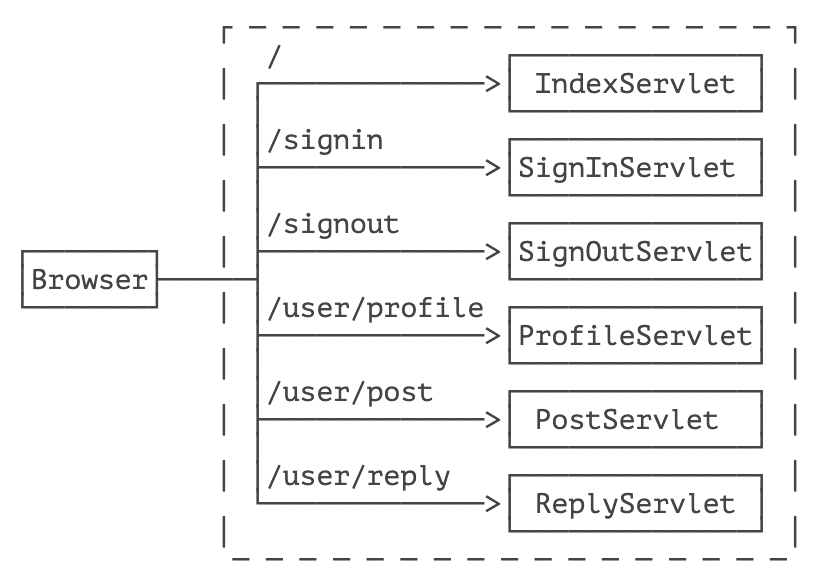
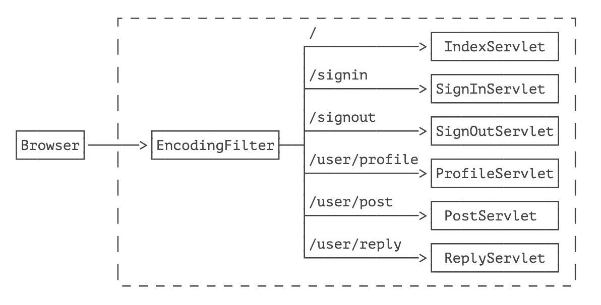
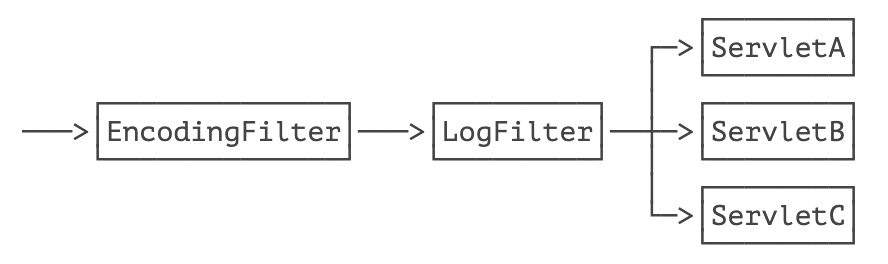

在一个比较复杂的 Web 应用程序中，通常都有很多 URL 映射，对应的，也会有多个 Servlet 来处理 URL。

我们考察这样一个论坛应用程序：



各个 Servlet 设计功能如下：

- IndexServlet：浏览帖子；
- SignInServlet：登录；
- SignOutServlet：登出；
- ProfileServlet：修改用户资料；
- PostServlet：发帖；
- ReplyServlet：回复。

其中，ProfileServlet、PostServlet 和 ReplyServlet 都需要用户登录后才能操作，否则，应当直接跳转到登录页面。

我们可以直接把判断登录的逻辑写到这 3 个 Servlet 中，但是，同样的逻辑重复 3 次没有必要，并且，如果后续继续加 Servlet 并且也需要验证登录时，还需要继续重复这个检查逻辑。

为了把一些公用逻辑从各个 Servlet 中抽离出来，JavaEE 的 Servlet 规范还提供了一种 Filter 组件，即过滤器，它的作用是，在 HTTP 请求到达 Servlet 之前，可以被一个或多个 Filter 预处理，类似打印日志、登录检查等逻辑，完全可以放到 Filter 中。

例如，我们编写一个最简单的 EncodingFilter，它强制把输入和输出的编码设置为 UTF-8：

```java
@WebFilter(urlPatterns = "/*")
public class EncodingFilter implements Filter {
    public void doFilter(ServletRequest request, ServletResponse response, FilterChain chain)
            throws IOException, ServletException {
        System.out.println("EncodingFilter:doFilter");
        request.setCharacterEncoding("UTF-8");
        response.setCharacterEncoding("UTF-8");
        chain.doFilter(request, response);
    }
}
```

编写 Filter 时，必须实现 `Filter` 接口，在 `doFilter()` 方法内部，要继续处理请求，必须调用 `chain.doFilter()`。最后，用 `@WebFilter` 注解标注该 Filter 需要过滤的 URL。这里的 `/*` 表示所有路径。

添加了 Filter 之后，整个请求的处理架构如下：



还可以继续添加其他 Filter，例如 LogFilter：

```java
@WebFilter("/*")
public class LogFilter implements Filter {
    public void doFilter(ServletRequest request, ServletResponse response, FilterChain chain)
            throws IOException, ServletException {
        System.out.println("LogFilter: process" + ((HttpServletRequest) request).getRequestURI());
        chain.doFilter(request, response);
    }
}
```

多个 Filter 会组成一个链，每个请求都被链上的 Filter 依次处理：



有些细心的童鞋会问，有多个 Filter 的时候，Filter 的顺序如何指定？多个 Filter 按不同顺序处理会造成处理结果不同吗？

答案是 Filter 的顺序确实对处理的结果有影响。但遗憾的是，Servlet 规范并没有对 `@WebFilter` 注解标注的 Filter 规定顺序。如果一定要给每个 Filter 指定顺序，就必须在 `web.xml` 文件中对这些 Filter 再配置一遍。

注意到上述两个 Filter 的过滤路径都是 `/*`，即它们会对所有请求进行过滤。也可以编写只对特定路径进行过滤的 Filter，例如 `AuthFilter`：

```java
@WebFilter("/user/*")
public class AuthFilter implements Filter {
    public void doFilter(ServletRequest request, ServletResponse response, FilterChain chain)
            throws IOException, ServletException {
        System.out.println("AuthFilter: check authentication");
        HttpServletRequest req = (HttpServletRequest) request;
        HttpServletResponse resp = (HttpServletResponse) response;
        if (req.getSession().getAttribute("user") == null) {
            // 未登录，自动跳转到登录页:
            System.out.println("AuthFilter: not signin!");
            resp.sendRedirect("/signin");
        } else {
            // 已登录，继续处理:
            chain.doFilter(request, response);
        }
    }
}
```

注意到 `AuthFilter` 只过滤以 `/user/` 开头的路径，因此：

- 如果一个请求路径类似 `/user/profile`，那么它会被上述 3 个 Filter 依次处理；
- 如果一个请求路径类似 `/test`，那么它会被上述 2 个 Filter 依次处理（不会被 AuthFilter 处理）。

再注意观察 `AuthFilter`，当用户没有登录时，在 `AuthFilter` 内部，直接调用 `resp.sendRedirect()` 发送重定向，且没有调用 `chain.doFilter()`，因此，当用户没有登录时，请求到达 `AuthFilter` 后，不再继续处理，即后续的 Filter 和任何 Servlet 都没有机会处理该请求了。

可见，Filter 可以有针对性地拦截或者放行 HTTP 请求。

如果一个 Filter 在当前请求中生效，但什么都没有做：

```java
@WebFilter("/*")
public class MyFilter implements Filter {
    public void doFilter(ServletRequest request, ServletResponse response, FilterChain chain)
            throws IOException, ServletException {
        // TODO
    }
}
```

那么，用户将看到一个空白页，因为请求没有继续处理，默认响应是 200 + 空白输出。

> [!caution]
> 如果 Filter 要使请求继续被处理，就一定要调用 chain.doFilter()！

如果我们使用上一节介绍的 MVC 模式，即一个统一的 `DispatcherServlet` 入口，加上多个 Controller，这种模式下 Filter 仍然是正常工作的。例如，一个处理 `/user/*` 的 Filter 实际上作用于那些处理 `/user/` 开头的 Controller 方法之前。

## 🍀 小结

Filter 是一种对 HTTP 请求进行预处理的组件，它可以构成一个处理链，使得公共处理代码能集中到一起；

Filter 适用于日志、登录检查、全局设置等；

设计合理的 URL 映射可以让 Filter 链更清晰。


