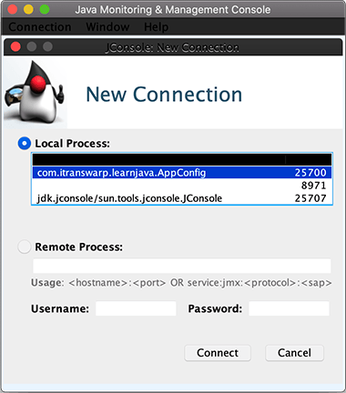
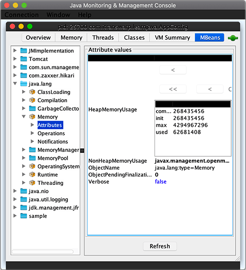
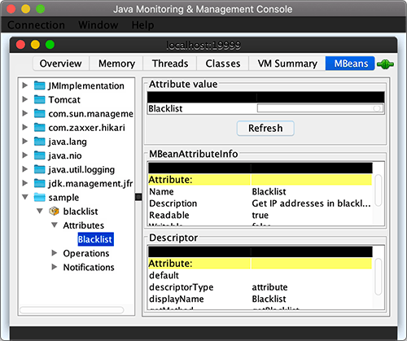
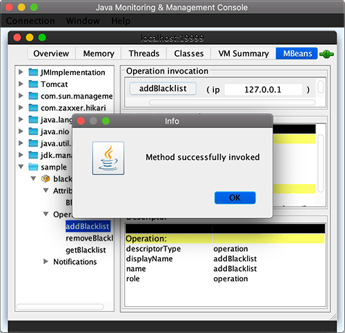
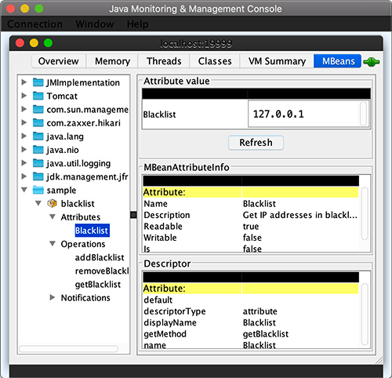
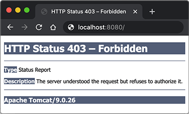

::: details 目录
[[toc]]
:::


Spring 框架不仅提供了标准的 IoC 容器、AOP 支持、数据库访问以及 WebMVC 等标准功能，还可以非常方便地集成许多常用的第三方组件：

- 可以集成 JavaMail 发送邮件；
- 可以集成 JMS 消息服务；
- 可以集成 Quartz 实现定时任务；
- 可以集成 Redis 等服务。

本章我们介绍如何在 Spring 中简单快捷地集成这些第三方组件。


## 🍀 集成 JavaMail


我们在 [发送 Email](https://www.liaoxuefeng.com/wiki/1252599548343744/1319099923693601) 和[接收 Email](https://www.liaoxuefeng.com/wiki/1252599548343744/1319099948859426)中已经介绍了如何通过 JavaMail 来收发电子邮件。在 Spring 中，同样可以集成 JavaMail。

因为在服务器端，主要以发送邮件为主，例如在注册成功、登录时、购物付款后通知用户，基本上不会遇到接收用户邮件的情况，所以本节我们只讨论如何在 Spring 中发送邮件。

在 Spring 中，发送邮件最终也是需要 JavaMail，Spring 只对 JavaMail 做了一点简单的封装，目的是简化代码。为了在 Spring 中集成 JavaMail，我们在 `pom.xml` 中添加以下依赖：

- org.springframework:spring-context-support:6.0.0
- jakarta.mail:jakarta.mail-api:2.0.1
- com.sun.mail:jakarta.mail:2.0.1

以及其他 Web 相关依赖。

我们希望用户在注册成功后能收到注册邮件，为此，我们先定义一个 `JavaMailSender` 的 Bean：

```java
@Bean
JavaMailSender createJavaMailSender(
        // smtp.properties:
        @Value("${smtp.host}") String host,
        @Value("${smtp.port}") int port,
        @Value("${smtp.auth}") String auth,
        @Value("${smtp.username}") String username,
        @Value("${smtp.password}") String password,
        @Value("${smtp.debug:true}") String debug)
{
    var mailSender = new JavaMailSenderImpl();
    mailSender.setHost(host);
    mailSender.setPort(port);
    mailSender.setUsername(username);
    mailSender.setPassword(password);
    Properties props = mailSender.getJavaMailProperties();
    props.put("mail.transport.protocol", "smtp");
    props.put("mail.smtp.auth", auth);
    if (port == 587) {
        props.put("mail.smtp.starttls.enable", "true");
    }
    if (port == 465) {
        props.put("mail.smtp.socketFactory.port", "465");
        props.put("mail.smtp.socketFactory.class", "javax.net.ssl.SSLSocketFactory");
    }
    props.put("mail.debug", debug);
    return mailSender;
}
```

这个 `JavaMailSender` 接口的实现类是 `JavaMailSenderImpl`，初始化时，传入的参数与 JavaMail 是完全一致的。

另外注意到需要注入的属性是从 `smtp.properties` 中读取的，因此，`AppConfig` 导入的就不止一个 `.properties` 文件，可以导入多个：

```java
@Configuration
@ComponentScan
@EnableWebMvc
@EnableTransactionManagement
@PropertySource({"classpath:/jdbc.properties", "classpath:/smtp.properties"})
public class AppConfig {
    ...
}
```

下一步是封装一个 `MailService`，并定义 `sendRegistrationMail()` 方法：

```java
@Component
public class MailService {
    @Value("${smtp.from}")
    String from;

    @Autowired
    JavaMailSender mailSender;

    public void sendRegistrationMail(User user) {
        try {
            MimeMessage mimeMessage = mailSender.createMimeMessage();
            MimeMessageHelper helper = new MimeMessageHelper(mimeMessage, "utf-8");
            helper.setFrom(from);
            helper.setTo(user.getEmail());
            helper.setSubject("Welcome to Java course!");
            String html = String.format("<p>Hi, %s,</p><p>Welcome to Java course!</p><p>Sent at %s</p>", user.getName(), LocalDateTime.now());
            helper.setText(html, true);
            mailSender.send(mimeMessage);
        } catch (MessagingException e) {
            throw new RuntimeException(e);
        }
    }
}
```

观察上述代码，`MimeMessage` 是 JavaMail 的邮件对象，而 `MimeMessageHelper` 是 Spring 提供的用于简化设置 MimeMessage 的类，比如我们设置 HTML 邮件就可以直接调用 `setText(String text, boolean html)` 方法，而不必再调用比较繁琐的 JavaMail 接口方法。

最后一步是调用 `JavaMailSender.send()` 方法把邮件发送出去。

在 MVC 的某个 Controller 方法中，当用户注册成功后，我们就启动一个新线程来异步发送邮件：

```java
User user = userService.register(email, password, name);
logger.info("user registered: {}", user.getEmail());
// send registration mail:
new Thread(() -> {
    mailService.sendRegistrationMail(user);
}).start();
```

因为发送邮件是一种耗时的任务，从几秒到几分钟不等，因此，异步发送是保证页面能快速显示的必要措施。这里我们直接启动了一个新的线程，但实际上还有更优化的方法，我们在下一节讨论。

### 练习


### 小结

Spring 可以集成 JavaMail，通过简单的封装，能简化邮件发送代码。其核心是定义一个 `JavaMailSender` 的 Bean，然后调用其 `send()` 方法。


## 🍀 集成 JMS

JMS 即 Java Message Service，是 JavaEE 的消息服务接口。JMS 主要有两个版本：1.1 和 2.0。2.0 和 1.1 相比，主要是简化了收发消息的代码。

所谓消息服务，就是两个进程之间，通过消息服务器传递消息：

```ascii
┌────────┐    ┌──────────────┐    ┌────────┐
│Producer│───>│Message Server│───>│Consumer│
└────────┘    └──────────────┘    └────────┘
```

使用消息服务，而不是直接调用对方的 API，它的好处是：

- 双方各自无需知晓对方的存在，消息可以异步处理，因为消息服务器会在 Consumer 离线的时候自动缓存消息；
- 如果 Producer 发送的消息频率高于 Consumer 的处理能力，消息可以积压在消息服务器，不至于压垮 Consumer；
- 通过一个消息服务器，可以连接多个 Producer 和多个 Consumer。

因为消息服务在各类应用程序中非常有用，所以 JavaEE 专门定义了 JMS 规范。注意到 JMS 是一组接口定义，如果我们要使用 JMS，还需要选择一个具体的 JMS 产品。常用的 JMS 服务器有开源的 [ActiveMQ](https://activemq.apache.org/)，商业服务器如 WebLogic、WebSphere 等也内置了 JMS 支持。这里我们选择开源的 ActiveMQ 作为 JMS 服务器，因此，在开发 JMS 之前我们必须首先安装 ActiveMQ。

现在问题来了：从官网下载 ActiveMQ 时，蹦出一个页面，让我们选择 ActiveMQ Classic 或者 ActiveMQ Artemis，这两个是什么关系，又有什么区别？

实际上 ActiveMQ Classic 原来就叫 ActiveMQ，是 Apache 开发的基于 JMS 1.1 的消息服务器，目前稳定版本号是 5.x，而 ActiveMQ Artemis 是由 RedHat 捐赠的 [HornetQ](https://hornetq.jboss.org/) 服务器代码的基础上开发的，目前稳定版本号是 2.x。和 ActiveMQ Classic 相比，Artemis 版的代码与 Classic 完全不同，并且，它支持 JMS 2.0，使用基于 Netty 的异步 IO，大大提升了性能。此外，Artemis 不仅提供了 JMS 接口，它还提供了 AMQP 接口，STOMP 接口和物联网使用的 MQTT 接口。选择 Artemis，相当于一鱼四吃。

所以，我们这里直接选择 ActiveMQ Artemis。从官网 [下载](https://activemq.apache.org/components/artemis/download/) 最新的 2.x 版本，解压后设置环境变量 `ARTEMIS_HOME`，指向 Artemis 根目录，例如 `C:\Apps\artemis`，然后，把 `ARTEMIS_HOME/bin` 加入 PATH 环境变量：

- Windows 下添加 `%ARTEMIS_HOME%\bin` 到 Path 路径；
- Mac 和 Linux 下添加 `$ARTEMIS_HOME/bin` 到 PATH 路径。

Artemis 有个很好的设计，就是它把程序和数据完全分离了。我们解压后的 `ARTEMIS_HOME` 目录是程序目录，要启动一个 Artemis 服务，还需要创建一个数据目录。我们把数据目录直接设定在项目 `spring-integration-jms` 的 `jms-data` 目录下。执行命令 `artemis create jms-data`：

```bash
$ pwd
/Users/liaoxuefeng/workspace/spring-integration-jms

$ artemis create jms-data
Creating ActiveMQ Artemis instance at: /Users/liaoxuefeng/workspace/spring-integration-jms/jms-data

--user: is a mandatory property!
Please provide the default username:
admin

--password: is mandatory with this configuration:
Please provide the default password:
********

--allow-anonymous | --require-login: is a mandatory property!
Allow anonymous access?, valid values are Y,N,True,False
N

Auto tuning journal ...
done! Your system can make 0.09 writes per millisecond, your journal-buffer-timeout will be 11392000

You can now start the broker by executing:

   "/Users/liaoxuefeng/workspace/spring-integration-jms/jms-data/bin/artemis" run

Or you can run the broker in the background using:

   "/Users/liaoxuefeng/workspace/spring-integration-jms/jms-data/bin/artemis-service" start
```

在创建过程中，会要求输入连接用户和口令，这里我们设定 `admin` 和 `password`，以及是否允许匿名访问（这里选择 `N`）。

此数据目录 `jms-data` 不仅包含消息数据、日志，还自动创建了两个启动服务的命令 `bin/artemis` 和 `bin/artemis-service`，前者在前台启动运行，按 Ctrl+C 结束，后者会一直在后台运行。

我们把目录切换到 `jms-data/bin`，直接运行 `artemis run` 即可启动 Artemis 服务：

```bash
$ ./artemis run
     _        _               _
    / \  ____| |_  ___ __  __(_) _____
   / _ \|  _ \ __|/ _ \  \/  | |/  __/
  / ___ \ | \/ |_/  __/ |\/| | |\___ \
 /_/   \_\|   \__\____|_|  |_|_|/___ /
 Apache ActiveMQ Artemis 2.13.0

...

2020-06-02 07:50:21,718 INFO  [org.apache.activemq.artemis] AMQ241001: HTTP Server started at http://localhost:8161
2020-06-02 07:50:21,718 INFO  [org.apache.activemq.artemis] AMQ241002: Artemis Jolokia REST API available at http://localhost:8161/console/jolokia
2020-06-02 07:50:21,719 INFO  [org.apache.activemq.artemis] AMQ241004: Artemis Console available at http://localhost:8161/console
```

启动成功后，Artemis 提示可以通过 URL`http://localhost:8161/console` 访问管理后台。注意 * 不要关闭命令行窗口 *。

 如果 Artemis 启动时显示警告：AMQ222212: Disk Full! ... Clients will report blocked. 这是因为磁盘空间不够，可以在 etc/broker.xml 配置中找到 <max-disk-usage> 并改为 99。

在编写 JMS 代码之前，我们首先得理解 JMS 的消息模型。JMS 把生产消息的一方称为 Producer，处理消息的一方称为 Consumer。有两种类型的消息通道，一种是 Queue：

```ascii
┌────────┐    ┌────────┐    ┌────────┐
│Producer│───>│ Queue  │───>│Consumer│
└────────┘    └────────┘    └────────┘
```

一种是 Topic：

```ascii
                            ┌────────┐
                         ┌─>│Consumer│
                         │  └────────┘
┌────────┐    ┌────────┐ │  ┌────────┐
│Producer│───>│ Topic  │─┼─>│Consumer│
└────────┘    └────────┘ │  └────────┘
                         │  ┌────────┐
                         └─>│Consumer│
                            └────────┘
```

它们的区别在于，Queue 是一种一对一的通道，如果 Consumer 离线无法处理消息时，Queue 会把消息存起来，等 Consumer 再次连接的时候发给它。设定了持久化机制的 Queue 不会丢失消息。如果有多个 Consumer 接入同一个 Queue，那么它们等效于以集群方式处理消息，例如，发送方发送的消息是 A，B，C，D，E，F，两个 Consumer 可能分别收到 A，C，E 和 B，D，F，即每个消息只会交给其中一个 Consumer 处理。

Topic 则是一种一对多通道。一个 Producer 发出的消息，会被多个 Consumer 同时收到，即每个 Consumer 都会收到一份完整的消息流。那么问题来了：如果某个 Consumer 暂时离线，过一段时间后又上线了，那么在它离线期间产生的消息还能不能收到呢？

这取决于消息服务器对 Topic 类型消息的持久化机制。如果消息服务器不存储 Topic 消息，那么离线的 Consumer 会丢失部分离线时期的消息，如果消息服务器存储了 Topic 消息，那么离线的 Consumer 可以收到自上次离线时刻开始后产生的所有消息。JMS 规范通过 Consumer 指定一个持久化订阅可以在上线后收取所有离线期间的消息，如果指定的是非持久化订阅，那么离线期间的消息会全部丢失。

细心的童鞋可以看出来，如果一个 Topic 的消息全部都持久化了，并且只有一个 Consumer，那么它和 Queue 其实是一样的。实际上，很多消息服务器内部都只有 Topic 类型的消息架构，Queue 可以通过 Topic“模拟” 出来。

无论是 Queue 还是 Topic，对 Producer 没有什么要求。多个 Producer 也可以写入同一个 Queue 或者 Topic，此时消息服务器内部会自动排序确保消息总是有序的。

以上是消息服务的基本模型。具体到某个消息服务器时，Producer 和 Consumer 通常是通过 TCP 连接消息服务器，在编写 JMS 程序时，又会遇到 `ConnectionFactory`、`Connection`、`Session` 等概念，其实这和 JDBC 连接是类似的：

- ConnectionFactory：代表一个到消息服务器的连接池，类似 JDBC 的 DataSource；
- Connection：代表一个到消息服务器的连接，类似 JDBC 的 Connection；
- Session：代表一个经过认证后的连接会话；
- Message：代表一个消息对象。

在 JMS 1.1 中，发送消息的典型代码如下：

```java
try {
    Connection connection = null;
    try {
        // 创建连接:
        connection = connectionFactory.createConnection();
        // 创建会话:
        Session session = connection.createSession(false,Session.AUTO_ACKNOWLEDGE);
        // 创建一个 Producer 并关联到某个 Queue:
        MessageProducer messageProducer = session.createProducer(queue);
        // 创建一个文本消息:
        TextMessage textMessage = session.createTextMessage(text);
        // 发送消息:
        messageProducer.send(textMessage);
    } finally {
        // 关闭连接:
        if (connection != null) {
            connection.close();
        }
    }
} catch (JMSException ex) {
    // 处理 JMS 异常
}
```

JMS 2.0 改进了一些 API 接口，发送消息变得更简单：

```java
try (JMSContext context = connectionFactory.createContext()) {
    context.createProducer().send(queue, text);
}
```

`JMSContext` 实现了 `AutoCloseable` 接口，可以使用 `try(resource)` 语法，代码更简单。

有了以上预备知识，我们就可以开始开发 JMS 应用了。

首先，我们在 `pom.xml` 中添加如下依赖：

- org.springframework:spring-jms:6.0.0
- org.apache.activemq:artemis-jakarta-client:2.27.0

Artemis 的 Client 接口依赖了 `jakarta.jms:jakarta.jms-api`，因此不必再引入 JMS API 的依赖。

在 AppConfig 中，通过 `@EnableJms` 让 Spring 自动扫描 JMS 相关的 Bean，并加载 JMS 配置文件 `jms.properties`：

```
@Configuration
@ComponentScan
@EnableWebMvc
@EnableJms // 启用 JMS
@EnableTransactionManagement
@PropertySource({"classpath:/jdbc.properties", "classpath:/jms.properties"})
public class AppConfig {
    ...
}
```

首先要创建的 Bean 是 `ConnectionFactory`，即连接消息服务器的连接池：

```java
@Bean
ConnectionFactory createJMSConnectionFactory(
    @Value("${jms.uri:tcp://localhost:61616}") String uri,
    @Value("${jms.username:admin}") String username,
    @Value("${jms.password:password}") String password)
{
    return new ActiveMQJMSConnectionFactory(uri, username, password);
}
```

因为我们使用的消息服务器是 ActiveMQ Artemis，所以 `ConnectionFactory` 的实现类就是消息服务器提供的 `ActiveMQJMSConnectionFactory`，它需要的参数均由配置文件读取后传入，并设置了默认值。

我们再创建一个 `JmsTemplate`，它是 Spring 提供的一个工具类，和 `JdbcTemplate` 类似，可以简化发送消息的代码：

```java
@Bean
JmsTemplate createJmsTemplate(@Autowired ConnectionFactory connectionFactory) {
    return new JmsTemplate(connectionFactory);
}
```

下一步要创建的是 `JmsListenerContainerFactory`，

```java
@Bean("jmsListenerContainerFactory")
DefaultJmsListenerContainerFactory createJmsListenerContainerFactory(@Autowired ConnectionFactory connectionFactory) {
    var factory = new DefaultJmsListenerContainerFactory();
    factory.setConnectionFactory(connectionFactory);
    return factory;
}
```

除了必须指定 Bean 的名称为 `jmsListenerContainerFactory` 外，这个 Bean 的作用是处理和 Consumer 相关的 Bean。我们先跳过它的原理，继续编写 `MessagingService` 来发送消息：

```java
@Component
public class MessagingService {
    @Autowired ObjectMapper objectMapper;
    @Autowired JmsTemplate jmsTemplate;

    public void sendMailMessage(MailMessage msg) throws Exception {
        String text = objectMapper.writeValueAsString(msg);
        jmsTemplate.send("jms/queue/mail", new MessageCreator() {
            public Message createMessage(Session session) throws JMSException {
                return session.createTextMessage(text);
            }
        });
    }
}
```

JMS 的消息类型支持以下几种：

- TextMessage：文本消息；
- BytesMessage：二进制消息；
- MapMessage：包含多个 Key-Value 对的消息；
- ObjectMessage：直接序列化 Java 对象的消息；
- StreamMessage：一个包含基本类型序列的消息。

最常用的是发送基于 JSON 的文本消息，上述代码通过 `JmsTemplate` 创建一个 `TextMessage` 并发送到名称为 `jms/queue/mail` 的 Queue。

注意：Artemis 消息服务器默认配置下会自动创建 Queue，因此不必手动创建一个名为 `jms/queue/mail` 的 Queue，但不是所有的消息服务器都会自动创建 Queue，生产环境的消息服务器通常会关闭自动创建功能，需要手动创建 Queue。

再注意到 `MailMessage` 是我们自己定义的一个 JavaBean，真正的 JMS 消息是创建的 `TextMessage`，它的内容是 JSON。

当用户注册成功后，我们就调用 `MessagingService.sendMailMessage()` 发送一条 JMS 消息，此代码十分简单，这里不再贴出。

下面我们要详细讨论的是如何处理消息，即编写 Consumer。从理论上讲，可以创建另一个 Java 进程来处理消息，但对于我们这个简单的 Web 程序来说没有必要，直接在同一个 Web 应用中接收并处理消息即可。

处理消息的核心代码是编写一个 Bean，并在处理方法上标注 `@JmsListener`：

```java
@Component
public class MailMessageListener {
    final Logger logger = LoggerFactory.getLogger(getClass());

    @Autowired ObjectMapper objectMapper;
    @Autowired MailService mailService;

    @JmsListener(destination = "jms/queue/mail", concurrency = "10")
    public void onMailMessageReceived(Message message) throws Exception {
        logger.info("received message:" + message);
        if (message instanceof TextMessage) {
            String text = ((TextMessage) message).getText();
            MailMessage mm = objectMapper.readValue(text, MailMessage.class);
            mailService.sendRegistrationMail(mm);
        } else {
            logger.error("unable to process non-text message!");
        }
    }
}
```

注意到 `@JmsListener` 指定了 Queue 的名称，因此，凡是发到此 Queue 的消息都会被这个 `onMailMessageReceived()` 方法处理，方法参数是 JMS 的 `Message` 接口，我们通过强制转型为 `TextMessage` 并提取 JSON，反序列化后获得自定义的 JavaBean，也就获得了发送邮件所需的所有信息。

下面问题来了：Spring 处理 JMS 消息的流程是什么？

如果我们直接调用 JMS 的 API 来处理消息，那么编写的代码大致如下：

```
// 创建 JMS 连接:
Connection connection = connectionFactory.createConnection();
// 创建会话:
Session session = connection.createSession(false, Session.AUTO_ACKNOWLEDGE);
// 创建一个 Consumer:
MessageConsumer consumer = session.createConsumer(queue);
// 为 Consumer 指定一个消息处理器:
consumer.setMessageListener(new MessageListener() {
    public void onMessage(Message message) {
        // 在此处理消息...
    }
});
// 启动接收消息的循环:
connection.start();
```

我们自己编写的 `MailMessageListener.onMailMessageReceived()` 相当于消息处理器：

```
consumer.setMessageListener(new MessageListener() {
    public void onMessage(Message message) {
        mailMessageListener.onMailMessageReceived(message);
    }
});
```

所以，Spring 根据 `AppConfig` 的注解 `@EnableJms` 自动扫描带有 `@JmsListener` 的 Bean 方法，并为其创建一个 `MessageListener` 把它包装起来。

注意到前面我们还创建了一个 `JmsListenerContainerFactory` 的 Bean，它的作用就是为每个 `MessageListener` 创建 `MessageConsumer` 并启动消息接收循环。

再注意到 `@JmsListener` 还有一个 `concurrency` 参数，10 表示可以最多同时并发处理 10 个消息，`5-10` 表示并发处理的线程可以在 5~10 之间调整。

因此，Spring 在通过 `MessageListener` 接收到消息后，并不是直接调用 `mailMessageListener.onMailMessageReceived()`，而是用线程池调用，因此，要时刻牢记，`onMailMessageReceived()` 方法可能被多线程并发执行，一定要保证线程安全。

我们总结一下 Spring 接收消息的步骤：

通过 `JmsListenerContainerFactory` 配合 `@EnableJms` 扫描所有 `@JmsListener` 方法，自动创建 `MessageConsumer`、`MessageListener` 以及线程池，启动消息循环接收处理消息，最终由我们自己编写的 `@JmsListener` 方法处理消息，可能会由多线程同时并发处理。

要验证消息发送和处理，我们注册一个新用户，可以看到如下日志输出：

```
2020-06-02 08:04:27 INFO  c.i.learnjava.web.UserController - user registered: bob@example.com
2020-06-02 08:04:27 INFO  c.i.l.service.MailMessageListener - received message: ActiveMQMessage[ID:9fc5...]:PERSISTENT/ClientMessageImpl[messageID=983, durable=true, address=jms/queue/mail, ...]]
2020-06-02 08:04:27 INFO  c.i.learnjava.service.MailService - [send mail] sending registration mail to bob@example.com...
2020-06-02 08:04:30 INFO  c.i.learnjava.service.MailService - [send mail] registration mail was sent to bob@example.com.
```

可见，消息被成功发送到 Artemis，然后在很短的时间内被接收处理了。

使用消息服务对发送 Email 进行改造的好处是，发送 Email 的能力通常是有限的，通过 JMS 消息服务，如果短时间内需要给大量用户发送 Email，可以先把消息堆积在 JMS 服务器上慢慢发送，对于批量发送邮件、短信等尤其有用。

### 练习


### 小结

JMS 是 Java 消息服务，可以通过 JMS 服务器实现消息的异步处理。

消息服务主要解决 Producer 和 Consumer 生产和处理速度不匹配的问题。


## 🍀 使用 Scheduler


在很多应用程序中，经常需要执行定时任务。例如，每天或每月给用户发送账户汇总报表，定期检查并发送系统状态报告，等等。

定时任务我们在 [使用线程池](https://www.liaoxuefeng.com/wiki/1252599548343744/1306581130018849) 一节中已经讲到了，Java 标准库本身就提供了定时执行任务的功能。在 Spring 中，使用定时任务更简单，不需要手写线程池相关代码，只需要两个注解即可。

我们还是以实际代码为例，建立工程 `spring-integration-schedule`，无需额外的依赖，我们可以直接在 `AppConfig` 中加上 `@EnableScheduling` 就开启了定时任务的支持：

```java
@Configuration
@ComponentScan
@EnableWebMvc
@EnableScheduling
@EnableTransactionManagement
@PropertySource({"classpath:/jdbc.properties", "classpath:/task.properties"})
public class AppConfig {
    ...
}
```

接下来，我们可以直接在一个 Bean 中编写一个 `public void` 无参数方法，然后加上 `@Scheduled` 注解：

```java
@Component
public class TaskService {
    final Logger logger = LoggerFactory.getLogger(getClass());

    @Scheduled(initialDelay = 60_000, fixedRate = 60_000)
    public void checkSystemStatusEveryMinute() {
        logger.info("Start check system status...");
    }
}
```

上述注解指定了启动延迟 60 秒，并以 60 秒的间隔执行任务。现在，我们直接运行应用程序，就可以在控制台看到定时任务打印的日志：

```bash
2020-06-03 18:47:32 INFO  [pool-1-thread-1] c.i.learnjava.service.TaskService - Start check system status...
2020-06-03 18:48:32 INFO  [pool-1-thread-1] c.i.learnjava.service.TaskService - Start check system status...
2020-06-03 18:49:32 INFO  [pool-1-thread-1] c.i.learnjava.service.TaskService - Start check system status...
```

如果没有看到定时任务的日志，需要检查：

- 是否忘记了在 `AppConfig` 中标注 `@EnableScheduling`；
- 是否忘记了在定时任务的方法所在的 class 标注 `@Component`。

除了可以使用 `fixedRate` 外，还可以使用 `fixedDelay`，两者的区别我们已经在 [使用线程池](https://www.liaoxuefeng.com/wiki/1252599548343744/1306581130018849) 一节中讲过，这里不再重复。

有的童鞋在实际开发中会遇到一个问题，因为 Java 的注解全部是常量，写死了 `fixedDelay=30000`，如果根据实际情况要改成 60 秒怎么办，只能重新编译？

我们可以把定时任务的配置放到配置文件中，例如 `task.properties`：

```
task.checkDiskSpace=30000
```

这样就可以随时修改配置文件而无需动代码。但是在代码中，我们需要用 `fixedDelayString` 取代 `fixedDelay`：

```java
@Component
public class TaskService {
    ...

    @Scheduled(initialDelay = 30_000, fixedDelayString = "${task.checkDiskSpace:30000}")
    public void checkDiskSpaceEveryMinute() {
        logger.info("Start check disk space...");
    }
}
```

注意到上述代码的注解参数 `fixedDelayString` 是一个属性占位符，并配有默认值 30000，Spring 在处理 `@Scheduled` 注解时，如果遇到 `String`，会根据占位符自动用配置项替换，这样就可以灵活地修改定时任务的配置。

此外，`fixedDelayString` 还可以使用更易读的 `Duration`，例如：

```
@Scheduled(initialDelay = 30_000, fixedDelayString = "${task.checkDiskSpace:PT2M30S}")
```

以字符串 `PT2M30S` 表示的 `Duration` 就是 2 分 30 秒，请参考 [LocalDateTime](https://www.liaoxuefeng.com/wiki/1252599548343744/1303871087444002) 一节的 Duration 相关部分。

多个 `@Scheduled` 方法完全可以放到一个 Bean 中，这样便于统一管理各类定时任务。

### 使用 Cron 任务

还有一类定时任务，它不是简单的重复执行，而是按时间触发，我们把这类任务称为 Cron 任务，例如：

- 每天凌晨 2:15 执行报表任务；
- 每个工作日 12:00 执行特定任务；
- ……

Cron 源自 Unix/Linux 系统自带的 crond 守护进程，以一个简洁的表达式定义任务触发时间。在 Spring 中，也可以使用 Cron 表达式来执行 Cron 任务，在 Spring 中，它的格式是：

```
秒 分 小时 天 月份 星期 年
```

年是可以忽略的，通常不写。每天凌晨 2:15 执行的 Cron 表达式就是：

```
0 15 2 * * *
```

每个工作日 12:00 执行的 Cron 表达式就是：

```
0 0 12 * * MON-FRI
```

每个月 1 号，2 号，3 号和 10 号 12:00 执行的 Cron 表达式就是：

```
0 0 12 1-3,10 * *
```

在 Spring 中，我们定义一个每天凌晨 2:15 执行的任务：

```java
@Component
public class TaskService {
    ...

    @Scheduled(cron = "${task.report:0 15 2 * * *}")
    public void cronDailyReport() {
        logger.info("Start daily report task...");
    }
}
```

Cron 任务同样可以使用属性占位符，这样修改起来更加方便。

Cron 表达式还可以表达每 10 分钟执行，例如：

```
0 */10 * * * *
```

这样，在每个小时的 0:00，10:00，20:00，30:00，40:00，50:00 均会执行任务，实际上它可以取代 `fixedRate` 类型的定时任务。

### 集成 Quartz

在 Spring 中使用定时任务和 Cron 任务都十分简单，但是要注意到，这些任务的调度都是在每个 JVM 进程中的。如果在本机启动两个进程，或者在多台机器上启动应用，这些进程的定时任务和 Cron 任务都是独立运行的，互不影响。

如果一些定时任务要以集群的方式运行，例如每天 23:00 执行检查任务，只需要集群中的一台运行即可，这个时候，可以考虑使用 [Quartz](https://www.quartz-scheduler.org/)。

Quartz 可以配置一个 JDBC 数据源，以便存储所有的任务调度计划以及任务执行状态。也可以使用内存来调度任务，但这样配置就和使用 Spring 的调度没啥区别了，额外集成 Quartz 的意义就不大。

Quartz 的 JDBC 配置比较复杂，Spring 对其也有一定的支持。要详细了解 Quartz 的集成，请参考 [Spring 的文档](https://docs.spring.io/spring/docs/current/spring-framework-reference/integration.html#scheduling-quartz)。

思考：如果不使用 Quartz 的 JDBC 配置，多个 Spring 应用同时运行时，如何保证某个任务只在某一台机器执行？

### 练习


### 小结

Spring 内置定时任务和 Cron 任务的支持，编写调度任务十分方便。


## 🍀 集成 JMX

在 Spring 中，可以方便地集成 JMX。

那么第一个问题来了：什么是 JMX？

JMX 是 Java Management Extensions，它是一个 Java 平台的管理和监控接口。为什么要搞 JMX 呢？因为在所有的应用程序中，对运行中的程序进行监控都是非常重要的，Java 应用程序也不例外。我们肯定希望知道 Java 应用程序当前的状态，例如，占用了多少内存，分配了多少内存，当前有多少活动线程，有多少休眠线程等等。如何获取这些信息呢？

为了标准化管理和监控，Java 平台使用 JMX 作为管理和监控的标准接口，任何程序，只要按 JMX 规范访问这个接口，就可以获取所有管理与监控信息。

实际上，常用的运维监控如 Zabbix、Nagios 等工具对 JVM 本身的监控都是通过 JMX 获取的信息。

因为 JMX 是一个标准接口，不但可以用于管理 JVM，还可以管理应用程序自身。下图是 JMX 的架构：

```ascii
    ┌─────────┐  ┌─────────┐
    │jconsole │  │   Web   │
    └─────────┘  └─────────┘
         │            │
┌ ─ ─ ─ ─│─ ─ ─ ─ ─ ─ ┼ ─ ─ ─ ─
 JVM     ▼            ▼        │
│   ┌─────────┐  ┌─────────┐
  ┌─┤Connector├──┤ Adaptor ├─┐ │
│ │ └─────────┘  └─────────┘ │
  │       MBeanServer        │ │
│ │ ┌──────┐┌──────┐┌──────┐ │
  └─┤MBean1├┤MBean2├┤MBean3├─┘ │
│   └──────┘└──────┘└──────┘
 ─ ─ ─ ─ ─ ─ ─ ─ ─ ─ ─ ─ ─ ─ ─ ┘
```

JMX 把所有被管理的资源都称为 MBean（Managed Bean），这些 MBean 全部由 MBeanServer 管理，如果要访问 MBean，可以通过 MBeanServer 对外提供的访问接口，例如通过 RMI 或 HTTP 访问。

注意到使用 JMX 不需要安装任何额外组件，也不需要第三方库，因为 MBeanServer 已经内置在 JavaSE 标准库中了。JavaSE 还提供了一个 `jconsole` 程序，用于通过 RMI 连接到 MBeanServer，这样就可以管理整个 Java 进程。

除了 JVM 会把自身的各种资源以 MBean 注册到 JMX 中，我们自己的配置、监控信息也可以作为 MBean 注册到 JMX，这样，管理程序就可以直接控制我们暴露的 MBean。因此，应用程序使用 JMX，只需要两步：

1. 编写 MBean 提供管理接口和监控数据；
2. 注册 MBean。

在 Spring 应用程序中，使用 JMX 只需要一步：

1. 编写 MBean 提供管理接口和监控数据。

第二步注册的过程由 Spring 自动完成。我们以实际工程为例，首先在 `AppConfig` 中加上 `@EnableMBeanExport` 注解，告诉 Spring 自动注册 MBean：

```
@Configuration
@ComponentScan
@EnableWebMvc
@EnableMBeanExport // 自动注册 MBean
@EnableTransactionManagement
@PropertySource({"classpath:/jdbc.properties"})
public class AppConfig {
    ...
}
```

剩下的全部工作就是编写 MBean。我们以实际问题为例，假设我们希望给应用程序添加一个 IP 黑名单功能，凡是在黑名单中的 IP 禁止访问，传统的做法是定义一个配置文件，启动的时候读取：

```
## 🍀 blacklist.txt
1.2.3.4
5.6.7.8
2.2.3.4
...
```

如果要修改黑名单怎么办？修改配置文件，然后重启应用程序。

但是每次都重启应用程序实在是太麻烦了，能不能不重启应用程序？可以自己写一个定时读取配置文件的功能，检测到文件改动时自动重新读取。

上述需求本质上是在应用程序运行期间对参数、配置等进行热更新并要求尽快生效。如果以 JMX 的方式实现，我们不必自己编写自动重新读取等任何代码，只需要提供一个符合 JMX 标准的 MBean 来存储配置即可。

还是以 IP 黑名单为例，JMX 的 MBean 通常以 MBean 结尾，因此我们遵循标准命名规范，首先编写一个 `BlacklistMBean`：

```
public class BlacklistMBean {
    private Set<String> ips = new HashSet<>();

    public String[] getBlacklist() {
        return ips.toArray(String[]::new);
    }

    public void addBlacklist(String ip) {
        ips.add(ip);
    }

    public void removeBlacklist(String ip) {
        ips.remove(ip);
    }

    public boolean shouldBlock(String ip) {
        return ips.contains(ip);
    }
}
```

这个 MBean 没什么特殊的，它的逻辑和普通 Java 类没有任何区别。

下一步，我们要使用 JMX 的客户端来实时热更新这个 MBean，所以要给它加上一些注解，让 Spring 能根据注解自动把相关方法注册到 MBeanServer 中：

```java
@Component
@ManagedResource(objectName = "sample:name=blacklist", description = "Blacklist of IP addresses")
public class BlacklistMBean {
    private Set<String> ips = new HashSet<>();

    @ManagedAttribute(description = "Get IP addresses in blacklist")
    public String[] getBlacklist() {
        return ips.toArray(String[]::new);
    }

    @ManagedOperation
    @ManagedOperationParameter(name = "ip", description = "Target IP address that will be added to blacklist")
    public void addBlacklist(String ip) {
        ips.add(ip);
    }

    @ManagedOperation
    @ManagedOperationParameter(name = "ip", description = "Target IP address that will be removed from blacklist")
    public void removeBlacklist(String ip) {
        ips.remove(ip);
    }

    public boolean shouldBlock(String ip) {
        return ips.contains(ip);
    }
}
```

观察上述代码，`BlacklistMBean` 首先是一个标准的 Spring 管理的 Bean，其次，添加了 `@ManagedResource` 表示这是一个 MBean，将要被注册到 JMX。objectName 指定了这个 MBean 的名字，通常以 `company:name=Xxx` 来分类 MBean。

对于属性，使用 `@ManagedAttribute` 注解标注。上述 MBean 只有 get 属性，没有 set 属性，说明这是一个只读属性。

对于操作，使用 `@ManagedOperation` 注解标准。上述 MBean 定义了两个操作：`addBlacklist()` 和 `removeBlacklist()`，其他方法如 `shouldBlock()` 不会被暴露给 JMX。

使用 MBean 和普通 Bean 是完全一样的。例如，我们在 `BlacklistInterceptor` 对 IP 进行黑名单拦截：

```
@Order(1)
@Component
public class BlacklistInterceptor implements HandlerInterceptor {
    final Logger logger = LoggerFactory.getLogger(getClass());

    @Autowired
    BlacklistMBean blacklistMBean;

    @Override
    public boolean preHandle(HttpServletRequest request, HttpServletResponse response, Object handler)
            throws Exception {
        String ip = request.getRemoteAddr();
        logger.info("check ip address {}...", ip);
        // 是否在黑名单中:
        if (blacklistMBean.shouldBlock(ip)) {
            logger.warn("will block ip {} for it is in blacklist.", ip);
            // 发送 403 错误响应:
            response.sendError(403);
            return false;
        }
        return true;
    }
}
```

下一步就是正常启动 Web 应用程序，不要关闭它，我们打开另一个命令行窗口，输入 `jconsole` 启动 JavaSE 自带的一个 JMX 客户端程序：



通过 jconsole 连接到一个 Java 进程最简单的方法是直接在 Local Process 中找到正在运行的 `AppConfig`，点击 Connect 即可连接到我们当前正在运行的 Web 应用，在 jconsole 中可直接看到内存、CPU 等资源的监控。

我们点击 MBean，左侧按分类列出所有 MBean，可以在 `java.lang` 查看内存等信息：



细心的童鞋可以看到 HikariCP 连接池也是通过 JMX 监控的。

在 `sample` 中可以看到我们自己的 MBean，点击可查看属性 `blacklist`：



点击 `Operations`-`addBlacklist`，可以填入 `127.0.0.1` 并点击 `addBlacklist` 按钮，相当于 jconsole 通过 JMX 接口，调用了我们自己的 `BlacklistMBean` 的 `addBlacklist()` 方法，传入的参数就是填入的 `127.0.0.1`：



再次查看属性 `blacklist`，可以看到结果已经更新了：



我们可以在浏览器中测试一下黑名单功能是否已生效：



可见，`127.0.0.1` 确实被添加到了黑名单，后台日志打印如下：

```
2020-06-06 20:22:12 INFO  c.i.l.web.BlacklistInterceptor - check ip address 127.0.0.1...
2020-06-06 20:22:12 WARN  c.i.l.web.BlacklistInterceptor - will block ip 127.0.0.1 for it is in blacklist.
```

注意：如果使用 IPv6，那么需要把 `0:0:0:0:0:0:0:1` 这个本机地址加到黑名单。

如果从 jconsole 中调用 `removeBlacklist` 移除 `127.0.0.1`，刷新浏览器可以看到又允许访问了。

使用 jconsole 直接通过 Local Process 连接 JVM 有个限制，就是 jconsole 和正在运行的 JVM 必须在同一台机器。如果要远程连接，首先要打开 JMX 端口。我们在启动 `AppConfig` 时，需要传入以下 JVM 启动参数：

- -Dcom.sun.management.jmxremote.port=19999
- -Dcom.sun.management.jmxremote.authenticate=false
- -Dcom.sun.management.jmxremote.ssl=false

第一个参数表示在 19999 端口监听 JMX 连接，第二个和第三个参数表示无需验证，不使用 SSL 连接，在开发测试阶段比较方便，生产环境必须指定验证方式并启用 SSL。详细参数可参考 Oracle[官方文档](https://docs.oracle.com/javase/8/docs/technotes/guides/management/agent.html#gdeum)。这样 jconsole 可以用 `ip:19999` 的远程方式连接 JMX。连接后的操作是完全一样的。

许多 JavaEE 服务器如 JBoss 的管理后台都是通过 JMX 提供管理接口，并由 Web 方式访问，对用户更加友好。

在实际项目中，通过 JMX 实现配置的实时更新其实并不常用，JMX 更多地用于收集 JVM 的运行状态和应用程序的性能数据，然后通过监控服务器汇总数据后实现监控与报警。一个典型的监控系统架构如下：

```ascii
┌───────────────┐   ┌───────────────┐
│  Web Console  │◀──│Metrics Server │
└───────────────┘   └───────────────┘
                            │
                            │
   ┌ ─ ─ ─ ─ ─ ─ ─ ─ ─ ─ ─ ─│─ ─ ┐
     ┌───────────────┐      │
   │ │      App      │      │    │
     ├─────────┬─────┤   ┌─────┐
   │ │         │ JMX │──▶│Agent│ │
     │         └─────┤   └─────┘
   │ │      JVM      │           │
     └───────────────┘
   └ ─ ─ ─ ─ ─ ─ ─ ─ ─ ─ ─ ─ ─ ─ ┘
```

其中，App 自身和 JVM 的的统计数据都通过 JMX 收集并发送给本机的一个 Agent，Agent 再将数据发送至监控服务器，最后以可视化的形式将监控数据通过 Web 等形式展示给用户。常用的监控系统有开源的 [Prometheus](https://prometheus.io/) 和以云服务方式提供的 [DataDog](https://www.datadoghq.com/) 等。

### 练习

编写一个 MBean 统计当前注册用户数量，并在 jconsole 中查看：


### 小结

在 Spring 中使用 JMX 需要：

- 通过 `@EnableMBeanExport` 启用自动注册 MBean；
- 编写 MBean 并实现管理属性和管理操作。


