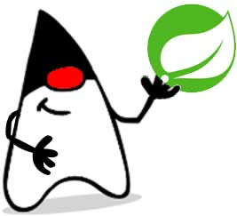

::: details 目录
[[toc]]
:::

## 🍀 什么是 Spring？

Spring 是一个支持快速开发 Java EE 应用程序的框架。它提供了一系列底层容器和基础设施，并可以和大量常用的开源框架无缝集成，可以说是开发 Java EE 应用程序的必备。

Spring 最早是由 Rod Johnson 这哥们在他的 [《Expert One-on-One J2EE Development without EJB》](https://book.douban.com/subject/1426848/) 一书中提出的用来取代 EJB 的轻量级框架。随后这哥们又开始专心开发这个基础框架，并起名为 Spring Framework。

随着 Spring 越来越受欢迎，在 Spring Framework 基础上，又诞生了 Spring Boot、Spring Cloud、Spring Data、Spring Security 等一系列基于 Spring Framework 的项目。本章我们只介绍 Spring Framework，即最核心的 Spring 框架。后续章节我们还会涉及 Spring Boot、Spring Cloud 等其他框架。

## 🍀 Spring Framework

Spring Framework 主要包括几个模块：

- 支持 IoC 和 AOP 的容器；
- 支持 JDBC 和 ORM 的数据访问模块；
- 支持声明式事务的模块；
- 支持基于 Servlet 的 MVC 开发；
- 支持基于 Reactive 的 Web 开发；
- 以及集成 JMS、JavaMail、JMX、缓存等其他模块。

我们会依次介绍 Spring Framework 的主要功能。

本教程使用的 Spring 版本是 6.x 版，如果使用 Spring 5.x 则需注意，两者有以下不同：

| | Spring 5.x | Spring 6.x |
| -- | :--: | :--: |
| JDK 版本 | >= 1.8 | >= 17 | 
| Tomcat 版本 | 9.x | 10.x | 
| Annotation 包 | javax.annotation | jakarta.annotation | 
| Servlet 包 | javax.servlet	jakarta.servlet | 
| JMS 包 | javax.jms | jakarta.jms | 
| JavaMail 包 | javax.mail | jakarta.mail | 

如果使用 Spring 的其他版本，则需要根据需要调整代码。

