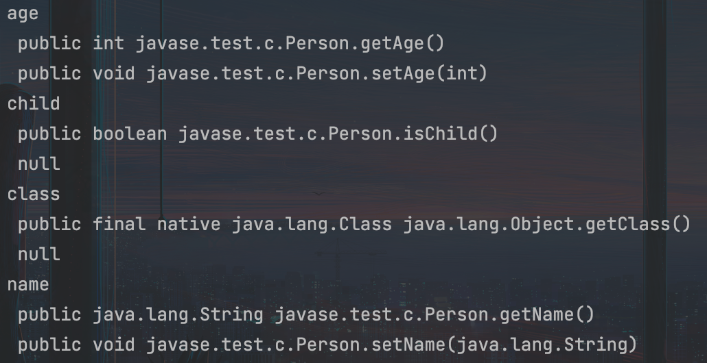

::: details 目录
[[toc]]
:::


在 Java 中，有很多 `class` 的定义都符合这样的规范：

- 若干 `private` 实例字段；
- 通过 `public` 方法来读写实例字段。

例如：

```java
public class Person {
    private String name;
    private int age;

    public String getName() { return this.name;}
    public void setName(String name) { this.name = name; }

    public int getAge() { return this.age;}
    public void setAge(int age) { this.age = age; }
}
```

如果读写方法符合以下这种命名规范：


```java
// 读方法:
public Type getXyz()
// 写方法:
public void setXyz(Type value)
```

那么这种 `class` 被称为 `JavaBean` ：


上面的字段是 `xyz` ，那么读写方法名分别以 `get` 和 `set` 开头，并且后接大写字母开头的字段名 `Xyz` ，因此两个读写方法名分别是 `getXyz()` 和 `setXyz()` 。

`boolean` 字段比较特殊，它的读方法一般命名为 `isXyz()` ：

```java
// 读方法:
public boolean isChild()
// 写方法:
public void setChild(boolean value)
```

我们通常把一组对应的读方法（ `getter` ）和写方法（ `setter` ）称为属性（ `property` ）。例如， `name` 属性：

- 对应的读方法是 `String getName()`
- 对应的写方法是 `setName(String)`

只有 `getter` 的属性称为只读属性（ read-only ），例如，定义一个 age 只读属性：

- 对应的读方法是 `int getAge()`
- 无对应的写方法 `setAge(int)`

类似的，只有 `setter` 的属性称为 ***只写属性*** （ write-only ）。

很明显，只读属性很常见，只写属性不常见。

属性只需要定义 `getter` 和 `setter` 方法，不一定需要对应的字段。例如， `child` 只读属性定义如下：


```java
public class Person {
    private String name;
    private int age;

    public String getName() { return this.name; }
    public void setName(String name) { this.name = name; }

    public int getAge() { return this.age; }
    public void setAge(int age) { this.age = age; }

    public boolean isChild() {
        return age <= 6;
    }
}
```


可以看出， `getter` 和 `setter` 也是一种数据封装的方法。


## 🍀 JavaBean 的作用

***JavaBean 主要用来传递数据*** ，即把一组数据组合成一个 JavaBean 便于传输。此外，JavaBean 可以方便地被 IDE 工具分析，生成读写属性的代码，主要用在图形界面的可视化设计中。

通过 IDE，可以快速生成 `getter` 和 `setter` 。例如，在 IDEA 中，先输入以下代码：

```java
public class Person {
    private String name;
    private int age;
}
```
然后，点击右键，在弹出的菜单中选择 “Generate” (cmd + N) ， “Getters / Setters” ，在弹出的对话框中选中需要生成 getter 和 setter 方法的字段，点击确定即可由 IDE 自动完成所有方法代码。


## 🍀 枚举 JavaBean 属性

要枚举一个 JavaBean 的所有属性，可以直接使用 Java 核心库提供的 `Introspector` ：

```java
import java.beans.*;
public class Main {
    public static void main(String[] args) throws Exception {
        BeanInfo info = Introspector.getBeanInfo(Person.class);
        for (PropertyDescriptor pd : info.getPropertyDescriptors()) {
            System.out.println(pd.getName());
            System.out.println(" " + pd.getReadMethod());
            System.out.println(" " + pd.getWriteMethod());
        }
    }
}

class Person {
    private String name;
    private int age;

    public String getName() {
        return name;
    }

    public void setName(String name) {
        this.name = name;
    }

    public int getAge() {
        return age;
    }

    public void setAge(int age) {
        this.age = age;
    }
}
```


运行上述代码，可以列出所有的属性，以及对应的读写方法。注意 `class` 属性是从 `Object` 继承的 `getClass()` 方法带来的。





## 🍀 小结

- JavaBean 是一种符合命名规范的 `class` ，它通过 `getter` 和 `setter` 来定义属性；
- 属性是一种通用的叫法，并非 Java 语法规定；
- 可以利用 IDE 快速生成 `getter` 和 `setter` ；
- 使用 `Introspector.getBeanInfo()` 可以获取属性列表。


