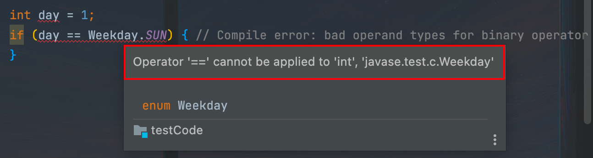

::: details 目录
[[toc]]
:::


在 Java 中，我们可以通过 `static final` 来定义常量。例如，我们希望定义周一到周日这 7 个常量，可以用 7 个不同的 `int` 表示：

```java
public class Weekday {
    public static final int SUN = 0;
    public static final int MON = 1;
    public static final int TUE = 2;
    public static final int WED = 3;
    public static final int THU = 4;
    public static final int FRI = 5;
    public static final int SAT = 6;
}
```

使用常量的时候，可以这么引用：


```java
if (day == Weekday.SAT || day == Weekday.SUN) {
    // TODO: work at home
}
```

也可以把常量定义为字符串类型，例如，定义 3 种颜色的常量：

```java
public class Color {
    public static final String RED = "r";
    public static final String GREEN = "g";
    public static final String BLUE = "b";
}
```

使用常量的时候，可以这么引用：

```java
String color = ...
if (Color.RED.equals(color)) {
    // TODO:
}
```


无论是 `int` 常量还是 `String` 常量，使用这些常量来表示一组枚举值的时候，有一个严重的问题就是，编译器无法检查每个值的合理性。例如：


```java
if (weekday == 6 || weekday == 7) {
    if (tasks == Weekday.MON) {
        // TODO:
    }
}
```


上述代码编译和运行均不会报错，但存在两个问题：

- 注意到 `Weekday` 定义的常量范围是 `0` ~ `6` ，并不包含 `7` ，编译器无法检查不在枚举中的 `int` 值；
- 定义的常量仍可与其他变量比较，但其用途并非是枚举星期值。


## 🍀 enum


为了让编译器能自动检查某个值在枚举的集合内，并且，不同用途的枚举需要不同的类型来标记，不能混用，我们可以使用 `enum` 来定义枚举类：

```java
// enum
public class Main {
    public static void main(String[] args) {
        Weekday day = Weekday.SUN;
        if (day == Weekday.SAT || day == Weekday.SUN) {
            System.out.println("Work at home!");
        } else {
            System.out.println("Work at office!");
        }
    }
}

enum Weekday {
    SUN, MON, TUE, WED, THU, FRI, SAT;
}
```

注意到定义枚举类是通过关键字 `enum` 实现的，我们只需依次列出枚举的常量名。

和 `int` 定义的常量相比，使用 `enum` 定义枚举有如下好处：

首先，  ***`enum` 常量本身带有类型信息*** ，即 `Weekday.SUN` 类型是 `Weekday` ，编译器会自动检查出类型错误。例如，下面的语句不可能编译通过：


```java
int day = 1;
if (day == Weekday.SUN) { // Compile error: bad operand types for binary operator '=='
}
```




其次， ***不可能引用到非枚举的值*** ，因为无法通过编译。

最后， ***不同类型的枚举不能互相比较或者赋值，因为类型不符。*** 例如，不能给一个 `Weekday` 枚举类型的变量赋值为 `Color` 枚举类型的值：

```java
Weekday x = Weekday.SUN; // ok!
Weekday y = Color.RED; // Compile error: incompatible types
```

这就使得编译器可以在编译期自动检查出所有可能的潜在错误。


## 🍀 enum 的比较

使用 `enum` 定义的枚举类是一种*引用类型*。前面我们讲到，引用类型比较，要使用 `equals()` 方法，如果使用 `==` 比较，它 ***比较的是两个引用类型的变量是否是同一个对象*** 。因此，引用类型比较，要始终使用 `equals()` 方法， ***但 `enum` 类型可以例外*** 。

这是因为 `enum` 类型的每个常量在 JVM 中只有一个唯一实例，所以可以直接用 `==` 比较：

```java
if (day == Weekday.FRI) { // ok!
}
if (day.equals(Weekday.SUN)) { // ok, but more code!
}
```

## 🍀 enum 类型

> [!important]
> 通过 `enum` 定义的枚举类，和其他的 `class` 有什么区别？

答案是没有任何区别。 `enum` 定义的类型就是 `class` ，只不过它有以下几个特点：

- 定义的 `enum` 类型总是继承自 `java.lang.Enum` ，且无法被继承；
- 只能定义出 `enum` 的实例，而无法通过 `new` 操作符创建 `enum` 的实例；
- 定义的每个实例都是引用类型的唯一实例；
- 可以将 `enum` 类型用于 `switch` 语句。

例如，我们定义的 `Color` 枚举类：


```java
public enum Color {
    RED, GREEN, BLUE;
}
```


编译器编译出的 `class` 大概就像这样：

```java
public final class Color extends Enum { // 继承自 Enum，标记为 final class
    // 每个实例均为全局唯一:
    public static final Color RED = new Color();
    public static final Color GREEN = new Color();
    public static final Color BLUE = new Color();
    // private 构造方法，确保外部无法调用 new 操作符:
    private Color() {}
}
```


所以，编译后的 `enum` 类和普通 `class` 并没有任何区别。但是我们自己无法按定义普通 `class` 那样来定义 `enum` ，必须使用 `enum` 关键字，这是 Java 语法规定的。

因为 `enum` 是一个 `class` ，每个枚举的值都是 `class` 实例，因此，这些实例有一些方法：

### name()

返回常量名，例如：

```java
String s = Weekday.SUN.name(); // "SUN"
```

### ordinal()

返回定义的常量的顺序，从 `0` 开始计数，例如：

```java
int n = Weekday.MON.ordinal(); // 1
```

改变枚举常量定义的顺序就会导致 `ordinal()` 返回值发生变化。例如：

```java
public enum Weekday {
    SUN, MON, TUE, WED, THU, FRI, SAT;
}
```

和

```java
public enum Weekday {
    MON, TUE, WED, THU, FRI, SAT, SUN;
}
```

的 `ordinal` 就是不同的。如果在代码中编写了类似 `if(x.ordinal()==1)` 这样的语句，就要保证 `enum` 的枚举顺序不能变。新增的常量必须放在最后。

有些童鞋会想， `Weekday` 的枚举常量如果要和 `int` 转换，使用 `ordinal()` 不是非常方便？比如这样写：

```java
String task = Weekday.MON.ordinal() + "/ppt";
saveToFile(task);
```

但是，如果不小心修改了枚举的顺序，编译器是无法检查出这种逻辑错误的。要编写健壮的代码，就不要依靠 `ordinal()` 的返回值。因为 `enum` 本身是 `class` ，所以我们可以定义 `private` 的构造方法，并且，给每个枚举常量添加字段：


```java
// enum
public class Main {
    public static void main(String[] args) {
        Weekday day = Weekday.SUN;
        if (day.dayValue == 6 || day.dayValue == 0) {
            System.out.println("Work at home!");
        } else {
            System.out.println("Work at office!");
        }
    }
}

enum Weekday {
    MON(1), TUE(2), WED(3), THU(4), FRI(5), SAT(6), SUN(0);

    public final int dayValue;

    private Weekday(int dayValue) {
        this.dayValue = dayValue;
    }
}
```


这样就无需担心顺序的变化，新增枚举常量时，也需要指定一个 `int` 值。

> [!caution]
> 枚举类的字段也可以是非 `final` 类型，即可以在运行期修改，但是不推荐这样做！


默认情况下，对枚举常量调用 `toString()` 会返回和 `name()` 一样的字符串。但是， `toString()` 可以被重写，而 `name()` 则不行。我们可以给 `Weekday` 添加 `toString()` 方法：

```java
// enum
public class Main {
    public static void main(String[] args) {
        Weekday day = Weekday.SUN;
        if (day.dayValue == 6 || day.dayValue == 0) {
            System.out.println("Today is " + day + ". Work at home!");
        } else {
            System.out.println("Today is " + day + ". Work at office!");
        }
    }
}

enum Weekday {
    MON(1, "星期一"), TUE(2, "星期二"), WED(3, "星期三"), THU(4, "星期四"), FRI(5, "星期五"), SAT(6, "星期六"), SUN(0, "星期日");

    public final int dayValue;
    private final String chinese;

    private Weekday(int dayValue, String chinese) {
        this.dayValue = dayValue;
        this.chinese = chinese;
    }

    @Override
    public String toString() {
        return this.chinese;
    }
}
```

重写 `toString()` 的目的是 ***在输出时更有可读性*** 。


> [!warning]
> **判断枚举常量的名字**，要始终使用 `name()` 方法，绝不能调用 `toString()`！


### switch

最后，枚举类可以应用在 `switch` 语句中。因为枚举类天生具有类型信息和有限个枚举常量，所以比 `int` 、 `String` 类型更适合用在 `switch` 语句中：


```java
// switch
public class Main {
    public static void main(String[] args) {
        Weekday day = Weekday.SUN;
        switch(day) {
        case MON:
        case TUE:
        case WED:
        case THU:
        case FRI:
            System.out.println("Today is " + day + ". Work at office!");
            break;
        case SAT:
        case SUN:
            System.out.println("Today is " + day + ". Work at home!");
            break;
        default:
            throw new RuntimeException("cannot process" + day);
        }
    }
}

enum Weekday {
    MON, TUE, WED, THU, FRI, SAT, SUN;
}
```


加上 `default` 语句，可以在漏写某个枚举常量时自动报错，从而及时发现错误。


## 🍀 小结

- Java 使用 `enum` 定义枚举类型，它被编译器编译为 `final class Xxx extends Enum {…}`；
- ***通过 `name()` 获取常量定义的字符串*** ，注意不要使用 `toString()`；
- 通过 `ordinal()` 返回常量定义的顺序（*无实质意义*）；
- 可以为 `enum` 编写构造方法、字段和方法
- ***`enum` 的构造方法要声明为 `private` ，字段强烈建议声明为 `final` ；***

- `enum` 适合用在 `switch` 语句中。


