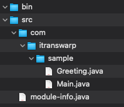

::: details 目录
[[toc]]
:::

从 Java 9 开始，JDK 又引入了模块（Module）。

## 🍀 什么是模块？

这要从 Java 9 之前的版本说起。

我们知道，`.class` 文件是 JVM 看到的最小可执行文件，而一个大型程序需要编写很多 Class，并生成一堆 `.class` 文件，很不便于管理，所以，`jar` 文件就是 `class` 文件的容器。

在 Java 9 之前，一个大型 Java 程序会生成自己的 jar 文件，同时引用依赖的第三方 jar 文件，而 JVM 自带的 Java 标准库，实际上也是以 jar 文件形式存放的，这个文件叫 `rt.jar`，一共有 60 多 M。

如果是自己开发的程序，除了一个自己的 `app.jar` 以外，还需要一堆第三方的 jar 包，运行一个 Java 程序，一般来说，命令行写这样：

```
java -cp app.jar:a.jar:b.jar:c.jar com.liaoxuefeng.sample.Main
```

> [!caution]
> JVM 自带的标准库 rt.jar 不要写到 classpath 中，写了反而会干扰 JVM 的正常运行。

如果漏写了某个运行时需要用到的 jar ，那么在运行期极有可能抛出 `ClassNotFoundException` 。

所以，jar 只是用于存放 class 的容器，它并不关心 class 之间的依赖。

从 Java 9 开始引入的模块，主要是为了解决 “依赖” 这个问题。如果 `a.jar` 必须依赖另一个 `b.jar` 才能运行，那我们应该给 `a.jar` 加点说明啥的，让程序在编译和运行的时候能自动定位到 `b.jar`，这种自带 “依赖关系” 的 class 容器就是模块。

为了表明 Java 模块化的决心，从 Java 9 开始，原有的 Java 标准库已经由一个单一巨大的 `rt.jar` 分拆成了几十个模块，这些模块以 `.jmod` 扩展名标识，可以在 `$JAVA_HOME/jmods` 目录下找到它们：

- java.base.jmod
- java.compiler.jmod
- java.datatransfer.jmod
- java.desktop.jmod
- ...

这些 `.jmod` 文件每一个都是一个模块，模块名就是文件名。例如：模块 `java.base` 对应的文件就是 `java.base.jmod` 。模块之间的依赖关系已经被写入到模块内的 `module-info.class` 文件了。所有的模块都直接或间接地依赖 `java.base` 模块，只有 `java.base` 模块不依赖任何模块，它可以被看作是 “根模块”，好比所有的类都是从 `Object` 直接或间接继承而来。

把一堆 class 封装为 jar 仅仅是一个打包的过程，而把一堆 class 封装为模块则不但需要打包，还需要写入依赖关系，并且还可以包含二进制代码（通常是 JNI 扩展）。此外，模块支持多版本，即在同一个模块中可以为不同的 JVM 提供不同的版本。

## 🍀 编写模块

那么，我们应该如何编写模块呢？还是以具体的例子来说。首先，创建模块和原有的创建 Java 项目是完全一样的，以 `oop-module` 工程为例，它的目录结构如下：

    oop-module
    ├── bin
    ├── build.sh
    └── src
        ├── com
        │   └── itranswarp
        │       └── sample
        │           ├── Greeting.java
        │           └── Main.java
        └── module-info.java

其中，`bin` 目录存放编译后的 class 文件，`src` 目录存放源码，按包名的目录结构存放，仅仅在 `src` 目录下多了一个 `module-info.java` 这个文件，这就是模块的描述文件。在这个模块中，它长这样：

```java
module hello.world {
	requires java.base; // 可不写，任何模块都会自动引入 java.base
	requires java.xml;
}
```

其中，`module` 是关键字，后面的 `hello.world` 是模块的名称，它的命名规范与包一致。花括号的 `requires xxx;` 表示这个模块需要引用的其他模块名。除了 `java.base` 可以被自动引入外，这里我们引入了一个 `java.xml` 的模块。

当我们使用模块声明了依赖关系后，才能使用引入的模块。例如，`Main.java` 代码如下：

```java
package com.itranswarp.sample;

// 必须引入 java.xml 模块后才能使用其中的类:
import javax.xml.XMLConstants;

public class Main {
	public static void main(String[] args) {
		Greeting g = new Greeting();
		System.out.println(g.hello(XMLConstants.XML_NS_PREFIX));
	}
}
```

如果把 `requires java.xml;` 从 `module-info.java` 中去掉，编译将报错。可见，**_模块的重要作用就是声明依赖关系_** 。

下面，我们用 JDK 提供的命令行工具来编译并创建模块。

首先，我们把工作目录切换到 `oop-module`，在当前目录下编译所有的 `.java` 文件，并存放到 `bin` 目录下，命令如下：

```
$ javac -d bin src/module-info.java src/com/itranswarp/sample/*.java
```

如果编译成功，现在项目结构如下：

    oop-module
    ├── bin
    │   ├── com
    │   │   └── itranswarp
    │   │       └── sample
    │   │           ├── Greeting.class
    │   │           └── Main.class
    │   └── module-info.class
    └── src
        ├── com
        │   └── itranswarp
        │       └── sample
        │           ├── Greeting.java
        │           └── Main.java
        └── module-info.java

注意到 `src` 目录下的 `module-info.java` 被编译到 `bin` 目录下的 `module-info.class` 。

下一步，我们需要把 `bin` 目录下的所有 class 文件先打包成 jar，在打包的时候，注意传入 `--main-class` 参数，让这个 jar 包能自己定位 `main` 方法所在的类：

```
$ jar --create --file hello.jar --main-class com.itranswarp.sample.Main -C bin .
```

现在我们就在当前目录下得到了 `hello.jar` 这个 jar 包，它和普通 jar 包并无区别，可以直接使用命令 `java -jar hello.jar` 来运行它。但是我们的目标是创建模块，所以，继续使用 JDK 自带的 `jmod` 命令把一个 `jar` 包转换成模块：

```
$ jmod create --class-path hello.jar hello.jmod
```

于是，在当前目录下我们又得到了 `hello.jmod` 这个模块文件，这就是最后打包出来的传说中的模块！

## 🍀 运行模块

要运行一个 jar，我们使用 `java -jar xxx.jar` 命令。要运行一个模块，我们只需要指定模块名。试试：

```
$ java --module-path hello.jmod --module hello.world
```

结果是一个错误：

```
Error occurred during initialization of boot layer
java.lang.module.FindException: JMOD format not supported at execution time: hello.jmod
```

原因是 `.jmod` 不能被放入 `--module-path` 中。换成 `.jar` 就没问题了：

```
$ java --module-path hello.jar --module hello.world
Hello, xml!
```

那我们辛辛苦苦创建的 `hello.jmod` 有什么用？答案是我们可以用它来打包 JRE 。

## 🍀 打包 JRE

前面讲了，为了支持模块化，Java 9 首先带头把自己的一个巨大无比的 `rt.jar` 拆成了几十个 `.jmod` 模块，原因就是，运行 Java 程序的时候，实际上我们用到的 JDK 模块，并没有那么多。不需要的模块，完全可以删除。

过去发布一个 Java 应用程序，要运行它，必须下载一个完整的 JRE，再运行 jar 包。而完整的 JRE 块头很大，有 100 多 M。怎么给 JRE 瘦身呢？

现在，JRE 自身的标准库已经分拆成了模块，只需要带上程序用到的模块，其他的模块就可以被裁剪掉。怎么裁剪 JRE 呢？并不是说把系统安装的 JRE 给删掉部分模块，而是 “复制” 一份 JRE，但只带上用到的模块。为此，JDK 提供了 `jlink` 命令来干这件事。命令如下：

```
$ jlink --module-path hello.jmod --add-modules java.base,java.xml,hello.world --output jre/
```

我们在 `--module-path` 参数指定了我们自己的模块 `hello.jmod`，然后，在 `--add-modules` 参数中指定了我们用到的 3 个模块 `java.base`、`java.xml` 和 `hello.world`，用 `,` 分隔。最后，在 `--output` 参数指定输出目录。

现在，在当前目录下，我们可以找到 `jre` 目录，这是一个完整的并且带有我们自己 `hello.jmod` 模块的 JRE。试试直接运行这个 JRE：

```
$ jre/bin/java --module hello.world
Hello, xml!
```

要分发我们自己的 Java 应用程序，只需要把这个 `jre` 目录打个包给对方发过去，对方直接运行上述命令即可，既不用下载安装 JDK，也不用知道如何配置我们自己的模块，极大地方便了分发和部署。

## 🍀 访问权限

前面我们讲过，Java 的 class 访问权限分为 public、protected、private 和默认的包访问权限。引入模块后，这些访问权限的规则就要稍微做些调整。

确切地说，class 的这些访问权限只在一个模块内有效，模块和模块之间，例如，a 模块要访问 b 模块的某个 class，必要条件是 b 模块明确地导出了可以访问的包。

举个例子：我们编写的模块 `hello.world` 用到了模块 `java.xml` 的一个类 `javax.xml.XMLConstants`，我们之所以能直接使用这个类，是因为模块 `java.xml` 的 `module-info.java` 中声明了若干导出：

```java
module java.xml {
    exports java.xml;
    exports javax.xml.catalog;
    exports javax.xml.datatype;
    ...
}
```

只有它声明的导出的包，外部代码才被允许访问。换句话说，如果外部代码想要访问我们的 `hello.world` 模块中的 `com.itranswarp.sample.Greeting` 类，我们必须将其导出：

```java
module hello.world {
    exports com.itranswarp.sample;

    requires java.base;
	requires java.xml;
}
```

因此，模块进一步隔离了代码的访问权限。

## 🍀 练习

请练习如何打包模块和 JRE。



```java
package com.itranswarp.sample;

import javax.xml.XMLConstants;

public class Main {

	public static void main(String[] args) {
		Greeting g = new Greeting();
		System.out.println(g.hello(XMLConstants.XML_NS_PREFIX));
	}
}
```

```java
package com.itranswarp.sample;

public class Greeting {

	public String hello(String name) {
		return "Hello, " + name + "!";
	}
}
```

```java
module hello.world {
	requires java.base;
	requires java.xml;
}
```

## 🍀 小结

Java 9 引入的模块目的是为了管理依赖；

使用模块可以按需打包 JRE；

使用模块对类的访问权限有了进一步限制。
