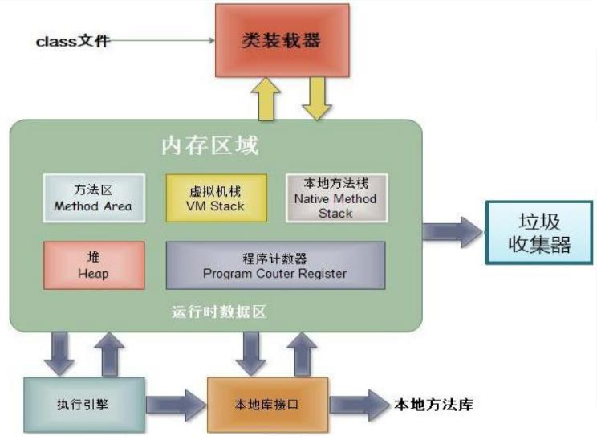

::: details 目录
[[toc]]
:::


## 🍀 1. 创建类，设计类的成员

```java
class Person{
	//属性
	String name;
	int age;
	boolean isMale;
	
	//方法
	public void eat(){
		System.out.println("人可以吃饭");
	}
	public void sleep(){
		System.out.println("人可以睡觉");
	}
	public void talk(String language){
		System.out.println("人可以说话，使用的是：" + language);
	}
}
```

## 🍀 2. 创建类的对象

```java
	Person p1 = new Person();
	//Scanner scan = new Scanner(System.in);
```


## 🍀 3. 通过“对象.属性”或“对象.方法”调用对象的结构

```java
    //调用属性：“对象.属性”
	p1.name = "tom";
	p1.isMale = true;
	System.out.println(p1.name);
		
    //调用方法：“对象.方法”
	p1.eat();
	p1.sleep();
	p1.talk("Chinese");
```

> [!important]
> 如果创建了一个类的多个对象，则每个对象都独立的拥有一套类的属性。  
> （非static类）意味着，如果我们修改一个对象的属性 a，则不影响另外一个对象属性 a 的值。


## 🍀 4. 内存解析




## 🍀 补充

### 一、理解 “万事万物皆对象”

1. 在 Java 语言范畴中，我们都将功能、结构封装到类中，通过类的实例化，来调用具体的功能结构
	- Scanner，String 等
	- 文件：File
	- 网络资源：URL
2. 涉及到 Java 语言与前端 Html 、后端的数据库交互时，前后端的结构在 Java 层面交互时，都体现为类、对象。


### 二、内存解析的说明

引用类型的变量，只可能存储两类值：null 或 地址值（含变量的类型）


### 三、匿名对象的使用

1. 我们创建的对象，没有显式的赋给一个变量名，即为匿名对象

    ```java
        // 匿名对象
        new Phone().sendEmail();
        new Phone().playGame();
    
        new Phone().price = 1999;
        new Phone().showPrice();//0.0
    ```
2. ***匿名对象只能调用一次***
3. 匿名对象的使用如下所示
    ```java
    public class InstanceTest {
        public static void main(String[] args) {
            PhoneMall mall = new PhoneMall();
    
            // 匿名对象的使用
            mall.show(new Phone());
        }
    }
    class PhoneMall{
        public void show(Phone phone) {
            phone.sendEmail();
            phone.playGame();
        }
    }
    class Phone{
        public void sendEmail() {
            System.out.println("发送邮件");
        }
        public void playGame() {
            System.out.println("玩游戏");
        }
    }
    ```


