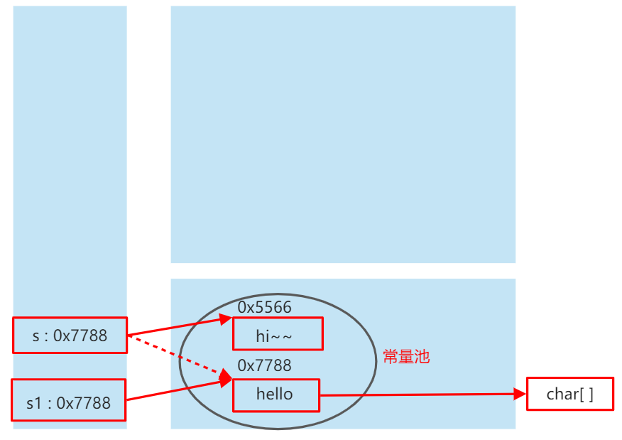
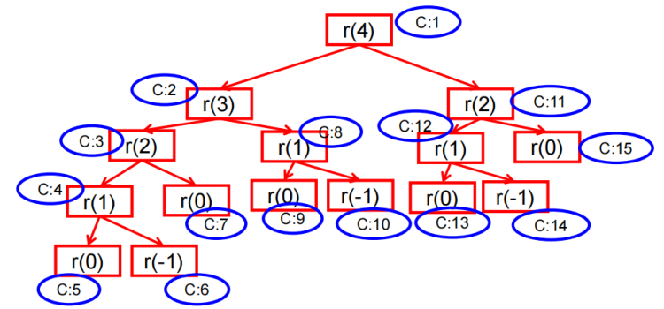

::: details 目录
[[toc]]
:::


## 🍀 属性

### 语法格式

```java
    修饰符 数据类型 属性名 = 初始化值; 
```

### 属性（成员变量） VS 局部变量

#### 相同点

1. 定义变量的格式： `数据类型 变量名 = 变量值` 
2. 先声明，后使用
3. 变量都有其对应的作用域

#### 不同点

1. 在类中==声明的位置==不同
   - ***属性*** ：直接定义在类的一对`{` `}`内。
   - ***局部变量*** ：声明在方法内、方法形参、代码块内、构造器形参、构造器内部的变量。

2. 关于==权限修饰符==的不同
   - ***属性*** ：可以在声明属性时，指明其权限，使用权限修饰符。
      - 常用的权限修饰符，private、public、缺省、protected -->封装性
      - 目前，大家声明属性时，都使用缺省就好。
   - ***局部变量*** ：不可以使用权限修饰符。

3. ==默认初始化值==的情况
   - ***属性*** ：类的属性，根据其类型，都有默认的初始化值。
      - 整型（byte、short、int、long），0
      - 浮点型（float、double）：0.0
      - 字符型（char）：0（或'\u0000'）
      - 布尔型（boolean）：false
      - 引用数据类型（类、数组、接口）：null
   - ***局部变量*** ：没有默认初始化值。
      - 意味着，我们在调用局部变量之前，一定要显式赋值。
      - 特别的，形参在调用时，我们赋值即可。
4. ==在内存中加载的位置==不同
   - ***属性*** ：加载到堆空间。（非 static）
   - ***局部变量*** ：加载到栈空间。


## 🍀 方法

> [!warning]
> *描述类应该具有的功能*

一个 `class` 可以包含多个 `field` ，例如，我们给 `Person` 类就定义了两个 `field` ：

```java
class Person {
    public String name;
    public int age;
}
```

但是，直接把 `field` 用 `public` 暴露给外部可能会破坏封装性。比如，代码可以这样写：

```java
    Person ming = new Person();
    ming.name = "Xiao Ming";
    ming.age = -99; // age 设置为负数
```

显然，直接操作 `field` ，容易造成逻辑混乱。为了避免外部代码直接去访问 `field` ，我们可以用 `private` 修饰 `field` ，拒绝外部访问：

```java
class Person {
    private String name;
    private int age;
}
```

试试 `private` 修饰的 `field` 有什么效果：

```java
public class Main {
    public static void main(String[] args) {
        Person ming = new Person();
        ming.name = "Xiao Ming"; // 对字段 name 赋值
        ming.age = 12; // 对字段 age 赋值
    }
}

class Person {
    private String name;
    private int age;
}
```

是不是编译报错？把访问 `field` 的赋值语句去了就可以正常编译了。


把 `field` 从 `public` 改成 `private` ，外部代码不能访问这些 `field` ，那我们定义这些 `field` 有什么用？怎么才能给它赋值？怎么才能读取它的值？

所以我们需要使用方法（ `method` ）来让外部代码可以间接修改 `field` ：

```java
public class Main {
    public static void main(String[] args) {
        Person ming = new Person();
        ming.setName("Xiao Ming"); // 设置 name
        ming.setAge(12); // 设置 age
        System.out.println(ming.getName() + "," + ming.getAge());
    }
}

class Person {
    private String name;
    private int age;

    public String getName() {
        return this.name;
    }

    public void setName(String name) {
        this.name = name;
    }

    public int getAge() {
        return this.age;
    }

    public void setAge(int age) {
        if (age < 0 || age> 100) {
            throw new IllegalArgumentException("invalid age value");
        }
        this.age = age;
    }
}
```

虽然外部代码不能直接修改 `private` 字段，但是，外部代码可以调用方法 `setName()` 和 `setAge()` 来间接修改 `private` 字段。在方法内部，我们就有机会检查参数对不对。比如， `setAge()` 就会检查传入的参数，参数超出了范围，直接报错。这样，外部代码就没有任何机会把 `age` 设置成不合理的值。

对 `setName()` 方法同样可以做检查，例如，不允许传入 `null` 和空字符串：

```java
public void setName(String name) {
    if (name == null || name.isBlank()) {
        throw new IllegalArgumentException("invalid name");
    }
    this.name = name.strip(); // 去掉首尾空格
}
```

同样，外部代码不能直接读取 `private` 字段，但可以通过 `getName()` 和 `getAge()` 间接获取 `private` 字段的值。

所以，*一个类通过定义方法，就可以给外部代码暴露一些操作的接口，同时，内部自己保证逻辑一致性* 。

调用方法的语法是 `实例变量. 方法名 (参数);` 。一个方法调用就是一个语句，所以不要忘了在末尾加 `;` 。例如： `ming.setName("Xiao Ming");` 。


### 定义方法

从上面的代码可以看出，定义方法的语法是：

```java
权限修饰符 返回值类型 方法名 (形参列表){
	方法体
	//return 返回值;
}
```

方法返回值通过 `return` 语句实现，如果没有返回值，返回类型设置为 `void` ，可以省略 `return` 。

举例：
```java
public void eat() {}
public void sleep(int hour) {}
public String getName() {}
public String getNation(String nation) {}
```

### private 方法

有 `public` 方法，自然就有 `private` 方法。和 `private` 字段一样， `private` 方法不允许外部调用，那我们定义 `private` 方法有什么用？

定义 `private` 方法的理由是内部方法是可以调用 `private` 方法的。例如：

```java
public class Main {
    public static void main(String[] args) {
        Person ming = new Person();
        ming.setBirth(2008);
        System.out.println(ming.getAge());
    }
}

class Person {
    private String name;
    private int birth;

    public void setBirth(int birth) {
        this.birth = birth;
    }

    public int getAge() {
        return calcAge(2019); // 调用 private 方法
    }

    // private 方法:
    private int calcAge(int currentYear) {
        return currentYear - this.birth;
    }
}
```

观察上述代码， `calcAge()` 是一个 `private` 方法，外部代码无法调用，但是，内部方法 `getAge()` 可以调用它。

此外，我们还注意到，这个 `Person` 类只定义了 `birth` 字段，没有定义 `age` 字段，获取 `age` 时，通过方法 `getAge()` 返回的是一个实时计算的值，并非存储在某个字段的值。这说明方法可以封装一个类的对外接口，调用方不需要知道也不关心 `Person` 实例在内部到底有没有 `age` 字段。


### this 变量

在方法内部，可以使用一个隐含的变量 `this` ，它始终指向当前实例。因此，通过 `this.field` 就可以 ***访问当前实例的字段*** 。

#### `this` 可以用来修饰、调用：属性、方法、构造器

如果没有命名冲突，可以省略 `this` 。例如：

```java
class Person {
    private String name;

    public String getName() {
        return name; // 相当于 this.name
    }
}
```

但是， ***如果有局部变量和字段重名，那么局部变量优先级更高，就必须加上 this*** ：

```java
class Person {
    private String name;

    public void setName(String name) {
        this.name = name; // 前面的 this 不可少，少了就变成局部变量 name 了
    }
}
```

#### `this` 修饰属性和方法

> [!warning]
> `this` 理解为： 当前对象 或 当前正在创建的对象

1. 在类的方法中，我们可以使用 `this.属性` 或 `this.方法` 的方式，调用当前对象属性或方法。

> 但是通常情况下，我们都省略 `this.` 。特殊情况下，如果方法的形参和类的属性同名时，我们必须显式的使用 `this.变量` 的方式，表明此变量是属性而非形参。

2. 在类的构造器中，我们可以使用 `this.属性` 或 `this.方法` 的方式，调用当前正在创建的对象属性或方法。

> 但是通常情况下，我们都省略 `this.` 。特殊情况下，如果构造器的形参和类的属性同名时，我们必须显式的使用 `this.变量` 的方式，表明此变量是属性而非形参。

#### `this` 调用构造器

① 我们在类的构造器中，可以显式的使用 `this(形参列表)` 方式，调用本类中指定的其他构造器
② 构造器中不能通过 `this(形参列表)` 方式调用自己
③ 如果一个类中有 `n` 个构造器，则最多有 `n - 1` 个构造器中使用了 `this(形参列表)`
④ 规定： `this(形参列表)` 必须声明在当前构造器的首行
⑤ 构造器内部，最多只能声明一个 `this(形参列表)` ，用来调用其他构造器


### 方法参数

方法可以包含 0 个或任意个参数。方法参数用于接收传递给方法的变量值。调用方法时，必须严格按照参数的定义一一传递。例如：

```java
class Person {
    ...
    public void setNameAndAge(String name, int age) {
        ...
    }
}
```

调用这个 `setNameAndAge()` 方法时，必须有两个参数，且第一个参数必须为 `String` ，第二个参数必须为 `int` ：

```java
    Person ming = new Person();
    ming.setNameAndAge("Xiao Ming"); // 编译错误：参数个数不对
    ming.setNameAndAge(12, "Xiao Ming"); // 编译错误：参数类型不对
```

### 可变参数


可变参数用 `类型...` 定义，可变参数相当于数组类型：

```java
class Group {
    private String[] names;

    public void setNames(String... names) {
        this.names = names;
    }
}
```

上面的 `setNames()` 就定义了一个可变参数。调用时，可以这么写：


```java
    Group g = new Group();
    g.setNames("Xiao Ming", "Xiao Hong", "Xiao Jun"); // 传入 3 个 String
    g.setNames("Xiao Ming", "Xiao Hong"); // 传入 2 个 String
    g.setNames("Xiao Ming"); // 传入 1 个 String
    g.setNames(); // 传入 0 个 String
```

完全可以把可变参数改写为 `String[]` 类型：

```java
class Group {
    private String[] names;

    public void setNames(String[] names) {
        this.names = names;
    }
}
```

但是，调用方需要自己先构造 `String[]` ，比较麻烦。例如：

```java
    Group g = new Group();
    g.setNames(new String[] {"Xiao Ming", "Xiao Hong", "Xiao Jun"}); // 传入 1 个 String[]
```

另一个问题是，调用方可以传入 `null` ：

```java
    Group g = new Group();
    g.setNames(null);
```

> [!caution]
> 可变参数可以保证无法传入 `null` ，因为传入 0 个参数时，接收到的实际值是一个空数组而不是 `null` 。


1. 可变个数形参的方法与本类中方法名相同，形参不同的方法之间构成重载
2. 可变个数形参的方法与本类中方法名相同，形参类型也相同的数组之间，不构成重载
3. 可变个数形参在方法的形参中，必须声明在（形参列表的）末尾
4. 可变个数形参在方法的形参中，最多只能声明一个可变形参


```java
	public void show(int i){
		System.out.println("show(int i)");
	}
	public void show(String s){
		System.out.println("show(String s)");
	}
	public void show(String ... strs){
		System.out.println("show(String ... strs)");
		for(int i = 0;i < strs.length;i++){
			System.out.println(strs[i]);
		}
	}

	// 不能与上一个方法同时存在
//	public void show(String[] str){
//
//	}
```


### 方法参数的值传递机制

***形参***：方法 *定义* 时，*声明的小括号内的参数* ；
***实参***：方法 *调用* 时，*实际传递给形参的数据* ；


我们先观察一个基本类型参数的传递：


```java
public class Main {
    public static void main(String[] args) {
        Person p = new Person();
        int n = 15; // n 的值为 15
        p.setAge(n); // 传入 n 的值
        System.out.println(p.getAge()); // 15
        n = 20; // n 的值改为 20
        System.out.println(p.getAge()); // 15 还是 20?
    }
}

class Person {
    private int age;

    public int getAge() {
        return this.age;
    }

    public void setAge(int age) {
        this.age = age;
    }
}
```

运行代码，从结果可知，修改外部的局部变量 `n` ，不影响实例 `p` 的 `age` 字段，原因是 `setAge()` 方法获得的参数，复制了 `n` 的值，因此， `p.age` 和局部变量 `n` 互不影响。


> [!warning]
> ***基本类型参数*** *的传递，实参赋给形参的是实参真实存储的* ***数据值*** *。双方各自的后续修改，互不影响。*


我们再看一个传递引用类型参数的例子：

```java
public class Main {
    public static void main(String[] args) {
        Person p = new Person();
        String[] fullname = new String[] { "Homer", "Simpson" };
        p.setName(fullname); // 传入 fullname 数组
        System.out.println(p.getName()); // "Homer Simpson"
        fullname[0] = "Bart"; // fullname 数组的第一个元素修改为 "Bart"
        System.out.println(p.getName()); // "Homer Simpson" 还是 "Bart Simpson"?
    }
}

class Person {
    private String[] name;

    public String getName() {
        return this.name[0] + " " + this.name[1];
    }

    public void setName(String[] name) {
        this.name = name;
    }
}
```

注意到 `setName()` 的参数现在是一个数组。一开始，把 `fullname` 数组传进去，然后，修改 `fullname` 数组的内容，结果发现，实例 `p` 的字段 `p.name` 也被修改了！

> [!warning]
> ***引用类型参数*** *的传递，实参赋给形参的是实参存储数据的* ***地址值*** *，指向的是同一个对象。双方任意一方对这个对象的修改，都会影响对方（因为指向同一个对象嘛）。*


```java
public class ValueTransferTest {
	public static void main(String[] args) {
		String s1 = "hello";

		ValueTransferTest test = new ValueTransferTest();
		test.change(s1);

		System.out.println(s1);//hello
	}

	public void change(String s){
		s = "hi~~";
	}
}
```



有了上面的结论，我们再看一个例子：

```java
public class Main {
    public static void main(String[] args) {
        Person p = new Person();
        String bob = "Bob";
        p.setName(bob); // 传入 bob 变量
        System.out.println(p.getName()); // "Bob"
        bob = "Alice"; // bob 改名为 Alice
        System.out.println(p.getName()); // "Bob" 还是 "Alice"?
    }
}

class Person {
    private String name;

    public String getName() {
        return this.name;
    }

    public void setName(String name) {
        this.name = name;
    }
}
```

> [!important]
> 试解释为什么上面的代码两次输出都是 "Bob"。


### 练习

给 `Person` 类增加 `getAge` / `setAge` 方法

```java
public class PersonATest {
    public static void main(String[] args) {
        Person ming = new Person();
        ming.setName("小明");
        System.out.println(ming.getName());
        ming.setAge(12);
        System.out.println(ming.getAge());
    }
}
class Person {
    private String name;
    private int age;

    public String getName() {
        return this.name;
    }

    public void setName(String name) {
        this.name = name;
    }

    public void setAge(int age) {
        this.age = age;
    }

    public int getAge() {
        return this.age;
    }
}
```


### 小结


1. 方法可以让外部代码安全地访问实例字段；
2. 方法是一组执行语句，并且可以执行任意逻辑；
3. 外部代码通过 `public` 方法操作实例，内部代码可以调用 `private` 方法；
4. 方法内部遇到 `return` 时返回， `void` 表示不返回任何值（注意和返回 `null` 不同）；
   - 如果方法 *有返回值*，则必须再方法声明时，指定返回值的类型。同时，方法中，需要使用 `return` 关键字来返回指定类型的变量或者常量；
   - 如果方法 *没有返回值*，则方法声明时，使用 `void` 来表示。通常，没有返回值的方法中，就不需要使用 `return` 。但是，如果使用的话，只能 `return;` 表示结束此方法的意思。
5. 方法名：属于标识符，遵循标识符的规则和规范：“见名知意”；
6. 理解方法的值传递机制。


### 递归方法（了解）

***方法的使用中，可以调用当前类的属性或方法***

> [!warning]
> 方法中，不可以定义方法。

特殊的，方法 A 中又调用了方法 A ：递归方法（例如快速排序）。

- 方法递归包含了一种隐式的循环，它会重复执行某段代码，但这种重复执行无须循环控制。
- 递归一定要向已知方向递归，否则这种递归就变成了无穷递归，类似于死循环。


```java
public class RecursionTest {

	public static void main(String[] args) {

		// 例 1. 计算 1 ~ 100 之间所有自然数的和
		// 方式一：
		int sum = 0;
		for(int i = 0;i <= 100;i++){
			sum += i;
		}
		System.out.println(sum);

		// 方式二：
		RecursionTest test = new RecursionTest();
		int sum1 = test.getSum(100);
		System.out.println(sum1);

	}

	// 例 1. 计算 1 ~ n 之间所有自然数的和
	public int getSum(int n){

		if(n == 1){
			return 1;
		}else{
			return n + getSum(n - 1);
		}

	}

	// 例 2. 计算 1 ~ n 之间所有自然数的乘积：阶乘 n!
	public int getSum1(int n){

		if(n == 1){
			return 1;
		}else{
			return n * getSum1(n - 1);
		}

	}

	// 例 3. 7.2 f(0) = 1, f(1) = 4, f(n+2) = 2 * f(n+1) + f(n)
	public int getFx1(int n){
        if(n == 0){
            return 1;
        }else if(n == 1){
            return 4;
        }else{
//			return 2 * getFx1(n + 2) - getFx1(n + 1);
            return 2 * getFx1(n - 1) + getFx1(n - 2);
        }
    }

	// 例 4. 斐波那契数列 (Fibonacci)
	public int getFibonacci(int n){
		if(n == 1 || n == 2){
			return 1;
		}else{
			return getFibonacci(n-1) + getFibonacci(n-2);
		}
	}
}
```


```java
// 例 5. 汉诺塔问题
    // 在一根柱子上从下往上按照大小顺序摞着64片黄金圆盘。
    // 把圆盘从下面开始按大小顺序重新摆放在另一根柱子上。
    // 并且规定，在小圆盘上不能放大圆盘，在三根柱子之间一次只能移动一个圆盘。
    // 求移动的步骤和移动的次数。
public class TowersOfHanoi {
    public static void main(String[] args) {
        Scanner imput = new Scanner(System.in);
        char A = 'A';
        char B = 'B';
        char C = 'C';
        System.out.println("******************************************************************************************");
        System.out.println("这是汉诺塔问题（把A塔上编号从小号到大号的圆盘从A塔通过B辅助塔移动到C塔上去");
        System.out.println("******************************************************************************************");
        System.out.print("请输入圆盘的个数：");
        int disks = imput.nextInt();
        TowersOfHanoi.hanoi(disks, A, B, C);
        System.out.println(">>移动了" + m + "次，把A上的圆盘都移动到了C上");
        imput.close();
    }

    static int m =0;//标记移动次数
    //实现移动的函数
    public static void move(int disks,char N,char M)
    {
        System.out.println("第" + (++m) +" 次移动 : " +" 把 "+ disks+" 号圆盘从 " + N +" ->移到->  " + M);
    }
    //递归实现汉诺塔的函数
    public static void hanoi(int n,char A,char B,char C)
    {
        if(n == 1)//圆盘只有一个时，只需将其从A塔移到C塔
            TowersOfHanoi.move(1, A, C);//将编b号为1的圆盘从A移到C
        else
        {//否则
            hanoi(n - 1, A, C, B);//递归，把A塔上编号1~n-1的圆盘移到B上，以C为辅助塔
            TowersOfHanoi.move(n, A, C);//把A塔上编号为n的圆盘移到C上
            hanoi(n - 1, B, A, C);//递归，把B塔上编号1~n-1的圆盘移到C上，以A为辅助塔
        }
    }
}
```


### 扩展：





## 🍀 构造器

创建实例的时候，我们经常需要同时初始化这个实例的字段，例如：

```java
    Person ming = new Person();
    ming.setName("小明");
    ming.setAge(12);
```

初始化对象实例需要 3 行代码，而且，如果忘了调用 `setName()` 或者 `setAge()` ，这个实例内部的状态就是不正确的。

能否在创建对象实例时就把内部字段全部初始化为合适的值？

完全可以。

这时，我们就需要构造器。

创建实例的时候，实际上是通过构造器来初始化实例的。我们先来定义一个构造器，能在创建 `Person` 实例的时候，一次性传入 `name` 和 `age` ，完成初始化：

```java
public class Main {
    public static void main(String[] args) {
        Person p = new Person("Xiao Ming", 15);
        System.out.println(p.getName());
        System.out.println(p.getAge());
    }
}

class Person {
    private String name;
    private int age;

    //构造器
    public Person(String name, int age) {
        this.name = name;
        this.age = age;
    }
    
    public String getName() {
        return this.name;
    }

    public int getAge() {
        return this.age;
    }
}
```

由于构造器是如此特殊，所以构造器的名称就是类名。构造器的参数没有限制，在方法内部，也可以编写任意语句。但是，和普通方法相比，构造器没有返回值（也没有 `void` ），调用构造器，必须用 `new` 操作符。

### 默认构造器

是不是任何 `class` 都有构造器？是的。

那前面我们并没有为 `Person` 类编写构造器，为什么可以调用 `new Person()` ？

原因是如果一个类没有定义构造器，编译器会自动为我们生成一个默认构造器，它没有参数，也没有执行语句，类似这样：

```java
class Person {
    public Person() {
    }
}
```

要特别注意的是，*如果我们自定义了一个构造器，那么，编译器就不再自动创建默认构造器* ：

```java
public class Main {
    public static void main(String[] args) {
        Person p = new Person(); // 编译错误:找不到这个构造器
    }
}

class Person {
    private String name;
    private int age;

    //构造器
    public Person(String name, int age) {
        this.name = name;
        this.age = age;
    }
    
    public String getName() {
        return this.name;
    }

    public int getAge() {
        return this.age;
    }
}
```

如果既要能使用带参数的构造器，又想保留不带参数的构造器，那么只能把两个构造器都定义出来：

```java
public class Main {
    public static void main(String[] args) {
        Person p1 = new Person("Xiao Ming", 15); // 既可以调用带参数的构造器
        Person p2 = new Person(); // 也可以调用无参数构造器
    }
}

class Person {
    private String name;
    private int age;

    public Person() {
    }

    public Person(String name, int age) {
        this.name = name;
        this.age = age;
    }
    
    public String getName() {
        return this.name;
    }

    public int getAge() {
        return this.age;
    }
}
```

没有在构造器中初始化字段时，引用类型的字段默认是 `null` ，数值类型的字段用默认值， `int` 类型默认值是 `0` ，布尔类型默认值是 `false` ：

```java
class Person {
    private String name; // 默认初始化为null
    private int age; // 默认初始化为0

    public Person() {
    }
}
```

也可以对字段直接进行初始化：

```java
class Person {
    private String name = "Unamed";
    private int age = 10;
}
```

那么问题来了：既对字段进行初始化，又在构造器中对字段进行初始化：

```java
class Person {
    private String name = "Unamed";
    private int age = 10;

    public Person(String name, int age) {
        this.name = name;
        this.age = age;
    }
}
```

当我们创建对象的时候， `new Person("Xiao Ming", 12)` 得到的对象实例，字段的初始值是啥？

在 Java 中，创建对象实例的时候，按照如下顺序进行初始化：

1. 先初始化字段，例如， `int age = 10;` 表示字段初始化为 `10` ， `double salary;` 表示字段默认初始化为 `0` ， `String name;` 表示引用类型字段默认初始化为 `null` ；
2. 执行构造器的代码进行初始化。

因此，构造器的代码由于后运行，所以， `new Person("Xiao Ming", 12)` 的字段值最终由构造器的代码确定。

### 多构造器

可以定义多个构造器，在通过 `new` 操作符调用的时候，编译器通过构造器的参数数量、位置和类型自动区分：

```java
class Person {
    private String name;
    private int age;

    public Person(String name, int age) {
        this.name = name;
        this.age = age;
    }

    public Person(String name) {
        this.name = name;
        this.age = 12;
    }

    public Person() {
    }
}
```

如果调用 `new Person("Xiao Ming", 20);` ，会自动匹配到构造器 `public Person(String, int)` 。

如果调用 `new Person("Xiao Ming");` ，会自动匹配到构造器 `public Person(String)` 。

如果调用 `new Person();` ，会自动匹配到构造器 `public Person()` 。

一个构造器可以调用其他构造器，这样做的目的是便于代码复用。调用其他构造器的语法是 `this(…)` ：

```java
class Person {
    private String name;
    private int age;

    public Person(String name, int age) {
        this.name = name;
        this.age = age;
    }

    public Person(String name) {
        this(name, 18); // 调用另一个构造器Person(String, int)
    }

    public Person() {
        this("Unnamed"); // 调用另一个构造器Person(String)
    }
}
```


### 练习

请给 `Person` 类增加 `(String, int)` 的构造器：

```java
public class PersonBTest {
    public static void main(String[] args) {
        PersonB ming = new PersonB();
        System.out.println(ming.getName());
        System.out.println(ming.getAge());
    }
}

class PersonB {
    private String name;
    private int age;

    public PersonB() {
    }

    public PersonB(String name, int age) {
        this.name = name;
        this.age = age;
    }

    public String getName() {
        return this.name;
    }

    public int getAge() {
        return this.age;
    }
}
```


### 小结


#### 构造器的作用

实例在创建时通过 `new` 操作符会调用其对应的构造器，构造器用于 ***初始化实例*** ：

1. 创建对象
2. 初始化对象的属性


#### 使用说明

1. 如果没有显式的定义类的构造器的话，则编译器会自动创建一个空参的构造器；
2. 定义构造器的格式：`权限修饰符  类名（形参列表）{}` ；
3. 一个类中可以定义多个构造器，彼此构成重载，编译器根据参数自动判断；
4. 一旦我们显式的定义了类的构造器之后，系统就不再提供默认的空参构造器；
5. 一个类中，至少会有一个构造器；
6. 可以在一个构造器内部调用另一个构造器，便于代码复用。


#### 属性赋值的先后顺序

① 默认初始化值  
② 显式初始化  
③ 构造器中赋值  
④ 通过 `对象.方法` 或 `对象.属性` 的方式，赋值  

以上操作的先后顺序：① → ② → ③ → ④  

#### 拓展：JavaBean

是一种 Java 语言写成的可重用组件。

所谓 `JavaBean` ，是指符合如下标准的 Java 类：
   - 类是公共的
   - 有一个无参的公共的构造器
   - 有属性，且有对应的 get 、 set 方法


> [!important]
> 用户可以使用 `JavaBean` 将功能、处理、值、数据库访问和其他任何可以用 `Java` 代码创造的对象进行打包，并且其他的开发者可以通过内部的 `JSP` 页面、 `Servlet` 、其他 `JavaBean`、`applet` 程序或者应用来使用这些对象。用户可以认为 `JavaBean` 提供了一种随时随地的复制和粘贴的功能，而不用关心任何改变。


#### 拓展：UML类图


1. `+` 表示 ***public*** 类型， `-` 表示 ***private*** 类型，`#` 表示 ***protected*** 类型
2. 方法的写法: 

```java
    方法的类型(+、-) 方法名(参数名： 参数类型)：返回值类型
```


## 🍀 代码块


## 🍀 [内部类*](/VueDoc/1-Java/2_面向对象/面向对象基础/12.html)


