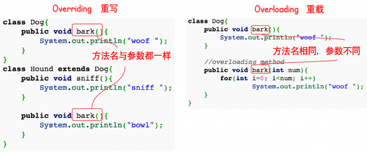

::: details 目录
[[toc]]
:::


在继承关系中， ***子类如果定义了一个与父类方法签名完全相同的方法*** ，被称为 重写 / 覆写（*Override*）。

例如，在 `Person` 类中，我们定义了 `run()` 方法：

```java
class Person {
    public void run() {
        System.out.println("Person.run");
    }
}
```

在子类 `Student` 中，重写这个 `run()` 方法：

```java
class Student extends Person {
    @Override
    public void run() {
        System.out.println("Student.run");
    }
}
```

`Override` 和 `Overload` 不同的是，如果方法签名不同，就是 `Overload` ， `Overload` 方法是一个新方法；如果方法签名相同，并且返回值也相同，就是 `Override` 。

> [!caution]
> 方法名相同，方法参数相同，但方法返回值不同，也是不同的方法。在 Java 程序中，出现这种情况，编译器会报错。

```java
class Person {
    public void run() {...}
}

class Student extends Person {
    // 不是 Override，因为参数不同:
    public void run(String s) {...}
    // 不是 Override，因为返回值不同:
    public int run() {...}
}
```

加上 `@Override` 可以让编译器帮助检查是否进行了正确的重写。希望进行重写，但是不小心写错了方法签名，编译器会报错。

```java
public class Main {
    public static void main(String[] args) {
    }
}

class Person {
    public void run() {}
}

public class Student extends Person {
    @Override // Compile error!
    public void run(String s) {}
}
```

> [!important]
> @Override 不是必需的。


## 🍀 面试题：方法的重载与重写的区别？

| 区别点   | 重载方法 | 重写方法    |
| :------- | :------- | :-------- |
| 参数列表 | 必须修改 | 一定不能修改   |
| 返回类型 | 可以修改 | 一定不能修改   |
| 异常   | 可以修改 | 可以减少或删除，一定不能抛出新的或者更广的异常 |
| 访问   | 可以修改 | 一定不能做更严格的限制（可以降低限制）         |

方法的重写（Overriding）和重载（Overloading）是 Java 多态性的不同表现，重写是父类与子类之间多态性的一种表现，重载可以理解成多态的具体表现形式。

1. 方法重载是一个类中定义了多个方法名相同，而他们的参数的数量不同或数量相同而类型和次序不同，则称为方法的重载（Overloading）。
2. 方法重写是在子类存在方法与父类的方法的名字相同，而且参数的个数与类型一样，返回值也一样的方法，就称为重写（Overriding）。
3. 方法重载是一个类的多态性表现，而方法重写是子类与父类的一种多态性表现。




