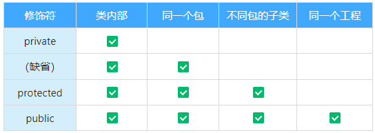
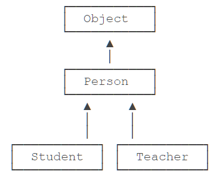

::: details 目录
[[toc]]
:::

## 🍀 封装性（Encapsulation）

当我们创建一个类的对象以后，我们可以通过 `对象.属性` 的方式，对对象的属性进行赋值，这里，赋值操作要受到属性的数据类型和存储范围的制约。除此之外，没有其他制约条件。

但是，在实际问题中，我们往往需要给属性赋值，加入额外的限制条件。这个条件就不能在属性声明时体现，我们只能通过方法进行限制条件的添加（比如，_setLegs_）。同时，我们需要避免用户再使用 `对象.属性` 的方式对属性进行赋值，则需要将属性声明为私有的（_private_）。

```java
	private int legs;// 腿的个数

	// 对属性的设置
	public void setLegs(int l){
		if(l>= 0 && l % 2 == 0){
			legs = l;
		}else{
			legs = 0;
			// 抛出一个异常（暂时没有讲）
		}
	}

	// 对属性的获取
	public int getLegs(){
		return legs;
	}
```

→ 此时，针对于属性就体现了封装性。
​

### 封装性的体现

① _我们将类的属性私有化 (`private`) ，同时，提供公共的 (`public`) 方法来获取 (`getXxx`) 和设置 (`setXxx`) 此属性的值。_
② 不对外暴露的私有的方法
③ 单例模式（将构造器私有化）
④ 如果不希望类在包外被调用，可以将类设置为缺省的。
​

> [!warning]
> 封装性的体现，需要权限修饰符来配合

1. Java 规定的 4 种权限（从小到大排列），_private_ → _缺省_ → _protected_ → _public_
2. 4 种权限可以用来修饰类及类的内部结构：属性、方法、构造器、内部类

> [!important]
> 修饰类的话，只能使用：缺省、 _public_

Java 提供了 4 中权限修饰符来修饰类及类的内部结构，体现类及类的内部结构在被调用时的可见性的大小。



### 为什么需要封装？封装的作用和含义？

- 我们程序设计追求 **_“高内聚，低耦合”_** 。
  - _高内聚_ ：类的内部数据操作细节自己完成，不允许外部干涉；
  - _低耦合_ ：仅对外暴露少量的方法用于使用；
- 隐藏对象内部的复杂性，只对外公开简单的接口。
- 便于外界调用，从而提高系统的可扩展性、可维护性。
  - 通俗的说，把该隐藏的隐藏起来，该暴露的暴露出来。这就是封装性的设计思想。

## 🍀 继承性（inheritance）

在前面的章节中，我们已经定义了 `Person` 类：

```java
class Person {
    private String name;
    private int age;

    public String getName() {...}
    public void setName(String name) {...}
    public int getAge() {...}
    public void setAge(int age) {...}
}
```

现在，假设需要定义一个 `Student` 类，字段如下：

```java
class Student {
    private String name;
    private int age;
    private int score;

    public String getName() {...}
    public void setName(String name) {...}
    public int getAge() {...}
    public void setAge(int age) {...}
    public int getScore() {...}
    public void setScore(int score) {...}
}
```

仔细观察，发现 `Student` 类包含了 `Person` 类已有的字段和方法，只是多出了一个 `score` 字段和相应的 `getScore()`、`setScore()` 方法。

能不能在 `Student` 中不要写重复的代码？

这个时候，继承就派上用场了。

继承是面向对象编程中非常强大的一种机制，它首先可以 **_复用代码_** 。当我们让 `Student` 从 `Person` 继承时，`Student` 就获得了 `Person` 的所有功能，我们只需要为 `Student` 编写新增的功能。

Java 使用 `extends` 关键字来实现继承：

```java
class Person {
    private String name;
    private int age;

    public String getName() {...}
    public void setName(String name) {...}
    public int getAge() {...}
    public void setAge(int age) {...}
}

class Student extends Person {
    // 不要重复 name 和 age 字段 / 方法,
    // 只需要定义新增 score 字段 / 方法:
    private int score;

    public int getScore() { …}
    public void setScore(int score) { … }
}
```

可见，通过继承，`Student` 只需要编写额外的功能，不再需要重复代码。

> [!caution]
> 子类自动获得了父类的所有字段，_严禁定义与父类重名的字段_！

在 OOP 的术语中，我们把 `Person` 称为超类（_super class_），父类（_parent class_），基类（_base class_），把 `Student` 称为子类（_subclass_），扩展类（_extended class_）。

### 继承树

注意到我们在定义 `Person` 的时候，没有写 `extends` 。

1. 如果我们没有显式的声明一个类的父类的话，则此类继承于 `java.lang.Object` 类
2. 所有的 Java 类（除 `java.lang.Object` 类之外）都直接 / 间接的继承于 `java.lang.Object` 类
3. 意味着，所有的 Java 类具有 `java.lang.Object` 类声明的功能。

在 Java 中，没有明确写 `extends` 的类，编译器会自动加上 `extends Object` 。所以，任何类，除了 `Object`，都会继承自某个类。下图是 `Person`、`Student` 的继承树：


Java 只允许一个 `class` 继承自一个类，因此，一个类有且仅有一个父类。只有 `Object` 特殊，它没有父类。

类似的，如果我们定义一个继承自 `Person` 的 `Teacher`，它们的继承树关系如下：



### protected

继承有个特点，就是 **_子类无法访问父类的 `private` 字段或者 `private` 方法_** 。例如，`Student` 类就无法访问 `Person` 类的 `name` 和 `age` 字段：

```java
class Person {
    private String name;
    private int age;
}

class Student extends Person {
    public String hello() {
        return "Hello," + name; // 编译错误：无法访问 name 字段
    }
}
```

这使得继承的作用被削弱了。为了让子类可以访问父类的字段，我们需要把 `private` 改为 `protected` 。**_用 `protected` 修饰的字段可以被子类访问_** ：

```java
class Person {
    protected String name;
    protected int age;
}

class Student extends Person {
    public String hello() {
        return "Hello," + name; // OK!
    }
}
```

因此，`protected` 关键字可以把字段和方法的访问权限控制在继承树内部，一个 `protected` 字段和方法可以被其子类，以及子类的子类所访问，后面我们还会详细讲解。

### super

`super` 关键字表示父类（超类）。子类引用父类的字段时，可以用 `super.fieldName` 。例如：

```java
class Student extends Person {
    public String hello() {
        return "Hello," + super.name;
    }
}
```

实际上，这里使用 `super.name`，或者 `this.name`，或者 `name`，效果都是一样的。编译器会自动定位到父类的 `name` 字段。

但是，在某些时候，就必须使用 `super` 。我们来看一个例子：

```java
public class Main {
    public static void main(String[] args) {
        Student s = new Student("Xiao Ming", 12, 89);
    }
}

class Person {
    protected String name;
    protected int age;

    public Person(String name, int age) {
        this.name = name;
        this.age = age;
    }
}

class Student extends Person {
    protected int score;

    public Student(String name, int age, int score) {
        this.score = score;
    }
}
```

运行上面的代码，会得到一个编译错误，大意是在 `Student` 的构造方法中，无法调用 `Person` 的构造方法。

这是因为在 Java 中，任何 `class` 的构造方法，第一行语句必须是调用父类的构造方法。如果没有明确地调用父类的构造方法，编译器会帮我们自动加一句 `super();`，所以，`Student` 类的构造方法实际上是这样：

```java
class Student extends Person {
    protected int score;

    public Student(String name, int age, int score) {
        super(); // 自动调用父类的构造方法
        this.score = score;
    }
}
```

但是，`Person` 类并没有无参数的构造方法，因此，编译失败。

解决方法是调用 `Person` 类存在的某个构造方法。例如：

```java
class Student extends Person {
    protected int score;

    public Student(String name, int age, int score) {
        super(name, age); // 调用父类的构造方法 Person(String, int)
        this.score = score;
    }
}
```

这样就可以正常编译了！

因此我们得出结论： **_如果父类没有默认的构造方法，子类就必须显式调用 `super()` 并给出参数以便让编译器定位到父类的一个合适的构造方法_** 。

这里还顺带引出了另一个问题：即 **_子类不会继承任何父类的构造方法_** 。子类默认的构造方法是编译器自动生成的，不是继承的。

### 阻止继承 \*

正常情况下，只要某个 `class` 没有 `final` 修饰符，那么任何类都可以从该 `class` 继承。

> [!important]
> 从 Java 15 开始，允许使用 `sealed` 修饰 `class`，并通过 `permits` 明确写出能够从该 `class` 继承的子类名称。

例如，定义一个 `Shape` 类：

```java
public sealed class Shape permits Rect, Circle, Triangle {
    ...
}
```

上述 `Shape` 类就是一个 `sealed` 类，它只允许指定的 3 个类继承它。如果写：

```java
public final class Rect extends Shape {...}
```

是没问题的，因为 `Rect` 出现在 `Shape` 的 `permits` 列表中。但是，如果定义一个 `Ellipse` 就会报错：

```java
public final class Ellipse extends Shape {...}
// Compile error: class is not allowed to extend sealed class: Shape
```

原因是 `Ellipse` 并未出现在 `Shape` 的 `permits` 列表中。这种 `sealed` 类主要用于一些框架，防止继承被滥用。

`sealed` 类在 Java 15 中目前是预览状态，要启用它，必须使用参数 `--enable-preview` 和 `--source 15` 。

### 向上转型

如果一个引用变量的类型是 `Student`，那么它可以指向一个 `Student` 类型的实例：

```java
    Student s = new Student();
```

如果一个引用类型的变量是 `Person`，那么它可以指向一个 `Person` 类型的实例：

```java
    Person p = new Person();
```

现在问题来了：如果 `Student` 是从 `Person` 继承下来的，那么，一个引用类型为 `Person` 的变量，能否指向 `Student` 类型的实例？

```java
    Person p = new Student(); // ???
```

测试一下就可以发现，这种指向是允许的！

这是因为 `Student` 继承自 `Person`，因此，它拥有 `Person` 的全部功能。`Person` 类型的变量，如果指向 `Student` 类型的实例，对它进行操作，是没有问题的！

这种 _把一个子类类型安全地变为父类类型的赋值_ ，被称为 **_向上转型_** （_upcasting_）。

向上转型实际上是把一个子类型安全地变为更加抽象的父类型：

```java
    Student s = new Student();
    Person p = s; // upcasting, ok
    Object o1 = p; // upcasting, ok
    Object o2 = s; // upcasting, ok
```

注意到继承树是 $Student > Person > Object$ ，所以，可以把 `Student` 类型转型为 `Person`，或者更高层次的 `Object` 。

### 向下转型

和向上转型相反，如果把一个父类类型强制转型为子类类型，就是向下转型（_downcasting_）。例如：

```java
    Person p1 = new Student(); // upcasting, ok
    Person p2 = new Person();
    Student s1 = (Student) p1; // ok
    Student s2 = (Student) p2; // runtime error! ClassCastException!
```

如果测试上面的代码，可以发现：

`Person` 类型 `p1` 实际指向 `Student` 实例，`Person` 类型变量 `p2` 实际指向 `Person` 实例。在向下转型的时候，把 `p1` 转型为 `Student` 会成功，因为 `p1` 确实指向 `Student` 实例，把 `p2` 转型为 `Student` 会失败，因为 `p2` 的实际类型是 `Person`，不能把父类变为子类，因为子类功能比父类多，多的功能无法凭空变出来。

因此，向下转型很可能会失败。失败的时候，Java 虚拟机会报 `ClassCastException` 。

为了避免向下转型出错，Java 提供了 `instanceof` 操作符，可以先判断一个实例究竟是不是某种类型：

```java
    Person p = new Person();
    System.out.println(p instanceof Person); // true
    System.out.println(p instanceof Student); // false

    Student s = new Student();
    System.out.println(s instanceof Person); // true
    System.out.println(s instanceof Student); // true

    Student n = null;
    System.out.println(n instanceof Student); // false
```

`instanceof` 实际上判断一个变量所指向的实例是否是指定类型，或者这个类型的子类。如果一个引用变量为 `null`，那么对任何 `instanceof` 的判断都为 `false。`

利用 `instanceof`，在向下转型前可以先判断：

```java
    Person p = new Student();
    if (p instanceof Student) {
        // 只有判断成功才会向下转型:
        Student s = (Student) p; // 一定会成功
    }
```

> [!important]
> 从 Java 14 开始，判断 `instanceof` 后，可以直接转型为指定变量，避免再次强制转型。例如，对于以下代码：

```java
    Object obj = "hello";
    if (obj instanceof String) {
        String s = (String) obj;
        System.out.println(s.toUpperCase());
    }
```

可以改写如下：

```java
public class Main {
    public static void main(String[] args) {
        Object obj = "hello";
        if (obj instanceof String s) {
            // 可以直接使用变量 s:
            System.out.println(s.toUpperCase());
        }
    }
}
```

这种使用 `instanceof` 的写法更加简洁。

### 区分继承和组合

在使用继承时，我们要注意逻辑一致性。

考察下面的 `Book` 类：

```java
class Book {
    protected String name;
    public String getName() {...}
    public void setName(String name) {...}
}
```

这个 `Book` 类也有 `name` 字段，那么，我们能不能让 `Student` 继承自 `Book` 呢？

```java
class Student extends Book {
    protected int score;
}
```

显然，从逻辑上讲，这是不合理的，`Student` 不应该从 `Book` 继承，而应该从 `Person` 继承。

究其原因，是因为 `Student` 是 `Person` 的一种，它们是 `is` 关系，而 `Student` 并不是 `Book` 。实际上 `Student` 和 `Book` 的关系是 has 关系。

具有 has 关系不应该使用继承，而是使用组合，即 `Student` 可以持有一个 `Book` 实例：

```java
class Student extends Person {
    protected Book book;
    protected int score;
}
```

因此，继承是 `is` 关系，组合是 `has` 关系。

### 练习

定义 `PrimaryStudent`，从 `Student` 继承，并新增一个 `grade` 字段：

```java
public class PrimaryStudentTest {
    public static void main(String[] args) {
        PersonD p = new PersonD("小明", 12);
        StudentD s = new StudentD("小红", 20, 99);
        // TODO: 定义 PrimaryStudent，从 Student 继承，新增 grade 字段:
        StudentD ps = new PrimaryStudent("小军", 9, 100, 5);
        System.out.println(ps.getScore());
    }
}

class PersonD {
    protected String name;
    protected int age;

    public PersonD(String name, int age) {
        this.name = name;
        this.age = age;
    }

    public String getName() { return name;}
    public void setName(String name) { this.name = name; }

    public int getAge() { return age;}
    public void setAge(int age) { this.age = age; }
}

class StudentD extends PersonD {
    protected int score;

    public StudentD(String name, int age, int score) {
        super(name, age);
        this.score = score;
    }

    public int getScore() { return score;}
}

class PrimaryStudent extends StudentD {
    // TODO
    protected int grade;

    public PrimaryStudent(String name, int age, int score, int grade) {
        super(name, age, score);
        this.grade = grade;
    }
}
```

### 小结

- 继承是面向对象编程的一种强大的代码复用方式；
- Java 只允许单继承，所有类最终的根类是 `Object` ；
- `protected` 允许子类访问父类的字段和方法；
- 子类的构造方法可以通过 `super()` 调用父类的构造方法；
- 可以安全地向上转型为更抽象的类型；
- 可以强制向下转型，最好借助 `instanceof` 判断；
- 子类和父类的关系是 `is`，`has` 关系不能用继承。

#### 继承性的好处：

① 减少了代码的冗余，提高了代码的复用性
② 便于功能的扩展
③ 为之后多态性的使用，提供了前提

#### 子类继承父类后有哪些不同？

1. 体现：一旦子类 A 继承父类 B 以后，子类 A 中就获取了父类 B 中声明的所有的属性、方法。
   - 特别的，父类中声明为 `private` 的属性或方法，子类继承父类以后，仍然认为 _获取了父类中私有的结构_ ，只因为封装性的影响，使得子类不能直接调用父类的结构而已。
2. 子类继承父类以后，还可以 _声明自己特有的属性或方法_ ，实现功能的拓展。

#### Java 中关于继承性的规定

1. 一个类可以被多个子类继承；
2. Java 中类的单继承性：一个类只能有一个父类；
3. 子父类是相对的概念（多层继承）；
4. 子类直接继承的父类：直接父类；子类间接继承的父类：间接父类；
5. 子类继承父类以后，就获取了直接父类以及所有间接父类中的属性和方法。

## 🍀 多态性(Polymorphic)

在上一节中，我们已经知道，引用变量的声明类型可能与其实际类型不符，例如：

```java
    Person p = new Student();
```

现在，我们考虑一种情况，如果子类重写了父类的方法：

```java
public class Main {
    public static void main(String[] args) {
        Person p = new Student();
        p.run(); // 应该打印 Person.run 还是 Student.run?
    }
}

class Person {
    public void run() {
        System.out.println("Person.run");
    }
}

class Student extends Person {
    @Override
    public void run() {
        System.out.println("Student.run");
    }
}
```

那么，一个实际类型为 `Student`，引用类型为 `Person` 的变量，调用其 `run()` 方法，调用的是 `Person` 还是 `Student` 的 `run()` 方法？

运行一下上面的代码就可以知道，实际上调用的方法是 `Student` 的 `run()` 方法。因此可得出结论：

Java 的实例方法调用是基于运行时的实际类型的动态调用，而非变量的声明类型。

这个非常重要的特性在面向对象编程中称之为多态。它的英文拼写非常复杂： **_Polymorphic_** 。

### 定义

多态是指，**_针对某个类型的方法调用，其真正执行的方法取决于运行时期实际类型的方法。_** 例如：

```java
    Person p = new Student();
    p.run(); // 无法确定运行时究竟调用哪个 run() 方法
```

有童鞋会问，从上面的代码一看就明白，肯定调用的是 Student 的 run() 方法啊。

但是，假设我们编写这样一个方法：

```java
public void runTwice(Person p) {
    p.run();
    p.run();
}
```

它传入的参数类型是 `Person`，我们是无法知道传入的参数实际类型究竟是 `Person`，还是 `Student`，还是 `Person` 的其他子类，因此，也无法确定调用的是不是 `Person` 类定义的 `run()` 方法。

所以，多态的特性就是，**_运行期才能动态决定调用的子类方法_** 。对某个类型调用某个方法，执行的实际方法可能是某个子类的重写方法。这种不确定性的方法调用，究竟有什么作用？

我们还是来举栗子。

假设我们定义一种收入，需要给它报税，那么先定义一个 `Income` 类：

```java
class Income {
    protected double income;
    public double getTax() {
        return income * 0.1; // 税率 10%
    }
}
```

对于工资收入，可以减去一个基数，那么我们可以从 `Income` 派生出 `SalaryIncome`，并重写 `getTax()` ：

```java
class Salary extends Income {
    @Override
    public double getTax() {
        if (income <= 5000) {
            return 0;
        }
        return (income - 5000) * 0.2;
    }
}
```

如果你享受国务院特殊津贴，那么按照规定，可以全部免税：

```java
class StateCouncilSpecialAllowance extends Income {
    @Override
    public double getTax() {
        return 0;
    }
}
```

现在，我们要编写一个报税的财务软件，对于一个人的所有收入进行报税，可以这么写：

```java
public double totalTax(Income... incomes) {
    double total = 0;
    for (Income income: incomes) {
        total = total + income.getTax();
    }
    return total;
}
```

来试一下：

```java
// Polymorphic
public class Main {
    public static void main(String[] args) {
        // 给一个有普通收入、工资收入和享受国务院特殊津贴的小伙伴算税:
        Income[] incomes = new Income[] {
            new Income(3000),
            new Salary(7500),
            new StateCouncilSpecialAllowance(15000)
        };
        System.out.println(totalTax(incomes));
    }

    public static double totalTax(Income... incomes) {
        double total = 0;
        for (Income income: incomes) {
            total = total + income.getTax();
        }
        return total;
    }
}

class Income {
    protected double income;

    public Income(double income) {
        this.income = income;
    }

    public double getTax() {
        return income * 0.1; // 税率 10%
    }
}

class Salary extends Income {
    public Salary(double income) {
        super(income);
    }

    @Override
    public double getTax() {
        if (income <= 5000) {
            return 0;
        }
        return (income - 5000) * 0.2;
    }
}

class StateCouncilSpecialAllowance extends Income {
    public StateCouncilSpecialAllowance(double income) {
        super(income);
    }

    @Override
    public double getTax() {
        return 0;
    }
}
```

观察 `totalTax()` 方法：利用多态，`totalTax()` 方法只需要和 `Income` 打交道，它完全不需要知道 `Salary` 和 `StateCouncilSpecialAllowance` 的存在，就可以正确计算出总的税。如果我们要新增一种稿费收入，只需要从 `Income` 派生，然后正确重写 `getTax()` 方法就可以。把新的类型传入 `totalTax()`，不需要修改任何代码。

可见，多态具有一个非常强大的功能，就是 **_允许添加更多类型的子类实现功能扩展，却不需要修改基于父类的代码_** 。

### 重写 Object 方法

因为所有的 `class` 最终都继承自 `Object`，而 `Object` 定义了几个重要的方法：

- `toString()` ：把 `instance` 输出为 `String` ；
- `equals()` ：判断两个 `instance` 是否逻辑相等；
- `hashCode()` ：计算一个 `instance` 的哈希值。

在必要的情况下，我们可以重写 `Object` 的这几个方法。例如：

```java
class Person {
    ...
    // 显示更有意义的字符串:
    @Override
    public String toString() {
        return "Person:name=" + name;
    }

    // 比较是否相等:
    @Override
    public boolean equals(Object o) {
        // 当且仅当 o 为 Person 类型:
        if (o instanceof Person) {
            Person p = (Person) o;
            // 并且 name 字段相同时，返回 true:
            return this.name.equals(p.name);
        }
        return false;
    }

    // 计算 hash:
    @Override
    public int hashCode() {
        return this.name.hashCode();
    }
}
```

### 调用 super

在子类的重写方法中，如果要 **_调用父类的被重写的方法_** ，可以通过 `super` 来调用。例如：

```java
class Person {
    protected String name;
    public String hello() {
        return "Hello," + name;
    }
}

Student extends Person {
    @Override
    public String hello() {
        // 调用父类的 hello() 方法:
        return super.hello() + "!";
    }
}
```

### final

继承可以允许子类重写父类的方法。如果一个父类不允许子类对它的某个方法进行重写，可以把该方法标记为 `final` 。**_用 `final` 修饰的方法不能被 `Override`_** ：

```java
class Person {
    protected String name;
    public final String hello() {
        return "Hello," + name;
    }
}

Student extends Person {
    // compile error: 不允许重写
    @Override
    public String hello() {
    }
}
```

如果一个类不希望任何其他类继承自它，那么可以把这个类本身标记为 `final` 。**_用 `final` 修饰的类不能被继承_** ：

```java
final class Person {
    protected String name;
}

// compile error: 不允许继承自 Person
Student extends Person {
}
```

对于一个类的实例字段，同样可以用 `final` 修饰。**_用 `final` 修饰的字段在初始化后不能被修改。_** 例如：

```java
class Person {
    public final String name = "Unamed";
}
```

对 `final` 字段重新赋值会报错：

```java
    Person p = new Person();
    p.name = "New Name"; // compile error!
```

可以在构造方法中初始化 `final` 字段：

```java
class Person {
    public final String name;
    public Person(String name) {
        this.name = name;
    }
}
```

这种方法更为常用，因为 **_可以保证实例一旦创建，其 `final` 字段就不可修改_** 。

### 练习

给一个有工资收入和稿费收入的小伙伴算税。

```java
public class PolymorphicTest {
    public static void main(String[] args) {
        // 给一个有工资收入和稿费收入的小伙伴算税:
        Income[] incomes = new Income[] {
                new Salary(8000),
                new RoyaltyIncome(2000)
        };

        Person p = new Person("Frank");
        p.setIncome(incomes);
        double totalTax = p.getTotalTax();
        System.out.printf("%s's total tax is: %.2f", p.getName(), p.getTotalTax());
    }

    public static double totalTax(Income... incomes) {
        double total = 0;
        for (Income income: incomes) {
            total = total + income.getTax();
        }
        return total;
    }
}

class Person {
    protected Income[] incomes;
    protected String name;

    public Person(String name) {
        this.name = name;
    }

    public String getName() {
        return this.name;
    }

    public void setIncome(Income... incomes) {
        this.incomes = incomes;
    }

    public double getTotalTax() {
        double totalTax = 0;

        for (Income income : this.incomes) {
            totalTax += income.getTax();
        }

        return totalTax;
    }
}

class Income {
    protected double income;

    public Income(double income) {
        this.income = income;
    }

    public double getTax() {
        return income * 0.1; // 税率 10%
    }
}

class Salary extends Income {
    public Salary(double income) {
        super(income);
    }

    @Override
    public double getTax() {
        if (income <= 5000) {
            return 0;
        }
        return (income - 5000) * 0.2;
    }
}

class RoyaltyIncome extends Income {
    public RoyaltyIncome(double income) {
        super(income);
    }

    @Override
    public double getTax() {
        return income * 0.2;//稿费收入税率是20%
    }
}
```

### 小结

- 子类可以重写父类的方法（_Override_），重写在子类中改变了父类方法的行为；
- Java 的方法调用总是作用于运行期对象的实际类型，这种行为称为多态；
- `final` 修饰符有多种作用：
- `final` 修饰的方法可以阻止被重写；
- `final` 修饰的 `class` 可以阻止被继承；
- `final` 修饰的 `field` 必须在创建对象时初始化，随后不可修改。
