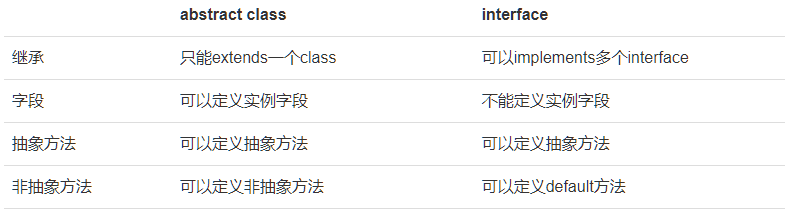
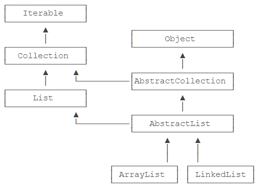

::: details 目录
[[toc]]
:::


在抽象类中，抽象方法本质上是 ***定义接口规范*** ：即规定高层类的接口，从而保证所有子类都有相同的接口实现，这样，多态就能发挥出威力。

如果一个抽象类没有字段，所有方法全部都是抽象方法：

```java
abstract class Person {
    public abstract void run();
    public abstract String getName();
}
```

就可以把该抽象类改写为接口： `interface` 。

在 Java 中，使用 `interface` 可以声明一个接口：

```java
interface Person {
    void run();
    String getName();
}
```

所谓 `interface` ，就是比抽象类还要抽象的纯抽象接口，因为它连字段都不能有。因为接口定义的所有方法默认都是 `public abstract` 的，所以这两个修饰符 *不需要写出来* （写不写效果都一样）。

当一个具体的 `class` 去实现一个 `interface` 时，需要使用 `implements` 关键字。举个例子：

```java
class Student implements Person {
    private String name;

    public Student(String name) {
        this.name = name;
    }

    @Override
    public void run() {
        System.out.println(this.name + "run");
    }

    @Override
    public String getName() {
        return this.name;
    }
}
```

我们知道，在 Java 中，一个类只能继承自另一个类，不能从多个类继承。但是，一个类可以实现多个 `interface` ，例如：

```java
class Student implements Person, Hello { // 实现了两个 interface
    ...
}
```


## 🍀 术语


注意区分术语：

Java 的接口特指 `interface` 的定义，表示一个接口类型和一组方法签名，而编程接口泛指接口规范，如方法签名，数据格式，网络协议等。

抽象类和接口的对比如下：




## 🍀 接口继承


一个 `interface` 可以继承自另一个 `interface` 。 `interface` 继承自 `interface` 使用 `extends` ，它相当于扩展了接口的方法。例如：

```java
interface Hello {
    void hello();
}

interface Person extends Hello {
    void run();
    String getName();
}
```

此时， `Person` 接口继承自 `Hello` 接口，因此， `Person` 接口现在实际上有 3 个抽象方法签名，其中一个来自继承的 `Hello` 接口。


## 🍀 继承关系


合理设计 `interface` 和 `abstract class` 的继承关系，可以充分复用代码。一般来说，公共逻辑适合放在 `abstract class` 中，具体逻辑放到各个子类，而接口层次代表抽象程度。可以参考 Java 的集合类定义的一组接口、抽象类以及具体子类的继承关系：



在使用的时候，实例化的对象永远只能是某个具体的子类，但总是通过接口去引用它，因为接口比抽象类更抽象：

```java
List list = new ArrayList(); // 用 List 接口引用具体子类的实例
Collection coll = list; // 向上转型为 Collection 接口
Iterable it = coll; // 向上转型为 Iterable 接口
```


## 🍀 default 方法

在接口中，可以定义 `default` 方法。例如，把 `Person` 接口的 `run()` 方法改为 `default` 方法：

```java
public class Main {
    public static void main(String[] args) {
        Person p = new Student("Xiao Ming");
        p.run();
    }
}

interface Person {
    String getName();
    default void run() {
        System.out.println(getName() + "run");
    }
}

class Student implements Person {
    private String name;

    public Student(String name) {
        this.name = name;
    }

    public String getName() {
        return this.name;
    }
}
```

实现类可以不必重写 `default` 方法。 `default` 方法的目的是，当我们需要给接口新增一个方法时，会涉及到修改全部子类。如果新增的是 `default` 方法，那么子类就不必全部修改，只需要在需要重写的地方去重写新增方法。

`default` 方法和抽象类的普通方法是有所不同的。因为 `interface` 没有字段， `default` 方法无法访问字段，而抽象类的普通方法可以访问实例字段。

## 🍀 练习


用接口给一个有工资收入和稿费收入的小伙伴算税。


```java
public class PolymorphicTest {
    public static void main(String[] args) {
        // 给一个有工资收入和稿费收入的小伙伴算税:
        Income[] incomes = new Income[] {
                new Salary(8000),
                new RoyaltyIncome(2000)
        };

        Person p = new Person("Frank");
        p.setIncome(incomes);
        double totalTax = p.getTotalTax();
        System.out.printf("%s's total tax is: %.2f", p.getName(), p.getTotalTax());
    }

    public static double totalTax(Income... incomes) {
        double total = 0;
        for (Income income: incomes) {
            total = total + income.getTax();
        }
        return total;
    }
}

class Person {
    protected Income[] incomes;
    protected String name;

    public Person(String name) {
        this.name = name;
    }

    public String getName() {
        return this.name;
    }

    public void setIncome(Income... incomes) {
        this.incomes = incomes;
    }

    public double getTotalTax() {
        double totalTax = 0;

        for (Income income : this.incomes) {
            totalTax += income.getTax();
        }

        return totalTax;
    }
}

interface Income {
    double getTax();
}

class Salary implements Income {
    protected double income;

    public Salary(double income) {
        this.income = income;
    }

    @Override
    public double getTax() {
        if (income <= 5000) {
            return 0;
        }
        return (income - 5000) * 0.2;
    }
}

class RoyaltyIncome implements Income {
    protected double income;

    public RoyaltyIncome(double income) {
        this.income = income;
    }

    @Override
    public double getTax() {
        return income * 0.2;//稿费收入税率是20%
    }
}
```

## 🍀 小结

- Java 的接口（*interface*）定义了纯抽象规范，一个类可以实现多个接口；
- 接口也是数据类型，适用于向上转型和向下转型；
- 接口的所有方法都是抽象方法，接口不能定义实例字段；
- 接口可以定义 `default` 方法（JDK >= 1.8）。


