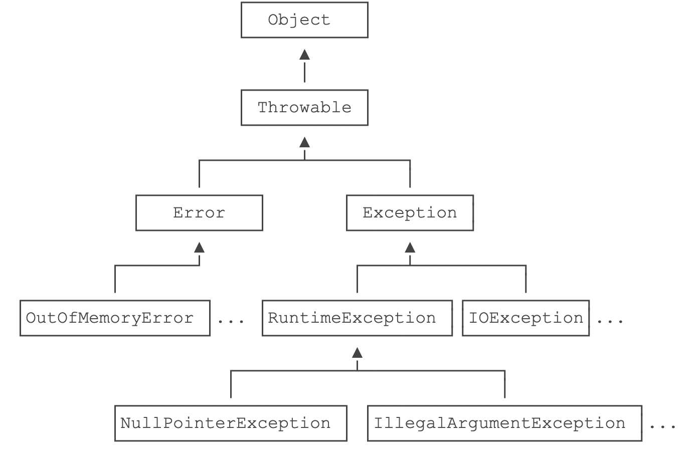

::: details 目录
[[toc]]
:::


在计算机程序运行的过程中，总是会出现各种各样的错误。

有一些错误是用户造成的，比如，希望用户输入一个 `int` 类型的年龄，但是用户的输入是 `abc` ：

```java
// 假设用户输入了 abc：
String s = "abc";
int n = Integer.parseInt(s); // NumberFormatException!
```

程序想要读写某个文件的内容，但是用户已经把它删除了：

```java
// 用户删除了该文件：
String t = readFile("C:\\abc.txt"); // FileNotFoundException!
```

还有一些错误是随机出现，并且永远不可能避免的。比如：

- 网络突然断了，连接不到远程服务器；
- 内存耗尽，程序崩溃了；
- 用户点 “打印”，但根本没有打印机；
- ……

所以，一个健壮的程序必须处理各种各样的错误。

所谓错误，就是程序调用某个函数的时候，如果失败了，就表示出错。


## 🍀 调用方如何获知调用失败的信息？

有两种方法：

### 方法一

<u>==约定返回错误码==</u>

例如，处理一个文件，如果返回 `0` ，表示成功，返回其他整数，表示约定的错误码：

```java
int code = processFile("C:\\test.txt");
if (code == 0) {
    // ok:
} else {
    // error:
    switch (code) {
    case 1:
        // file not found:
    case 2:
        // no read permission:
    default:
        // unknown error:
    }
}
```

因为使用 `int` 类型的错误码，想要处理就非常麻烦。这种方式常见于底层 C 函数。


### 方法二 

<u>==在语言层面上提供一个异常处理机制==</u>

Java 内置了一套异常处理机制，总是使用异常来表示错误。

异常是一种 `class` ，因此它本身带有类型信息。异常可以在任何地方抛出，但只需要在上层捕获，这样就和方法调用分离了：

```java
try {
    String s = processFile(“C:\\test.txt”);
    // ok:
} catch (FileNotFoundException e) {
    // file not found:
} catch (SecurityException e) {
    // no read permission:
} catch (IOException e) {
    // io error:
} catch (Exception e) {
    // other error:
}
```

因为 Java 的异常是 class，它的继承关系如下：



从继承关系可知： `Throwable` 是异常体系的根，它继承自 `Object` 。 `Throwable` 有两个体系： `Error` 和 `Exception` ， `Error` 表示 ==严重的错误== ，程序对此一般无能为力，例如：

- `OutOfMemoryError` ：内存耗尽
- `NoClassDefFoundError` ：无法加载某个 Class
- `StackOverflowError` ：栈溢出


而 `Exception` 则是运行时的错误，它 ==**可以被捕获并处理**==。

某些异常是应用程序逻辑处理的一部分，应该捕获并处理。例如：

- `NumberFormatException` ：数值类型的格式错误
- `FileNotFoundException` ：未找到文件
- `SocketException` ：读取网络失败


还有一些异常是程序逻辑编写不对造成的，应该修复程序本身。例如：

- `NullPointerException` ：对某个 `null` 的对象调用方法或字段
- `IndexOutOfBoundsException` ：数组索引越界


`Exception` 又分为两大类：

1. `RuntimeException` 以及它的子类；
2. 非 `RuntimeException` （包括 `IOException` 、 `ReflectiveOperationException` 等等）


Java 规定：

- 必须捕获的异常，包括 `Exception` 及其子类，但不包括 `RuntimeException` 及其子类，这种类型的异常称为 Checked Exception 。
- 不需要捕获的异常，包括 Error 及其子类，RuntimeException 及其子类。

> [!caution]
> 编译器对 `RuntimeException` 及其子类不做强制捕获要求，不是指应用程序本身不应该捕获并处理 `RuntimeException` 。是否需要捕获，具体问题具体分析。


## 🍀 捕获异常

捕获异常使用 `try ... catch` 语句，把可能发生异常的代码放到 `try {...}` 中，然后使用 `catch` 捕获对应的 `Exception` 及其子类：

```java
import java.io.UnsupportedEncodingException;
import java.util.Arrays;
public class Main {
    public static void main(String[] args) {
        byte[] bs = toGBK("中文");
        System.out.println(Arrays.toString(bs));
    }

    static byte[] toGBK(String s) {
        try {
            // 用指定编码转换 String 为 byte[]:
            return s.getBytes("GBK");
        } catch (UnsupportedEncodingException e) {
            // 如果系统不支持 GBK 编码，会捕获到 UnsupportedEncodingException:
            System.out.println(e); // 打印异常信息
            return s.getBytes(); // 尝试使用用默认编码
        }
    }
}
```


如果我们不捕获 `UnsupportedEncodingException` ，会出现编译失败的问题：

```java
import java.io.UnsupportedEncodingException;
import java.util.Arrays;
public class Main {
    public static void main(String[] args) {
        byte[] bs = toGBK("中文");
        System.out.println(Arrays.toString(bs));
    }

    static byte[] toGBK(String s) {
        return s.getBytes("GBK");
    }
}
```


编译器会报错，错误信息类似：`unreported exception UnsupportedEncodingException; must be caught or declared to be thrown` ，并且准确地指出需要捕获的语句是 `return s.getBytes("GBK");` 。意思是说，像 `UnsupportedEncodingException` 这样的 Checked Exception ，必须被捕获。


这是因为 `String.getBytes(String)` 方法定义是：


```java
public byte[] getBytes(String charsetName) throws UnsupportedEncodingException {
    ...
}
```

在方法定义的时候，使用 `throws Xxx` 表示该方法可能抛出的异常类型。调用方在调用的时候，必须强制捕获这些异常，否则编译器会报错。

在 `toGBK()` 方法中，因为调用了 `String.getBytes(String)` 方法，就必须捕获 `UnsupportedEncodingException` 。我们也可以不捕获它，而是在方法定义处用 `throws` 表示 `toGBK()` 方法可能会抛出 `UnsupportedEncodingException` ，就可以让 `toGBK()` 方法通过编译器检查：


```java
// try...catch
import java.io.UnsupportedEncodingException;
import java.util.Arrays;
public class Main {
    public static void main(String[] args) {
        byte[] bs = toGBK("中文");
        System.out.println(Arrays.toString(bs));
    }

    static byte[] toGBK(String s) throws UnsupportedEncodingException {
        return s.getBytes("GBK");
    }
}
```


上述代码仍然会得到编译错误，但这一次，编译器提示的不是调用 `return s.getBytes("GBK");` 的问题，而是 `byte[] bs = toGBK("中文");` 。因为在 `main()` 方法中，调用 `toGBK()` ，没有捕获它声明的可能抛出的 `UnsupportedEncodingException` 。

修复方法是在 `main()` 方法中捕获异常并处理：


```java
// try...catch
import java.io.UnsupportedEncodingException;
import java.util.Arrays;
public class Main {
    public static void main(String[] args) {
        try {
            byte[] bs = toGBK("中文");
            System.out.println(Arrays.toString(bs));
        } catch (UnsupportedEncodingException e) {
            System.out.println(e);
        }
    }

    static byte[] toGBK(String s) throws UnsupportedEncodingException {
        // 用指定编码转换 String 为 byte[]:
        return s.getBytes("GBK");
    }
}
```


可见，只要是方法声明的 Checked Exception ，不在调用层捕获，也必须在更高的调用层捕获。所有未捕获的异常，最终也必须在 `main()` 方法中捕获，不会出现漏写 `try` 的情况。这是由编译器保证的。 `main()` 方法也是最后捕获 `Exception` 的机会。

如果是测试代码，上面的写法就略显麻烦。如果不想写任何 `try` 代码，可以直接把 `main()` 方法定义为 `throws Exception` ：


```java
import java.io.UnsupportedEncodingException;
import java.util.Arrays;
public class Main {
    public static void main(String[] args) throws Exception {
        byte[] bs = toGBK("中文");
        System.out.println(Arrays.toString(bs));
    }

    static byte[] toGBK(String s) throws UnsupportedEncodingException {
        // 用指定编码转换 String 为 byte[]:
        return s.getBytes("GBK");
    }
}
```


因为 `main()` 方法声明了可能抛出 `Exception` ，也就声明了可能抛出所有的 `Exception` ，因此在内部就无需捕获了。代价就是一旦发生异常，程序会立刻退出。

还有一些童鞋喜欢在 `toGBK()` 内部 “消化” 异常：


```java
static byte[] toGBK(String s) {
    try {
        return s.getBytes("GBK");
    } catch (UnsupportedEncodingException e) {
        // 什么也不干
    }
    return null;
}
```

这种捕获后不处理的方式是非常不好的，即使真的什么也做不了，也要先把异常记录下来：


```java
static byte[] toGBK(String s) {
    try {
        return s.getBytes("GBK");
    } catch (UnsupportedEncodingException e) {
        // 先记下来再说:
        e.printStackTrace();
    }
    return null;
}
```

所有异常都可以调用 `printStackTrace()` 方法打印异常栈，这是一个简单有用的快速打印异常的方法。

## 🍀 小结

- Java 使用异常来表示错误，并通过 `try ... catch` 捕获异常；
- Java 的异常是 `class` ，并且从 `Throwable` 继承；
- `Error` 是无需捕获的严重错误， `Exception` 是应该捕获的可处理的错误；
- `RuntimeException` 无需强制捕获，非 `RuntimeException` （Checked Exception）需强制捕获，或者用 `throws` 声明；
- **不推荐捕获了异常但不进行任何处理。**


