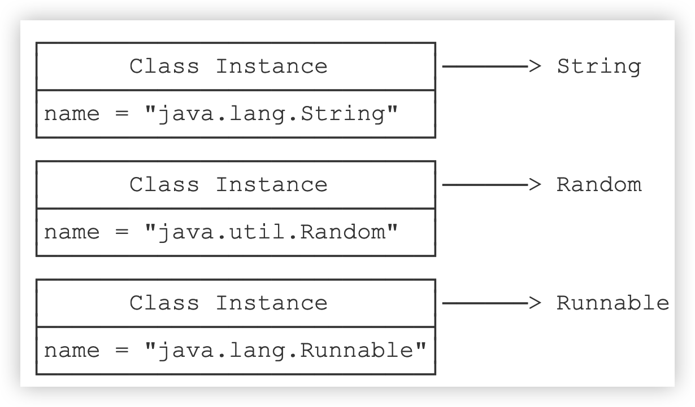
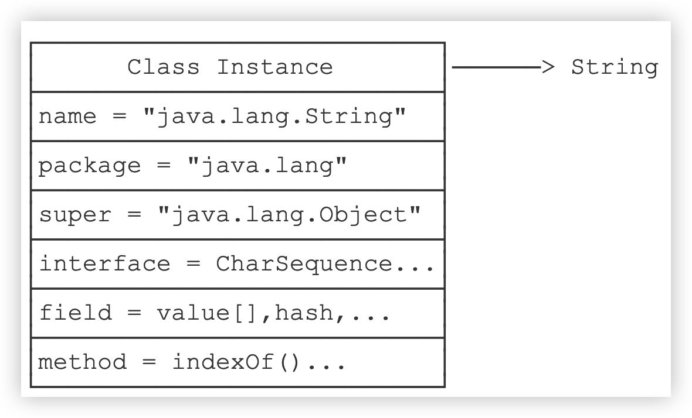

::: details 目录
[[toc]]
:::

除了 `int` 等基本类型外，Java 的其他类型全部都是 `class` （包括 `interface` ）。例如：

- String
- Object
- Runnable
- Exception
- ...

仔细思考，我们可以得出结论： `class` （包括 `interface` ）的本质是数据类型（ `Type` ）。_无继承关系的数据类型无法赋值_：

```java
Number n = new Double(123.456); // OK
String s = new Double(123.456); // compile error!
```

而 `class` 是由 JVM 在执行过程中动态加载的。JVM 在第一次读取到一种 `class` 类型时，将其加载进内存。

每加载一种 `class` ，JVM 就为其创建一个 `Class` 类型的实例，并关联起来。

> [!warning]
> 注意：这里的 `Class` 类型是一个名叫 `Class` 的 `class` 。它长这样：

```java
public final class Class {
    private Class() {}
}
```

以 `String` 类为例，当 JVM 加载 `String` 类时，它首先读取 `String.class` 文件到内存，然后，为 `String` 类创建一个 `Class` 实例并关联起来：

```java
Class cls = new Class(String);
```

这个 `Class` 实例是 JVM 内部创建的，如果我们查看 JDK 源码，可以发现 `Class` 类的构造方法是 `private` ，_只有 JVM 能创建 `Class` 实例_，我们自己的 Java 程序是无法创建 `Class` 实例的。

所以，JVM 持有的每个 `Class` 实例都指向一个数据类型（ `class` 或 `interface` ）：



一个 `Class` 实例包含了该 class 的所有完整信息：



由于 JVM 为每个加载的 `class` 创建了对应的 `Class` 实例，并在实例中保存了该 `class` 的所有信息，包括 _类名_、_包名_、_父类_、_实现的接口_、_所有方法_、_字段_ 等，因此，如果获取了某个 `Class` 实例，我们就可以通过这个 `Class` 实例获取到该实例对应的 `class` 的所有信息。

> [!important]
> _这种通过 `Class` 实例获取 `class` 信息的方法称为反射（ Reflection ）_。

## 🍀 如何获取一个 `class` 的 `Class` 实例？

有三个方法：

### 方法一：

直接通过一个 `class` 的静态变量 `class` 获取：

```java
Class cls = String.class;
```

### 🌸 方法二：

如果我们有一个实例变量，可以通过该实例变量提供的 `getClass()` 方法获取：

```java
String s = "Hello";
Class cls = s.getClass();
```

### 方法三：

如果知道一个 `class` 的完整类名，可以通过静态方法 `Class.forName()` 获取：

```java
Class cls = Class.forName("java.lang.String");
```

因为 `Class` 实例在 JVM 中是唯一的，所以，上述方法获取的 `Class` 实例是同一个实例。可以用 `==` 比较两个 `Class` 实例：

```java
Class cls1 = String.class;

String s = "Hello";
Class cls2 = s.getClass();

boolean sameClass = cls1 == cls2; // true
```

注意一下 `Class` 实例比较和 `instanceof` 的差别：

```java
Integer n = new Integer(123);

boolean b1 = n instanceof Integer; // true，因为 n 是 Integer 类型
boolean b2 = n instanceof Number; // true，因为 n 是 Number 类型的子类

boolean b3 = n.getClass() == Integer.class; // true，因为 n.getClass() 返回 Integer.class
boolean b4 = n.getClass() == Number.class; // false，因为 Integer.class!=Number.class
```

**_用 `instanceof` 不但匹配指定类型，还匹配指定类型的子类。_** 而用 `==` 判断 `class` 实例可以精确地判断数据类型，但不能作子类型比较。

<u>通常情况下，我们应该用 `instanceof` 判断数据类型</u>，因为面向抽象编程的时候，我们不关心具体的子类型。只有在需要精确判断一个类型是不是某个 `class` 的时候，我们才使用 `==` 判断 `class` 实例。

因为反射的目的是为了获得某个实例的信息。因此，当我们拿到某个 `Object` 实例时，我们可以通过反射获取该 `Object` 的 `class` 信息：

```java
void printObjectInfo(Object obj) {
    Class cls = obj.getClass();
}
```

要从 `Class` 实例获取的基本信息，参考下面的代码：

```java
public class Main {
    public static void main(String[] args) {
        printClassInfo("".getClass());
        printClassInfo(Runnable.class);
        printClassInfo(java.time.Month.class);
        printClassInfo(String[].class);
        printClassInfo(int.class);
    }

    static void printClassInfo(Class cls) {
        System.out.println("Class name:" + cls.getName());
        System.out.println("Simple name:" + cls.getSimpleName());
        if (cls.getPackage() != null) {
            System.out.println("Package name:" + cls.getPackage().getName());
        }
        System.out.println("is interface:" + cls.isInterface());
        System.out.println("is enum:" + cls.isEnum());
        System.out.println("is array:" + cls.isArray());
        System.out.println("is primitive:" + cls.isPrimitive());
    }
}
```

注意到数组（例如 `String[]` ）也是一种类，而且不同于 `String.class` ，它的类名是 `[Ljava.lang.String;` 。此外，JVM 为每一种基本类型如 `int` 也创建了 `Class` 实例，通过 `int.class` 访问。

如果获取到了一个 `Class` 实例，我们就可以通过该 `Class` 实例来创建对应类型的实例：

```java
// 获取 String 的 Class 实例:
Class cls = String.class;
// 创建一个 String 实例:
String s = (String) cls.newInstance();
```

上述代码相当于 `new String()` 。

> 通过 `Class.newInstance()` 可以创建类实例，它的局限是：只能调用 `public` 的无参数构造方法。带参数的构造方法，或者非 `public` 的构造方法都无法通过 `Class.newInstance()` 被调用。

## 🍀 动态加载

JVM 在执行 Java 程序的时候，并不是一次性把所有用到的 class 全部加载到内存，而是第一次需要用到 class 时才加载。例如：

```java
public class Main {
    public static void main(String[] args) {
        if (args.length> 0) {
            create(args[0]);
        }
    }

    static void create(String name) {
        Person p = new Person(name);
    }
}
```

> [!tip]
> 当执行 `Main.java` 时，由于用到了 `Main` ，因此，JVM 首先会把 `Main.class` 加载到内存。然而，并不会加载 `Person.class` ，除非程序执行到 `create()` 方法，JVM 发现需要加载 `Person` 类时，才会首次加载 `Person.class` 。如果没有执行 `create()` 方法，那么 `Person.class` 根本就不会被加载。

这就是 JVM 动态加载 `class` 的特性。

动态加载 `class` 的特性对于 Java 程序非常重要。利用 JVM 动态加载 `class` 的特性，我们才能 **_在运行期根据条件加载不同的实现类_** 。

> 例如， Commons Logging 总是优先使用 Log4j ，只有当 Log4j 不存在时，才使用 JDK 的 logging 。


利用 JVM 动态加载特性，大致的实现代码如下：

```java
// Commons Logging 优先使用 Log4j:
LogFactory factory = null;
if (isClassPresent("org.apache.logging.log4j.Logger")) {
    factory = createLog4j();
} else {
    factory = createJdkLog();
}

boolean isClassPresent(String name) {
    try {
        Class.forName(name);
        return true;
    } catch (Exception e) {
        return false;
    }
}
```

这就是为什么我们只需要把 Log4j 的 jar 包放到 classpath 中， Commons Logging 就会自动使用 Log4j 的原因。

## 🍀 小结

- JVM 为每个加载的 `class` 及 `interface` 创建了对应的 `Class` 实例来保存 `class` 及 `interface` 的所有信息；
- 获取一个 `class` 对应的 `Class` 实例后，就可以获取该 `class` 的所有信息；
- 通过 `Class` 实例获取 `class` 信息的方法称为反射（ Reflection ）；
- JVM 总是动态加载 `class` ，可以在运行期根据条件来控制加载 `class` 。
