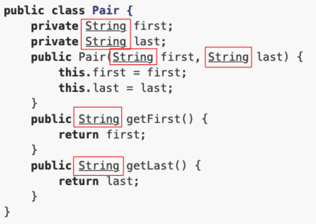

::: details 目录
[[toc]]
:::

编写泛型类比普通类要复杂。通常来说，泛型类一般用在集合类中，例如 `ArrayList<T>` ，我们很少需要编写泛型类。

如果我们确实需要编写一个泛型类，那么，应该如何编写它？

可以按照以下步骤来编写一个泛型类。

1. 首先，按照某种类型，例如： `String` ，来编写类：

```java
public class Pair {
    private String first;
    private String last;
    public Pair(String first, String last) {
        this.first = first;
        this.last = last;
    }
    public String getFirst() {
        return first;
    }
    public String getLast() {
        return last;
    }
}
```

2. 然后，标记所有的特定类型，这里是 `String` ：

    

3. 最后，把特定类型 `String` 替换为 `T` ，并申明 `<T>` ：

```java
public class Pair<T> {
    private T first;
    private T last;
    public Pair(T first, T last) {
        this.first = first;
        this.last = last;
    }
    public T getFirst() {
        return first;
    }
    public T getLast() {
        return last;
    }
}
```

熟练后即可直接从 `T` 开始编写。


## 🍀 静态方法

编写泛型类时，要特别注意，泛型类型 `<T>` 不能用于静态方法。例如：


```java
public class Pair<T> {
    private T first;
    private T last;
    public Pair(T first, T last) {
        this.first = first;
        this.last = last;
    }
    public T getFirst() { ...}
    public T getLast() { ...}

    // 对静态方法使用 <T>:
    public static Pair<T> create(T first, T last) {
        return new Pair<T>(first, last);
    }
}
```

上述代码会导致编译错误，我们无法在静态方法 `create()` 的方法参数和返回类型上使用泛型类型 `T` 。

有些同学在网上搜索发现，~~可以在 `static` 修饰符后面加一个 `<T>`~~，编译就能通过：

```java
public class Pair<T> {
    private T first;
    private T last;
    public Pair(T first, T last) {
        this.first = first;
        this.last = last;
    }
    public T getFirst() { ...}
    public T getLast() { ...}

    // 可以编译通过:
    public static <T> Pair<T> create(T first, T last) {
        return new Pair<T>(first, last);
    }
}
```

但实际上，这个 `<T>` 和 `Pair<T>` 类型的 `<T>` 已经没有任何关系了。

> 对于静态方法，我们可以单独改写为 “泛型” 方法，只需要使用另一个类型即可。

对于上面的 `create()` 静态方法，我们应该把它改为另一种泛型类型，例如， `<K>` ：

```java
public class Pair<T> {
    private T first;
    private T last;
    public Pair(T first, T last) {
        this.first = first;
        this.last = last;
    }
    public T getFirst() { ...}
    public T getLast() { ...}

    // 静态泛型方法应该使用其他类型区分:
    public static <K> Pair<K> create(K first, K last) {
        return new Pair<K>(first, last);
    }
}
```

这样才能清楚地将静态方法的泛型类型和实例类型的泛型类型区分开。


## 🍀 多个泛型类型

泛型还可以定义多种类型。例如，我们希望 `Pair` 不总是存储两个类型一样的对象，就可以使用类型 `<T, K>` ：

```java
public class Pair<T, K> {
    private T first;
    private K last;
    public Pair(T first, K last) {
        this.first = first;
        this.last = last;
    }
    public T getFirst() { ...}
    public K getLast() { ...}
}
```

使用的时候，需要指出两种类型：

```java
Pair<String, Integer> p = new Pair<>("test", 123);
```

Java 标准库的 `Map<K,V>` 就是使用两种泛型类型的例子。它对 `Key` 使用一种类型，对 `Value` 使用另一种类型。


## 🍀 小结

- 编写泛型时，需要定义泛型类型 `<T>` ；
- 静态方法不能引用泛型类型 `<T>` ，必须定义其他类型（例如 `<K>` ）来实现静态泛型方法；
- 泛型可以同时定义多种类型，例如 `Map<K,V>` 。

