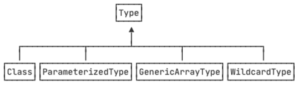

::: details 目录
[[toc]]
:::

泛型是一种类似“模板代码”的技术，不同语言的泛型实现方式不一定相同。

Java 语言的泛型实现方式是擦拭法（Type Erasure）。

所谓擦拭法是指，_虚拟机对泛型其实一无所知，所有的工作都是编译器做的_。

例如，我们编写了一个泛型类 `Pair<T>`，这是编译器看到的代码：

```java
public class Pair<T> {
    private T first;
    private T last;
    public Pair(T first, T last) {
        this.first = first;
        this.last = last;
    }
    public T getFirst() {
        return first;
    }
    public T getLast() {
        return last;
    }
}
```

而虚拟机根本不知道泛型。这是虚拟机执行的代码：

```java
public class Pair {
    private Object first;
    private Object last;
    public Pair(Object first, Object last) {
        this.first = first;
        this.last = last;
    }
    public Object getFirst() {
        return first;
    }
    public Object getLast() {
        return last;
    }
}
```

因此，Java 使用擦拭法实现泛型，导致了：

- 编译器把类型 `<T>` 视为 `Object` ；
- 编译器根据 `<T>` 实现安全的强制转型。

使用泛型的时候，我们编写的代码也是编译器看到的代码：

```java
Pair<String> p = new Pair<>("Hello", "world");
String first = p.getFirst();
String last = p.getLast();
```

而虚拟机执行的代码并没有泛型：

```java
Pair p = new Pair("Hello", "world");
String first = (String) p.getFirst();
String last = (String) p.getLast();
```

所以，Java 的泛型是由编译器在 **编译时** 实行的，编译器内部永远把所有类型 `T` 视为 `Object` 处理，但是，在需要转型的时候，编译器会根据 `T` 的类型自动为我们实行安全地强制转型。

## 🍀 Java 泛型的局限

了解了 Java 泛型的实现方式——擦拭法，我们就知道了 Java 泛型的局限：

::: warning 局限一
`<T>` 不能是基本类型，例如 `int`，因为实际类型是 `Object`，`Object` 类型无法持有基本类型：
:::

```java
Pair<int> p = new Pair<>(1, 2); // compile error!
```

::: warning 局限二
无法取得带泛型的 `Class` 。观察以下代码：
:::

```java
public class Main {
    public static void main(String[] args) {
        Pair<String> p1 = new Pair<>("Hello", "world");
        Pair<Integer> p2 = new Pair<>(123, 456);
        Class c1 = p1.getClass();
        Class c2 = p2.getClass();
        System.out.println(c1==c2); // true
        System.out.println(c1==Pair.class); // true
    }
}

class Pair<T> {
    private T first;
    private T last;
    public Pair(T first, T last) {
        this.first = first;
        this.last = last;
    }
    public T getFirst() {
        return first;
    }
    public T getLast() {
        return last;
    }
}
```

因为 `T` 是 `Object`，我们对 `Pair<String>` 和 `Pair<Integer>` 类型获取 `Class` 时，获取到的是同一个 `Class`，也就是 `Pair` 类的 `Class` 。

换句话说，所有泛型实例，无论 T 的类型是什么，`getClass()` 返回同一个 Class 实例，因为编译后它们全部都是 `Pair<Object>`。

::: warning 局限三
无法判断带泛型的类型：
:::

```java
Pair<Integer> p = new Pair<>(123, 456);
// Compile error:
if (p instanceof Pair<String>) {
}
```

原因和前面一样，并不存在 `Pair<String>.class`，而是只有唯一的 `Pair.class` 。

::: warning 局限四
不能实例化 `T` 类型：
:::

```java
public class Pair<T> {
    private T first;
    private T last;
    public Pair() {
        // Compile error:
        first = new T();
        last = new T();
    }
}
```

上述代码无法通过编译，因为构造方法的两行语句：

```java
first = new T();
last = new T();
```

擦拭后实际上变成了：

```java
first = new Object();
last = new Object();
```

这样一来，创建 `new Pair<String>()` 和创建 `new Pair<Integer>()` 就全部成了 `Object`，显然编译器要阻止这种类型不对的代码。

---

要实例化 `T` 类型，我们必须借助额外的 `Class<T>` 参数：

```java
public class Pair<T> {
    private T first;
    private T last;
    public Pair(Class<T> clazz) {
        first = clazz.newInstance();
        last = clazz.newInstance();
    }
}
```

上述代码借助 `Class<T>` 参数并通过反射来实例化 `T` 类型，使用的时候，也必须传入 `Class<T>` 。例如：

```java
Pair<String> pair = new Pair<>(String.class);
```

因为传入了 `Class<String>` 的实例，所以我们借助 `String.class` 就可以实例化 `String` 类型。

## 🍀 不恰当的覆写方法

有些时候，一个看似正确定义的方法会无法通过编译。例如：

```java
public class Pair<T> {
    public boolean equals(T t) {
        return this == t;
    }
}
```

这是因为，定义的 `equals(T t)` 方法实际上会被擦拭成 `equals(Object t)`，而这个方法是继承自 `Object` 的，~~编译器会阻止一个实际上会变成覆写的泛型方法定义~~。

换个方法名，避开与 `Object.equals(Object)` 的冲突就可以成功编译：

```java
public class Pair<T> {
    public boolean same(T t) {
        return this == t;
    }
}
```

## 🍀 泛型继承\*

一个类可以继承自一个泛型类。例如：父类的类型是 `Pair<Integer>`，子类的类型是 `IntPair`，可以这么继承：

```java
public class IntPair extends Pair<Integer> {
}
```

使用的时候，因为子类 `IntPair` 并没有泛型类型，所以，正常使用即可：

```java
IntPair ip = new IntPair(1, 2);
```

前面讲了，我们无法获取 `Pair<T>` 的 `T` 类型，即给定一个变量 `Pair<Integer> p`，无法从 `p` 中获取到 `Integer` 类型。

但是，在父类是泛型类型的情况下，编译器就必须把类型 `T` （对 `IntPair` 来说，也就是 `Integer` 类型）保存到子类的 `class` 文件中，不然编译器就不知道 `IntPair` 只能存取 `Integer` 这种类型。

在继承了泛型类型的情况下，子类可以获取父类的泛型类型。例如： `IntPair` 可以获取到父类的泛型类型 `Integer` 。获取父类的泛型类型代码比较复杂：

```java
import java.lang.reflect.ParameterizedType;
import java.lang.reflect.Type;

public class Main {
    public static void main(String[] args) {
        Class<IntPair> clazz = IntPair.class;
        Type t = clazz.getGenericSuperclass();
        if (t instanceof ParameterizedType) {
            ParameterizedType pt = (ParameterizedType) t;
            Type[] types = pt.getActualTypeArguments(); // 可能有多个泛型类型
            Type firstType = types[0]; // 取第一个泛型类型
            Class<?> typeClass = (Class<?>) firstType;
            System.out.println(typeClass); // Integer
        }
    }
}

class Pair<T> {
    private T first;
    private T last;
    public Pair(T first, T last) {
        this.first = first;
        this.last = last;
    }
    public T getFirst() {
        return first;
    }
    public T getLast() {
        return last;
    }
}

class IntPair extends Pair<Integer> {
    public IntPair(Integer first, Integer last) {
        super(first, last);
    }
}
```

因为 Java 引入了泛型，所以，只用 Class 来标识类型已经不够了。实际上，Java 的类型系统结构如下：



## 🍀 小结

1. Java 的泛型是采用擦拭法实现的；
2. 擦拭法决定了泛型 `<T>` ：
   - 不能是基本类型，例如： `int` ；
   - 不能获取带泛型类型的 `Class`，例如： `Pair<String>.class` ；
   - 不能判断带泛型类型的类型，例如： `x instanceof Pair<String>` ；
   - 不能实例化 `T` 类型，例如： `new T()` 。
3. 泛型方法要防止重复定义方法，例如： `public boolean equals(T obj)` ；
4. 子类可以获取父类的泛型类型 `<T>` 。
