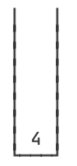
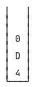
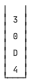
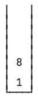

::: details 目录
[[toc]]
:::


栈（Stack）是一种后进先出（LIFO：Last In First Out）的数据结构。

什么是 LIFO 呢？我们先回顾一下 Queue 的特点 FIFO：


所谓 FIFO，是最先进队列的元素一定最早出队列，而 LIFO 是最后进 Stack 的元素一定最早出 Stack。如何做到这一点呢？只需要把队列的一端封死：


因此，Stack 是这样一种数据结构：只能不断地往 Stack 中压入（push）元素，最后进去的必须最早弹出（pop）来：


Stack 只有入栈和出栈的操作：

- 把元素压栈：push(E)；
- 把栈顶的元素 “弹出”：pop()；
- 取栈顶元素但不弹出：peek()。


在 Java 中，我们用 Deque 可以实现 Stack 的功能：

- 把元素压栈：push(E)/addFirst(E)；
- 把栈顶的元素 “弹出”：pop()/removeFirst()；
- 取栈顶元素但不弹出：peek()/peekFirst()。


为什么 Java 的集合类没有单独的 Stack 接口呢？因为有个遗留类名字就叫 Stack，出于兼容性考虑，所以没办法创建 Stack 接口，只能用 Deque 接口来 “模拟” 一个 Stack 了。

当我们把 Deque 作为 Stack 使用时，注意只调用 push()/pop()/peek() 方法，不要调用 addFirst()/removeFirst()/peekFirst() 方法，这样代码更加清晰。


## 🍀 Stack 的作用

Stack 在计算机中使用非常广泛，JVM 在处理 Java 方法调用的时候就会通过栈这种数据结构维护方法调用的层次。例如：

```java
static void main(String[] args) {
    foo(123);
}

static String foo(x) {
    return "F-" + bar(x + 1);
}

static int bar(int x) {
    return x << 2;
}
```


JVM 会创建方法调用栈，每调用一个方法时，先将参数压栈，然后执行对应的方法；当方法返回时，返回值压栈，调用方法通过出栈操作获得方法返回值。

因为方法调用栈有容量限制，嵌套调用过多会造成栈溢出，即引发 StackOverflowError：

```java
// 测试无限递归调用
public class Main {
    public static void main(String[] args) {
        increase(1);
    }

    static int increase(int x) {
        return increase(x) + 1;
    }
}
```

我们再来看一个 Stack 的用途：对整数进行进制的转换就可以利用栈。

例如，我们要把一个 int 整数 12500 转换为十六进制表示的字符串，如何实现这个功能？

首先我们准备一个空栈：


然后计算 $12500 ÷ 16 = 781 … 4$，余数是 4，把余数 4 压栈：



然后计算 $781 ÷ 16 = 48 … 13$，余数是 13，13 的十六进制用字母 D 表示，把余数 D 压栈：


然后计算 $48 ÷ 16 = 3 … 0$，余数是 0，把余数 0 压栈：



最后计算 $3 ÷ 16 = 0 … 3$，余数是 3，把余数 3 压栈：



当商是 0 的时候，计算结束，我们把栈的所有元素依次弹出，组成字符串 30D4，这就是十进制整数 12500 的十六进制表示的字符串。


## 🍀 计算中缀表达式

在编写程序的时候，我们使用的带括号的数学表达式实际上是中缀表达式，即运算符在中间，例如： $1 + 2 * (9 - 5)$ 。

但是计算机执行表达式的时候，它并不能直接计算中缀表达式，而是通过编译器把中缀表达式转换为后缀表达式，例如： `1 2 9 5 - * +` 。

这个编译过程就会用到栈。我们先跳过编译这一步（涉及运算优先级，代码比较复杂），看看如何通过栈计算后缀表达式。

计算后缀表达式不考虑优先级，直接从左到右依次计算，因此计算起来简单。首先准备一个空的栈：


然后我们依次扫描后缀表达式 1 2 9 5 - * +，遇到数字 1，就直接扔到栈里：


紧接着，遇到数字 2，9，5，也扔到栈里：


接下来遇到减号时，弹出栈顶的两个元素，并计算 $9-5=4$，把结果 4 压栈：


接下来遇到 * 号时，弹出栈顶的两个元素，并计算 $2*4=8$，把结果 8 压栈：



接下来遇到 + 号时，弹出栈顶的两个元素，并计算 $1+8=9$，把结果 9 压栈：


扫描结束后，没有更多的计算了，弹出栈的唯一一个元素，得到计算结果 9。


## 🍀 练习

请利用 Stack 把一个给定的整数转换为十六进制：

```java
// 转十六进制
import java.util.*;

public class Main {
    public static void main(String[] args) {
        String hex = toHex(12500);
        if (hex.equalsIgnoreCase("30D4")) {
            System.out.println("测试通过");
        } else {
            System.out.println("测试失败");
        }
    }

    static String toHex(int n) {
        return "";
    }
}
```

进阶练习：

请利用 Stack 把字符串中缀表达式编译为后缀表达式，然后再利用栈执行后缀表达式获得计算结果：

```java
// 高难度练习，慎重选择！
import java.util.*;

public class Main {
    public static void main(String[] args) {
        String exp = "1 + 2 * (9 - 5)";
        SuffixExpression se = compile(exp);
        int result = se.execute();
        System.out.println(exp + " = " + result + " " + (result == 1 + 2 * (9 - 5) ? "✓" : "✗"));
    }

    static SuffixExpression compile(String exp) {
        // TODO:
        return new SuffixExpression();
    }
}

class SuffixExpression {
    int execute() {
        // TODO:
        return 0;
    }
}
```


进阶练习 2：

请把带变量的中缀表达式编译为后缀表达式，执行后缀表达式时，传入变量的值并获得计算结果：

```java
// 超高难度练习，慎重选择！
import java.util.*;

public class Main {
    public static void main(String[] args) {
        String exp = "x + 2 * (y - 5)";
        SuffixExpression se = compile(exp);
        Map<String, Integer> env = Map.of("x", 1, "y", 9);
        int result = se.execute(env);
        System.out.println(exp + " = " + result + " " + (result == 1 + 2 * (9 - 5) ? "✓" : "✗"));
    }

    static SuffixExpression compile(String exp) {
        // TODO:
        return new SuffixExpression();
    }
}

class SuffixExpression {
    int execute(Map<String, Integer> env) {
        // TODO:
        return 0;
    }
}
```


## 🍀 小结

1. 栈（Stack）是一种后进先出（LIFO）的数据结构，操作栈的元素的方法有：

- 把元素压栈：push(E)；
- 把栈顶的元素 “弹出”：pop(E)；
- 取栈顶元素但不弹出：peek(E)。

2. 在 Java 中，我们用 Deque 可以实现 Stack 的功能，注意只调用 push()/pop()/peek() 方法，避免调用 Deque 的其他方法。

3. 最后，不要使用遗留类 Stack。

